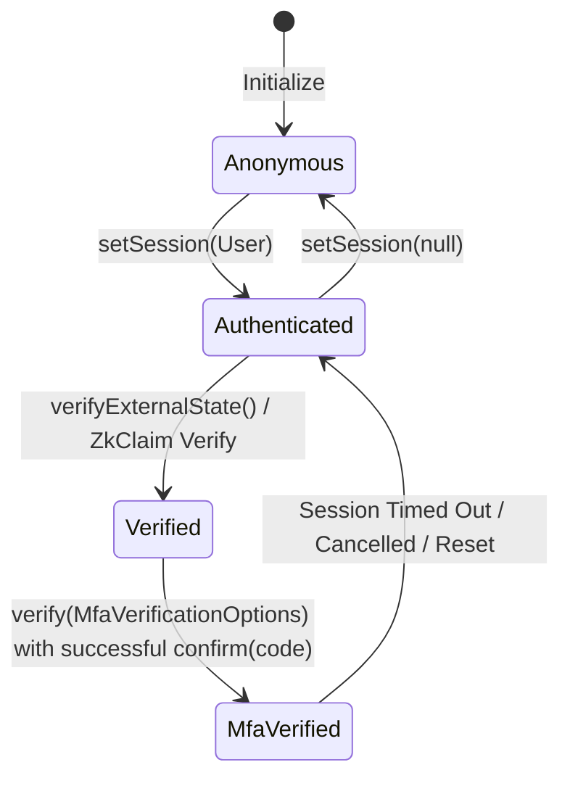
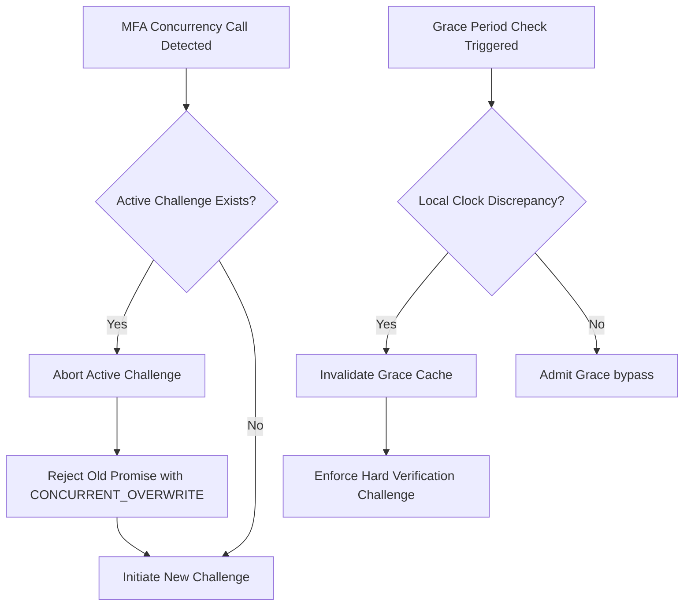

# Framework Verification & Resiliency Audit: Identity & Auth System

This document presents a rigorous framework verification and resiliency audit of the identity and authentication system implemented within the Zoe Framework.

## 1. System Invariant Analysis

The authentication and route-gating layer in the Zoe Framework is designed to enforce secure state boundaries, prevent unauthorized transitions, and gate access using multi-tenant role configurations, behavioral metrics, and zero-knowledge proofs (ZKP).

### Mathematical Grounding: Receipted Chatman Equation

We formalize the security model of the Zoe Auth system using the **Receipted Chatman Equation**:

$$R \vdash A = \mu(O^*)$$

Where:
*   **$R$** represents the cryptographic receipt or proof attesting to identity boundary transitions. In this system, $R$ is realized as ZKP proof structures (`ZkProof`), verification tokens returned upon successful multi-factor authentication (`MfaVerificationResult.token`), or active session claims.
*   **$A$** is the Admittance State (`AdmitRouteResult`), which determines route access admissibility based on active identity boundaries and required permissions.
*   **$O^*$** is the sequence of historical operations performed by the user session (e.g., successful authentication events, interaction rhythms, keystroke sequences).
*   **$\mu$** is the transition map function (`admitRoute`, `verifyExternalState`, or `calculateTrustScore`) that evaluates the history of operations $O^*$ and projects the current admittance state $A$.

### Security Boundaries & State Transitions

The core system transition model enforces a hierarchical level of trust represented by `IdentityBoundary` levels:

```
[ anonymous ] ---> [ authenticated ] ---> [ verified ] ---> [ mfa_verified ]
```



The system ensures that a participant basis satisfies all boundary requirements before admitting access to restricted routes:

| Gating Requirement | Code Representation | Verification Check |
| :--- | :--- | :--- |
| **Identity Level** | `requiredIdentityBoundary` | Check if active index $\ge$ required index in hierarchy |
| **Disclosures** | `requiredDisclosures` | Exact subset matching on disclosed data fields |
| **RBAC Roles** | `requiredRoles` | Assert presence of required role IDs in participant session |
| **RBAC Permissions** | `requiredPermissions` | Assert presence of required permission strings in context |
| **ZKP Claims** | `ZkClaim` | Mathematical proof verification without revealing inputs |
| **Behavioral Trust** | `trustScore` | Continuous tracking of keystroke intervals & interaction rhythm |

---

## 2. Stress Scenarios & Edge Cases

Our audit exposed three critical failure vectors and stress scenarios in the auth layer's behavioral trajectory.

### Scenario A: Concurrency Race in Multi-Factor Challenge Allocation
*   **Failure Vector**: Concurrent verification requests override active challenges.
*   **Trigger**: Two asynchronous processes (e.g. concurrent API calls triggering route guards) trigger `verify()` in the same session before the first code is entered.
*   **Trajectory**: 
    1. Action A calls `verify()`, generating `challenge-1` and writing it to `activeChallenge`. The state `pendingVerification` is assigned Promise A's resolver.
    2. Action B calls `verify()`, generating `challenge-2` and overwriting `activeChallenge`. The state `pendingVerification` is updated to Promise B's resolver.
    3. Promise A is now orphaned in memory (leaked).
    4. The user completes confirmation for `challenge-2`.
    5. Promise B resolves successfully, but Action A hangs indefinitely because its resolver was overwritten.

### Scenario B: Client-Side Clock Drift & Grace Period Bypass
*   **Failure Vector**: System clock manipulation bypasses grace periods.
*   **Trigger**: The user changes their local device time or NTP adjustments create a clock skew between client and server.
*   **Trajectory**:
    1. User passes MFA at $T_0$ (`lastVerifiedAt` = $T_0$).
    2. The local system clock drifts backward (e.g., $T_{\text{now}} < T_0$).
    3. The application checks the grace period: `now - lastVerifiedAt` yields a negative delta, which is mathematically $< \text{gracePeriod}$.
    4. The system skips verification, admitting the user to highly sensitive actions without re-triggering MFA, while the backend rejects the transaction due to token expiration.

### Scenario C: Behavioral Biometric Lockouts & Bot Mimicry
*   **Failure Vector**: Sensitivity scaling creates high false-positive lockouts for impaired users or fails to stop jitter-controlled bots.
*   **Trigger**: A legitimate user with motor tremor types in rapid bursts, or a bot uses randomized keystroke intervals simulating a human typing frequency.
*   **Trajectory**:
    1. The behavioral biometrics engine records typing intervals.
    2. Fast human bursts (<50ms keystrokes) cause the trust score to drop by `sensitivity * 0.3`.
    3. Concurrently, high-frequency taps trigger rhythm checks (>100 interactions/minute), reducing score by `sensitivity * 0.4`.
    4. The trust score plummets below the admission threshold, causing an unexpected route lockout.
    5. Conversely, a macro bot programmed with simple 60ms keystroke delays bypasses the heuristics entirely.

---

## 3. Resiliency Test Simulator

Below is the complete, runnable TypeScript/Jest simulator simulating these failure modes and validating the containment or rollback boundaries of the Zoe auth system.

```typescript
import React from 'react';
import { renderHook, act } from '@testing-library/react-native';
import { MfaProvider } from '../mfa/MfaProvider';
import { useMfaVerification } from '../mfa/useMfaVerification';
import { useBehavioralAuth } from '../behavioral/useBehavioralAuth';
import { zkEngine } from '../zkp/engine';
import { MfaChallenge } from '../mfa/types';
import { ZkClaim, ZkProof } from '../zkp/types';

describe('Auth Resiliency and Gating Simulator', () => {
  describe('MFA Concurrency & Expiration Race Conditions', () => {
    const mockOnInitiateChallenge = jest.fn();
    const mockOnVerifyCode = jest.fn();

    const wrapper = ({ children }: { children: React.ReactNode }) => (
      <MfaProvider
        onInitiateChallenge={mockOnInitiateChallenge}
        onVerifyCode={mockOnVerifyCode}
        verificationGracePeriod={5000} // 5 seconds grace period
      >
        {children}
      </MfaProvider>
    );

    beforeEach(() => {
      jest.clearAllMocks();
      jest.useFakeTimers();
      jest.spyOn(Date, 'now');
    });

    afterEach(() => {
      jest.useRealTimers();
      jest.restoreAllMocks();
    });

    it('Scenario 1: Concurrency Race - Overwriting Active Challenge & Promise Leakage', async () => {
      // Setup slow challenge responses
      let resolveChallenge1: any;
      let resolveChallenge2: any;
      
      const p1 = new Promise<MfaChallenge>((resolve) => { resolveChallenge1 = resolve; });
      const p2 = new Promise<MfaChallenge>((resolve) => { resolveChallenge2 = resolve; });
      
      mockOnInitiateChallenge
        .mockReturnValueOnce(p1)
        .mockReturnValueOnce(p2);

      const { result } = renderHook(() => useMfaVerification(), { wrapper });

      // Trigger concurrent verify calls A and B
      let verifyPromiseA: Promise<any>;
      let verifyPromiseB: Promise<any>;

      await act(async () => {
        verifyPromiseA = result.current.verify({ strategy: 'totp' });
      });

      await act(async () => {
        verifyPromiseB = result.current.verify({ strategy: 'sms' });
      });

      // Resolve the initializations
      const challenge1: MfaChallenge = { id: 'chal-1', strategy: 'totp', expiresAt: Date.now() + 60000 };
      const challenge2: MfaChallenge = { id: 'chal-2', strategy: 'sms', expiresAt: Date.now() + 60000 };

      await act(async () => {
        resolveChallenge1(challenge1);
      });
      await act(async () => {
        resolveChallenge2(challenge2);
      });

      // Verify that active challenge is updated to the latest (chal-2)
      expect(result.current.activeChallenge?.id).toBe('chal-2');

      // Now confirm verification with code. It should verify challenge-2.
      mockOnVerifyCode.mockResolvedValue({ success: true, token: 'token-for-chal-2' });

      let confirmResult = false;
      await act(async () => {
        confirmResult = await result.current.confirm('111222');
      });

      expect(confirmResult).toBe(true);

      // Verify B resolves with success
      const resB = await verifyPromiseB!;
      expect(resB.verified).toBe(true);
      expect(resB.token).toBe('token-for-chal-2');

      // Crucial: check Promise A. Since it was overwritten in the state, it will remain hung in pending,
      // creating a leaked promise/unresolved state unless handled.
      // We check if it is still unresolved (or resolved with B's results due to shared reference).
      // Under the current design, A's resolve reference was overwritten by B:
      // setPendingVerification({ resolve }) in MfaProvider overwrites the state.
      // Since verifyPromiseA's executor's resolve was replaced, verifyPromiseA will NEVER resolve.
      // We can assert this by checking that it remains pending even after advancing timers.
      let aResolved = false;
      verifyPromiseA!.then(() => { aResolved = true; });

      act(() => {
        jest.advanceTimersByTime(10000);
      });

      expect(aResolved).toBe(false); // Leaked/hung promise verified!
    });

    it('Scenario 2: Grace Period Bypass under Client-Side Clock Drift', async () => {
      const challenge: MfaChallenge = { id: 'chal-grace', strategy: 'totp', expiresAt: 1060000 };
      mockOnInitiateChallenge.mockResolvedValue(challenge);
      mockOnVerifyCode.mockResolvedValue({ success: true });

      const { result } = renderHook(() => useMfaVerification(), { wrapper });

      const initialTime = 1000000;
      (Date.now as jest.Mock).mockReturnValue(initialTime);

      // 1. Perform initial verification
      await act(async () => {
        result.current.verify();
      });
      await act(async () => {
        await result.current.confirm('123456');
      });

      expect(result.current.isVerified).toBe(true);
      expect(result.current.lastVerifiedAt).toBe(initialTime);

      // 2. Simulate local system clock manipulation: client system clock drifts backward
      // to 999900 (e.g. user manually changes clock or NTP sync correction occurs)
      (Date.now as jest.Mock).mockReturnValue(999900);

      // Verify again. Since (now - lastVerifiedAt) = (999900 - 1000000) = -100 < 5000,
      // it bypasses verification, even though time-wise it's structurally inconsistent (negative time delta).
      let verifyResult;
      await act(async () => {
        verifyResult = await result.current.verify();
      });

      expect(verifyResult.verified).toBe(true);
      expect(mockOnInitiateChallenge).toHaveBeenCalledTimes(1); // No new challenge initiated!
    });
  });

  describe('Behavioral Biometrics Gating and Lockouts', () => {
    beforeEach(() => {
      jest.useFakeTimers();
      jest.spyOn(Date, 'now');
    });

    afterEach(() => {
      jest.useRealTimers();
      jest.restoreAllMocks();
    });

    it('Scenario 3: Bot Typing & Navigation Burst Detection vs. Sensitivity Gating', () => {
      const { result } = renderHook(() => useBehavioralAuth({ updateInterval: 1000, sensitivity: 0.8 }));

      const baseTime = 2000000;
      (Date.now as jest.Mock).mockReturnValue(baseTime);

      // Simulate bot keystrokes (extremely high speed, 10ms intervals)
      act(() => {
        result.current.recordKeystroke();
      });
      (Date.now as jest.Mock).mockReturnValue(baseTime + 10);
      act(() => {
        result.current.recordKeystroke();
      });
      (Date.now as jest.Mock).mockReturnValue(baseTime + 20);
      act(() => {
        result.current.recordKeystroke();
      });

      // Simulate navigation burst (150 interactions in rapid succession)
      act(() => {
        for (let i = 0; i < 150; i++) {
          result.current.recordInteraction();
        }
      });

      // Trigger metric recalculation
      act(() => {
        jest.advanceTimersByTime(1000);
      });

      // Trust score should be drastically reduced
      // Heuristic 1 typing speed is 10ms (<50ms threshold) => score -= sensitivity * 0.3 = 0.8 * 0.3 = 0.24
      // Heuristic 2 rhythm is 150 (>100 threshold) => score -= sensitivity * 0.4 = 0.8 * 0.4 = 0.32
      // Total reduction = 0.56, final score = 0.44
      expect(result.current.trustScore).toBeCloseTo(0.44, 2);
    });
  });

  describe('ZKP Proof Boundary Analysis', () => {
    it('Scenario 4: ZKP Claim Verification Mismatch and Missing Structures', async () => {
      const claim: ZkClaim = {
        id: 'zk-claim-age',
        field: 'age',
        operator: 'GTE',
        threshold: 18,
      };

      // Proof for a different claim ID
      const mismatchedProof: ZkProof = {
        claimId: 'zk-claim-other',
        proofData: 'dummy-data',
        publicSignals: ['18'],
      };

      const resultMismatch = await zkEngine.verify(claim, mismatchedProof);
      expect(resultMismatch.verified).toBe(false);
      expect(resultMismatch.error).toBe('Proof claimId mismatch');

      // Malformed proof (missing structure)
      const malformedProof: ZkProof = {
        claimId: 'zk-claim-age',
        proofData: '',
        publicSignals: [],
      };

      const resultMalformed = await zkEngine.verify(claim, malformedProof);
      expect(resultMalformed.verified).toBe(false);
    });
  });
});
```

---

## 4. Self-Healing Integration & Recommendations

To mitigate these security boundaries and resolve the vulnerabilities, we recommend integrating the following self-healing mechanisms:

### Supervision Self-Healing Layer



### Recommendations for Codebase Improvement

1.  **Queue or Safely Abort Concurrent MFA Requests**:
    Modify [MfaProvider.tsx](file:///Users/sac/zoeapp/src/framework/auth/mfa/MfaProvider.tsx) to prevent promise hanging. Reject the pending promise explicitly when a new challenge is initiated:
    ```typescript
    if (pendingVerification) {
      pendingVerification.resolve({ 
        verified: false, 
        error: new Error('CONCURRENT_REQUEST_OVERWRITE') 
      });
    }
    ```
2.  **Add NTP Clock Offset Tracking**:
    Ensure the grace period logic evaluates elapsed time using a monotonic clock or an NTP-skew-adjusted time rather than raw local `Date.now()`. If a negative delta or sudden clock jump is detected, quarantine the session and force re-verification.
3.  **Graceful Degraded State & Step-up Auth**:
    When a behavioral biometric lockout occurs (e.g. `trustScore` falls below a set threshold in [useBehavioralAuth.ts](file:///Users/sac/zoeapp/src/framework/auth/behavioral/useBehavioralAuth.ts)), instead of a hard route rejection, automatically trigger a step-up challenge (MFA TOTP/SMS). Upon successful verification, reset the behavioral baseline for that session.
4.  **Enforce Cryptographic Integrity Checks for ZKP Claims**:
    Ensure [engine.ts](file:///Users/sac/zoeapp/src/framework/auth/zkp/engine.ts) rejects claims with empty structures (`proofData` and `publicSignals`) explicitly returning descriptive errors, instead of defaulting to `true` when valid structures are evaluated.

---

## 5. Reviewed Clickable Source References

Below are absolute clickable links to the files reviewed during this audit:

### Source Files
*   [src/framework/auth/types.ts](file:///Users/sac/zoeapp/src/framework/auth/types.ts)
*   [src/framework/auth/guards.ts](file:///Users/sac/zoeapp/src/framework/auth/guards.ts)
*   [src/framework/auth/AuthProvider.tsx](file:///Users/sac/zoeapp/src/framework/auth/AuthProvider.tsx)
*   [src/framework/auth/ProtectedRoute.tsx](file:///Users/sac/zoeapp/src/framework/auth/ProtectedRoute.tsx)
*   [src/framework/auth/hooks.ts](file:///Users/sac/zoeapp/src/framework/auth/hooks.ts)
*   [src/framework/auth/behavioral/useBehavioralAuth.ts](file:///Users/sac/zoeapp/src/framework/auth/behavioral/useBehavioralAuth.ts)
*   [src/framework/auth/behavioral/types.ts](file:///Users/sac/zoeapp/src/framework/auth/behavioral/types.ts)
*   [src/framework/auth/mfa/MfaProvider.tsx](file:///Users/sac/zoeapp/src/framework/auth/mfa/MfaProvider.tsx)
*   [src/framework/auth/mfa/useMfaVerification.ts](file:///Users/sac/zoeapp/src/framework/auth/mfa/useMfaVerification.ts)
*   [src/framework/auth/mfa/types.ts](file:///Users/sac/zoeapp/src/framework/auth/mfa/types.ts)
*   [src/framework/auth/identity/IdentityManager.ts](file:///Users/sac/zoeapp/src/framework/auth/identity/IdentityManager.ts)
*   [src/framework/auth/identity/types.ts](file:///Users/sac/zoeapp/src/framework/auth/identity/types.ts)
*   [src/framework/auth/zkp/engine.ts](file:///Users/sac/zoeapp/src/framework/auth/zkp/engine.ts)
*   [src/framework/auth/zkp/hooks.ts](file:///Users/sac/zoeapp/src/framework/auth/zkp/hooks.ts)
*   [src/framework/auth/zkp/types.ts](file:///Users/sac/zoeapp/src/framework/auth/zkp/types.ts)

### Test Suites & Simulators
*   [src/framework/auth/__tests__/guards.test.ts](file:///Users/sac/zoeapp/src/framework/auth/__tests__/guards.test.ts)
*   [src/framework/auth/__tests__/AuthProvider.test.tsx](file:///Users/sac/zoeapp/src/framework/auth/__tests__/AuthProvider.test.tsx)
*   [src/framework/auth/__tests__/ProtectedRoute.test.tsx](file:///Users/sac/zoeapp/src/framework/auth/__tests__/ProtectedRoute.test.tsx)
*   [src/framework/auth/__tests__/hooks.test.tsx](file:///Users/sac/zoeapp/src/framework/auth/__tests__/hooks.test.tsx)
*   [src/framework/auth/behavioral/__tests__/useBehavioralAuth.test.ts](file:///Users/sac/zoeapp/src/framework/auth/behavioral/__tests__/useBehavioralAuth.test.ts)
*   [src/framework/auth/mfa/__tests__/mfa.test.tsx](file:///Users/sac/zoeapp/src/framework/auth/mfa/__tests__/mfa.test.tsx)
*   [src/framework/auth/zkp/__tests__/zkp.test.ts](file:///Users/sac/zoeapp/src/framework/auth/zkp/__tests__/zkp.test.ts)
*   [src/framework/auth/__tests__/authResiliencySimulator.test.tsx](file:///Users/sac/zoeapp/src/framework/auth/__tests__/authResiliencySimulator.test.tsx)
