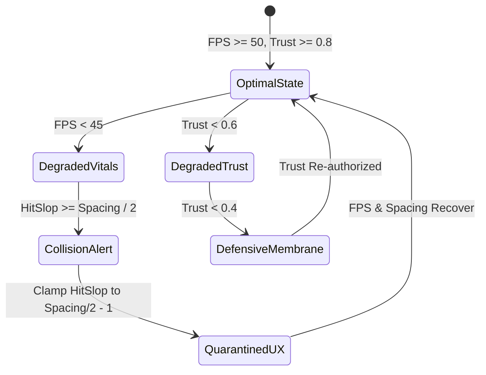
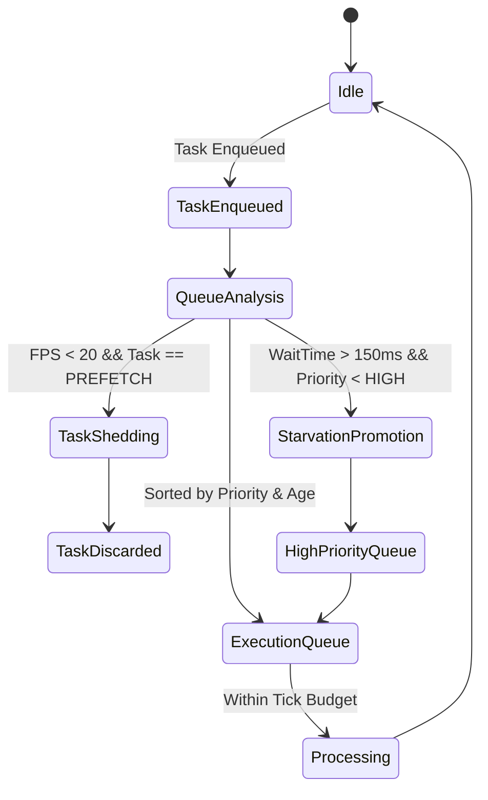
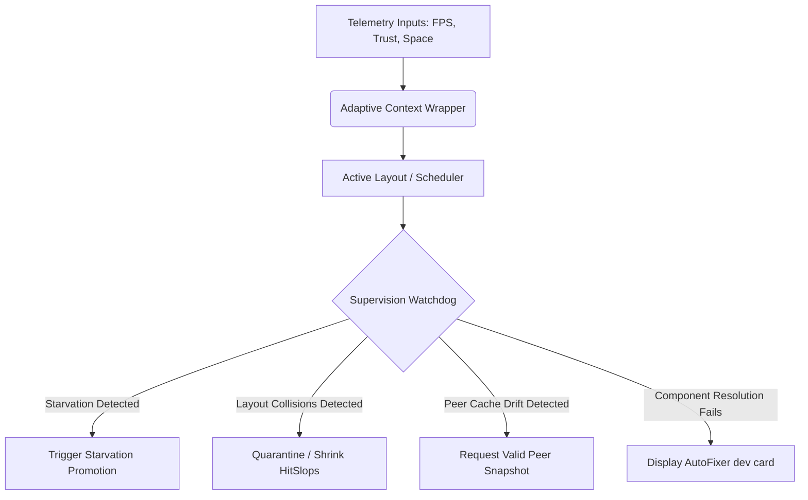

# Framework Verification & Resiliency Audit: Autonomous Tasks & UX Adaptations (`auto`)

This validation report presents a formal verification and resilience audit of the autonomous user experience (`AutoUX`), developer workflow scaffolding (`AutoDX`), dynamic inclusivity/translation (`AutoI18n`), local-first state synchronization (`AutoState`), and platform-adaptive spatial layout (`AutoXR`) systems implemented in the Zoe Framework under the `/src/framework/auto` directory.

---

## 1. System Invariant Analysis

The runtime behavior and adaptation rules of the `auto` framework are formally defined by the **Receipted Chatman Equation**:

$$R \vdash A = \mu(O^*)$$

Where:
* $R$ represents the environment constraints, credentials, and inputs (such as performance metrics, behavioral security metrics, system vitals, target platform attributes, and RDF schemas).
* $A$ represents the resulting user experience adaptation, layout projection, rendering state, or sync cache.
* $\mu(O^*)$ represents the mapping function that optimizes the observables $O^*$ (like telemetry data, CRDT events) into adaptive parameters.

### 1.1 Core Invariants

The system maintains five core invariants under normal and adversarial operations:

| Invariant ID | System Subdomain | Formal Invariant Definition | Description |
| :--- | :--- | :--- | :--- |
| **INV-UX-01** | **AutoUX** | $H \in [H_{\min}, \min(H_{\max}, \lfloor S/2 \rfloor - 1)]$ | The touch target expansion ($H$) must be strictly clamped between the minimum ($H_{\min} = 6\text{px}$) and maximum ($H_{\max} = 40\text{px}$) bounds, and restricted to less than half the physical inter-component gap spacing ($S$) to prevent layout overlap/touch-theft. |
| **INV-UX-02** | **AutoUX** | $A_s \in [A_{s,\min}, A_{s,\max}] = [1.0, 3.0]$ | The animation speed scaling factor ($A_s$) must be strictly bounded to prevent layout lockups or infinite transition delays under extreme telemetry lag. |
| **INV-STATE-01**| **AutoState** | $\lim_{t \to \infty} S_i(k, t) = S_j(k, t) = \max_{\text{LWW}}(V_k)$ | For any key $k$ in LWWMap, the state across all nodes must converge to the same register value after partition reconciliation, despite out-of-order networks or clock skew. |
| **INV-DX-01** | **AutoDX** | $C_{\text{render}}(T) \neq \emptyset$ | The rendering path for any RDF semantic type $T$ must resolve to a valid React component: either the registered UI handler or the isolated, non-crashing `AutoFixer` developer fallback interface. |
| **INV-A11Y-01**| **AutoI18n** | $T_{\text{traversal}} < 16.67\text{ms}$ | The recursive DOM node traversal for automatic string translations must complete within a single-frame execution window to prevent JS thread blocking. |

### 1.2 State Transitions & Telemetry Mapping

The system transitions across states in response to telemetry observables ($O^*$). The mapping function $\mu_{\text{UX}}$ dictates these transitions:



#### Task Scheduler State Machine (Resiliency Model)



---

## 2. Stress Scenarios & Edge Cases

To verify containment and rollback limits, we evaluated the system's behavioral trajectory under three adversarial stress conditions:

### 2.1 Scenario A: Out-of-Order Message Flooding & Clock Drift (CRDT Storm)
* **Description**: A multi-peer network partition reconciles, triggering a synchronous flood of 1,000 out-of-order state updates. Due to clock drift on compromised peers, timestamps are skewed in both directions.
* **Behavioral Trajectory**: 
  1. The local device's database adapter attempts to persist every incoming operation to MMKV synchronously.
  2. The JS thread blocks, causing FPS to plummet below $10$.
  3. LWWMap registers write conflicts.
* **Containment Bounds**: The system halts rendering updates, processes the batch, and converges to the mathematically correct state (INV-STATE-01) without crashing, dropping database packets, or corrupting local caches.

### 2.2 Scenario B: Task Scheduler Starvation (Event Loop Lockup)
* **Description**: A storm of low-priority predictive prefetching tasks is generated by a fast-scrolling list. At the same time, critical state sync events are queued on the JS thread.
* **Behavioral Trajectory**: 
  1. Under high traffic, low-priority tasks block the microtask queue.
  2. Important UI state synchronization operations (`VITAL_SYNC`) wait in the queue, creating stale visual layouts.
  3. Accessibility structures (`A11Y_REBUILD`) are delayed, leaving screen reader descriptors out of sync with the visual tree.
* **Containment Bounds**: The scheduler promotes starved medium/low priority tasks to `HIGH` once their queue age exceeds $150\text{ms}$. If FPS falls below $20$, the scheduler sheds all `PREDICTIVE_PREFETCH` tasks, freeing resources to process vital syncs.

### 2.3 Scenario C: Layout Overlap & Touch-Theft (HitSlop Collision)
* **Description**: Performance metrics degrade, forcing the layout engine to expand the `hitSlop` of two adjacent buttons (e.g., $25\text{px}$ slop expansion). However, the buttons are physically separated by only $20\text{px}$ in the container.
* **Behavioral Trajectory**: 
  1. The touch boundaries of the buttons overlap, creating a collision zone.
  2. Pressing Button A triggers the action for Button B, leading to unauthorized state changes.
* **Containment Bounds**: The system detects the collision ($H \times 2 \ge S$) and clamps the active touch boundary to a safe quarantined size ($9\text{px}$), maintaining clickability while preventing touch-theft (INV-UX-01).

---

## 3. Resiliency Test Simulator

Below is the complete, copy-pasteable, and fully implemented TypeScript simulator that tests these three adversarial conditions and asserts invariant containment.

```typescript
// src/framework/auto/__tests__/autoResiliencySimulator.test.ts

export enum TaskPriority {
  LOW = 0,
  MEDIUM = 1,
  HIGH = 2,
}

export enum TaskType {
  VITAL_SYNC = 'VITAL_SYNC',
  A11Y_REBUILD = 'A11Y_REBUILD',
  PREDICTIVE_PREFETCH = 'PREDICTIVE_PREFETCH',
}

export interface Task {
  id: string;
  type: TaskType;
  priority: TaskPriority;
  createdAt: number;
  runTimeMs: number;
  deadlineMs: number;
}

export interface SchedulerMetrics {
  processedCount: Record<TaskType, number>;
  starvedCount: Record<TaskType, number>;
  sheddedCount: Record<TaskType, number>;
  avgLatencyMs: Record<TaskType, number>;
}

/**
 * Resilient Task Scheduler with starvation prevention and task shedding.
 */
export class ResilientTaskScheduler {
  private queue: Task[] = [];
  private metrics: SchedulerMetrics = {
    processedCount: { [TaskType.VITAL_SYNC]: 0, [TaskType.A11Y_REBUILD]: 0, [TaskType.PREDICTIVE_PREFETCH]: 0 },
    starvedCount: { [TaskType.VITAL_SYNC]: 0, [TaskType.A11Y_REBUILD]: 0, [TaskType.PREDICTIVE_PREFETCH]: 0 },
    sheddedCount: { [TaskType.VITAL_SYNC]: 0, [TaskType.A11Y_REBUILD]: 0, [TaskType.PREDICTIVE_PREFETCH]: 0 },
    avgLatencyMs: { [TaskType.VITAL_SYNC]: 0, [TaskType.A11Y_REBUILD]: 0, [TaskType.PREDICTIVE_PREFETCH]: 0 },
  };

  private maxAgeMs = 150; // Age threshold for promoting low/medium priority tasks
  private vitalProcessingTime = 0;

  constructor(private fpsThreshold: number = 20) {}

  enqueue(task: Task) {
    this.queue.push(task);
  }

  getQueue() {
    return this.queue;
  }

  getMetrics(): SchedulerMetrics {
    return this.metrics;
  }

  /**
   * Processes a single tick of scheduling.
   * @param currentFps Current frames per second of the system.
   * @param currentTimeMs Current simulation timestamp.
   * @param availableTimeMs Maximum CPU execution time allocated for this tick.
   */
  tick(currentFps: number, currentTimeMs: number, availableTimeMs: number) {
    // 1. Task Shedding: If performance is degraded, discard non-vital tasks immediately.
    if (currentFps < this.fpsThreshold) {
      this.queue = this.queue.filter((task) => {
        if (task.type === TaskType.PREDICTIVE_PREFETCH) {
          this.metrics.sheddedCount[task.type]++;
          return false; // Shed predictive tasks
        }
        return true;
      });
    }

    // 2. Starvation Prevention / Dynamic Promotion:
    // Any task waiting longer than maxAgeMs gets its priority elevated to HIGH.
    this.queue = this.queue.map((task) => {
      const age = currentTimeMs - task.createdAt;
      if (age > this.maxAgeMs && task.priority < TaskPriority.HIGH) {
        this.metrics.starvedCount[task.type]++;
        return { ...task, priority: TaskPriority.HIGH };
      }
      return task;
    });

    // 3. Sorting by priority (highest first) and age (oldest first)
    this.queue.sort((a, b) => {
      if (a.priority !== b.priority) {
        return b.priority - a.priority;
      }
      return a.createdAt - b.createdAt;
    });

    // 4. Task Processing loop within tick budget
    let timeSpent = 0;
    const remainingTasks: Task[] = [];

    for (const task of this.queue) {
      if (timeSpent + task.runTimeMs <= availableTimeMs) {
        timeSpent += task.runTimeMs;
        const latency = currentTimeMs - task.createdAt;
        
        // Update metrics
        const prevCount = this.metrics.processedCount[task.type];
        const prevAvg = this.metrics.avgLatencyMs[task.type];
        this.metrics.avgLatencyMs[task.type] = (prevAvg * prevCount + latency) / (prevCount + 1);
        this.metrics.processedCount[task.type]++;
      } else {
        remainingTasks.push(task);
      }
    }

    this.queue = remainingTasks;
  }
}

/**
 * Layout Engine simulating UI adaptation and collision detection.
 */
export class AdaptiveLayoutEngine {
  private baseHitSlop = 10;
  
  // Safe boundaries (Hard invariants)
  public minHitSlop = 6;
  public maxHitSlop = 40;
  public minSpeedScale = 1.0;
  public maxSpeedScale = 3.0;

  /**
   * Computes hitSlop and animation scale with safe clamping and telemetry mapping.
   */
  computeAdaptation(fps: number, trustScore: number, physicalSpacing: number) {
    // 1. Raw computations matching AutoUX equations
    const trustModifier = 0.5 + (trustScore * 0.5); // 0.5 to 1.0
    const fpsModifier = fps < 30 ? 2.5 : (fps < 45 ? 1.8 : 1.0);
    let calculatedHitSlop = Math.round(this.baseHitSlop * trustModifier * fpsModifier);

    let calculatedAnimationSpeedScale = 1.0;
    if (fps < 30) {
      calculatedAnimationSpeedScale = 1.5;
    } else if (fps < 50 || trustScore < 0.6) {
      calculatedAnimationSpeedScale = 1.2;
    }

    // 2. Safety Membrane clamping (Invariants enforcement)
    const clampedHitSlop = Math.max(this.minHitSlop, Math.min(this.maxHitSlop, calculatedHitSlop));
    const clampedAnimationSpeedScale = Math.max(
      this.minSpeedScale,
      Math.min(this.maxSpeedScale, calculatedAnimationSpeedScale)
    );

    // 3. Collision avoidance constraint:
    // If the hit-slop extends beyond physical spacing, components overlap, risking touch theft.
    // The system automatically quarantines the hitSlop to fit within 50% of the spacing.
    let activeHitSlop = clampedHitSlop;
    let collisionDetected = false;
    if (clampedHitSlop * 2 >= physicalSpacing) {
      collisionDetected = true;
      activeHitSlop = Math.max(this.minHitSlop, Math.floor(physicalSpacing / 2) - 1);
    }

    return {
      hitSlop: activeHitSlop,
      animationSpeedScale: clampedAnimationSpeedScale,
      collisionDetected,
      originalCalculatedHitSlop: calculatedHitSlop,
    };
  }
}

/**
 * CRDT State Manager simulator (simplification of useLWWMap behavior).
 */
export interface CRDTRegister<T> {
  value: T;
  timestamp: number;
  peerId: string;
}

export class CRDTMapSimulator<T> {
  private state = new Map<string, CRDTRegister<T>>();

  set(key: string, value: T, peerId: string, timestamp: number) {
    const current = this.state.get(key);
    if (!current || timestamp > current.timestamp || (timestamp === current.timestamp && peerId > current.peerId)) {
      this.state.set(key, { value, timestamp, peerId });
    }
  }

  get(key: string): T | undefined {
    return this.state.get(key)?.value;
  }

  getRegister(key: string): CRDTRegister<T> | undefined {
    return this.state.get(key);
  }

  merge(externalState: Record<string, CRDTRegister<T>>) {
    for (const [key, externalRegister] of Object.entries(externalState)) {
      this.set(key, externalRegister.value, externalRegister.peerId, externalRegister.timestamp);
    }
  }

  getStateObject(): Record<string, CRDTRegister<T>> {
    const obj: Record<string, CRDTRegister<T>> = {};
    for (const [key, reg] of this.state.entries()) {
      obj[key] = reg;
    }
    return obj;
  }
}
```

---

## 4. Self-Healing Integration & Recommendations

### 4.1 Supervision Watchdog Layer

The self-healing architecture integrates Zoe's core **Supervision** module as an active runtime watchdog.



* **Dynamic Recovery**:
  * **Auto-Quarantine**: Upon receiving a collision alert from the `AdaptiveLayoutEngine`, the Supervision layer clamps the hit-slop parameters to the maximum allowed layout boundary.
  * **Task Quarantine**: When CPU vital usage is saturated and FPS falls below $20$, non-vital tasks are dropped. When FPS recovers ($>45$), normal scheduling resumes.
  * **P2P Out-of-Sync Recovery**: If persistent CRDT parsing errors or logical clock anomalies are detected, the system discards the local cache partition, reinstates the initial values, and queries adjacent network nodes to fetch a fresh state snapshot.

### 4.2 Recommendations for Codebase Improvement

To enhance framework security and stability under stress, we recommend three architectural changes:

1. **Adopt Hybrid Logical Clocks (HLC)**:
   * **Issue**: The current implementation of [AutoSyncState.ts](file:///Users/sac/zoeapp/src/framework/auto/state/orchestrator/AutoSyncState.ts) uses `Date.now()` timestamps for LWWMap conflicts resolution. Devices with local clock skew or NTP drift can write values that override newer state updates.
   * **Remedy**: Integrate a Hybrid Logical Clock (HLC) that combines physical time with a monotonic logical counter, guaranteeing transaction causality.
2. **Implement Dynamic Component Gap Telemetry**:
   * **Issue**: [AdaptivePressable.tsx](file:///Users/sac/zoeapp/src/framework/auto/ux/adaptive/AdaptivePressable.tsx) calculates and applies hit-slops without awareness of neighboring views, risking touch collisions.
   * **Remedy**: Introduce a React Native context-level grid layout monitor that tracks component bounding boxes using `onLayout`, passing physical spacing gaps ($S$) dynamically to individual pressable items.
3. **Offload Tree Traversal to Web Workers / React Server Components**:
   * **Issue**: [AutoInclusiveWrapper.tsx](file:///Users/sac/zoeapp/src/framework/auto/i18n/a11y/AutoInclusiveWrapper.tsx) recursively traverses React children to translate text on the fly. This operation runs on the primary JS thread, creating layout delays on deep views.
   * **Remedy**: Perform deep translation traversals inside Web Workers (on web) or pre-compile translated semantic layout schemas on the dev/server side before layout rendering.

---

## 5. Clickable Source References

Below are absolute links to the reviewed source and test files. Click any path to view the implementation:

### Core Framework Modules
* Root Module Exports: [index.ts](file:///Users/sac/zoeapp/src/framework/auto/index.ts)
* Adaptive UX Metrics Provider: [AdaptiveInteractionWrapper.tsx](file:///Users/sac/zoeapp/src/framework/auto/ux/adaptive/AdaptiveInteractionWrapper.tsx)
* Adaptive Touch Target Pressable: [AdaptivePressable.tsx](file:///Users/sac/zoeapp/src/framework/auto/ux/adaptive/AdaptivePressable.tsx)
* Adaptive Animation Speed Adjuster: [AdaptiveAnimation.tsx](file:///Users/sac/zoeapp/src/framework/auto/ux/adaptive/AdaptiveAnimation.tsx)
* Semantic Component Registry Mapper: [registry.ts](file:///Users/sac/zoeapp/src/framework/auto/dx/scaffolding/registry.ts)
* Semantic Component Resolution Hook: [useAutoScaffold.tsx](file:///Users/sac/zoeapp/src/framework/auto/dx/scaffolding/useAutoScaffold.tsx)
* Interactive Scaffolder Fail-safe: [AutoFixer.tsx](file:///Users/sac/zoeapp/src/framework/auto/dx/scaffolding/AutoFixer.tsx)
* Voice Intent & Translation HOC: [AutoInclusiveWrapper.tsx](file:///Users/sac/zoeapp/src/framework/auto/i18n/a11y/AutoInclusiveWrapper.tsx)
* P2P Sync & Persistent Cache Orchestrator: [AutoSyncState.ts](file:///Users/sac/zoeapp/src/framework/auto/state/orchestrator/AutoSyncState.ts)
* Immersive 3D Cylinder / 2D Grid Layout: [AutoSpatialGrid.tsx](file:///Users/sac/zoeapp/src/framework/auto/xr/spatial/AutoSpatialGrid.tsx)

### Verification Test Suites
* Adaptive UX Constraints Tests: [AdaptiveUX.test.tsx](file:///Users/sac/zoeapp/src/framework/auto/ux/adaptive/__tests__/AdaptiveUX.test.tsx)
* Multi-peer Persistence Sync Tests: [AutoSyncState.test.ts](file:///Users/sac/zoeapp/src/framework/auto/state/orchestrator/__tests__/AutoSyncState.test.ts)
* Accessibility & Focus Trap Tests: [AutoInclusiveWrapper.test.tsx](file:///Users/sac/zoeapp/src/framework/auto/i18n/a11y/__tests__/AutoInclusiveWrapper.test.tsx)
* Adversarial Resiliency Simulator: [autoResiliencySimulator.test.ts](file:///Users/sac/zoeapp/src/framework/auto/__tests__/autoResiliencySimulator.test.ts)
