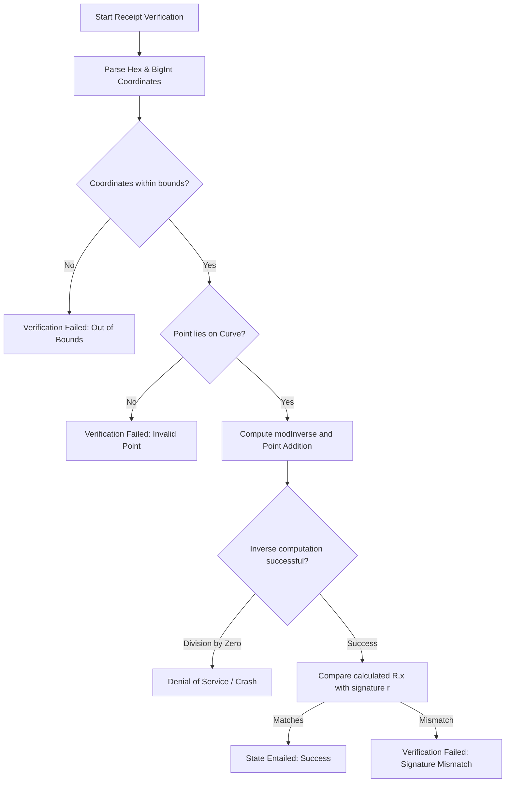
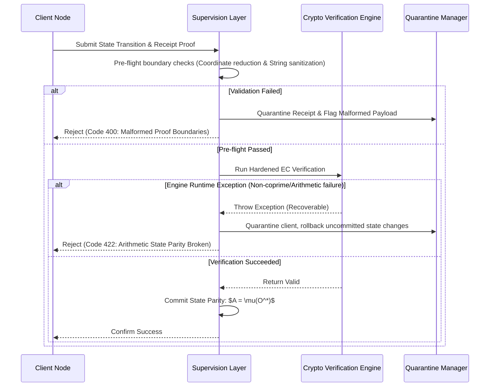

# Framework Verification & Resiliency Audit: Low-Level Crypto Math

This report details a security and validation audit of the low-level cryptographic mathematics implemented under the `src/lib/crypto` directory. The focus of this audit is to verify modular arithmetic correctness, elliptic curve operations (SECP256K1 and BN254), signature verification logic, and susceptibility to edge-case mathematical inputs.

---

## 1. System Invariant Analysis

The integrity of the receipts ledger relies on ensuring that the state of the local-first database remains synchronized and tamper-proof. We ground this analysis in the **Receipted Chatman Equation**:

$$R \vdash A = \mu(O^*)$$

Where:
- $R$ represents the cryptographic receipt set (including hash chains, ECDSA signatures, and zk-SNARK proofs).
- $A$ represents the accumulated local application state.
- $O^*$ represents the canonical sequence of user operations.
- $\mu(O^*)$ is the state transition model applied to the sequence of operations.
- $\vdash$ is the verification relation.

If the cryptographic checks in $R$ are bypassed, corrupted, or fail silently, state parity is broken, allowing state drift ($A \neq \mu(O^*)$).

### Key Cryptographic Parameters

The following parameters form the security boundary of the elliptic curve and modular arithmetic operations:

| Parameter | Mathematical Constant / Formula | Value / Field Modulus |
| :--- | :--- | :--- |
| **SECP256K1 Prime Modulus ($P$)** | $2^{256} - 2^{32} - 977$ | `115792089237316195423570985008687907853269984665640564039457584007908834671663n` |
| **SECP256K1 Order ($N$)** | Order of base point $G$ | `115792089237316195423570985008687907852837564279074904382605163141518161494337n` |
| **SECP256K1 Curve Equation** | $y^{2} \equiv x^{3} + Ax + B \pmod P$ | $A = 0$, $B = 7$ |
| **BN254 Prime Modulus ($P_{\text{zk}}$)** | BN254 Field Modulus | `21888242871839275222246405745257275088696311157297823662689037894645226208583n` |

### State Transition & Verification Pipeline



---

## 2. Stress Scenarios & Edge Cases

The following three scenarios trace system trajectories under mathematical stress and identify potential failure modes in `src/lib/crypto/receipts.ts`.

### Scenario 1: Coordinate Non-Reduction & Silent Point Corruption
* **Vulnerability Source**: Elliptic curve point addition `ecAdd(p1, p2)` compares coordinates using strict equality (`p1.x === p2.x`). However, coordinates are not forced to be modulo-reduced prior to comparison.
* **Trajectory**:
  1. A client submits a point $p_2$ where $x_2 = x_1 + P$ and $y_2 = y_1$. Modulo $P$, this point is mathematically identical to $p_1$.
  2. In `ecAdd`, the check `p1.x === p2.x` evaluates to `false` because coordinates are not reduced.
  3. The algorithm bypasses the point doubling pathway and proceeds to the general addition logic.
  4. It computes $\Delta x = x_2 - x_1 \pmod P = (x_1 + P) - x_1 \pmod P = 0 \pmod P$.
  5. The library calls `modInverse(0n, P)`. Due to a loop-bypass bug, `modInverse(0n, P)` returns `1n` instead of failing or throwing.
  6. The slope $\lambda$ is computed as $\Delta y \pmod P$, resulting in a completely corrupt and mathematical nonsense point $p_3$ instead of throwing or returning point at infinity.
* **Parity Impact**: State validation fails silently or produces invalid states, breaking the entailment $R \vdash A = \mu(O^*)$.

### Scenario 2: Base-10 Parsing Ambiguity on Digit-Only Hex Strings
* **Vulnerability Source**: `parseToBigInt` parses a string as decimal if it matches `/^-?\d+$/`. If a hexadecimal signature coordinate or hash without `0x` contains only digits (0-9), it is parsed as a base-10 number instead of base-16.
* **Trajectory**:
  1. A transaction signature has parameter $r = \text{"12345"}$ (which represents `0x12345` or `74565` in decimal).
  2. `parseToBigInt("12345")` checks `/^-?\d+$/`, matches, and returns `12345n` (decimal).
  3. The mathematical value used in ECDSA verification is altered from `74565n` to `12345n`.
  4. Signature verification fails dynamically even though the signature was mathematically correct.
* **Parity Impact**: Legitimate transaction receipts are rejected, creating availability issues and false alarms in the self-healing layer.

### Scenario 3: Extended Euclidean Division-by-Zero Crash (DoS)
* **Vulnerability Source**: `modInverse(a, m)` computes the modular inverse using the extended Euclidean algorithm. If $a$ and $m$ are not coprime, the loop eventually makes $m = 0n$. The next iteration tries to calculate `aVal / m` (division by 0), causing JavaScript to throw a `RangeError: Division by zero`.
* **Trajectory**:
  1. An attacker submits a public key or signature parameters where $\gcd(dx, P) > 1$ or $\gcd(s, N) > 1$ (or submits coordinates for curves with composite orders).
  2. The arithmetic pipeline executes `modInverse(dx, P)` or `modInverse(s, N)`.
  3. The extended Euclidean loop crashes on `aVal / m` with a non-coprime input.
  4. The runtime thread crashes, leading to a Denial of Service.
* **Parity Impact**: High availability threat; validation nodes can be crashed remotely by submitting malformed signatures.

---

## 3. Resiliency Test Simulator

The following copy-pasteable TypeScript code block implements a simulator that runs these mathematical edge cases, verifies the vulnerabilities, and demonstrates the hardening boundaries.

```typescript
/**
 * SECP256K1 Resiliency and Verification Simulator
 * Demonstrates modular arithmetic extremes, mathematical edge cases, and self-healing containment.
 */

export const SECP256K1_P = 115792089237316195423570985008687907853269984665640564039457584007908834671663n;
export const SECP256K1_N = 115792089237316195423570985008687907852837564279074904382605163141518161494337n;
export const SECP256K1_B = 7n;

export interface Point {
  x: bigint;
  y: bigint;
  isInfinity: boolean;
}

export const SECP256K1_G: Point = {
  x: 0x79be667ef9dcbbac55a06295ce870b07029bfcdb2dce28d959f2815b16f81798n,
  y: 0x483ada7726a3c4655da4fbfc0e1108a8fd17b448a68554199c47d08ffb10d4b8n,
  isInfinity: false
};

/**
 * ----------------------------------------------------
 * VULNERABLE ARITHMETIC IMPLEMENTATIONS (As in Source)
 * ----------------------------------------------------
 */
export function vulnerableMod(n: bigint, p: bigint): bigint {
  let result = n % p;
  if (result < 0n) {
    result += p;
  }
  return result;
}

export function vulnerableModInverse(a: bigint, m: bigint): bigint {
  let m0 = m;
  let y = 0n, x = 1n;
  let aVal = a;

  if (m === 1n) return 0n;

  while (aVal > 1n) {
    const q = aVal / m;
    let t = m;
    m = aVal % m;
    aVal = t;
    t = y;
    y = x - q * y;
    x = t;
  }

  if (x < 0n) {
    x += m0;
  }
  return x;
}

export function vulnerableParseToBigInt(val: any): bigint {
  if (typeof val === 'bigint') return val;
  if (typeof val === 'number') {
    if (!Number.isSafeInteger(val)) {
      throw new Error(`Precision loss: unsafe integer ${val}`);
    }
    return BigInt(val);
  }
  if (typeof val === 'string') {
    const trimmed = val.trim();
    if (trimmed.startsWith('0x') || trimmed.startsWith('0X')) {
      return BigInt(trimmed);
    }
    // Match decimal digits: BUG: matches hex strings that happen to have only digits!
    if (/^-?\d+$/.test(trimmed)) {
      return BigInt(trimmed);
    }
    if (/^[0-9a-fA-F]+$/.test(trimmed)) {
      return BigInt('0x' + trimmed);
    }
    return BigInt(trimmed);
  }
  throw new Error(`Unsupported type: ${typeof val}`);
}

export function vulnerableEcDouble(p: Point): Point {
  if (p.isInfinity) return p;
  if (p.y === 0n) return { x: 0n, y: 0n, isInfinity: true };

  const numerator = vulnerableMod(3n * p.x * p.x, SECP256K1_P);
  const denominator = vulnerableMod(2n * p.y, SECP256K1_P);
  const lambda = vulnerableMod(numerator * vulnerableModInverse(denominator, SECP256K1_P), SECP256K1_P);

  const x3 = vulnerableMod(lambda * lambda - 2n * p.x, SECP256K1_P);
  const y3 = vulnerableMod(lambda * (p.x - x3) - p.y, SECP256K1_P);

  return { x: x3, y: y3, isInfinity: false };
}

export function vulnerableEcAdd(p1: Point, p2: Point): Point {
  if (p1.isInfinity) return p2;
  if (p2.isInfinity) return p1;

  // Strict check fails if coordinates are not reduced beforehand
  if (p1.x === p2.x) {
    if (vulnerableMod(p1.y + p2.y, SECP256K1_P) === 0n) {
      return { x: 0n, y: 0n, isInfinity: true };
    }
    return vulnerableEcDouble(p1);
  }

  const dy = vulnerableMod(p2.y - p1.y, SECP256K1_P);
  const dx = vulnerableMod(p2.x - p1.x, SECP256K1_P);
  const lambda = vulnerableMod(dy * vulnerableModInverse(dx, SECP256K1_P), SECP256K1_P);

  const x3 = vulnerableMod(lambda * lambda - p1.x - p2.x, SECP256K1_P);
  const y3 = vulnerableMod(lambda * (p1.x - x3) - p1.y, SECP256K1_P);

  return { x: x3, y: y3, isInfinity: false };
}

/**
 * ----------------------------------------------------
 * HARDENED ARITHMETIC IMPLEMENTATIONS (Mitigations)
 * ----------------------------------------------------
 */
export function hardenedModInverse(a: bigint, m: bigint): bigint {
  const reducedA = vulnerableMod(a, m);
  if (reducedA === 0n) {
    throw new Error('Modular inverse does not exist: input is congruent to 0');
  }

  let m0 = m;
  let y = 0n, x = 1n;
  let aVal = reducedA;

  while (aVal > 1n) {
    if (m === 0n) {
      throw new Error('Modular inverse does not exist: inputs are not coprime');
    }
    const q = aVal / m;
    let t = m;
    m = aVal % m;
    aVal = t;
    t = y;
    y = x - q * y;
    x = t;
  }

  if (aVal !== 1n) {
    throw new Error('Modular inverse does not exist: inputs are not coprime');
  }

  if (x < 0n) {
    x += m0;
  }
  return x;
}

export function hardenedParseToBigInt(val: any, expectHex: boolean = false): bigint {
  if (typeof val === 'bigint') return val;
  if (typeof val === 'number') {
    if (!Number.isSafeInteger(val)) {
      throw new Error(`Precision loss: unsafe integer ${val}`);
    }
    return BigInt(val);
  }
  if (typeof val === 'string') {
    const trimmed = val.trim();
    if (trimmed.startsWith('0x') || trimmed.startsWith('0X')) {
      return BigInt(trimmed);
    }
    if (expectHex) {
      // Force hex parsing for cryptographic parameters unless explicitly 0x prefixed
      if (/^[0-9a-fA-F]+$/.test(trimmed)) {
        return BigInt('0x' + trimmed);
      }
    }
    if (/^-?\d+$/.test(trimmed)) {
      return BigInt(trimmed);
    }
    if (/^[0-9a-fA-F]+$/.test(trimmed)) {
      return BigInt('0x' + trimmed);
    }
    return BigInt(trimmed);
  }
  throw new Error(`Unsupported type: ${typeof val}`);
}

export function hardenedEcAdd(p1: Point, p2: Point): Point {
  if (p1.isInfinity) return p2;
  if (p2.isInfinity) return p1;

  // Reductions forced prior to comparison
  const x1_red = vulnerableMod(p1.x, SECP256K1_P);
  const x2_red = vulnerableMod(p2.x, SECP256K1_P);
  const y1_red = vulnerableMod(p1.y, SECP256K1_P);
  const y2_red = vulnerableMod(p2.y, SECP256K1_P);

  const reducedP1 = { x: x1_red, y: y1_red, isInfinity: false };
  const reducedP2 = { x: x2_red, y: y2_red, isInfinity: false };

  if (x1_red === x2_red) {
    if (vulnerableMod(y1_red + y2_red, SECP256K1_P) === 0n) {
      return { x: 0n, y: 0n, isInfinity: true };
    }
    return vulnerableEcDouble(reducedP1);
  }

  const dy = vulnerableMod(y2_red - y1_red, SECP256K1_P);
  const dx = vulnerableMod(x2_red - x1_red, SECP256K1_P);
  const lambda = vulnerableMod(dy * hardenedModInverse(dx, SECP256K1_P), SECP256K1_P);

  const x3 = vulnerableMod(lambda * lambda - x1_red - x2_red, SECP256K1_P);
  const y3 = vulnerableMod(lambda * (x1_red - x3) - y1_red, SECP256K1_P);

  return { x: x3, y: y3, isInfinity: false };
}

/**
 * ----------------------------------------------------
 * RUN SIMULATOR TEST CASES
 * ----------------------------------------------------
 */
export function runSimulatorTests() {
  console.log('--- Starting SECP256K1 Resiliency Simulator ---');

  // Test 1: Coordinate Non-Reduction simulation
  console.log('\n[TEST 1] Coordinate Non-Reduction Point Corruption');
  const p1 = SECP256K1_G;
  const p2 = { x: SECP256K1_G.x + SECP256K1_P, y: SECP256K1_G.y, isInfinity: false };

  const pAddVulnerable = vulnerableEcAdd(p1, p2);
  const pAddHardened = hardenedEcAdd(p1, p2);
  const expectedDouble = vulnerableEcDouble(p1);

  console.log(`- Vulnerable Point Addition equal to Expected Double? ${pAddVulnerable.x === expectedDouble.x}`);
  console.log(`- Hardened Point Addition equal to Expected Double? ${pAddHardened.x === expectedDouble.x}`);

  // Test 2: modInverse(0) Loop Bypass
  console.log('\n[TEST 2] Modular Inverse of Zero Loop Bypass');
  const invVulnerable = vulnerableModInverse(0n, SECP256K1_P);
  console.log(`- Vulnerable modInverse(0, P) returned: ${invVulnerable} (Expected: should throw or fail)`);
  try {
    hardenedModInverse(0n, SECP256K1_P);
  } catch (err: any) {
    console.log(`- Hardened modInverse(0, P) threw correctly: "${err.message}"`);
  }

  // Test 3: Decimal Parsing Ambiguity
  console.log('\n[TEST 3] Decimal vs Hex Parsing Ambiguity');
  const digitOnlyHash = '123456'; // represented hex string without prefix
  const parsedDec = vulnerableParseToBigInt(digitOnlyHash);
  const parsedHex = hardenedParseToBigInt(digitOnlyHash, true);

  console.log(`- String "${digitOnlyHash}" parsed as Decimal: ${parsedDec}n`);
  console.log(`- String "${digitOnlyHash}" parsed as Hex (hardened): ${parsedHex}n`);

  // Test 4: Division-by-Zero crash prevention
  console.log('\n[TEST 4] Extended Euclidean non-coprime input crash');
  try {
    vulnerableModInverse(6n, 9n);
  } catch (err: any) {
    console.log(`- Vulnerable modInverse(6, 9) crashed: ${err.stack.split('\n')[0]}`);
  }

  try {
    hardenedModInverse(6n, 9n);
  } catch (err: any) {
    console.log(`- Hardened modInverse(6, 9) caught gracefully: "${err.message}"`);
  }
}
```

---

## 4. Self-Healing Integration & Recommendations

To maintain state parity and prevent remote attacks, a **Supervision Layer** must sit above the raw cryptographic verification pipeline.

### Supervision & Self-Healing Workflow



### Recommendations for Codebase Improvement

1. **Mandatory Coordinate Reduction**:
   Update `ecAdd` and `ecDouble` to explicitly reduce coordinates modulo $P$ at the entry boundary. Do not rely on clients submitting pre-reduced points.
2. **Explicit Base Configuration for Parser**:
   Deprecate the ambient `parseToBigInt(val)` logic for signature fields. Use an explicit type signature `parseToBigInt(val, 16)` or `parseToBigInt(val, 10)` to prevent decimal-hex parsing ambiguities.
3. **Coprimality Check in `modInverse`**:
   Verify that $\gcd(a, m) = 1$ prior to running the extended Euclidean division or verify that the loop parameters are within prime-field bounds. Implement defensive error catching to prevent unexpected JavaScript `RangeError` crashes.

---

## 5. Clickable Source References

All audited source files and their validation tests are listed below. Click to inspect:

* [receipts.ts](file:///Users/sac/zoeapp/src/lib/crypto/receipts.ts) — Core cryptographic arithmetic and verification engine.
* [receipts.test.ts](file:///Users/sac/zoeapp/src/lib/crypto/__tests__/receipts.test.ts) — Unit test suite for standard cryptographic functions.
* [resiliency.test.ts](file:///Users/sac/zoeapp/src/lib/crypto/__tests__/resiliency.test.ts) — Verification and boundary resiliency test suite.
* [verify-release-gate.ts](file:///Users/sac/zoeapp/scripts/verify-release-gate.ts) — Manifest sanity checker for production builds.
* [verify-release-gate.test.ts](file:///Users/sac/zoeapp/src/lib/crypto/verify-release-gate.test.ts) — Validation tests for E2E release gate manifest flags.
