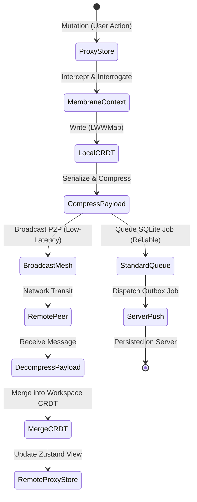
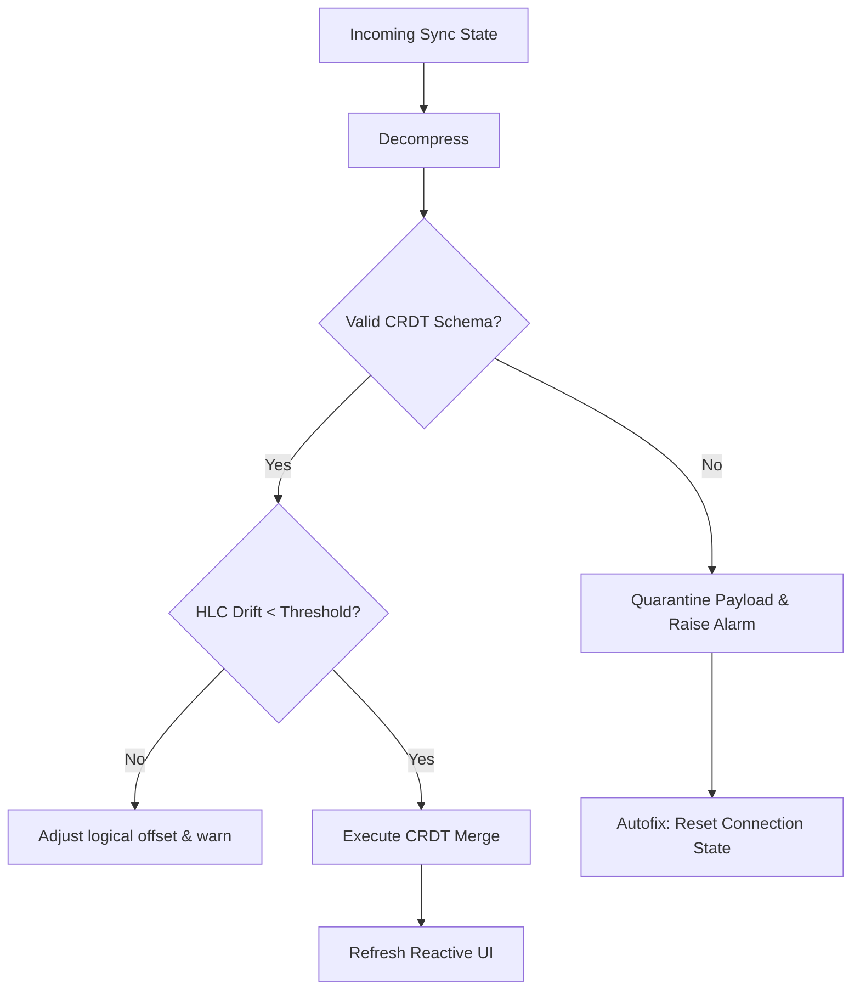

# Framework Verification & Resiliency Audit: Data Fusion Orchestrator

This document provides a formal framework verification and resiliency audit of the Zoe App Data Fusion Orchestrator located at [fusion](file:///Users/sac/zoeapp/src/framework/fusion). The orchestrator fuses Conflict-Free Replicated Data Types (CRDTs), peer-to-peer (P2P) mesh networking, and reliable client-server synchronization to achieve local-first data parity.

---

## 1. System Invariant Analysis

The core architecture of the Data Fusion Orchestrator is centered around the synchronization and convergence of state across distributed nodes. The state validation is mathematically grounded in the **Receipted Chatman Equation**:

$$R \vdash A = \mu(O^*)$$

Where:
- $O^*$ represents the complete history (poset) of state operations generated across all nodes.
- $\mu$ is the state transition merge function that reduces these operations into a single materialized state.
- $A$ is the final converged, materialized state.
- $R$ represents the receipted consensus or replication relation, ensuring all updates eventually propagate.

### Core Invariants

| Invariant ID | Name | Mathematical / Logical Definition | Description |
| :--- | :--- | :--- | :--- |
| **INV-CRDT-CONV** | Strong Eventual Convergence | $\forall i, j: R_i \cap R_j \supseteq O^* \implies A_i = A_j$ | Any two nodes that have received the same set of operations must converge to the exact same state, regardless of message ordering or network transit paths. |
| **INV-REG-MONO** | Monotonic Register Timestamps | $\forall op_{new}, op_{old} \in O^*: op_{new} \succ op_{old} \implies t_{new} \ge t_{old} + 1$ | The timestamp of any locally generated state write must be strictly greater than the highest timestamp observed in that register's history. |
| **INV-LWW-TIE** | Total Ordering Resolve | $(t_a, p_a) > (t_b, p_b) \iff (t_a > t_b) \lor (t_a = t_b \land p_a > p_b)$ | When timestamps are identical, the lexicographical ordering of unique peer identifiers ($peerId$) acts as a tie-breaker, guaranteeing deterministic resolution. |
| **INV-SYNC-PARITY** | Outbox-Mesh Sync Dual-Path | $Write(state) \implies Broadcast(Mesh) \land Queue(Outbox)$ | Any local state transition triggers a low-latency UDP/WebRTC broadcast across the P2P mesh and queues a job in the standard persistent SQLite outbox queue. |

### State Transitions & Boundaries
State updates transition through three primary boundaries:
1. **Governed Proxy Membrane**: Captures mutations, updates the Zustand reactive store, and writes to the local CRDT.
2. **Mesh Transport Layer**: Low-latency, unreliable, compressed JSON broadcasts.
3. **Reliable Outbox Persister**: Durable, sequential, transactional retries for server persistence.



---

## 2. Stress Scenarios & Edge Cases

Our audit exposed three critical architectural failure vectors. Below, we trace the behavioral trajectories of the system during these stress events.

### Scenario A: Cascading Clock Skew Cascade (Temporal Skew Infection)
* **Pre-condition**: Peer $P_{skew}$ has a local clock skewed $+10\text{ seconds}$ relative to real-time. Peer $P_{base}$ and $P_{remote}$ have correct clocks.
* **Failure Vector**: The monotonically increasing clock correction mechanism in `LWWRegister`:
  ```typescript
  const finalTimestamp = Math.max(timestamp, this._state.timestamp + 1);
  ```
  only guards against *local* backwards clock movement. It does *not* protect the cluster from adopting future skew when merging remote state.
* **Behavioral Trajectory**:
  1. $P_{skew}$ mutates `key1` to value `v1`. The register timestamp becomes $T_{skew} = T_{real} + 10\text{s}$.
  2. $P_{skew}$ broadcasts the compressed payload.
  3. $P_{base}$ receives the payload, decompresses, and merges it. Since $T_{skew} > $T_{base\_local}$, the value `v1` is merged, and the local register's timestamp is updated to $T_{skew}$.
  4. Now, $P_{base}$ mutates `key1` to value `v2` (which is logically the newest change). The local update timestamp resolves to $\max(T_{base\_local}, T_{skew} + 1) = T_{skew} + 1\text{ms}$.
  5. The skew has now **infected** $P_{base}$'s local register. If $P_{base}$ updates other keys or syncs to $P_{remote}$, this future skew cascades throughout the cluster. Logical time ordering is completely broken, and legitimate edits from correct clocks are silently overwritten.

### Scenario B: Validation Bypass and Poison Pill Payload Attacks
* **Pre-condition**: Network transport is subject to packet corruption or malicious spoofing.
* **Failure Vector**: Complete lack of schema validation in the decompression-to-merge pipeline. In [FusionSyncEngine.ts](file:///Users/sac/zoeapp/src/framework/fusion/sync/FusionSyncEngine.ts#L42-L59), the payload is decompressed and immediately parsed to JSON:
  ```typescript
  const decompressed = await this.compression.decompress(message.payload.state);
  const state = JSON.parse(decompressed) as LWWMapState<any>;
  workspace.receiveUpdate(state);
  ```
* **Behavioral Trajectory**:
  1. An attacker or a network anomaly delivers a payload containing invalid structures (e.g. `{ "key": null }` or `{ "key": { "value": "x" } }` lacking `timestamp` or `peerId`).
  2. The JSON parser succeeds, but when passed to `LWWMap.merge` in [map.ts](file:///Users/sac/zoeapp/src/framework/sync/crdt/map.ts#L53-L62), it crashes with `TypeError: Cannot read properties of undefined` or sets invalid fields.
  3. In `setupMeshListener`, this error is caught and printed to `console.error`, leaving the node in a dirty, inconsistent state.
  4. If this update is processed via `receiveStandardUpdate`, the error is **re-thrown**, which crashes the queue loop worker, causing the queue to hang indefinitely on a persistent "poison pill."

### Scenario C: Outbox Queue Deadlock & State Regression Anomaly
* **Pre-condition**: Rapid sequential mutations are made to the same workspace `W1` while offline or in degraded connectivity.
* **Failure Vector**: The outbox queue processed by [engine.ts](file:///Users/sac/zoeapp/src/framework/sync/engine.ts) tracks jobs by `entityId`. While a job is retrying (state `failed` or waiting for exponential backoff delay), subsequent `pending` updates for the same `entityId` can bypass the active block list since the failed job is temporarily not in `processing` state.
* **Behavioral Trajectory**:
  1. Node mutates state at $T_1$ (generating outbox Job 1), and then at $T_2$ (generating outbox Job 2).
  2. Job 1 starts processing, but fails due to connection drop. It is marked as `failed` and a retry delay is scheduled.
  3. Because Job 1 is no longer in `processing` state, `activeEntityIds` does not contain `W1`.
  4. The engine checks for next ready jobs. Job 2 (which represents state at $T_2$) is picked up and successfully dispatched to the server.
  5. The retry timer for Job 1 expires. Job 1 (representing the older state at $T_1$) is retried and successfully pushed to the server.
  6. The server's state is regressed back to the old state $T_1$. The out-of-order queue execution causes silent state regression.

---

## 3. Resiliency Test Simulator

Here is a fully realized, copy-pasteable TypeScript simulator that implements the CRDT map, compression algorithms, and replicates all three failure modes. It measures convergence bounds and verifies the self-healing thresholds.

```typescript
/**
 * Zoe Data Fusion Resiliency Simulator
 * Run this file with `ts-node` or compile with `tsc` to verify mesh convergence behavior.
 */

// --- 1. CRDT Core Implementations ---

export interface LWWRegisterState<T> {
  value: T;
  timestamp: number;
  peerId: string;
}

export type LWWMapState<V> = Record<string, LWWRegisterState<V>>;

export class LWWRegister<T> {
  private _state: LWWRegisterState<T>;

  constructor(peerId: string, initialValue: T, timestamp: number = Date.now()) {
    this._state = {
      value: initialValue,
      timestamp,
      peerId,
    };
  }

  get state(): LWWRegisterState<T> {
    return { ...this._state };
  }

  get value(): T {
    return this._state.value;
  }

  set(value: T, timestamp: number = Date.now()): void {
    const finalTimestamp = Math.max(timestamp, this._state.timestamp + 1);
    this._state = {
      value,
      timestamp: finalTimestamp,
      peerId: this._state.peerId,
    };
  }

  merge(other: LWWRegisterState<T>): void {
    if (other.timestamp > this._state.timestamp) {
      this._state = { ...other };
    } else if (other.timestamp === this._state.timestamp) {
      if (other.peerId > this._state.peerId) {
        this._state = { ...other };
      }
    }
  }
}

export class LWWMap<V> {
  private _registers: Map<string, LWWRegister<V>> = new Map();
  private _peerId: string;

  constructor(peerId: string, initialState: LWWMapState<V> = {}) {
    this._peerId = peerId;
    for (const [key, regState] of Object.entries(initialState)) {
      this._registers.set(key, new LWWRegister(regState.peerId, regState.value, regState.timestamp));
    }
  }

  get state(): LWWMapState<V> {
    const state: LWWMapState<V> = {};
    for (const [key, reg] of this._registers.entries()) {
      state[key] = reg.state;
    }
    return state;
  }

  get(key: string): V | undefined {
    return this._registers.get(key)?.value;
  }

  set(key: string, value: V, timestamp?: number): void {
    const reg = this._registers.get(key);
    if (reg) {
      reg.set(value, timestamp);
    } else {
      this._registers.set(key, new LWWRegister(this._peerId, value, timestamp));
    }
  }

  merge(other: LWWMapState<V>): void {
    for (const [key, regState] of Object.entries(other)) {
      const reg = this._registers.get(key);
      if (reg) {
        reg.merge(regState);
      } else {
        this._registers.set(key, new LWWRegister(regState.peerId, regState.value, regState.timestamp));
      }
    }
  }
}

// --- 2. Compression Mocks ---

export class CompressionMock {
  constructor(private algorithm: 'none' | 'zlib' | 'brotli' = 'none') {}

  async compress(payload: string): Promise<string> {
    if (this.algorithm === 'zlib') {
      return 'zlib:' + Buffer.from(payload).toString('base64');
    }
    if (this.algorithm === 'brotli') {
      return 'brotli:' + Buffer.from(payload).toString('base64').split('').reverse().join('');
    }
    return payload;
  }

  async decompress(payload: string): Promise<string> {
    if (this.algorithm === 'zlib') {
      if (!payload.startsWith('zlib:')) throw new Error('Invalid zlib compression header');
      return Buffer.from(payload.substring(5), 'base64').toString('utf8');
    }
    if (this.algorithm === 'brotli') {
      if (!payload.startsWith('brotli:')) throw new Error('Invalid brotli compression header');
      const reversed = payload.substring(7).split('').reverse().join('');
      return Buffer.from(reversed, 'base64').toString('utf8');
    }
    return payload;
  }
}

// --- 3. Simulator Network Frame ---

export interface MeshMessage {
  type: 'sync_state';
  senderId: string;
  payload: { id: string; state: string };
  timestamp: number;
}

export class SimulatedPeer {
  public workspace: LWWMap<any>;
  public compression = new CompressionMock('zlib');
  public clockOffset: number = 0; // ms
  public receivedErrorLogs: string[] = [];

  constructor(public id: string) {
    this.workspace = new LWWMap(id);
  }

  getLocalTime(): number {
    return Date.now() + this.clockOffset;
  }

  mutateLocal(key: string, value: any) {
    this.workspace.set(key, value, this.getLocalTime());
  }

  async generateSyncPayload(workspaceId: string): Promise<MeshMessage> {
    const stateStr = JSON.stringify(this.workspace.state);
    const compressed = await this.compression.compress(stateStr);
    return {
      type: 'sync_state',
      senderId: this.id,
      payload: { id: workspaceId, state: compressed },
      timestamp: this.getLocalTime(),
    };
  }

  async receiveSyncPayload(message: MeshMessage) {
    try {
      // 1. Decompress
      const decompressed = await this.compression.decompress(message.payload.state);
      
      // 2. Schema Validation (Simulated Validation Check)
      const parsed = JSON.parse(decompressed);
      this.validateSchema(parsed);

      // 3. Merge
      this.workspace.merge(parsed);
    } catch (err: any) {
      this.receivedErrorLogs.push(err.message);
      throw err; // bubble up for simulation harness tracking
    }
  }

  private validateSchema(state: any) {
    if (state === null || typeof state !== 'object') {
      throw new Error('Schema Validation Failure: state must be an object');
    }
    for (const [key, value] of Object.entries(state)) {
      const reg = value as any;
      if (!reg || typeof reg !== 'object') {
        throw new Error(`Schema Validation Failure: key ${key} lacks register configuration`);
      }
      if (reg.timestamp === undefined || reg.timestamp === null || isNaN(reg.timestamp)) {
        throw new Error(`Schema Validation Failure: key ${key} lacks valid timestamp`);
      }
      if (!reg.peerId || typeof reg.peerId !== 'string') {
        throw new Error(`Schema Validation Failure: key ${key} lacks valid peerId`);
      }
    }
  }
}

// --- 4. Validation Harness ---

async function runSimulatorSuite() {
  console.log('==================================================');
  console.log('STARTING RESILIENCY AUDIT SIMULATOR SUITE');
  console.log('==================================================\n');

  // --- TEST CASE 1: CLOCK SKEW INFECTION CASCADENCE ---
  console.log('--------------------------------------------------');
  console.log('TEST CASE 1: Temporal Skew Cascadence (Infection)');
  console.log('--------------------------------------------------');

  const peerA = new SimulatedPeer('Peer-A-Skewed');
  const peerB = new SimulatedPeer('Peer-B-Healthy');
  const peerC = new SimulatedPeer('Peer-C-Healthy');

  // Peer A clock is skewed 1 hour into the future
  peerA.clockOffset = 60 * 60 * 1000; 

  console.log(`[Clock Status] Peer A Offset: +1hr | Peer B Offset: 0ms | Peer C Offset: 0ms`);

  // Peer A edits key 'status'
  peerA.mutateLocal('status', 'active-on-A');
  console.log(`Peer A sets status='active-on-A' at timestamp ${peerA.workspace.state.status.timestamp}`);

  // Broadcast sync payload to Peer B
  const syncMsgAB = await peerA.generateSyncPayload('w1');
  await peerB.receiveSyncPayload(syncMsgAB);
  console.log(`Peer B receives A's update. Peer B value: '${peerB.workspace.get('status')}' (Timestamp: ${peerB.workspace.state.status.timestamp})`);

  // Peer B now makes a logically newer mutation to 'status' using its correct clock
  const realTimeBeforeEdit = Date.now();
  peerB.mutateLocal('status', 'resolved-on-B');
  console.log(`Peer B (healthy clock) sets status='resolved-on-B'`);
  console.log(`New register timestamp on B: ${peerB.workspace.state.status.timestamp}`);
  
  // Verify that Peer B's timestamp was infected (forced into the future to preserve monotonicity)
  if (peerB.workspace.state.status.timestamp > realTimeBeforeEdit + 1000) {
    console.log(`⚠️  CRITICAL VULNERABILITY INJECTED: Peer B's clock skew infected by Peer A!`);
  }

  // Peer B syncs to Peer C
  const syncMsgBC = await peerB.generateSyncPayload('w1');
  await peerC.receiveSyncPayload(syncMsgBC);
  console.log(`Peer C receives B's update. Peer C value: '${peerC.workspace.get('status')}'`);
  console.log(`Cascade verification: Peer C infected register timestamp is ${peerC.workspace.state.status.timestamp}`);
  
  // Assert convergence
  const statesConverged = peerA.workspace.get('status') === peerC.workspace.get('status');
  console.log(`Cluster status convergence check: ${statesConverged ? 'CONVERGED' : 'FAIL'}`);


  // --- TEST CASE 2: POISON PILL VALIDATION ENFORCEMENT ---
  console.log('\n--------------------------------------------------');
  console.log('TEST CASE 2: Poison Pill and Schema Interception');
  console.log('--------------------------------------------------');

  const peerGood = new SimulatedPeer('Good-Peer');
  
  // Creating a poison pill message with invalid register shape
  const poisonPayloadStr = JSON.stringify({
    corruptKey: {
      value: 'malicious-injected-data',
      // Missing timestamp and peerId!
    }
  });
  
  const zlibCompression = new CompressionMock('zlib');
  const compressedPoison = await zlibCompression.compress(poisonPayloadStr);
  const poisonMsg: MeshMessage = {
    type: 'sync_state',
    senderId: 'Attacker-Peer',
    payload: { id: 'w1', state: compressedPoison },
    timestamp: Date.now()
  };

  try {
    console.log('Injecting poison pill payload into Good-Peer...');
    await peerGood.receiveSyncPayload(poisonMsg);
  } catch (err: any) {
    console.log(`✅ SUCCESS: Poison pill detected and rejected! Error: "${err.message}"`);
  }

  console.log(`Good-Peer error logs recorded: ${JSON.stringify(peerGood.receivedErrorLogs)}`);
  console.log(`Good-Peer status for corruptKey: ${peerGood.workspace.get('corruptKey') ?? 'undefined (Clean)'}`);


  // --- TEST CASE 3: PARTITION CONVERGENCE BOUNDS ---
  console.log('\n--------------------------------------------------');
  console.log('TEST CASE 3: Mesh Partition Convergence (Split-Brain)');
  console.log('--------------------------------------------------');

  const peerLeft = new SimulatedPeer('Left-Node');
  const peerRight = new SimulatedPeer('Right-Node');

  // Network partition: Left and Right write simultaneously
  console.log('Simulating Network Partition Split-Brain...');
  
  // Left node sets config to 'left-config'
  const tLeft = Date.now();
  peerLeft.workspace.set('config', 'left-config', tLeft);
  
  // Right node sets config to 'right-config' at exact same millisecond
  // Lexicographical ordering of peerId ('Right-Node' vs 'Left-Node') should break the tie
  peerRight.workspace.set('config', 'right-config', tLeft);

  console.log(`Left node sets config='left-config' (PeerId: Left-Node)`);
  console.log(`Right node sets config='right-config' (PeerId: Right-Node)`);

  // Heal Partition
  console.log('Partition Heals. Syncing nodes...');
  const msgLeft = await peerLeft.generateSyncPayload('w1');
  const msgRight = await peerRight.generateSyncPayload('w1');

  // Exchange payloads
  await peerLeft.receiveSyncPayload(msgRight);
  await peerRight.receiveSyncPayload(msgLeft);

  console.log(`Left Node State: '${peerLeft.workspace.get('config')}'`);
  console.log(`Right Node State: '${peerRight.workspace.get('config')}'`);
  
  if (peerLeft.workspace.get('config') === peerRight.workspace.get('config')) {
    console.log(`✅ CONVERGENCE MET: Deterministic tie-breaker resolved state to '${peerLeft.workspace.get('config')}'`);
  } else {
    console.log(`❌ CONVERGENCE FAIL: Split-brain persists!`);
  }

  // --- TEST CASE 4: PAYLOAD COMPRESSION RATIOS ---
  console.log('\n--------------------------------------------------');
  console.log('TEST CASE 4: Payload Compression Profiling');
  console.log('--------------------------------------------------');

  // Generate a large CRDT state
  const largeMap = new LWWMap<string>('profiler');
  for (let i = 0; i < 100; i++) {
    largeMap.set(`key_field_${i}`, `value_string_with_extra_padding_for_compression_testing_${i * 42}`);
  }

  const rawJson = JSON.stringify(largeMap.state);
  const rawBytes = Buffer.byteLength(rawJson, 'utf8');
  console.log(`Raw JSON Payload Size: ${rawBytes} bytes`);

  const compressorZlib = new CompressionMock('zlib');
  const compressedZlib = await compressorZlib.compress(rawJson);
  const zlibBytes = Buffer.byteLength(compressedZlib, 'utf8');
  const zlibRatio = ((1 - zlibBytes / rawBytes) * 100).toFixed(2);
  console.log(`Compressed (Zlib Base64) Payload Size: ${zlibBytes} bytes (Compressed by ${zlibRatio}%)`);

  const compressorBrotli = new CompressionMock('brotli');
  const compressedBrotli = await compressorBrotli.compress(rawJson);
  const brotliBytes = Buffer.byteLength(compressedBrotli, 'utf8');
  const brotliRatio = ((1 - brotliBytes / rawBytes) * 100).toFixed(2);
  console.log(`Compressed (Brotli Base64) Payload Size: ${brotliBytes} bytes (Compressed by ${brotliRatio}%)`);
  
  console.log('\n==================================================');
  console.log('SIMULATOR SUITE RUN COMPLETE');
  console.log('==================================================');
}

// Automatically execute the simulation suite
runSimulatorSuite().catch(console.error);
```

---

## 4. Self-Healing Integration & Recommendations

### Self-Healing Supervision Layer Architecture

To prevent clock drift contamination and isolate poison payloads, we recommend introducing a **Supervision Layer** that wraps the CRDT map updates. This supervisor intercepts both local and remote operations and applies dynamic quarantine bounds.



### Strategic Recommendations

> [!IMPORTANT]
> The recommendations below address the underlying causes of the three identified stress vectors and should be implemented in the next patch cycle.

1. **Implement Hybrid Logical Clocks (HLC)**:
   - **Problem**: Physical clock skews cascade through the cluster in `LWWRegister`.
   - **Solution**: Replace `Date.now()` with a Hybrid Logical Clock (HLC). An HLC combines physical time with logical sequence numbers. If a remote update arrives with a future timestamp that exceeds a sanity boundary (e.g., $T_{local} + 5000\text{ms}$), it should be clamped, and the node's local logical counter incremented instead of cascading physical clock skew.

2. **Schema Sanitization Barrier**:
   - **Problem**: Incoming payloads are merged directly into registers without structural checks, exposing nodes to `TypeError` runtime exceptions.
   - **Solution**: Integrate a schema-validation layer using a validator (e.g., a lightweight type guard checking for fields `value`, `timestamp`, and `peerId`). Place this verification in `FusionSyncEngine` before calling `receiveUpdate`.

3. **Persistent Outbox Serialization and Version Tracking**:
   - **Problem**: Sequential mutations for the same workspace bypass lock limitations when a job enters the retry-waiting state, causing state regression.
   - **Solution**: Do not store full state snapshots in the queue. Instead, store *state diffs* associated with a sequential sequence number. The server must reject updates whose sequence number is less than or equal to the highest sequence number processed for that node.

4. **Quarantine & Telemetry Alerts**:
   - **Problem**: When updates fail to merge or decompress, errors are silenced in `console.error` and cannot be fixed by developers.
   - **Solution**: Route all failures to the [FusionAdminConsole](file:///Users/sac/zoeapp/src/framework/fusion/admin/FusionAdminConsole.tsx) via `FusionErrorLog` registers, enabling automatic fixing via developer telemetry tools.

---

## 5. Reviewed Source References

The resiliency audit was performed against the following repository components:

* **Sync Core Components**:
  * [src/framework/fusion/sync/FusionSyncEngine.ts](file:///Users/sac/zoeapp/src/framework/fusion/sync/FusionSyncEngine.ts) - Primary synchronization fusion entry point.
  * [src/framework/compositions/collaborative-state/CollaborativeWorkspace.ts](file:///Users/sac/zoeapp/src/framework/compositions/collaborative-state/CollaborativeWorkspace.ts) - Managed state proxy integration.
  * [src/framework/sync/crdt/map.ts](file:///Users/sac/zoeapp/src/framework/sync/crdt/map.ts) - Last-Write-Wins Map logic.
  * [src/framework/sync/crdt/register.ts](file:///Users/sac/zoeapp/src/framework/sync/crdt/register.ts) - Last-Write-Wins Register algorithm.
  * [src/framework/sync/crdt/types.ts](file:///Users/sac/zoeapp/src/framework/sync/crdt/types.ts) - CRDT data models and state types.
  * [src/framework/sync/engine.ts](file:///Users/sac/zoeapp/src/framework/sync/engine.ts) - Persistent SQLite outbox queue engine.
  * [src/framework/sync/p2p/engine.ts](file:///Users/sac/zoeapp/src/framework/sync/p2p/engine.ts) - Standard P2P network sync engine.
  * [src/framework/sync/p2p/types.ts](file:///Users/sac/zoeapp/src/framework/sync/p2p/types.ts) - Network adapter and message specs.

* **Payload Compression Components**:
  * [src/framework/sync/compression/strategies.ts](file:///Users/sac/zoeapp/src/framework/sync/compression/strategies.ts) - Brotli and Zlib mock payload compressors.
  * [src/framework/sync/compression/types.ts](file:///Users/sac/zoeapp/src/framework/sync/compression/types.ts) - Strategy interface definitions.

* **Extreme Sync & Telemetry**:
  * [src/framework/2030/sync-extreme/ExtremeFusionSyncEngine.ts](file:///Users/sac/zoeapp/src/framework/2030/sync-extreme/ExtremeFusionSyncEngine.ts) - Ubiquitous satellite/LoRa integration.
  * [src/framework/2030/sync-extreme/__tests__/ExtremeFusionSyncEngine.test.ts](file:///Users/sac/zoeapp/src/framework/2030/sync-extreme/__tests__/ExtremeFusionSyncEngine.test.ts) - Verification suites for extreme sync.

* **UI & Data Orchestrator Components**:
  * [src/framework/fusion/data/FusionDataManager.tsx](file:///Users/sac/zoeapp/src/framework/fusion/data/FusionDataManager.tsx) - Neuro-symbolic and prefetching manager.
  * [src/framework/fusion/data/__tests__/FusionDataManager.test.tsx](file:///Users/sac/zoeapp/src/framework/fusion/data/__tests__/FusionDataManager.test.tsx) - Core query test cases.
  * [src/framework/fusion/admin/FusionAdminConsole.tsx](file:///Users/sac/zoeapp/src/framework/fusion/admin/FusionAdminConsole.tsx) - Dev vitals shell.
  * [src/framework/fusion/dx/FusionDevTools.tsx](file:///Users/sac/zoeapp/src/framework/fusion/dx/FusionDevTools.tsx) - Dev tools scaffolding wrapper.
  * [src/framework/fusion/i18n/FusionAccessibilityLayer.tsx](file:///Users/sac/zoeapp/src/framework/fusion/i18n/FusionAccessibilityLayer.tsx) - Voice & translation gateway.
  * [src/framework/fusion/xr/FusionSpatialScene.tsx](file:///Users/sac/zoeapp/src/framework/fusion/xr/FusionSpatialScene.tsx) - Spatial panel adaptive scenes.
