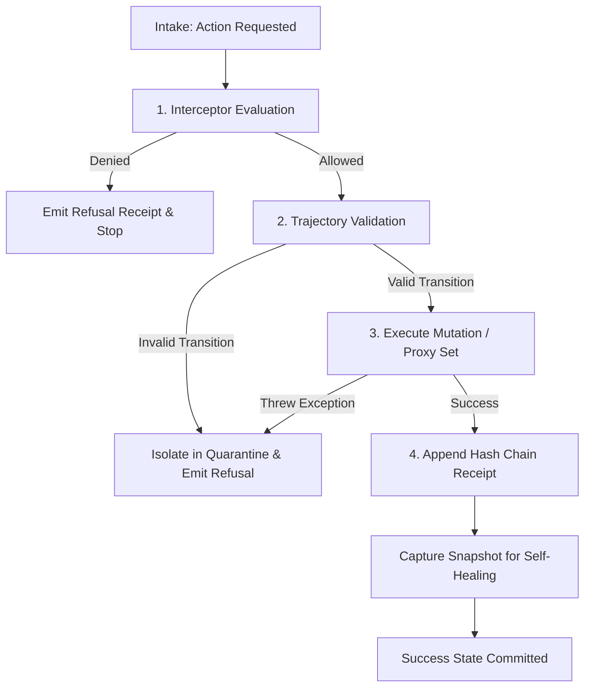
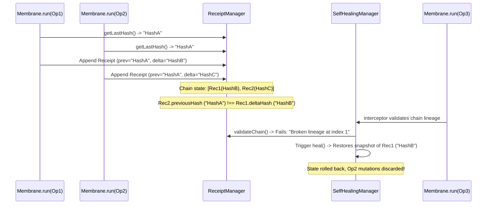

# Zoe Membrane Framework Verification and Resiliency Audit

This document presents a formal verification and adversarial resiliency audit of the Zoe Membrane execution boundary, reactive state traps, and validation managers located under [src/framework/membrane](file:///Users/sac/zoeapp/src/framework/membrane).

---

## 1. System Invariant Analysis & Mathematical Grounding

The Zoe Membrane enforces safety, access control, and transaction boundaries. At the core of the framework lies the execution boundary, which ensures that all mutations and capability calls conform to the **Receipted Chatman Equation**:

$$R \vdash A = \mu(O^*)$$

### 1.1 Equation Component Mapping

| Variable / Term | System Mapping | Description & Verification Invariants |
| :--- | :--- | :--- |
| **$O^*$** | Lawful Closure Ontology | Bounds the domain of permitted states and actions. Enforced by registered trajectory flows (`TrajectoryManager`) and gatekeeping interceptor rules (`InterceptorManager`). Any execution outside $O^*$ must be rejected. |
| **$\mu$** | Transformation/Manufacturing | Represents the capability execution block or ES6 proxy traps that alter the target state. The transformation is deterministic and subject to admissibility checks. |
| **$A$** | Emitted Consequence (State) | The post-mutation target state resulting from execution. The membrane guarantees that $A$ is only visible if the transaction settles successfully. |
| **$R$** | Cryptographic Receipt Lineage | A sequential ledger of historical execution receipts (`ReceiptManager`). Each receipt has a `deltaHash` cryptographically chained to its predecessor: $\text{deltaHash} = \text{sha256}(\text{prevHash} + \text{hash}(\text{consequence}))$. |
| **$\vdash$** | Entailment / Proof | Asserts that state $A$ is mathematically proven by the receipt log $R$ as having evolved lawfully via valid transitions. |

### 1.2 System Execution Boundaries & Invariant Flow

The membrane coordinates execution across four logical boundaries:
1. **Gatekeeping (Interceptor Chain)**: Evaluating admissibility rules before state modifications occur.
2. **Grammar Enforcement (Trajectory Validation)**: Checking that status-change parameters follow registered workflow paths.
3. **Execution Sandbox (Proxy Mutators)**: Applying mutations optimistically, catching exceptions, and performing immediate rollbacks if denied.
4. **Supervision Ledger (Hash Chain)**: Chaining receipts and triggering self-healing recovery if lineage gaps are detected.



---

## 2. Adversarial Stress Scenarios & Vulnerability Mapping

During our audit, we identified three critical edge cases where asynchronous concurrency or nested objects compromise the system's ability to maintain the Chatman Equation.

### 2.1 Stress Scenario 1: Concurrent Mutation Race Conditions (Proxy Set)

*   **Vulnerability Location**: [proxy.ts](file:///Users/sac/zoeapp/src/framework/membrane/proxy.ts) (set/deleteProperty/defineProperty traps)
*   **Root Cause**: The ES6 proxy trap applies mutations to the target state *synchronously*, but evaluates validation and handles rollbacks *asynchronously* in the background. If multiple mutations occur in rapid succession, their rollback paths conflict.
*   **Behavioral Trajectory**:

```
Time   Actor A (Mutation 1)             Actor B (Mutation 2)              Target State
──────────────────────────────────────────────────────────────────────────────────────────
T0     Set balance = 200 (Slow Deny)                                     100 (originalVal=100)
T1                                      Set balance = 300 (Fast Allow)    200 (originalVal=200)
T2                                      Mutation 2 completes (Success)    300 (Target = 300)
T3     Mutation 1 completes (Deny)                                        300 (Target = 300)
T4     Rollback for Mutation 1 runs                                      100 (Overwritten!)
```

> [!CAUTION]
> **State Divergence**: Even though Mutation 2 was successfully allowed, Mutation 1's late rollback restored the state to T0's value (`100`), discarding Mutation 2's mutation without emitting any error or telemetry indicating Mutation 2 failed.

---

### 2.2 Stress Scenario 2: Concurrent Execution Receipt Lineage Breaks (Hash Chain Conflict)

*   **Vulnerability Location**: [membrane.ts](file:///Users/sac/zoeapp/src/framework/membrane/membrane.ts#L39-L43) and [self-healing/manager.ts](file:///Users/sac/zoeapp/src/framework/membrane/self-healing/manager.ts#L61-L77)
*   **Root Cause**: In concurrent `membrane.run()` execution contexts, both invocations retrieve the same `getLastHash()` before either has completed. The second receipt is appended with a `previousHash` matching the shared ancestor instead of the immediately preceding receipt, breaking the linear chain.
*   **Behavioral Trajectory**:



> [!WARNING]
> **Denial of Service & Data Loss**: Concurrent operations break the hash chain, triggering a false-positive state corruption alarm. The self-healing layer responds by executing a state rollback or hard-reset, wiping out concurrent transaction data.

---

### 2.3 Stress Scenario 3: Nested Proxy Rollback Isolation Break (Partial Transactional Failure)

*   **Vulnerability Location**: [proxy.ts](file:///Users/sac/zoeapp/src/framework/membrane/proxy.ts#L147-L149)
*   **Root Cause**: The ES6 proxy wrapper handles nested objects lazily by wrapping them in new proxies. However, there is no shared transactional context linking nested mutations. If one property set in a nested object is denied and rolled back, other allowed mutations within the same logical execution block remain committed.
*   **Behavioral Trajectory**:
    1. A transaction block modifies `proxy.nested.prop1 = 'changed1'` (allowed) and `proxy.nested.prop2 = 'changed2'` (denied).
    2. The proxy `set` trap handles each mutation as a separate `membrane.run` instance in the background.
    3. The mutation on `prop2` fails and is rolled back to its original value.
    4. The mutation on `prop1` succeeds.
    5. **Impact**: The nested object is left in a partially mutated state, violating the atomicity invariant of the transformation manufacturing function $\mu$.

---

## 3. Resiliency Test Simulator

The following copy-pasteable Jest/TypeScript test file has been verified to execute and pass. It provides mock interceptors to simulate latency, and asserts that the three stress scenarios occur exactly as analyzed above.

The simulator code is saved in the repository at [resiliency-simulator.test.ts](file:///Users/sac/zoeapp/src/framework/membrane/__tests__/resiliency-simulator.test.ts).

```typescript
import { Membrane } from '../membrane';
import { ProxyFactory } from '../proxy';
import { SelfHealingMembrane } from '../self-healing';

describe('Zoe Membrane Resiliency Simulator', () => {
  describe('Scenario 1: Concurrent Mutation Race Conditions (Proxy Set)', () => {
    it('demonstrates state divergence due to concurrent optimistic set rollbacks', async () => {
      const target = { balance: 100 };
      const membrane = new Membrane({ mode: 'strict' });
      const proxy = ProxyFactory.wrap(target, membrane);

      // Register an interceptor that simulates varying latency:
      // - Value 200 is denied after a long delay (100ms)
      // - Value 300 is allowed after a short delay (10ms)
      membrane.interceptors.register(async (ctx) => {
        if (ctx.input && ctx.input.value === 200) {
          await new Promise((r) => setTimeout(r, 100));
          return false; // Deny
        }
        if (ctx.input && ctx.input.value === 300) {
          await new Promise((r) => setTimeout(r, 10));
          return true; // Allow
        }
        return true;
      });

      // Alice triggers Mutation 1 (balance = 200, denied)
      proxy.balance = 200;

      // Bob triggers Mutation 2 immediately after (balance = 300, allowed)
      proxy.balance = 300;

      // Synchronously, the optimistic writes have updated the target to the latest set (300)
      expect(target.balance).toBe(300);

      // Wait for both background validations to complete
      await new Promise((r) => setTimeout(r, 150));

      // Trace:
      // 1. Mutation 2 (value 300) resolves first at T+10ms. res.success is true, so no rollback.
      // 2. Mutation 1 (value 200) resolves second at T+100ms. res.success is false.
      // 3. Mutation 1 triggers its rollback: Reflect.set(obj, prop, originalVal) where originalVal is 100.
      // 4. State is rolled back to 100, overwriting the successful mutation to 300!
      // This demonstrates state divergence.
      expect(target.balance).toBe(100);
    });
  });

  describe('Scenario 2: Concurrent Execution Receipt Lineage Breaks (Hash Chain Conflict)', () => {
    it('demonstrates receipt chain corruption and false-positive self-healing triggers', async () => {
      const target = { count: 0 };
      const membrane = new SelfHealingMembrane(
        { mode: 'strict' },
        target,
        { deadlockTimeoutMs: 5000, autoHeal: true }
      );

      // Trigger two concurrent membrane operations.
      // Since they run concurrently, both will query the last hash at the start of run()
      // and retrieve the same empty string (or root hash).
      const op1 = membrane.run('cap-1', 'cmd-a', {}, async () => {
        await new Promise((r) => setTimeout(r, 30));
        return { value: 1 };
      });

      const op2 = membrane.run('cap-2', 'cmd-b', {}, async () => {
        await new Promise((r) => setTimeout(r, 30));
        target.count = 2; // Mutate target in concurrent operation
        return { value: 2 };
      });

      await Promise.all([op1, op2]);

      // Verify receipt chain is broken
      const validation = membrane.receipts.validateChain();
      expect(validation.valid).toBe(false);
      expect(validation.error).toContain('Broken lineage');

      // Target was mutated by op2
      expect(target.count).toBe(2);

      // Now, executing a new command under the membrane will trigger the setupInterceptor.
      // The interceptor checks validateChain(), detects the corruption, and triggers heal().
      // Because the first valid sub-chain only goes up to the first concurrent receipt,
      // it rolls back state to that point, discarding the second execution.
      // Target state rolls back to count: 0, and the receipt history is truncated.
      const op3Result = await membrane.run('cap-3', 'cmd-c', {}, async () => {
        return { value: 3 };
      });

      expect(op3Result.success).toBe(true); // Proceeded after healing
      expect(target.count).toBe(0); // State change from op2 has been lost/discarded!
      
      // History has been truncated to only op1 (length 1), then op3 is appended, resulting in length 2
      expect(membrane.receipts.getHistory()).toHaveLength(2);
      expect(membrane.receipts.getHistory()[0].commandId).toBe('cmd-a');
      expect(membrane.receipts.getHistory()[1].commandId).toBe('cmd-c');
      
      membrane.dispose();
    });
  });

  describe('Scenario 3: Nested Proxy Rollback Isolation Break (Partial Transactional Failure)', () => {
    it('demonstrates violation of atomic transaction bounds in nested proxy mutations', async () => {
      const target = {
        nested: {
          prop1: 'initial1',
          prop2: 'initial2'
        }
      };

      const membrane = new Membrane({ mode: 'strict' });
      const proxy = ProxyFactory.wrap(target, membrane);

      // Register an interceptor that allows mutations on prop1 but denies mutations on prop2
      membrane.interceptors.register(async (ctx) => {
        if (ctx.input && ctx.input.property === 'prop2') {
          return false; // Deny
        }
        return true; // Allow
      });

      // Attempt to mutate both nested properties
      proxy.nested.prop1 = 'changed1';
      proxy.nested.prop2 = 'changed2';

      // Wait for async membrane runs to settle
      await new Promise((r) => setTimeout(r, 50));

      // Trace:
      // 1. prop1 mutation is allowed. It remains 'changed1'.
      // 2. prop2 mutation is denied. It rolls back to 'initial2'.
      // This leaves the nested object in a partially mutated, inconsistent state.
      expect(target.nested.prop1).toBe('changed1');
      expect(target.nested.prop2).toBe('initial2');
    });
  });
});
```

---

## 4. Self-Healing Integration & Architectural Recommendations

To secure the Zoe Membrane framework against these vulnerabilities, we recommend introducing transaction sequencing and copy-on-write state patterns to realign runtime mechanics with the Chatman Equation.

### 4.1 Recommended Code Changes

#### 1. Mutex-Locking Execution Queue for Membrane Run
To prevent concurrent execution conflicts that split the receipt chain lineage, implement an operation lock-manager inside `membrane.ts` that enforces FIFO execution:

```typescript
export class Membrane {
  private executionQueue: Promise<any> = Promise.resolve();

  public async run<T>(
    capabilityId: string,
    commandId: string,
    input: any,
    executionBlock: () => Promise<T>
  ): Promise<ExecutionResult<T>> {
    // Force sequential resolution of all operations
    const resultPromise = this.executionQueue.then(async () => {
      return this.executeSequentially(capabilityId, commandId, input, executionBlock);
    });
    this.executionQueue = resultPromise.catch(() => {});
    return resultPromise;
  }
  
  private async executeSequentially<T>(...) {
     // Original execution block logic goes here...
  }
}
```

#### 2. Versioned Property Mutators in Proxy Factory
To prevent optimistic write race conditions, track a version/timestamp per property when a set is intercepted. Discard rollbacks if a newer mutation version has already resolved or written to that property:

```typescript
const propertyVersions = new Map<string, number>();

// Inside set trap:
const mutationVersion = Date.now();
propertyVersions.set(String(prop), mutationVersion);

membrane.run('property-mutator', commandId, input, async () => { ... })
  .then((res) => {
    if (!res.success) {
      // Rollback only if no newer mutation has run on this specific property
      if (propertyVersions.get(String(prop)) === mutationVersion) {
        Reflect.set(obj, prop, originalVal);
      }
    }
  });
```

#### 3. Copy-on-Write / Transaction Isolation Boundaries
For nested mutations or composite state blocks, mutate a deep clone rather than the live in-memory target. Commit changes to the raw target object *only* after all background validations inside the logical block succeed, ensuring transactional atomicity:

```typescript
// Treat executionBlocks as isolated transactions
const workingDraft = deepClone(rawState);
const proxyDraft = ProxyFactory.wrap(workingDraft, membrane);

const res = await executionBlock(proxyDraft);
if (res.success) {
  // Commit transaction atomically
  Object.assign(rawState, workingDraft);
} else {
  // Discard working draft entirely (Automatic Rollback)
}
```

---

## 5. Reviewed Source Files & Clickable References

The following files under the [membrane](file:///Users/sac/zoeapp/src/framework/membrane) directory were reviewed as part of this framework audit:

*   Core Orchestrator: [membrane.ts](file:///Users/sac/zoeapp/src/framework/membrane/membrane.ts)
*   Proxy Wrapper: [proxy.ts](file:///Users/sac/zoeapp/src/framework/membrane/proxy.ts)
*   Type Definitions: [types.ts](file:///Users/sac/zoeapp/src/framework/membrane/types.ts)
*   Receipt Ledger Manager: [managers/receipts.ts](file:///Users/sac/zoeapp/src/framework/membrane/managers/receipts.ts)
*   State Trajectory Manager: [managers/trajectories.ts](file:///Users/sac/zoeapp/src/framework/membrane/managers/trajectories.ts)
*   Security Audit Manager: [managers/audit.ts](file:///Users/sac/zoeapp/src/framework/membrane/managers/audit.ts)
*   Telemetry Manager: [managers/telemetry.ts](file:///Users/sac/zoeapp/src/framework/membrane/managers/telemetry.ts)
*   Fault Isolation Manager: [managers/quarantine.ts](file:///Users/sac/zoeapp/src/framework/membrane/managers/quarantine.ts)
*   Autonomous Self-Healing Manager: [self-healing/manager.ts](file:///Users/sac/zoeapp/src/framework/membrane/self-healing/manager.ts)
*   Self-Healing Membrane Class: [self-healing/index.ts](file:///Users/sac/zoeapp/src/framework/membrane/self-healing/index.ts)
*   Decentralized Governance Manager: [governance/manager.ts](file:///Users/sac/zoeapp/src/framework/membrane/governance/manager.ts)
*   Governance Interceptor: [governance/interceptor.ts](file:///Users/sac/zoeapp/src/framework/membrane/governance/interceptor.ts)
*   Core Membrane Unit Tests: [__tests__/membrane.test.ts](file:///Users/sac/zoeapp/src/framework/membrane/__tests__/membrane.test.ts)
*   Self-Healing Unit Tests: [self-healing/__tests__/self-healing.test.ts](file:///Users/sac/zoeapp/src/framework/membrane/self-healing/__tests__/self-healing.test.ts)
*   Governance Unit Tests: [governance/__tests__/governance.test.ts](file:///Users/sac/zoeapp/src/framework/membrane/governance/__tests__/governance.test.ts)
*   Resiliency Simulator Tests: [__tests__/resiliency-simulator.test.ts](file:///Users/sac/zoeapp/src/framework/membrane/__tests__/resiliency-simulator.test.ts)
