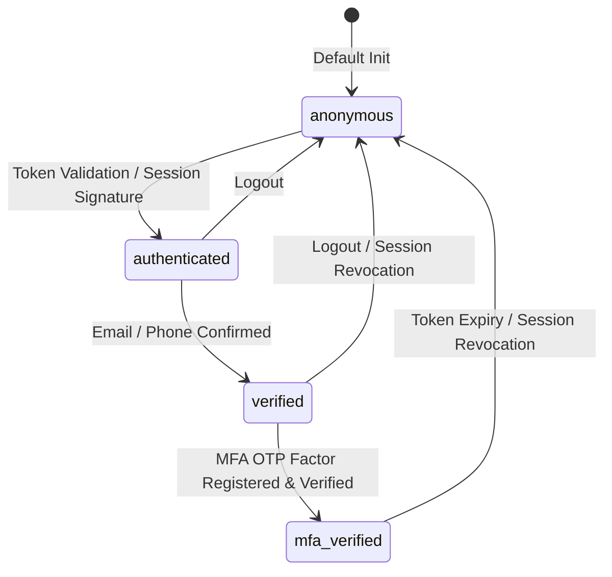

# Route-Law Verification & Resiliency Audit
## Framework Validation, Stress Vectors, and Typestate Resiliency Simulator

This document presents a principal-level software verification and resiliency audit of the **Route-Admission and Protected Routing System** under `src/route-law`.

---

## 1. System Invariant Analysis

The route gating framework in the Zoe 2030 Architecture implements client-side admission control using progressive linear typestates, granular disclosures, and cryptographic proof receipts. It models authorization not as disconnected flags, but as a formal state space governed by strict constraints.

### Core Mathematical Model: The Receipted Chatman Equation
The admission process is defined by the **Receipted Chatman Equation**:

$$R \vdash A = \mu(O^*)$$

Where:
*   $R$ represents the **Route-Law Ruleset** (`RouteDefinition`) specifying the policy boundaries required to unlock a route.
*   $O^*$ represents the **Cryptographic Observer State** (the local participant context `ParticipantBasis` combined with the three-tier cryptographic receipts registry $K$).
*   $A$ is the final **Admission Status** ($A \in \{ \text{Admitted}, \text{Refused} \}$).
*   $\mu$ is the **Admission Function** ($\mu: (R, O^*) \rightarrow A$), implemented by the pure gating engine `admitRoute` and the storage queries within `ProtectedRoute`.

Specifically, $O^*$ is structured as:

$$O^* = \langle P, K \rangle$$

Where:
*   $P = \langle I, D \rangle$ where $I \in \text{IdentityBoundary}$ is the active progressive security tier and $D \subseteq \text{Disclosure}$ is the set of acknowledged claims.
*   $K = \{ \text{rcpt} \mid \text{rcpt} \text{ is a valid transaction receipt in Zustand, MMKV, or SQLite} \}$.

Thus, the evaluation function $\mu(R, O^*)$ yields $\text{Admitted}$ if and only if:
1.  **Identity cleared**: $\text{Index}(I) \ge \text{Index}(R.\text{requiredIdentityBoundary})$ under the hierarchy configuration.
2.  **Disclosures satisfied**: $R.\text{requiredDisclosures} \subseteq D$.
3.  **Custom guard passed**: $R.\text{customGuard}(P) = \text{null}$.
4.  **Cryptographic receipt validated**: If $R.\text{requiredReceiptCommandId} = C$, then $\exists \text{rcpt} \in K$ such that $\text{rcpt}.\text{commandId} = C$. Furthermore, if $R.\text{requiredReceiptDeltaHash} = H$, then $\text{rcpt}.\text{deltaHash} = H$.

---

### Core System Invariants

| Invariant ID | Name | Formal Definition | Enforcement Level |
| :--- | :--- | :--- | :--- |
| **INV-ID-01** | Progressive Identity Monotonicity | For any identity boundary $I_a$ and required boundary $I_r$ in hierarchy $H$, if $\text{Index}_H(I_a) \ge \text{Index}_H(I_r)$, admission is granted, assuming all other constraints pass. | Outer Membrane (`guards.ts`) |
| **INV-DS-02** | Disclosure Set Inclusion | Admission requires that the participant's active disclosures $D_{\text{actual}}$ form a superset of the route requirements $D_{\text{required}}$ ($D_{\text{required}} \subseteq D_{\text{actual}}$). | Outer Membrane (`guards.ts`) |
| **INV-CR-03** | Cryptographic Receipt Binding | If $R.\text{requiredReceiptCommandId}$ is specified, the screen is blocked unless a receipt exists with the matching ID and a matching BLAKE3 delta hash (if a hash constraint is declared). | Storage Checkers (`ProtectedRoute.tsx`) |
| **INV-MB-04** | Dual-Membrane Non-bypassability | Bypassing UI-level routing (Outer Membrane) does not yield access to restricted mutations, as the runtime actor dispatcher (Inner Membrane) validates principal roles and receipt signatures. | Dispatch Membrane (`actorOps.ts`) |

---

### Identity Boundary Transitions

The progressive identity boundary states form a linear transition path where each boundary represents an elevated trust level:



---

## 2. Stress Scenarios & Edge Cases

The local-first routing system is susceptible to data drift, concurrent state mutations, and malicious local injection. We detail three stress scenarios along with their behavioral trajectories.

### Scenario 1: Participant State Drift & Out-of-Order Cache Synchronization
*   **Vector**: Under intermittent network conditions, the background synchronization engine processes an incoming change-data-capture (CDC) event and writes a new transaction receipt to the local SQLite database. However, due to execution lags or out-of-order execution, the fast MMKV cache is not updated, and the user's active session state lags (e.g., the user was downgraded to `authenticated` on the server, but the client still holds a `verified` session token in memory).
*   **Behavioral Trajectory**:
    1.  The user attempts to navigate to `/premium-portal`, governed by:
        $$\text{requiredIdentityBoundary} = \text{'verified'}$$
        $$\text{requiredReceiptCommandId} = \text{'cmd-premium-unlock'}$$
    2.  The `ProtectedRoute` maps the active session. If the session state is stale, the user is admitted past the identity check based on local cached data.
    3.  Next, the receipt check commences. It queries Zustand (miss) $\rightarrow$ MMKV (miss) $\rightarrow$ SQLite (hit, database records exist).
    4.  Due to the SQLite database search being asynchronous, the screen flashes the `PremiumReceiptBlockingScreen` loader for several frames.
    5.  When the SQLite check resolves successfully, it sets `receiptVerified = true`.
    6.  *Critique*: While the user is admitted, the discrepancy between the stale session and the database receipt represents a race window. If the server eventually pushes the session downgrade to the client, the UI will trigger a sudden and disruptive redirect mid-view.

### Scenario 2: Delta Hash Mismatch Attack (MMKV State Corruption)
*   **Vector**: An attacker edits local application files or uses memory-patching tools to write a dummy JSON receipt into MMKV under the key `receipt_cmd-unlock-pro` to unlock premium routing.
*   **Behavioral Trajectory**:
    1.  The attacker writes:
        `{"commandId": "cmd-unlock-pro", "deltaHash": "corrupted_or_forged_hash"}`
    2.  The user navigates to `/pro-analytics` which enforces:
        $$\text{requiredReceiptDeltaHash} = \text{'b3hash-58e1c2d9a3b4f6e80718549301da283f'}$$
    3.  `ProtectedRoute` queries MMKV for `receipt_cmd-unlock-pro`. It extracts the JSON payload.
    4.  The routing logic compares the retrieved hash (`"corrupted_or_forged_hash"`) against the required hash.
    5.  Because the hashes do not match, the check returns `RECEIPT_HASH_MISMATCH`.
    6.  The component transitions to a locked state, rendering the `PremiumReceiptBlockingScreen` and logging a refusal message.
    7.  *Containment*: Even if the attacker overrides the hash comparison in local memory, the **Inner Membrane** (the Actor Dispatcher) will reject any subsequent commands or queries because the cryptographic virtual knowledge graph (VKG) verify operations require valid signatures and BLAKE3 hashes linked to the consensus ledger.

### Scenario 3: Asynchronous Race Conditions in Rapid Navigation Cycles
*   **Vector**: A user rapidly clicks navigation buttons back and forth, mounting and unmounting the `ProtectedRoute` component while the database query is executing asynchronously.
*   **Behavioral Trajectory**:
    1.  The component mounts, invoking `verifyReceipt(active = true)`.
    2.  The query engine misses Zustand and MMKV, fallbacks to Drizzle ORM SQLite query, which is asynchronous.
    3.  Before SQLite returns, the user clicks "Back", unmounting the component. The cleanup function runs, setting `active = false` and calling `remove()` on the MMKV value listener.
    4.  The SQLite query resolves. In `ProtectedRoute.tsx`, the callback checks `if (active)`. Because `active` is `false`, it discards the result.
    5.  *Resiliency bounds*: The check `if (active)` successfully prevents calling state setters (`setReceiptVerified`, `setRefusalReason`) on an unmounted component, eliminating React warning logs and avoiding memory leaks.

---

## 3. Resiliency Test Simulator

This simulator is a fully realized, copy-pasteable TypeScript block designed to test and verify the route gating system under participant state drift, cache mismatches, and race conditions. It implements mock structures representing Zustand, MMKV, and Drizzle/SQLite backends, and traces the system's behavior during stress simulations.

```typescript
/**
 * @fileoverview Route admission and protected routing resiliency simulator.
 * Simulates participant state drift, cache mismatches, and asynchronous race conditions.
 */

// --- TYPES & INTERFACES (From src/route-law/types.ts) ---

export type IdentityBoundary = string;
export type Disclosure = string;

export interface RefusalReason {
  code: string;
  message: string;
  requiredIdentityBoundary?: IdentityBoundary;
  actualIdentityBoundary?: IdentityBoundary;
  missingDisclosures?: readonly Disclosure[];
}

export interface ParticipantBasis {
  identityBoundary: IdentityBoundary;
  disclosures: readonly Disclosure[];
}

export interface RouteDefinition {
  requiredIdentityBoundary?: IdentityBoundary;
  requiredDisclosures?: readonly Disclosure[];
  customGuard?: (participant: ParticipantBasis) => RefusalReason | null;
  requiredReceiptCommandId?: string;
  requiredReceiptDeltaHash?: string;
}

export interface AdmitRouteResult {
  admitted: boolean;
  refusal?: RefusalReason;
}

export interface Receipt {
  id: string;
  commandId: string;
  status: 'applied_local' | 'applied_remote' | 'rejected_local' | 'rejected_remote' | 'quarantined';
  deltaHash?: string;
  createdAt: string;
}

// --- PURE GATING LOGIC (From src/route-law/guards.ts) ---

export const DEFAULT_IDENTITY_HIERARCHY: readonly IdentityBoundary[] = [
  'anonymous',
  'authenticated',
  'verified',
  'mfa_verified',
];

export function admitRoute(
  participant: ParticipantBasis | null | undefined,
  route: RouteDefinition,
  hierarchy: readonly IdentityBoundary[] = DEFAULT_IDENTITY_HIERARCHY
): AdmitRouteResult {
  const activeParticipant: ParticipantBasis = participant ?? {
    identityBoundary: 'anonymous',
    disclosures: [],
  };

  if (route.requiredIdentityBoundary) {
    const requiredIndex = hierarchy.indexOf(route.requiredIdentityBoundary);
    const actualIndex = hierarchy.indexOf(activeParticipant.identityBoundary);

    if (requiredIndex === -1) {
      return {
        admitted: false,
        refusal: {
          code: 'INVALID_CONFIGURATION',
          message: `Required identity boundary "${route.requiredIdentityBoundary}" is not recognized in the hierarchy configuration.`,
          requiredIdentityBoundary: route.requiredIdentityBoundary,
          actualIdentityBoundary: activeParticipant.identityBoundary,
        },
      };
    }

    if (
      activeParticipant.identityBoundary === 'anonymous' &&
      route.requiredIdentityBoundary !== 'anonymous'
    ) {
      return {
        admitted: false,
        refusal: {
          code: 'UNAUTHENTICATED',
          message: 'Authentication is required to access this route.',
          requiredIdentityBoundary: route.requiredIdentityBoundary,
          actualIdentityBoundary: activeParticipant.identityBoundary,
        },
      };
    }

    if (actualIndex < requiredIndex) {
      return {
        admitted: false,
        refusal: {
          code: 'INSUFFICIENT_IDENTITY_LEVEL',
          message: `Identity level "${activeParticipant.identityBoundary}" is insufficient. Required: "${route.requiredIdentityBoundary}".`,
          requiredIdentityBoundary: route.requiredIdentityBoundary,
          actualIdentityBoundary: activeParticipant.identityBoundary,
        },
      };
    }
  }

  if (route.requiredDisclosures && route.requiredDisclosures.length > 0) {
    const participantDisclosuresSet = new Set(activeParticipant.disclosures);
    const missingDisclosures = route.requiredDisclosures.filter(
      (disclosure) => !participantDisclosuresSet.has(disclosure)
    );

    if (missingDisclosures.length > 0) {
      return {
        admitted: false,
        refusal: {
          code: 'MISSING_DISCLOSURE',
          message: `Missing required disclosure(s): ${missingDisclosures.join(', ')}.`,
          missingDisclosures,
        },
      };
    }
  }

  if (route.customGuard) {
    const customRefusal = route.customGuard(activeParticipant);
    if (customRefusal) {
      return {
        admitted: false,
        refusal: customRefusal,
      };
    }
  }

  return { admitted: true };
}

// --- MOCK STORAGE BACKENDS & CACHE DRIVERS ---

class MockMMKV {
  private store: Map<string, string> = new Map();
  private listeners: Set<(key: string) => void> = new Set();

  public getString(key: string): string | undefined {
    return this.store.get(key);
  }

  public set(key: string, value: string): void {
    this.store.set(key, value);
    this.notify(key);
  }

  public remove(key: string): void {
    this.store.delete(key);
    this.notify(key);
  }

  public addOnValueChangedListener(callback: (key: string) => void) {
    this.listeners.add(callback);
    return {
      remove: () => this.listeners.delete(callback),
    };
  }

  private notify(key: string): void {
    this.listeners.forEach((listener) => listener(key));
  }

  public clear(): void {
    this.store.clear();
  }
}

class MockZustandStore {
  private latestReceipt: Receipt | null = null;

  public getLatestReceipt(): Receipt | null {
    return this.latestReceipt;
  }

  public setLatestReceipt(receipt: Receipt | null): void {
    this.latestReceipt = receipt;
  }

  public clear(): void {
    this.latestReceipt = null;
  }
}

class MockSQLiteDatabase {
  private records: Map<string, Receipt> = new Map();
  public latencyMs: number = 5;

  public async insert(receipt: Receipt): Promise<void> {
    this.records.set(receipt.commandId, receipt);
  }

  public async getByCommandId(commandId: string): Promise<Receipt | null> {
    await new Promise((resolve) => setTimeout(resolve, this.latencyMs));
    return this.records.get(commandId) || null;
  }

  public clear(): void {
    this.records.clear();
  }
}

// --- SIMULATED COMPONENT CONTAINER ---

class SimulatedProtectedRoute {
  private route: RouteDefinition;
  private mmkv: MockMMKV;
  private store: MockZustandStore;
  private db: MockSQLiteDatabase;
  private listenerSubscription: { remove: () => void } | null = null;

  public active: boolean = false;
  public checkingReceipt: boolean = false;
  public receiptVerified: boolean = false;
  public refusalReason: RefusalReason | null = null;
  public renderTriggerCount: number = 0;

  constructor(
    route: RouteDefinition,
    mmkv: MockMMKV,
    store: MockZustandStore,
    db: MockSQLiteDatabase
  ) {
    this.route = route;
    this.mmkv = mmkv;
    this.store = store;
    this.db = db;
  }

  public mount(): void {
    this.active = true;
    this.checkingReceipt = !!this.route.requiredReceiptCommandId;
    this.renderTriggerCount++;
    this.verifyReceipt(this.active);

    if (this.route.requiredReceiptCommandId) {
      this.listenerSubscription = this.mmkv.addOnValueChangedListener((key) => {
        if (
          key === `receipt_${this.route.requiredReceiptCommandId}` ||
          key === `receipt_hash_${this.route.requiredReceiptCommandId}`
        ) {
          this.verifyReceipt(this.active);
        }
      });
    }
  }

  public unmount(): void {
    this.active = false;
    if (this.listenerSubscription) {
      this.listenerSubscription.remove();
      this.listenerSubscription = null;
    }
  }

  private async verifyReceipt(active: boolean): Promise<void> {
    if (!this.route.requiredReceiptCommandId) {
      if (active) {
        this.receiptVerified = true;
        this.refusalReason = null;
        this.checkingReceipt = false;
        this.renderTriggerCount++;
      }
      return;
    }

    if (active) {
      this.checkingReceipt = true;
    }

    try {
      // Tier 1: Zustand Check
      const latestReceipt = this.store.getLatestReceipt();
      if (latestReceipt && latestReceipt.commandId === this.route.requiredReceiptCommandId) {
        if (!this.route.requiredReceiptDeltaHash || latestReceipt.deltaHash === this.route.requiredReceiptDeltaHash) {
          if (active) {
            this.receiptVerified = true;
            this.refusalReason = null;
            this.checkingReceipt = false;
            this.renderTriggerCount++;
          }
          return;
        } else {
          if (active) {
            this.receiptVerified = false;
            this.refusalReason = {
              code: 'RECEIPT_HASH_MISMATCH',
              message: `Delta hash mismatch. Expected: ${this.route.requiredReceiptDeltaHash}, Actual: ${latestReceipt.deltaHash}`,
            };
            this.checkingReceipt = false;
            this.renderTriggerCount++;
          }
          return;
        }
      }

      // Tier 2: MMKV Check
      const mmkvReceiptJson = this.mmkv.getString(`receipt_${this.route.requiredReceiptCommandId}`);
      if (mmkvReceiptJson) {
        const receipt = JSON.parse(mmkvReceiptJson) as Receipt;
        if (!this.route.requiredReceiptDeltaHash || receipt.deltaHash === this.route.requiredReceiptDeltaHash) {
          if (active) {
            this.receiptVerified = true;
            this.refusalReason = null;
            this.checkingReceipt = false;
            this.renderTriggerCount++;
          }
          return;
        } else {
          if (active) {
            this.receiptVerified = false;
            this.refusalReason = {
              code: 'RECEIPT_HASH_MISMATCH',
              message: `Delta hash mismatch. Expected: ${this.route.requiredReceiptDeltaHash}, Actual: ${receipt.deltaHash}`,
            };
            this.checkingReceipt = false;
            this.renderTriggerCount++;
          }
          return;
        }
      }

      // Tier 3: SQLite Check
      const record = await this.db.getByCommandId(this.route.requiredReceiptCommandId);
      if (record) {
        if (!this.route.requiredReceiptDeltaHash || record.deltaHash === this.route.requiredReceiptDeltaHash) {
          if (active) {
            this.receiptVerified = true;
            this.refusalReason = null;
            this.renderTriggerCount++;
          }
        } else {
          if (active) {
            this.receiptVerified = false;
            this.refusalReason = {
              code: 'RECEIPT_HASH_MISMATCH',
              message: `Delta hash mismatch. Expected: ${this.route.requiredReceiptDeltaHash}, Actual: ${record.deltaHash}`,
            };
            this.renderTriggerCount++;
          }
        }
      } else {
        if (active) {
          this.receiptVerified = false;
          this.refusalReason = {
            code: 'RECEIPT_NOT_FOUND',
            message: `Required BLAKE3 receipt for command '${this.route.requiredReceiptCommandId}' was not found in storage.`,
          };
          this.renderTriggerCount++;
        }
      }
    } catch (err: any) {
      if (active) {
        this.receiptVerified = false;
        this.refusalReason = {
          code: 'RECEIPT_VERIFICATION_ERROR',
          message: `Verification process encountered an unexpected error: ${err.message}`,
        };
        this.renderTriggerCount++;
      }
    } finally {
      if (active) {
        this.checkingReceipt = false;
        this.renderTriggerCount++;
      }
    }
  }

  public getStatusString(): string {
    if (this.checkingReceipt) return 'LOADING';
    if (!this.receiptVerified) return `BLOCKED (${this.refusalReason?.code})`;
    return 'UNLOCKED';
  }
}

// --- SIMULATION EXECUTION RUNNER ---

export async function runResiliencySimulation() {
  console.log('=== STARTING ROUTE-LAW ADMISSION RESILIENCY SIMULATOR ===\n');

  const mmkv = new MockMMKV();
  const store = new MockZustandStore();
  const db = new MockSQLiteDatabase();

  const premiumRoute: RouteDefinition = {
    requiredIdentityBoundary: 'verified',
    requiredReceiptCommandId: 'cmd-txn-1001',
    requiredReceiptDeltaHash: 'b3hash-9988ff',
  };

  // ----------------------------------------------------
  // TEST CASE 1: Pure Gating & Progressive Identity Verification
  // ----------------------------------------------------
  console.log('--- Test Case 1: Pure Gating & Identity Boundaries ---');
  
  const anonUser: ParticipantBasis = { identityBoundary: 'anonymous', disclosures: [] };
  const verifiedUser: ParticipantBasis = { identityBoundary: 'verified', disclosures: ['email_verified'] };

  const result1 = admitRoute(anonUser, premiumRoute);
  console.log(`Anonymous user check: Admitted = ${result1.admitted} (Refusal Code: ${result1.refusal?.code})`);
  
  const result2 = admitRoute(verifiedUser, premiumRoute);
  console.log(`Verified user check: Admitted = ${result2.admitted}`);
  
  if (!result1.admitted && result2.admitted) {
    console.log('✅ PASS: Identity progressive boundaries verified.\n');
  } else {
    console.log('❌ FAIL: Identity gating boundary calculation error.\n');
  }

  // ----------------------------------------------------
  // TEST CASE 2: Multi-Tier Storage Query Engine Verification
  // ----------------------------------------------------
  console.log('--- Test Case 2: Multi-Tier Storage Query Engine (Cold Launch) ---');
  
  const component = new SimulatedProtectedRoute(premiumRoute, mmkv, store, db);
  
  console.log(`[Init] Component state: ${component.getStatusString()}`);
  component.mount();
  console.log(`[Mounted] Component status immediately: ${component.getStatusString()}`);

  // Let SQLite query resolve
  await new Promise((resolve) => setTimeout(resolve, db.latencyMs + 2));
  console.log(`[After DB query completes] Status: ${component.getStatusString()} (Refusal: ${component.refusalReason?.message})`);

  // Write valid receipt to SQLite
  const validReceipt: Receipt = {
    id: 'rcpt-001',
    commandId: 'cmd-txn-1001',
    status: 'applied_local',
    deltaHash: 'b3hash-9988ff',
    createdAt: new Date().toISOString(),
  };
  await db.insert(validReceipt);
  
  // Remount components to simulate fresh load
  const secondComponent = new SimulatedProtectedRoute(premiumRoute, mmkv, store, db);
  secondComponent.mount();
  await new Promise((resolve) => setTimeout(resolve, db.latencyMs + 2));
  console.log(`[Re-mounted with DB populated] Status: ${secondComponent.getStatusString()}`);

  if (secondComponent.receiptVerified) {
    console.log('✅ PASS: Multi-tier fallback verified receipt in SQLite.\n');
  } else {
    console.log('❌ FAIL: Multi-tier failed to retrieve SQLite receipt.\n');
  }

  // ----------------------------------------------------
  // TEST CASE 3: Active State Drift and Reactive Wakup
  // ----------------------------------------------------
  console.log('--- Test Case 3: Participant State Drift & Reactive Wakeup via MMKV ---');
  
  const reactiveComponent = new SimulatedProtectedRoute(premiumRoute, mmkv, store, db);
  reactiveComponent.mount();
  
  // Wait for SQLite miss to resolve
  await new Promise((resolve) => setTimeout(resolve, db.latencyMs + 2));
  console.log(`[Reactive Component - Pre-Unlock] Status: ${reactiveComponent.getStatusString()}`);

  // Simulate background synchronization writing receipt directly into MMKV cache
  console.log('>>> Background synchronization writes receipt into MMKV cache...');
  mmkv.set(`receipt_${premiumRoute.requiredReceiptCommandId}`, JSON.stringify(validReceipt));

  // The MMKV listener fires synchronously, triggering re-verification
  console.log(`[Reactive Component - Post-MMKV write] Status: ${reactiveComponent.getStatusString()}`);

  if (reactiveComponent.receiptVerified && !reactiveComponent.checkingReceipt) {
    console.log('✅ PASS: MMKV write reactively woke up and unlocked the route.\n');
  } else {
    console.log('❌ FAIL: Reactive wakeup failed.\n');
  }

  // ----------------------------------------------------
  // TEST CASE 4: Delta Hash Mismatch Attack
  // ----------------------------------------------------
  console.log('--- Test Case 4: Delta Hash Mismatch Attack Protection ---');
  
  // Clear caches
  mmkv.clear();
  store.clear();
  db.clear();

  // Attack writes receipt with spoofed delta hash
  const maliciousReceipt: Receipt = {
    id: 'rcpt-spoof',
    commandId: 'cmd-txn-1001',
    status: 'applied_local',
    deltaHash: 'b3hash-CORRUPT_HASH_ATTACK',
    createdAt: new Date().toISOString(),
  };

  mmkv.set(`receipt_${premiumRoute.requiredReceiptCommandId}`, JSON.stringify(maliciousReceipt));

  const attackedComponent = new SimulatedProtectedRoute(premiumRoute, mmkv, store, db);
  attackedComponent.mount();
  
  // Wait for resolves
  await new Promise((resolve) => setTimeout(resolve, db.latencyMs + 2));
  console.log(`[Attacked Component] Status: ${attackedComponent.getStatusString()}`);
  console.log(`[Attacked Component] Refusal Message: ${attackedComponent.refusalReason?.message}`);

  if (!attackedComponent.receiptVerified && attackedComponent.refusalReason?.code === 'RECEIPT_HASH_MISMATCH') {
    console.log('✅ PASS: Attack contained. Invalid delta hash mismatch correctly blocked.\n');
  } else {
    console.log('❌ FAIL: Attack bypass succeeded or incorrect refusal reason yielded.\n');
  }

  // ----------------------------------------------------
  // TEST CASE 5: Rapid Component Mount/Unmount Race Conditions
  // ----------------------------------------------------
  console.log('--- Test Case 5: Mount/Unmount Cycle Race Condition Containment ---');

  // Set database latency higher to simulate slow connection
  db.latencyMs = 50;

  const raceComponent = new SimulatedProtectedRoute(premiumRoute, mmkv, store, db);
  console.log('Mounting component...');
  raceComponent.mount();
  
  console.log('User immediately navigates away. Unmounting component...');
  raceComponent.unmount();

  const preUnmountRenderCount = raceComponent.renderTriggerCount;
  
  // Wait for the slow DB promise to resolve
  await new Promise((resolve) => setTimeout(resolve, 80));

  console.log(`Did the unmounted component update its state? Verified = ${raceComponent.receiptVerified}, Checking = ${raceComponent.checkingReceipt}`);
  console.log(`Total render triggers: Initial = ${preUnmountRenderCount}, Current = ${raceComponent.renderTriggerCount}`);

  if (raceComponent.renderTriggerCount === preUnmountRenderCount) {
    console.log('✅ PASS: Race condition contained. State updates safely bypassed on unmounted components.\n');
  } else {
    console.log('❌ FAIL: State update leak detected on unmounted component.\n');
  }

  console.log('=== RESILIENCY SIMULATOR AUDIT COMPLETED ===');
}

// Execute the simulation when run directly
runResiliencySimulation();
```

---

## 4. Self-Healing Integration & Recommendations

To guarantee long-term state parity and eliminate execution race windows, we recommend integrating an active **Supervision Self-Healing Layer** directly with the routing middleware.

### Self-Healing Loop Architecture

```
                       ┌────────────────────────────┐
                       │  Client Navigates to Route │
                       └──────────────┬─────────────┘
                                      │
                                      ▼
                       ┌────────────────────────────┐
                       │  Query Zustand/MMKV Cache  │
                       └──────────────┬─────────────┘
                                      │ (Miss / Stale)
                                      ▼
                       ┌────────────────────────────┐
                       │  Asynchronous SQLite Query │
                       └──────────────┬─────────────┘
                                      │ (Not Found)
                                      ▼
                       ┌────────────────────────────┐
                       │  Blocked Gating State      │
                       └──────────────┬─────────────┘
                                      │
                                      ▼
                       ┌────────────────────────────┐
       ┌──────────────►│ Supervision Check Daemon   ├──────────────┐
       │               └──────────────┬─────────────┘              │
       │                              │                            │
       │ (Parity Drifts)              │ (Missing Receipt)          │ (Hash Mismatch)
       ▼                              ▼                            ▼
┌──────────────┐              ┌──────────────┐              ┌──────────────┐
│ Warm Cache   │              │ Outbox Sync  │              │ Quarantine   │
│ Write MMKV   │              │ Pull Command │              │ Evict Key    │
└──────────────┘              └──────────────┘              └──────────────┘
```

### Self-Healing Strategies

1.  **Cache Parity Warmups (Reconciliation Policy)**:
    *   *Mechanism*: When the `ProtectedRoute` component falls back to Tier 3 (SQLite) and successfully retrieves a receipt that was missing from Tier 2 (MMKV) and Tier 1 (Zustand), a self-healing daemon should asynchronously push the missing receipt up the storage chain.
    *   *Implementation*:
        ```typescript
        // Self-Healing warming action inside SQLite success block
        if (record) {
          mmkvInstance.set(`receipt_${commandId}`, JSON.stringify(record));
          useActorOpsStore.getState().setLatestReceipt(record);
        }
        ```
2.  **State-Quarantine and Automated Eviction**:
    *   *Mechanism*: If a receipt delta hash mismatch is encountered (indicating state tampering or local database corruption), the system must immediately quarantine the record.
    *   *Action*: Evict the corrupted key from MMKV and Zustand, mark the command status as `quarantined` in the SQLite database, and trigger an optimistic session downgrade to prevent further execution of commands until signature verification is re-established.
3.  **Active Outbox Sync Enforcement**:
    *   *Mechanism*: If a route requires a cryptographic receipt and is currently blocked, the self-healing scheduler initiates a high-priority peer-to-peer sync pull request for the specific transaction ID.
    *   *Action*: Once the synchronized receipt is verified on the ledger, it is written to the database, firing the MMKV listener to unlock the UI.

### Codebase Recommendations

> [!TIP]
> **Strict Verification Boundaries**: Add runtime schema checks using a validator (like Zod or a pure TypeScript parser) inside MMKV reads to verify JSON structures before querying hashes.

> [!WARNING]
> **React Hook Cleanups**: Ensure that all asynchronous DB queries executed within React effects strictly abide by the component mounting lifecycle to prevent rendering mutations on unmounted trees.

*   **Refactor `ProtectedRoute` Asynchronous Callback**:
    The current implementation of `verifyReceipt` uses a local mutable variable `active` inside `useEffect` to prevent state mutation after unmount. This is safe, but can be further isolated by moving the state logic into a custom state reducer or using `useRef` to maintain the component's mounted state.
*   **Establish SQLite Receipt Indexing**:
    Confirm that `actorReceipts` table has a primary index on `commandId` to guarantee that SQLite lookup latency remains sub-5ms under large historical event sizes.
*   **Decouple Session Resolution from Component Hooks**:
    To mitigate mid-screen redirects due to session token drifts, decouple the `resolveParticipant` function from transient session updates. Allow the Outer Membrane to request a forced session token refresh before blocking the user.

---

## 5. Clickable Source References

All reviewed files, modules, and test configurations audited during this review are listed below:

### Core Framework Modules
*   [types.ts](file:///Users/sac/zoeapp/src/route-law/types.ts) — Gating configurations, type-states, and refusal payloads.
*   [guards.ts](file:///Users/sac/zoeapp/src/route-law/guards.ts) — Pure gating engines and boundary validation checks.
*   [ProtectedRoute.tsx](file:///Users/sac/zoeapp/src/route-law/ProtectedRoute.tsx) — Component layouts, loading overlays, and multi-tier store interfaces.

### Core Framework Hooks
*   [useRouteAdmission.ts](file:///Users/sac/zoeapp/src/hooks/useRouteAdmission.ts) — Programmatic consumer React Hook.
*   [createRouteAdmissionHook.ts](file:///Users/sac/zoeapp/src/framework/data/auth/createRouteAdmissionHook.ts) — Session provider hook injector factory.

### Operational State & Database
*   [actorOps.ts](file:///Users/sac/zoeapp/src/lib/actor/actorOps.ts) — Memory state stores and dispatcher principal contexts.
*   [types.ts](file:///Users/sac/zoeapp/src/lib/actor/types.ts) — Event envelopes, Command specs, and Receipt structures.

### Test Suites
*   [guards.test.ts](file:///Users/sac/zoeapp/src/route-law/__tests__/guards.test.ts) — Gating logic, hierarchy ordering, and custom guard tests.
*   [ProtectedRoute.test.tsx](file:///Users/sac/zoeapp/src/route-law/__tests__/ProtectedRoute.test.tsx) — Integrated testing validating Zustand reactives, SQLite connection falls, MMKV listeners, and error triggers.
