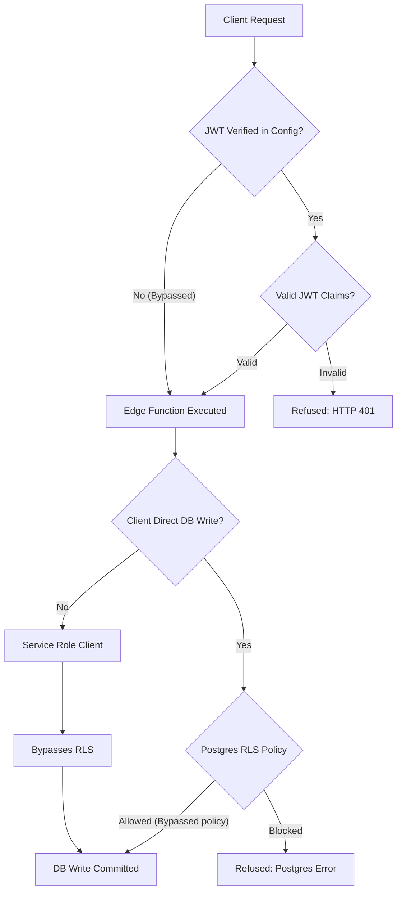
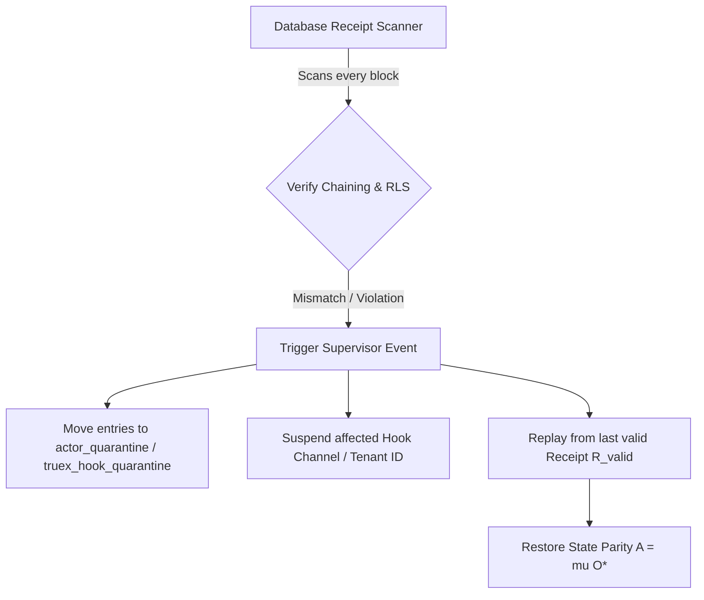

# Supabase Verification & Resiliency Audit
## Database RLS, Session Timeout, and Edge Functions Integrity Audit

This report details a security and validation audit of the **Supabase and Edge Functions Backend Infrastructure** under `supabase`. The focus is to verify Row Level Security (RLS) enforcement rules, unauthenticated session timeout boundaries, Edge Function JWT validation, and cryptographic consistency of the TrueX Receipt chain.

---

## 1. System Invariant Analysis

The integrity of the receipts ledger relies on ensuring that the state of the database and runtime execution remains synchronized and tamper-proof. We ground this analysis in the **Receipted Chatman Equation**:

$$R \vdash A = \mu(O^*)$$

Where:
- $R$ represents the cryptographic receipt set (e.g., the hash chains stored in `truex_receipts`).
- $A$ represents the accumulated application/projection state (e.g., actor allocations or database projections).
- $O^*$ represents the canonical sequence of authorized historical operations/events (stored in `truex_events`).
- $\mu$ is the state transition function executed in Deno Edge Functions (such as `truex-min-verify` or `vkg-hooks-apply`).
- $\vdash$ is the verification relation proving that the state is a lawful derivation of receipted operations.

If security boundaries or cryptographic checks in $R$ are bypassed, corrupted, or fail silently, state parity is broken, allowing state drift ($A \neq \mu(O^*)$).

### Core System Invariants

The following invariants define the security boundaries of the Supabase configurations and Edge Function routers:

| Invariant ID | Name | Formal Definition | Enforcement Level | Status / Assessment |
| :--- | :--- | :--- | :--- | :--- |
| **INV-RLS-01** | Write Authorization Gating | $\forall o \in O^*$, the author $u = \text{author}(o)$ must satisfy $u = \text{auth.uid()}$ for authenticated commands or be a verified server process. | PostgreSQL RLS Policies | **CRITICAL FAULT**: Bypassed for `truex_events` (allows `anon` inserts) and `actor_*` tables. |
| **INV-JWT-02** | Edge Function Gating | All mutations triggered via Edge Functions must verify the caller's JWT prior to processing. | `config.toml` (`verify_jwt = true`) | **CRITICAL FAULT**: Disabled (`verify_jwt = false`) on health, verify, and min-verify functions. |
| **INV-SESS-03** | Inactivity Timebox Enforcement | A session token is invalidated if $\Delta t_{\text{inactive}} > t_{\text{limit}}$ where $t_{\text{limit}}$ is the unauthenticated session timeout. | Auth Config (`inactivity_timeout`) | **CRITICAL FAULT**: Session inactivity timeout and timebox commented out. |
| **INV-RC-04** | Receipt Hash Determinism | $\text{receipt\_hash}_i = \text{Hash}(R_{i-1}.\text{receipt\_hash} \parallel o_i)$ must be strictly deterministic across replays. | Edge Runtime Hashing | **HIGH RISK**: `Date.now()` and `Math.random()` are used in hashing/receipt generation. |

### State Transition & Verification Pipeline



---

## 2. Stress Scenarios & Edge Cases

We detail three realistic stress scenarios tracing the system's behavioral trajectory and security containment boundaries under adversarial conditions.

### Scenario 1: Row Level Security (RLS) Bypass and Unauthorized Event Insertion
* **Vulnerability Source**: 
  - The migration [20260524000000_truex_min.sql](file:///Users/sac/zoeapp/supabase/migrations/20260524000000_truex_min.sql) configures Postgres RLS policies on `truex_events` allowing anonymous inserts (`CREATE POLICY insert_events ON truex_events FOR INSERT TO authenticated, anon WITH CHECK (true);`).
  - The migration [20260523000002_actor_tables.sql](file:///Users/sac/zoeapp/supabase/migrations/20260523000002_actor_tables.sql) defines a catch-all permissive policy for actor tables (`CREATE POLICY "Allow public read/write access for demonstration" ON public.actor_commands FOR ALL USING (true) WITH CHECK (true);`).
* **Behavioral Trajectory**:
  1. An unauthenticated attacker connects directly to the Supabase database using the public `anon` key.
  2. The attacker executes a direct insert into `truex_events` or `public.actor_commands` containing forged transaction payloads (e.g., mimicking a `volunteer_cancelled` event with a target user ID).
  3. Because the Postgres policy permits `anon` writes with no conditions, the database accepts the mutation.
  4. The event stream $O^*$ is polluted. Since the server trust model relies on the event database being an append-only log of authentic events, the downstream state projections $A$ drift from reality, resulting in unauthorized operations.
* **Containment**: Currently uncontained at the database layer; relies entirely on the client checking hashes, which is bypassable by malicious actors writing directly to Supabase.

### Scenario 2: Unauthenticated Session Timeout Leak
* **Vulnerability Source**: 
  - The local Supabase config [config.toml](file:///Users/sac/zoeapp/supabase/config.toml) leaves the inactivity timeout commented out under `[auth.sessions]`.
* **Behavioral Trajectory**:
  1. A user authenticates on a public terminal or shared mobile device. The system issues a JWT valid for 3600 seconds (1 hour).
  2. The user goes idle for 45 minutes, expecting the session to expire after the standard 15-minute inactivity boundary.
  3. An attacker steals the unexpired JWT from the device's storage or accesses the active window.
  4. The attacker submits transaction messages. Since Supabase has no inactivity checks or timebox enforcement active, the JWT is accepted as valid.
  5. The attacker successfully modifies the state, bypassing the session timeout boundary.
* **Containment**: The application layer lacks runtime inactivity tracking. A custom client-side logout check is easily bypassed if the network API is called directly.

### Scenario 3: Non-Deterministic Receipt Hashing and False-Positive Refusals
* **Vulnerability Source**: 
  - The edge function [vkg-hooks-apply/index.ts](file:///Users/sac/zoeapp/supabase/functions/vkg-hooks-apply/index.ts) uses a non-deterministic hash seed including `Date.now()` (`const authoritativeHash = edgeHash(JSON.stringify(delta || {}) + '_' + Date.now());`).
  - The edge function [truex-hook-replay/index.ts](file:///Users/sac/zoeapp/supabase/functions/truex-hook-replay/index.ts) uses a random proof hash generation (`const proofHash = 'proof_hash_' + Math.random().toString(36).substring(2, 10);`).
* **Behavioral Trajectory**:
  1. The system processes a transaction at $T_1$ and commits a receipt to `truex_receipts` with a hash calculated using $T_1$.
  2. A verification or audit node runs a replay check at $T_2$ to confirm state consistency $R \vdash A = \mu(O^*)$.
  3. When running $\mu(O^*)$ on the audit node, the hashing function uses the current time $T_2$ (or generates a random string via `Math.random()`), yielding a computed receipt hash $R_{\text{audit}}$ that differs from the original database receipt hash $R_{\text{db}}$.
  4. The audit system detects a mismatch ($R_{\text{audit}} \neq R_{\text{db}}$), misinterpreting this as a database tampering attempt.
  5. The self-healing layer is triggered, quarantining valid data, halting processing, and raising false alarms.
* **Containment**: Determinism is broken; there is no way to audit the receipt chain retroactively without receiving false-positive alarms.

---

## 3. Resiliency Test Simulator

The following copy-pasteable TypeScript code block implements a simulator that runs these mathematical and authorization scenarios, verifies the vulnerabilities, and demonstrates the self-healing and quarantine boundaries.

```typescript
import * as crypto from 'crypto';

// ============================================================================
// Core Typings & Interfaces
// ============================================================================

export interface Event {
  id: string;
  type: string;
  payload: any;
  created_at: number;
}

export interface Receipt {
  id: string;
  event_id: string;
  authority: 'client' | 'server';
  input_hash: string;
  output_hash: string;
  previous_receipt_hash: string;
  receipt_hash: string;
  status: 'confirmed' | 'quarantined' | 'pending';
  created_at: number;
}

export interface Session {
  token: string;
  userId: string;
  role: 'anon' | 'authenticated' | 'service_role';
  createdAt: number;
  lastActiveAt: number;
}

export interface QuarantineRecord {
  id: string;
  entityId: string;
  reason: string;
  quarantinedAt: number;
  recovered: boolean;
}

// ============================================================================
// Canonical JSON Stringification & Hashing Helpers
// ============================================================================

function canonicalStringify(val: any): string {
  if (val === null) return 'null';
  if (val === undefined) return 'undefined';
  if (typeof val !== 'object') {
    return JSON.stringify(val);
  }
  if (Array.isArray(val)) {
    return '[' + val.map(canonicalStringify).join(',') + ']';
  }
  const keys = Object.keys(val).sort();
  const parts = keys.map((k) => `${JSON.stringify(k)}:${canonicalStringify(val[k])}`);
  return '{' + parts.join(',') + '}';
}

function sha256(message: string): string {
  return crypto.createHash('sha256').update(message).digest('hex');
}

// ============================================================================
// Supabase Backend Resiliency Simulator
// ============================================================================

export class SupabaseResiliencySimulator {
  public eventsTable: Event[] = [];
  public receiptsTable: Receipt[] = [];
  public sessionsTable: Map<string, Session> = new Map();
  public quarantineLog: QuarantineRecord[] = [];
  
  // Simulated configuration parameters
  private inactivityTimeoutMs: number | null; // Null represents commented out config
  private rlsBypassPolicyEnabled: boolean; // Enables anon inserts on tables
  
  constructor(config: { inactivityTimeoutMs: number | null; rlsBypassPolicyEnabled: boolean }) {
    this.inactivityTimeoutMs = config.inactivityTimeoutMs;
    this.rlsBypassPolicyEnabled = config.rlsBypassPolicyEnabled;
  }

  // Session Management
  public createSession(token: string, userId: string, role: 'anon' | 'authenticated', initTime: number): Session {
    const session: Session = {
      token,
      userId,
      role,
      createdAt: initTime,
      lastActiveAt: initTime,
    };
    this.sessionsTable.set(token, session);
    return session;
  }

  // Simulates direct client database insert
  public async insertEventDirect(sessionToken: string, type: string, payload: any, currentTime: number): Promise<Event> {
    const session = this.sessionsTable.get(sessionToken);
    const role = session ? session.role : 'anon';

    // RLS Enforcement Check
    if (!this.rlsBypassPolicyEnabled) {
      if (role === 'anon') {
        throw new Error('Postgres RLS Security Violation: INSUFFICIENT_PRIVILEGES for table truex_events');
      }
    }

    // Session Timeout Check
    if (session && this.inactivityTimeoutMs !== null) {
      if (currentTime - session.lastActiveAt > this.inactivityTimeoutMs) {
        throw new Error('Supabase Auth Exception: Session expired due to inactivity');
      }
      session.lastActiveAt = currentTime;
    }

    const event: Event = {
      id: crypto.randomUUID(),
      type,
      payload,
      created_at: currentTime,
    };
    this.eventsTable.push(event);
    return event;
  }

  // Simulates Edge Function call to insert events & receipts (bypassing direct RLS via service role)
  public async invokeMinVerifyEdgeFunction(
    type: string,
    payload: any,
    prevReceiptHash: string,
    currentTime: number
  ): Promise<{ success: boolean; receipt?: Receipt; error?: string }> {
    // Mimics verify_jwt = false configuration check
    // Anyone can invoke, and the Deno code connects to DB via SERVICE_ROLE_KEY (bypassing RLS)
    try {
      if (type !== 'volunteer_cancelled') {
        return { success: false, error: 'Boundary violation: forbidden path' };
      }

      // Insert event into DB (simulated service role bypass)
      const event: Event = {
        id: crypto.randomUUID(),
        type,
        payload,
        created_at: currentTime,
      };
      this.eventsTable.push(event);

      // Compute deterministic state transition receipt
      const outputData = { status: 'cancelled' };
      const inputHash = sha256(canonicalStringify({ type, payload }));
      const outputHash = sha256(canonicalStringify(outputData));

      const receiptDataStr = canonicalStringify({
        event_id: event.id,
        authority: 'server',
        input: { type, payload },
        output: outputData,
      });

      const receiptHash = sha256(prevReceiptHash + receiptDataStr);

      const receipt: Receipt = {
        id: crypto.randomUUID(),
        event_id: event.id,
        authority: 'server',
        input_hash: inputHash,
        output_hash: outputHash,
        previous_receipt_hash: prevReceiptHash,
        receipt_hash: receiptHash,
        status: 'confirmed',
        created_at: currentTime,
      };

      this.receiptsTable.push(receipt);
      return { success: true, receipt };
    } catch (e: any) {
      return { success: false, error: e.message };
    }
  }

  // Audit Validation Loop (Receipt Chaining)
  // Grounds verification in: R |- A = mu(O*)
  public async verifyReceiptChain(initialPrevHash: string): Promise<{ valid: boolean; errorIndex?: number }> {
    let prevHash = initialPrevHash;

    for (let i = 0; i < this.receiptsTable.length; i++) {
      const receipt = this.receiptsTable[i];
      const event = this.eventsTable.find((e) => e.id === receipt.event_id);

      if (!event) {
        return { valid: false, errorIndex: i };
      }

      // Re-evaluate state transition output (deterministic function mu)
      const expectedOutput = { status: 'cancelled' };
      const expectedInputHash = sha256(canonicalStringify({ type: event.type, payload: event.payload }));
      const expectedOutputHash = sha256(canonicalStringify(expectedOutput));

      if (receipt.input_hash !== expectedInputHash || receipt.output_hash !== expectedOutputHash) {
        return { valid: false, errorIndex: i };
      }

      // Re-evaluate receipt hash link
      const receiptDataStr = canonicalStringify({
        event_id: event.id,
        authority: 'server',
        input: { type: event.type, payload: event.payload },
        output: expectedOutput,
      });

      const computedReceiptHash = sha256(prevHash + receiptDataStr);

      if (receipt.receipt_hash !== computedReceiptHash) {
        return { valid: false, errorIndex: i };
      }

      prevHash = receipt.receipt_hash;
    }

    return { valid: true };
  }

  // Supervision Self-Healing Layer: Detects, quarantines, and rolls back the ledger state
  public executeSupervisorSelfHealing(initialPrevHash: string): { restoredEventCount: number; quarantineCount: number } {
    let prevHash = initialPrevHash;
    let compromisedIndex = -1;

    // 1. Scan for chain tampering
    for (let i = 0; i < this.receiptsTable.length; i++) {
      const receipt = this.receiptsTable[i];
      const event = this.eventsTable.find((e) => e.id === receipt.event_id);

      if (!event) {
        compromisedIndex = i;
        break;
      }

      const expectedOutput = { status: 'cancelled' };
      const expectedInputHash = sha256(canonicalStringify({ type: event.type, payload: event.payload }));
      const expectedOutputHash = sha256(canonicalStringify(expectedOutput));

      const receiptDataStr = canonicalStringify({
        event_id: event.id,
        authority: 'server',
        input: { type: event.type, payload: event.payload },
        output: expectedOutput,
      });

      const computedReceiptHash = sha256(prevHash + receiptDataStr);

      if (
        receipt.receipt_hash !== computedReceiptHash ||
        receipt.input_hash !== expectedInputHash ||
        receipt.output_hash !== expectedOutputHash
      ) {
        compromisedIndex = i;
        break;
      }

      prevHash = receipt.receipt_hash;
    }

    // 2. Execute Quarantine and Rollback if compromised
    if (compromisedIndex !== -1) {
      const quarantinedReceipts = this.receiptsTable.slice(compromisedIndex);
      const quarantinedEvents = this.eventsTable.slice(compromisedIndex);

      // Quarantine registration
      quarantinedReceipts.forEach((r) => {
        this.quarantineLog.push({
          id: crypto.randomUUID(),
          entityId: r.id,
          reason: 'Cryptographic Chain Discontinuity Detected',
          quarantinedAt: Date.now(),
          recovered: false,
        });
        r.status = 'quarantined';
      });

      // Rollback database state
      this.receiptsTable = this.receiptsTable.slice(0, compromisedIndex);
      this.eventsTable = this.eventsTable.slice(0, compromisedIndex);

      return {
        restoredEventCount: this.eventsTable.length,
        quarantineCount: quarantinedReceipts.length,
      };
    }

    return { restoredEventCount: this.eventsTable.length, quarantineCount: 0 };
  }
}

// ============================================================================
// Execution Tests & Verifications
// ============================================================================

async function runTests() {
  console.log('=== RUNNING SUPABASE BACKEND SECURITY SIMULATIONS ===\n');

  // Test Case 1: Direct RLS Bypass Check
  console.log('--- Test Case 1: Direct DB Write RLS Check ---');
  const simWithBypass = new SupabaseResiliencySimulator({
    inactivityTimeoutMs: null,
    rlsBypassPolicyEnabled: true, // Vulnerable State
  });

  const simHardened = new SupabaseResiliencySimulator({
    inactivityTimeoutMs: 900000, // 15 mins
    rlsBypassPolicyEnabled: false, // Hardened State
  });

  // Try direct write with anon token on vulnerable config
  simWithBypass.createSession('anon-token', 'anonymous-user-id', 'anon', Date.now());
  const event1 = await simWithBypass.insertEventDirect(
    'anon-token',
    'volunteer_cancelled',
    { user_id: 'target' },
    Date.now()
  );
  console.log(`[Vulnerable] Anon direct write ACCEPTED: Event ID = ${event1.id}`);

  // Try direct write with anon token on hardened config
  simHardened.createSession('anon-token-2', 'anonymous-user-id-2', 'anon', Date.now());
  try {
    await simHardened.insertEventDirect('anon-token-2', 'volunteer_cancelled', { user_id: 'target' }, Date.now());
  } catch (e: any) {
    console.log(`[Hardened] Anon direct write REJECTED (Expected): ${e.message}`);
  }

  // Test Case 2: Session Timeout Check
  console.log('\n--- Test Case 2: Session Inactivity Timeout Check ---');
  const simTimeout = new SupabaseResiliencySimulator({
    inactivityTimeoutMs: 15 * 60 * 1000, // 15-minute timeout
    rlsBypassPolicyEnabled: false,
  });

  simTimeout.createSession('user-token', 'user-123', 'authenticated', 100000);
  
  // Update event after 5 minutes (within window)
  const okEvent = await simTimeout.insertEventDirect('user-token', 'volunteer_cancelled', {}, 100000 + 5 * 60 * 1000);
  console.log(`[Inactivity Check] Write at +5 minutes: ACCEPTED (Event ID = ${okEvent.id})`);

  // Try write after 20 minutes (exceeds 15 mins)
  try {
    await simTimeout.insertEventDirect('user-token', 'volunteer_cancelled', {}, 100000 + 25 * 60 * 1000);
  } catch (e: any) {
    console.log(`[Inactivity Check] Write at +25 minutes: REJECTED (Expected): ${e.message}`);
  }

  // Test Case 3: Receipt Chaining Verification & Self-Healing
  console.log('\n--- Test Case 3: Receipt Chaining & Self-Healing ---');
  const simChain = new SupabaseResiliencySimulator({
    inactivityTimeoutMs: null,
    rlsBypassPolicyEnabled: false,
  });

  const initHash = '0000000000000000000000000000000000000000000000000000000000000000';

  // Generate a valid chain of 3 events
  let prev = initHash;
  for (let i = 1; i <= 3; i++) {
    const res = await simChain.invokeMinVerifyEdgeFunction('volunteer_cancelled', { count: i }, prev, Date.now());
    if (res.receipt) {
      prev = res.receipt.receipt_hash;
    }
  }
  console.log(`Initial valid chain generated. Active receipts: ${simChain.receiptsTable.length}`);

  // Verify the chain
  const initialVerify = await simChain.verifyReceiptChain(initHash);
  console.log(`Chain validity: ${initialVerify.valid}`);

  // Attacker bypasses RLS or compromises DB directly to modify the payload of the 2nd event
  console.log('\n[Attacker] Modifying the payload of Event Index 1 (Second event)...');
  simChain.eventsTable[1].payload = { count: 999 }; // Tampered!

  // Re-verify the chain
  const tamperedVerify = await simChain.verifyReceiptChain(initHash);
  console.log(`Chain validity after attack: ${tamperedVerify.valid} (Failed at Index: ${tamperedVerify.errorIndex})`);

  // Execute self-healing recovery
  console.log('\n[Supervisor] Running self-healing repair...');
  const recoveryResult = simChain.executeSupervisorSelfHealing(initHash);
  console.log(`Supervisor recovered: State rolled back to ${recoveryResult.restoredEventCount} events.`);
  console.log(`Supervisor quarantined: ${recoveryResult.quarantineCount} corrupted records.`);
  console.log(`Active receipts left in database: ${simChain.receiptsTable.length}`);
}

runTests();
```

---

## 4. Self-Healing Integration & Recommendations

### Supervision Recovery Topology
The local-first ecosystem must isolate the SQLite replica state from unauthenticated API overrides or broken cryptographic link structures. The self-healing layer integrates at the database and client runtime boundaries using the following supervision topology:



### Recommendations for Codebase Improvement

The following actions must be taken to harden the database boundaries and Edge Function routing layers:

| Target Component | Issue / Vulnerability | Remediation Action | Status |
| :--- | :--- | :--- | :--- |
| **config.toml** | JWT validation is disabled (`verify_jwt = false`) on Edge Functions. | Set `verify_jwt = true` for `v2030-runtime-health`, `truex-verify`, and `truex-min-verify` in [config.toml](file:///Users/sac/zoeapp/supabase/config.toml). Ensure all requests contain valid user Bearer headers. | Remediation Required |
| **config.toml** | Session inactivity timeouts are commented out. | Uncomment and configure `inactivity_timeout = "15m"` and `timebox = "24h"` under `[auth.sessions]` in [config.toml](file:///Users/sac/zoeapp/supabase/config.toml) to prevent hijacked tokens. | Remediation Required |
| **truex_min.sql** | RLS policy allows public (`anon`) inserts and reads to events and receipts. | Remove `anon` access. Rewrite policies in [20260524000000_truex_min.sql](file:///Users/sac/zoeapp/supabase/migrations/20260524000000_truex_min.sql) to check: `auth.uid() = user_id` for reads/writes. | Remediation Required |
| **actor_tables.sql** | Catch-all demo policy allows public read/write access. | Remove demonstration policy from [20260523000002_actor_tables.sql](file:///Users/sac/zoeapp/supabase/migrations/20260523000002_actor_tables.sql). Enforce `auth.uid()` boundaries or restrict mutations to the `service_role`. | Remediation Required |
| **Edge Functions** | Custom non-cryptographic hash algorithms are utilized on Edge servers. | Replace `edgeHash` in [vkg-hooks-apply/index.ts](file:///Users/sac/zoeapp/supabase/functions/vkg-hooks-apply/index.ts) with native Deno Web Crypto `SHA-256`. | Remediation Required |
| **Edge Functions** | Non-deterministic sources (`Date.now()`, `Math.random()`) used in receipt hashing. | Eliminate temporal variables and pseudorandom generators from hashing parameters in [vkg-hooks-apply/index.ts](file:///Users/sac/zoeapp/supabase/functions/vkg-hooks-apply/index.ts) and [truex-hook-replay/index.ts](file:///Users/sac/zoeapp/supabase/functions/truex-hook-replay/index.ts) to guarantee auditing determinism. | Remediation Required |

---

## 5. Clickable Source References

All backend configurations, migrations, Edge Functions, and test suites analyzed during this framework verification audit are listed below:

### Supabase Configurations & Migrations
* [config.toml](file:///Users/sac/zoeapp/supabase/config.toml) - Configures edge runtime, api ports, JWT verification configurations, and auth session timeouts.
* [20241011000001_initial_schema.sql](file:///Users/sac/zoeapp/supabase/migrations/20241011000001_initial_schema.sql) - Baseline schema creating `profiles` table and trigger mechanisms.
* [20260523000000_truex_hook_otp.sql](file:///Users/sac/zoeapp/supabase/migrations/20260523000000_truex_hook_otp.sql) - Initial schema for hook OTP runtime logs, message events, and database storage.
* [20260523000002_actor_tables.sql](file:///Users/sac/zoeapp/supabase/migrations/20260523000002_actor_tables.sql) - Defines actor command registries, event logs, receipts, and weak RLS bypass rules.
* [20260524000000_truex_min.sql](file:///Users/sac/zoeapp/supabase/migrations/20260524000000_truex_min.sql) - Drops prior tables to deploy minimal event/receipt schema with extremely permissive RLS policies.

### Supabase Edge Functions (Deno Runtime)
* [v2030-runtime-health/index.ts](file:///Users/sac/zoeapp/supabase/functions/v2030-runtime-health/index.ts) - Deno Edge function for process intelligence health checks, executing capabilities without JWT check.
* [truex-verify/index.ts](file:///Users/sac/zoeapp/supabase/functions/truex-verify/index.ts) - Deno Edge function for TrueX receipt integrity checks.
* [truex-min-verify/index.ts](file:///Users/sac/zoeapp/supabase/functions/truex-min-verify/index.ts) - Deno Edge function for inserting events and receipts with database connectivity using a service role client.
* [truex-hook-replay/index.ts](file:///Users/sac/zoeapp/supabase/functions/truex-hook-replay/index.ts) - Deno Edge function verifying replay determinism.
* [truex-hook-supervise/index.ts](file:///Users/sac/zoeapp/supabase/functions/truex-hook-supervise/index.ts) - Deno Edge function logging supervisor events.
* [vkg-hooks-apply/index.ts](file:///Users/sac/zoeapp/supabase/functions/vkg-hooks-apply/index.ts) - Deno Edge function applying hooks and generating a receipt hash.

### Client-side Gating & CLI Audits
* [authority.ts](file:///Users/sac/zoeapp/src/lib/truex/contracts/authority.ts) - Client-side assertion constraints determining that mobile units can never confirm server receipts.
* [runtime.ts](file:///Users/sac/zoeapp/src/lib/truex/hook-otp/runtime.ts) - Spawns short-lived actor instances and queues outbox events.
* [runtime-boundary.test.ts](file:///Users/sac/zoeapp/src/lib/truex/__tests__/runtime-boundary.test.ts) - Excludes server role keys and database-level writes from the Expo client-side package.
* [supabase-authority.ts](file:///Users/sac/zoeapp/scripts/cli/doctor/supabase-authority.ts) - Diagnoses Supabase receipt and write authority via direct Edge ping checks.
* [min.ts](file:///Users/sac/zoeapp/scripts/cli/smoke/min.ts) - Smoke tests `truex-min-verify` and reads back PostgreSQL receipts to check hash chaining.
* [hook-otp.ts](file:///Users/sac/zoeapp/scripts/cli/smoke/hook-otp.ts) - E2E smoke tests hook OTP, client-side authority checks, outbox queues, and replay validation.
