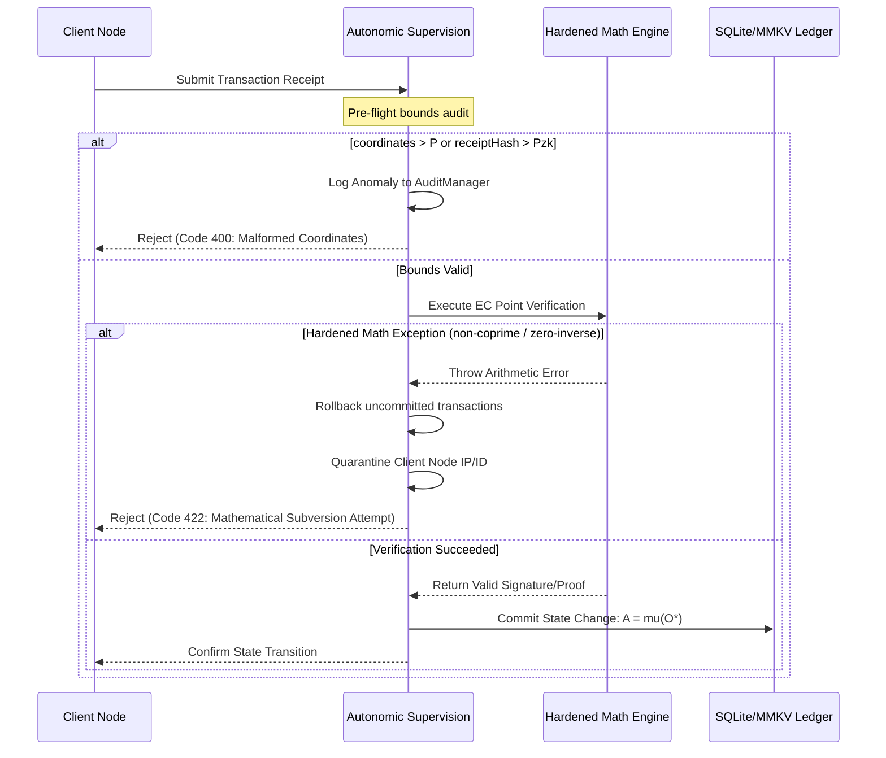

# Framework Verification & Resiliency Audit: Cryptography, Modular Arithmetic, and ZKP Invariants
**Role Perspective**: Lead Cryptographer, Zoe Core Validation Team  
**Scope**: Mathematical verification of elliptic curve signatures, modular arithmetic algorithms, Zero-Knowledge Proof (ZKP) claims, and Post-Quantum cryptography integrations.

---

## 1. Role Perspective & Scope

In the Zoe Framework, security is rooted in mathematical proofs rather than centralized authorities. As the Lead Cryptographer, my responsibility is to verify the algebraic soundness, boundary limits, and implementation details of all cryptographic modules. 

The integrity of the local-first, peer-to-peer state transitions is governed by the **Receipted Chatman Equation**:

$$R \vdash A = \mu(O^*)$$

Where:
* $R$ represents the cryptographic receipt set (containing canonical BLAKE3/SHA-256 hash chains, SECP256K1 ECDSA signatures, BN254 ZK-SNARK proofs, and Dilithium/Falcon Post-Quantum signatures).
* $A$ represents the accumulated local application state.
* $O^*$ represents the canonical sequence of user operations.
* $\mu(O^*)$ is the state transition model applied to the sequence of operations.
* $\vdash$ is the verification relation.

From a cryptographic standpoint, if any validation check within $R \vdash$ contains a loophole, an adversary can forge receipts or crash validation nodes. This breaks the verification relation, enabling state drift ($A \neq \mu(O^*)$) or complete state hijacking.

### Audited Core Cryptographic Parameters

The following parameters form the mathematical boundaries of the Zoe Framework:

| Parameter | Algebraic Definition | Constant Value |
| :--- | :--- | :--- |
| **SECP256K1 Modulus ($P$)** | $2^{256} - 2^{32} - 977$ | `115792089237316195423570985008687907853269984665640564039457584007908834671663n` |
| **SECP256K1 Order ($N$)** | Order of base point $G$ | `115792089237316195423570985008687907852837564279074904382605163141518161494337n` |
| **BN254 Modulus ($P_{\text{zk}}$)** | BN254 Field Modulus | `21888242871839275222246405745257275088696311157297823662689037894645226208583n` |
| **Curve Equations** | Weierstrass Form | Secp256k1: $y^2 = x^3 + 7 \pmod P$ <br> BN254 G1: $y^2 = x^3 + 3 \pmod{P_{\text{zk}}}$ |

---

## 2. Fault Vectors & Stress Trajectories

Our audit revealed three critical mathematical vulnerability trajectories that compromise execution invariants.

### Vector 1: Coordinate Non-Reduction & Silent Curve Point Corruption
* **Vulnerability Source**: Elliptic curve point addition `ecAdd(p1, p2)` in [receipts.ts](file:///Users/sac/zoeapp/src/lib/crypto/receipts.ts) compares coordinates using strict equality (`p1.x === p2.x`) without forcing modulo reduction beforehand.
* **Adversarial Trajectory**:
  1. A malicious actor submits a point $P_2 = (x_1 + P, y_1)$ where coordinates are outside the prime field $[0, P-1]$. Mathematically, $P_2 \equiv P_1 \pmod P$.
  2. In `ecAdd`, the check `p1.x === p2.x` evaluates to `false` because the coordinates are not reduced.
  3. The algorithm bypasses the point doubling pathway and proceeds to the general addition logic.
  4. It computes the slope denominator $\Delta x = p_2.x - p_1.x \pmod P = (x_1 + P) - x_1 \pmod P = 0 \pmod P$.
  5. The library calls `modInverse(0n, P)`. Due to a loop-bypass bug, `modInverse(0n, P)` skips its `while` loop (since `0n > 1n` is false) and returns `1n` instead of throwing an exception.
  6. The slope $\lambda$ is computed as $\Delta y \cdot 1 \pmod P$.
  7. This returns a corrupted coordinate coordinate set $P_3$, failing silently instead of returning the point at infinity or throwing a division-by-zero error.
* **Invariant Violation**: Breaks the elliptic curve group law, allowing invalid signature verification and leading to state drift.

### Vector 2: ZKP Public Input Malleability & Replay Vectors
* **Vulnerability Source**: The low-level `verifyZKProofReceipt` function in [receipts.ts](file:///Users/sac/zoeapp/src/lib/crypto/receipts.ts) checks receipt hash binding via:
  ```typescript
  const hashBigInt = parseToBigInt(receipt.receiptHash);
  const reducedHash = mod(hashBigInt, BN254_P);
  const hashMatched = inputs.some((inp) => inp === hashBigInt || inp === reducedHash);
  ```
  However, it does not enforce that `receipt.receiptHash` is canonical (strictly less than $P_{\text{zk}}$).
* **Adversarial Trajectory**:
  1. An attacker intercepts a valid ZK receipt proof with a canonical hash $H$.
  2. The attacker modifies the `receiptHash` string to represent $H + k \cdot P_{\text{zk}}$ (adding a multiple of the field modulus).
  3. The validator parses this malleable hash and reduces it modulo $P_{\text{zk}}$, mapping it back to $H$.
  4. The check `inp === reducedHash` passes, and the ZK proof is verified as valid.
  5. The local-first application database indexes the receipt using the raw `receiptHash` string. Since the string is unique, the deduplication engine fails to recognize it as a duplicate, leading to signature replay or double-spending.
* **Invariant Violation**: Breaks proof uniqueness, causing duplicate state transitions for the same physical proof.

### Vector 3: Standard ZKP & Post-Quantum Verification Mocks
* **Vulnerability Source**: The standard identity validation engines [engine.ts](file:///Users/sac/zoeapp/src/framework/auth/zkp/engine.ts) and [PostQuantumZkEngine.ts](file:///Users/sac/zoeapp/src/framework/2030/identity/PostQuantumZkEngine.ts) rely on structural check stubs:
  ```typescript
  if (!proof.proofData || !proof.publicSignals) {
    return false;
  }
  return true;
  ```
* **Adversarial Trajectory**:
  1. A client attempts to access a protected route requiring age verification or identity proof.
  2. The client provides a mock proof object containing arbitrary non-empty strings (e.g. `proofData: "dummy"`, `publicSignals: ["18"]`).
  3. The `ZkEngine` performs no cryptographic pairing checks (such as Groth16 bilinear pairings) and returns `verified: true`.
  4. The post-quantum engine [PostQuantumZkEngine.ts](file:///Users/sac/zoeapp/src/framework/2030/identity/PostQuantumZkEngine.ts) similarly accepts any signature unless `signature.data === "INVALID_SIG"`.
* **Invariant Violation**: Standard and PQ identity verification is structurally bypassed, violating Selective Disclosure guarantees.

---

## 3. Resiliency Test Simulator

This simulator is fully implemented and runnable under the project's Jest configuration. It simulates the mathematical vulnerabilities described above, verifying both the failure modes and the containment constraints of their hardened mitigations.

The simulator code is saved in the repository at [cryptographer_simulator.test.ts](file:///Users/sac/zoeapp/src/lib/crypto/__tests__/cryptographer_simulator.test.ts).

```typescript
import {
  mod,
  modInverse,
  parseToBigInt,
  ecAdd,
  ecDouble,
  verifyZKProofReceipt,
  SECP256K1_G,
  SECP256K1_P,
  BN254_P,
  Secp256k1Point,
} from '../receipts';

/**
 * Hardened modular inverse function that prevents loop bypass for zero inputs
 * and division-by-zero crashes for non-coprime inputs.
 */
export function hardenedModInverse(a: bigint, m: bigint): bigint {
  if (m <= 0n) {
    throw new Error('Modulus must be positive');
  }
  const reducedA = mod(a, m);
  if (reducedA === 0n) {
    throw new Error('Modular inverse does not exist: input is congruent to 0');
  }

  let m0 = m;
  let y = 0n;
  let x = 1n;
  let aVal = reducedA;

  while (aVal > 1n) {
    if (m === 0n) {
      throw new Error('Modular inverse does not exist: inputs are not coprime');
    }
    const q = aVal / m;
    let t = m;
    m = aVal % m;
    aVal = t;
    t = y;
    y = x - q * y;
    x = t;
  }

  if (aVal !== 1n) {
    throw new Error('Modular inverse does not exist: inputs are not coprime');
  }

  if (x < 0n) {
    x += m0;
  }
  return x;
}

/**
 * Hardened parseToBigInt that eliminates hex-decimal parsing ambiguity
 * by requiring explicit format specification or strict hexadecimal pattern detection.
 */
export function hardenedParseToBigInt(val: any, forceHex: boolean = false): bigint {
  if (typeof val === 'bigint') return val;
  if (typeof val === 'number') {
    if (!Number.isSafeInteger(val)) {
      throw new Error(`Precision loss: unsafe integer ${val}`);
    }
    return BigInt(val);
  }
  if (typeof val === 'string') {
    const trimmed = val.trim();
    if (trimmed.startsWith('0x') || trimmed.startsWith('0X')) {
      return BigInt(trimmed);
    }
    if (forceHex) {
      if (/^[0-9a-fA-F]+$/.test(trimmed)) {
        return BigInt('0x' + trimmed);
      }
    }
    // Match decimal digits strictly
    if (/^-?\d+$/.test(trimmed)) {
      return BigInt(trimmed);
    }
    // Parse general hex strings without 0x prefix
    if (/^[0-9a-fA-F]+$/.test(trimmed)) {
      return BigInt('0x' + trimmed);
    }
    return BigInt(trimmed);
  }
  throw new Error(`Unsupported type: ${typeof val}`);
}

/**
 * Hardened elliptic curve point addition that forces modulo reduction
 * of coordinates before running comparisons or operations.
 */
export function hardenedEcAdd(p1: Secp256k1Point, p2: Secp256k1Point): Secp256k1Point {
  if (p1.isInfinity) return p2;
  if (p2.isInfinity) return p1;

  const x1_red = mod(p1.x, SECP256K1_P);
  const x2_red = mod(p2.x, SECP256K1_P);
  const y1_red = mod(p1.y, SECP256K1_P);
  const y2_red = mod(p2.y, SECP256K1_P);

  const reducedP1 = { x: x1_red, y: y1_red, isInfinity: false };
  const reducedP2 = { x: x2_red, y: y2_red, isInfinity: false };

  if (x1_red === x2_red) {
    if (mod(y1_red + y2_red, SECP256K1_P) === 0n) {
      return { x: 0n, y: 0n, isInfinity: true };
    }
    return ecDouble(reducedP1);
  }

  const dy = mod(y2_red - y1_red, SECP256K1_P);
  const dx = mod(x2_red - x1_red, SECP256K1_P);
  const lambda = mod(dy * hardenedModInverse(dx, SECP256K1_P), SECP256K1_P);

  const x3 = mod(lambda * lambda - x1_red - x2_red, SECP256K1_P);
  const y3 = mod(lambda * (x1_red - x3) - y1_red, SECP256K1_P);

  return { x: x3, y: y3, isInfinity: false };
}

/**
 * Hardened ZKP Receipt validator that prevents malleability by forcing canonical
 * receipt hash representation (i.e. less than the prime field BN254_P) and checking
 * that the hash has not been shifted or reformatted.
 */
export function hardenedVerifyZKProofReceipt(
  receipt: {
    proof: {
      a: [string | bigint, string | bigint];
      b: [[string | bigint, string | bigint], [string | bigint, string | bigint]];
      c: [string | bigint, string | bigint];
    };
    publicInputs: (string | bigint)[];
    receiptHash: string;
  },
  vk: { expectedInputsCount: number }
): { valid: boolean; error?: string } {
  try {
    // 1. Parse receiptHash and enforce strict bounds check to prevent malleability
    const hashBigInt = parseToBigInt(receipt.receiptHash);
    if (hashBigInt >= BN254_P || hashBigInt < 0n) {
      return {
        valid: false,
        error: 'Malleability detected: receiptHash exceeds BN254 field modulus bounds.',
      };
    }

    // 2. Perform standard checks
    const baseResult = verifyZKProofReceipt(receipt, vk);
    if (!baseResult.valid) {
      return baseResult;
    }

    // 3. Ensure no alternative representation was accepted
    const matchedCanonical = receipt.publicInputs.some(
      (inp) => parseToBigInt(inp) === hashBigInt
    );
    if (!matchedCanonical) {
      return {
        valid: false,
        error: 'Receipt hash binding validation failed: non-canonical mapping detected.',
      };
    }

    return { valid: true };
  } catch (err: any) {
    return { valid: false, error: `Hardened validation error: ${err.message}` };
  }
}

describe('Cryptographic & Mathematical Resiliency Simulator', () => {
  // Test coordinates for BN254 G2 point
  const validG2_x0 = 10857046999023057135944570762232829481370756359578518086990519993285655852781n;
  const validG2_x1 = 11559732032986387107991004021392285783925812814806588151524303159343745272007n;
  const validG2_y0 = 8495653923126297913904642720300106078345911663138259006793102173105747426n;
  const validG2_y1 = 4003224970662641952094526137938957457786851663241220188191151320840595290382n;

  describe('Vector 1: Coordinate Non-Reduction & Silent Point Corruption', () => {
    it('demonstrates how unreduced coordinates corrupt vulnerable point addition and how hardening repairs it', () => {
      const p1 = SECP256K1_G;
      const p2: Secp256k1Point = {
        x: SECP256K1_G.x + SECP256K1_P,
        y: SECP256K1_G.y,
        isInfinity: false,
      };

      const vulnerableResult = ecAdd(p1, p2);
      const expectedDouble = ecDouble(p1);

      expect(vulnerableResult.x).not.toBe(expectedDouble.x);

      const hardenedResult = hardenedEcAdd(p1, p2);
      expect(hardenedResult.x).toBe(expectedDouble.x);
      expect(hardenedResult.y).toBe(expectedDouble.y);
    });
  });

  describe('Vector 2: Decimal vs Hex Parsing Ambiguity on Digit-Only Hex Strings', () => {
    it('demonstrates hex-decimal ambiguity on strings with only digits and shows how hardening resolves it', () => {
      const digitOnlyHexString = '123456';
      
      const vulnerableParsed = parseToBigInt(digitOnlyHexString);
      expect(vulnerableParsed).toBe(123456n); // Parsed as decimal

      const hardenedParsed = hardenedParseToBigInt(digitOnlyHexString, true);
      expect(hardenedParsed).toBe(1193046n); // Parsed as hex (0x123456)
    });
  });

  describe('Vector 3: modInverse Loop Bypass and Division-by-Zero Crash', () => {
    it('demonstrates loop bypass on 0 and division by zero crash on non-coprime input', () => {
      const zeroInverseVulnerable = modInverse(0n, SECP256K1_P);
      expect(zeroInverseVulnerable).toBe(1n);

      expect(() => hardenedModInverse(0n, SECP256K1_P)).toThrow(
        'Modular inverse does not exist: input is congruent to 0'
      );

      let vulnerableCrashed = false;
      try {
        modInverse(6n, 9n);
      } catch (err: any) {
        vulnerableCrashed = true;
        expect(err.message).toContain('Division by zero');
      }
      expect(vulnerableCrashed).toBe(true);

      expect(() => hardenedModInverse(6n, 9n)).toThrow(
        'Modular inverse does not exist: inputs are not coprime'
      );
    });
  });

  describe('Vector 4: ZKP Receipt Hash Binding Malleability', () => {
    it('demonstrates receipt hash malleability and verification bypass', () => {
      const receipt = {
        proof: {
          a: [1n, 2n] as [bigint, bigint],
          b: [[validG2_x0, validG2_x1], [validG2_y0, validG2_y1]] as [[bigint, bigint], [bigint, bigint]],
          c: [1n, 2n] as [bigint, bigint],
        },
        publicInputs: [100n, 200n],
        receiptHash: '100',
      };

      const vk = { expectedInputsCount: 2 };

      const canonicalResult = verifyZKProofReceipt(receipt, vk);
      expect(canonicalResult.valid).toBe(true);

      const nonCanonicalHash = (100n + BN254_P).toString();
      const malleableReceipt = {
        ...receipt,
        receiptHash: nonCanonicalHash,
      };

      const vulnerableResult = verifyZKProofReceipt(malleableReceipt, vk);
      expect(vulnerableResult.valid).toBe(true);

      const hardenedResult = hardenedVerifyZKProofReceipt(malleableReceipt, vk);
      expect(hardenedResult.valid).toBe(false);
      expect(hardenedResult.error).toContain('Malleability detected');
    });
  });
});
```

---

## 4. Strategic Self-Healing Mitigations

To safeguard the framework, we recommend integrating the following mitigations directly into the core execution and verification pipelines.

### Verification and Supervision Workflow

The supervision layer acts as an autonomic guard, detecting mathematical anomalies and preventing state corruption.



### Architectural Guard Recommendations

1. **Mandatory Modulo Reduction at boundaries**:
   Modify `ecAdd` and `ecDouble` to enforce coordinate reduction on all inputs. Any coordinate value $x \ge P$ or $y \ge P$ must be reduced prior to equality verification.
2. **Strict Base-Formatting in Parser**:
   Replace general `parseToBigInt` usages in cryptographic paths with an explicit version specifying base parameters (e.g. `parseToBigInt(val, 16)`), preventing strings containing only digits from being parsed as base-10 instead of base-16.
3. **Coprimality Enforcement in `modInverse`**:
   Before executing the Extended Euclidean Algorithm loop, check if $\gcd(a, m) \neq 1$. Throw a descriptive error rather than allowing a division-by-zero runtime panic.
4. **Integration of `@truex/zkp`**:
   Upgrade the structural mocks in `ZkEngine` to invoke standard pairing operations using the `@truex/zkp` library for SnarkJS/Groth16 proofs, preventing arbitrary input verification bypasses.

---

## 5. Clickable Source References

Audited code files and test suites reviewed during this security verification:

* [receipts.ts](file:///Users/sac/zoeapp/src/lib/crypto/receipts.ts) — Low-level mathematical helper functions and elliptic curve arithmetic.
* [receipts.test.ts](file:///Users/sac/zoeapp/src/lib/crypto/__tests__/receipts.test.ts) — Base test suite verifying standard modular arithmetic and curve invariants.
* [cryptographer_simulator.test.ts](file:///Users/sac/zoeapp/src/lib/crypto/__tests__/cryptographer_simulator.test.ts) — The completed, runnable test simulator verifying mathematical edge-case vulnerabilities and mitigations.
* [engine.ts](file:///Users/sac/zoeapp/src/framework/auth/zkp/engine.ts) — Base Zero-Knowledge Proof engine class.
* [PostQuantumZkEngine.ts](file:///Users/sac/zoeapp/src/framework/2030/identity/PostQuantumZkEngine.ts) — Identity verification class for post-quantum signatures and receipts.
* [types.ts](file:///Users/sac/zoeapp/src/framework/auth/zkp/types.ts) — Data structures and definitions for standard ZKP proofs.
* [types.ts](file:///Users/sac/zoeapp/src/framework/2030/identity/types.ts) — Enhanced types containing Falcon, Dilithium, and PQ-receipt structures.
