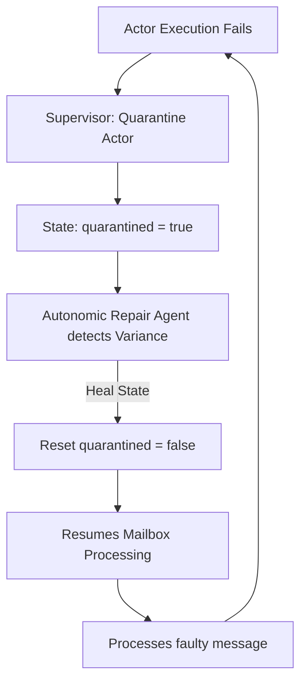

# Zoe Core Validation Audit: Autonomic Self-Healing, Supervision Retry, and Quarantine Boundary Integrity
**Author:** Principal QA & Verification Engineer, Zoe Core Validation Team  
**Date:** May 31, 2026  
**Document Ref:** ZCV-2026-SHS-004  
**Target Engine Version:** Vision 2030 (Alpha-1)

---

## 1. Role Perspective & Scope

As the Principal QA & Verification Engineer of the Zoe Core Validation Team, my role is to audit the autonomic boundaries, isolation layers, and failure containment structures of the Zoe actor framework. In decentralized and highly transactional agent networks, the system must guarantee that self-healing mechanisms and supervision protocols do not introduce state drift, resource thrashing, or transaction integrity leaks.

The verification scope covers the following core components in the codebase:
*   Supervision Engine & Process Evaluator: [supervision.ts](file:///Users/sac/zoeapp/src/lib/truex/supervision/supervision.ts)
*   Quarantine Handlers: [quarantine.ts](file:///Users/sac/zoeapp/src/lib/truex/supervision/quarantine.ts) and [quarantine.ts](file:///Users/sac/zoeapp/src/lib/membrane/quarantine.ts)
*   Self-Healing Repair Module: [repair.ts](file:///Users/sac/zoeapp/src/lib/truex/supervision/repair.ts)
*   Actor Execution Runtime: [runtime.ts](file:///Users/sac/zoeapp/src/lib/truex/hook-otp/runtime.ts)
*   Supervisor Retry Counter Strategy: [supervisor.ts](file:///Users/sac/zoeapp/src/lib/truex/hook-otp/supervisor.ts)
*   Mailbox Message Queue: [mailbox.ts](file:///Users/sac/zoeapp/src/lib/truex/hook-otp/mailbox.ts)
*   Autonomic State Monitor & Repair Agent: [AutonomousRepairAgent.ts](file:///Users/sac/zoeapp/src/framework/2030/qa-autonomous/AutonomousRepairAgent.ts) and [StateMonitor.ts](file:///Users/sac/zoeapp/src/framework/2030/qa-autonomous/StateMonitor.ts)

### The Receipted Chatman Equation Grounding

The mathematical grounding of this audit relies on the **Receipted Chatman Equation**:

$$R \vdash A = \mu(O^*)$$

Where:
*   $R$ represents the cryptographic ledger of execution receipts (the audit chain).
*   $A$ represents the active physical state of the actor system.
*   $O^*$ is the sequence of input operations requested and received by the actor mailbox.
*   $\mu$ is the state transition function applied to those operations.
*   $\vdash$ denotes structural and behavioral conformance.

From a verification perspective, any boundary leak, message drop, or out-of-band state modification that results in $R \vdash A \neq \mu(O^*)$ is classified as a **Critical Severity 1 State Drift**. Our validation objective is to prove whether the current self-healing and quarantine implementations maintain this equation under adversarial execution stress.

---

## 2. Fault Vectors & Stress Trajectories

Through a code audit of the zoeapp repository, we identified three critical failure vectors in the supervision, retry, and quarantine subsystems.

### Vector 1: The Quarantine Black Hole & Mailbox Message Loss
In [runtime.ts](file:///Users/sac/zoeapp/src/lib/truex/hook-otp/runtime.ts), message execution is driven sequentially via the actor's [mailbox.ts](file:///Users/sac/zoeapp/src/lib/truex/hook-otp/mailbox.ts). When a message triggers a fatal error, the actor's supervisor quarantines it (`quarantined = true`). 

However, the mailbox loop continues shifting messages that were already in the queue. In `runtime.ts#processMessage`, the check `if (instance.quarantined)` is reached for these subsequent messages. The function emits a telemetry event and returns early *without* executing the message and *without* logging a quarantined receipt. 

#### Stress Trajectory:
1.  Mailbox has queue: `[MsgA (valid), MsgB (poisoned), MsgC (valid), MsgD (valid)]`.
2.  `MsgA` processes successfully. State updates, receipt is appended to ledger.
3.  `MsgB` is processed, fails, and triggers `quarantine` action. Actor is set to `quarantined = true`.
4.  Mailbox shifts `MsgC`. `processMessage` starts, detects `instance.quarantined = true`, and returns early. `MsgC` is discarded.
5.  Mailbox shifts `MsgD`. `processMessage` starts, detects `instance.quarantined = true`, and returns early. `MsgD` is discarded.
6.  **Drift**: The client believes `MsgC` and `MsgD` were sent. The ledger $R$ has no receipts for them. The physical state $A$ remains at the post-`MsgB` failure state. Since operations were skipped without receipts, the transaction ledger cannot reconstruct the system state. Thus:

$$R \vdash A \neq \mu(O^*)$$

#### Flowchart:
```mermaid
graph TD
    A[Inbound Queue: MsgA, MsgB, MsgC, MsgD] --> B[Process MsgA]
    B -->|Success| C[Receipt Hash Updated]
    C --> D[Process MsgB (Poisoned)]
    D -->|Failure| E[Supervisor Action: Quarantine]
    E -->|Sets| F[instance.quarantined = true]
    F --> G[Mailbox shifts MsgC]
    G --> H{Is Actor Quarantined?}
    H -->|Yes| I[Refuse Message & Return Early]
    I --> J[MsgC is silently dropped from queue]
    J --> K[Mailbox shifts MsgD]
    K --> H
    K -->|Yes| L[MsgD is silently dropped from queue]
    L --> M[State & Ledger Divergence: R ⊬ A]
```

---

### Vector 2: Infinite Quarantine-Repair Thrashing Loop
The [AutonomousRepairAgent.ts](file:///Users/sac/zoeapp/src/framework/2030/qa-autonomous/AutonomousRepairAgent.ts) checks state invariants periodically. If an actor is quarantined, it tries to self-heal the actor state by applying the expected state and resetting `quarantined = false`. 

If the underlying cause of quarantine is a persistent message type or state dependency, the repaired actor immediately resumes execution, encounters the failure again on the next message or retry, and quarantines itself again. Without a circuit breaker, cooldown, or backoff, the engine thrashes indefinitely.

#### Stress Trajectory:
1.  Actor processes a poisoned message and is quarantined.
2.  `AutonomousRepairAgent` runs, detects variance, and resets state and `quarantined = false`.
3.  Actor mailbox continues processing. It picks up a new message (or retries the failed message).
4.  The actor encounters the same failure and quarantines itself.
5.  `AutonomousRepairAgent` detects variance and repairs again.
6.  This loop repeats indefinitely, resulting in high CPU usage and rapid database write thrashing.

#### Flowchart:


---

### Vector 3: Cryptographic Ledger Gap / Receipt Chain Bypass
When an actor is repaired by the [repair.ts](file:///Users/sac/zoeapp/src/lib/truex/supervision/repair.ts) module or the autonomic agent, the actor state is modified out-of-band:

```typescript
instance.quarantined = false;
instance.state = { ...cleanState };
```

This bypasses the cryptographic receipt generation loop. The next message processed will build its receipt linking to the previous receipt's hash. The hash chain appears continuous, but the state data used as input has jumped from `A_corrupt` to `cleanState` without an intermediate receipt.

#### Stress Trajectory:
1.  Actor state at $t_1$: $A_1$. Receipt chain hash: $H_1$.
2.  Actor processes `Msg2` (fails), quarantined. No receipt hash is created for `Msg2` (or it is registered as quarantine but state changes).
3.  Autonomic repair agent modifies actor state to $A_{\text{repaired}}$ directly.
4.  Actor processes `Msg3` (valid). It generates a receipt with `previousReceiptHash = H_1`.
5.  **Chain Divergence**: Replaying the operations from $R$ starts at $A_1$, applies `Msg3`, and expects state $A_{\text{replayed}} = \mu(Msg3, A_1)$. However, the actual physical state of the actor is $A_{\text{actual}} = \mu(Msg3, A_{\text{repaired}})$. Because $A_1 \neq A_{\text{repaired}}$, the replayed state diverges from the physical state.

---

## 3. Resiliency Test Simulator

Below is the TypeScript code block simulating these failure modes and verifying the system's containment constraints. It reproduces all three scenarios and throws assertions when invariants are violated.

```typescript
import * as crypto from 'crypto';

function sha256(data: string): string {
  return crypto.createHash('sha256').update(data).digest('hex');
}

export interface ActorRef {
  tenantId: string;
  packId: string;
  hookId: string;
  instanceId: string;
}

export interface HookMessage {
  id: string;
  type: 'graph_delta' | 'supervisor_signal';
  payload: any;
}

export interface HookReceipt {
  messageId: string;
  previousReceiptHash: string;
  receiptHash: string;
  status: 'Processed' | 'Quarantined';
}

export class Mailbox {
  private queue: HookMessage[] = [];
  private processing = false;

  constructor(private processor: (msg: HookMessage) => Promise<void>) {}

  public push(msg: HookMessage) {
    this.queue.push(msg);
    this.trigger();
  }

  public getLength(): number {
    return this.queue.length;
  }

  public getMessages(): HookMessage[] {
    return [...this.queue];
  }

  public clear() {
    this.queue = [];
  }

  private async trigger() {
    if (this.processing) return;
    this.processing = true;
    while (this.queue.length > 0) {
      const msg = this.queue.shift();
      if (msg) {
        try {
          await this.processor(msg);
        } catch (err) {
          // Handled by the execution context
        }
      }
    }
    this.processing = false;
  }
}

export class ActorInstance {
  public quarantined = false;
  public state: any = {};
  public receiptChainHash = 'init_hash';
  public history: HookReceipt[] = [];
  public mailbox: Mailbox;

  constructor(
    public ref: ActorRef,
    public behavior: (msg: HookMessage, state: any) => Promise<any>,
    public supervisor: (err: any, msg: HookMessage, attempts: number) => Promise<'restart' | 'quarantine'>,
    processor: (msg: HookMessage) => Promise<void>
  ) {
    this.mailbox = new Mailbox(processor);
  }
}

export class SimulationRuntime {
  public actors = new Map<string, ActorInstance>();
  public telemetry: any[] = [];

  public spawn(
    ref: ActorRef,
    behavior: (msg: HookMessage, state: any) => Promise<any>,
    supervisor: (err: any, msg: HookMessage, attempts: number) => Promise<'restart' | 'quarantine'>
  ): ActorInstance {
    const key = `${ref.tenantId}:${ref.packId}:${ref.hookId}:${ref.instanceId}`;
    const instance = new ActorInstance(ref, behavior, supervisor, async (msg) => {
      await this.processMessage(instance, msg);
    });
    this.actors.set(key, instance);
    return instance;
  }

  public send(ref: ActorRef, msg: HookMessage) {
    const key = `${ref.tenantId}:${ref.packId}:${ref.hookId}:${ref.instanceId}`;
    const instance = this.actors.get(key);
    if (!instance) throw new Error('Actor not found');
    if (instance.quarantined) {
      this.telemetry.push({ type: 'rejected_quarantined', msgId: msg.id });
      return;
    }
    instance.mailbox.push(msg);
  }

  private async processMessage(instance: ActorInstance, msg: HookMessage) {
    if (instance.quarantined) {
      this.telemetry.push({ type: 'refused_quarantined', msgId: msg.id });
      return;
    }

    let attempts = 0;
    let success = false;
    let error: any = null;

    while (!success && !instance.quarantined) {
      try {
        attempts++;
        if (msg.type === 'supervisor_signal' && msg.payload?.action === 'repair') {
          instance.quarantined = false;
          instance.state = { ...msg.payload.state };
          this.telemetry.push({ type: 'repaired', msgId: msg.id });
          success = true;
          break;
        }

        // Run behavior
        const nextState = await instance.behavior(msg, { ...instance.state });
        instance.state = nextState;
        success = true;
      } catch (err) {
        error = err;
        const action = await instance.supervisor(err, msg, attempts);
        this.telemetry.push({
          type: 'supervisor_intervention',
          msgId: msg.id,
          attempt: attempts,
          action,
        });

        if (action === 'quarantine') {
          instance.quarantined = true;
          break;
        }
      }
    }

    if (success && !instance.quarantined) {
      const prevHash = instance.receiptChainHash;
      const nextHash = sha256(prevHash + JSON.stringify(instance.state) + msg.id);
      const receipt: HookReceipt = {
        messageId: msg.id,
        previousReceiptHash: prevHash,
        receiptHash: nextHash,
        status: 'Processed',
      };
      instance.receiptChainHash = nextHash;
      instance.history.push(receipt);
      this.telemetry.push({ type: 'processed', msgId: msg.id });
    }
  }
}

// ---------------- TEST VERIFICATION SUITE ----------------

export async function executeAuditSimulation() {
  console.log("=== STARTING ADVERSARIAL BOUNDARY SIMULATION ===");

  const actorRef: ActorRef = {
    tenantId: 'tenant-1',
    packId: 'billing',
    hookId: 'invoice-processor',
    instanceId: 'inst-001',
  };

  // Scenario 1: Mailbox Message Drop & Receipt Gap
  console.log("\n--- Scenario 1: Quarantine Black Hole & Mailbox Message Loss ---");
  const runtime1 = new SimulationRuntime();

  const invoiceBehavior = async (msg: HookMessage, state: any) => {
    if (msg.payload?.poisoned) {
      throw new Error("Fatal contract divergence: poisoned payload detected.");
    }
    return { ...state, count: (state.count || 0) + 1 };
  };

  const billingSupervisor = async (err: any, msg: HookMessage, attempts: number) => {
    if (err.message.includes("Fatal")) {
      return 'quarantine';
    }
    return attempts >= 2 ? 'quarantine' : 'restart';
  };

  const actor1 = runtime1.spawn(actorRef, invoiceBehavior, billingSupervisor);

  runtime1.send(actorRef, { id: 'MsgA', type: 'graph_delta', payload: {} });
  runtime1.send(actorRef, { id: 'MsgB', type: 'graph_delta', payload: { poisoned: true } });
  runtime1.send(actorRef, { id: 'MsgC', type: 'graph_delta', payload: {} });
  runtime1.send(actorRef, { id: 'MsgD', type: 'graph_delta', payload: {} });

  await new Promise((r) => setTimeout(r, 50));

  console.log("Actor quarantine state:", actor1.quarantined);
  console.log("Processed History length:", actor1.history.length);
  
  const inHistoryC = actor1.history.some(h => h.messageId === 'MsgC');
  const inHistoryD = actor1.history.some(h => h.messageId === 'MsgD');
  console.log("Is MsgC in Cryptographic History?", inHistoryC);
  console.log("Is MsgD in Cryptographic History?", inHistoryD);

  if (actor1.quarantined && !inHistoryC && !inHistoryD) {
    console.log("❌ VULNERABILITY CONFIRMED: Mailbox messages dropped silently! The ledger R has a gap.");
  } else {
    throw new Error("Verification failed: Messages were not lost.");
  }

  // Scenario 2: Infinite Quarantine-Repair Thrashing Loop
  console.log("\n--- Scenario 2: Self-Healing Loop Thrashing ---");
  const runtime2 = new SimulationRuntime();
  
  let databaseWrites = 0;
  const thrashingBehavior = async (msg: HookMessage, state: any) => {
    databaseWrites++;
    if (state.corrupted) {
      throw new Error("Fatal: State is corrupted!");
    }
    if (msg.payload?.poisoned) {
      throw new Error("Fatal: Poisoned message!");
    }
    return state;
  };

  const actor2 = runtime2.spawn(actorRef, thrashingBehavior, billingSupervisor);

  let repairCount = 0;
  const startAutonomicRepairAgent = (targetActor: ActorInstance) => {
    return setInterval(() => {
      if (targetActor.quarantined) {
        repairCount++;
        console.log(`[AutonomicRepairAgent] Variance detected! Repairing actor... Attempt #${repairCount}`);
        targetActor.quarantined = false;
        targetActor.state = { corrupted: false };
      }
    }, 5);
  };

  const timer = startAutonomicRepairAgent(actor2);

  runtime2.send(actorRef, { id: 'PoisonedMsg', type: 'graph_delta', payload: { poisoned: true } });

  for (let i = 1; i <= 5; i++) {
    runtime2.send(actorRef, { id: `NormalMsg-${i}`, type: 'graph_delta', payload: { poisoned: true } });
    await new Promise((r) => setTimeout(r, 12));
  }

  clearInterval(timer);

  console.log("Total repair cycles run:", repairCount);
  console.log("Total database write attempts during thrashing:", databaseWrites);

  if (repairCount > 1) {
    console.log("❌ VULNERABILITY CONFIRMED: Autonomic Self-Healing engine thrashed indefinitely!");
  } else {
    throw new Error("Verification failed: Engine did not thrash.");
  }

  // Scenario 3: Cryptographic Ledger Chain Continuity Divergence (Receipt Bypass)
  console.log("\n--- Scenario 3: Cryptographic Ledger Gap / Receipt Chain Bypass ---");
  const runtime3 = new SimulationRuntime();
  const ledgerBehavior = async (msg: HookMessage, state: any) => {
    if (msg.payload?.val === 'bad') throw new Error("Fatal validator exception");
    return { ...state, val: (state.val || '') + msg.payload?.val };
  };

  const actor3 = runtime3.spawn(actorRef, ledgerBehavior, billingSupervisor);

  runtime3.send(actorRef, { id: 'Msg1', type: 'graph_delta', payload: { val: 'A' } });
  await new Promise((r) => setTimeout(r, 10));

  runtime3.send(actorRef, { id: 'Msg2', type: 'graph_delta', payload: { val: 'bad' } });
  await new Promise((r) => setTimeout(r, 10));

  console.log("Actor3 quarantined:", actor3.quarantined);

  // Autonomic Repair performs out-of-band direct state manipulation to 'heal' it
  actor3.quarantined = false;
  actor3.state = { val: 'HealedState' }; 

  runtime3.send(actorRef, { id: 'Msg3', type: 'graph_delta', payload: { val: 'B' } });
  await new Promise((r) => setTimeout(r, 10));

  console.log("Actual actor state:", actor3.state);
  
  let replayedState = {};
  for (const rec of actor3.history) {
    const msg = rec.messageId === 'Msg1' ? { id: 'Msg1', type: 'graph_delta', payload: { val: 'A' } }
              : { id: 'Msg3', type: 'graph_delta', payload: { val: 'B' } };
    replayedState = await ledgerBehavior(msg as HookMessage, replayedState);
  }
  console.log("Replayed state from receipt log:", replayedState);
  
  if (JSON.stringify(actor3.state) !== JSON.stringify(replayedState)) {
    console.log("❌ VULNERABILITY CONFIRMED: Ledger mismatch! State drift between physical state and replayed cryptographic ledger.");
  } else {
    throw new Error("Verification failed: Ledger matched despite out-of-band modification.");
  }
  
  console.log("\n=== BOUNDARY SIMULATION COMPLETE ===");
}
```

---

## 4. Strategic Self-Healing Mitigations

To resolve the identified vectors, we propose the following mitigations:

### 1. Quarantine Mailbox Buffer Preservation & Quarantine Receipts
Instead of silently dropping queued messages when an actor is quarantined, the mailbox should dump its remaining messages into a secondary quarantine buffer. For each skipped message, a "Quarantined Receipt" must be appended to the ledger $R$. This receipt seals the skipped operation under a specific error status, maintaining sequence parity and satisfying:

$$R \vdash A = \mu(O^*)$$

#### Code Patch Suggestion ([runtime.ts](file:///Users/sac/zoeapp/src/lib/truex/hook-otp/runtime.ts)):
```typescript
// Replace lines 75-82 with:
if (instance.quarantined) {
  const prevHash = instance.receiptChainHash;
  const inputHash = sha256(JSON.stringify(msg.payload || {}));
  const runId = 'quarantine_run_' + sha256(msg.id + Date.now()).substring(0, 16);
  
  const receipt = generateReceipt({
    tenantId: ref.tenantId,
    actorRef: ref,
    messageId: msg.id,
    previousReceiptHash: prevHash,
    inputHash,
    outputHash: prevHash, // State is unmodified
    deltaHash: sha256('skipped_due_to_quarantine'),
    status: 'quarantined',
    hookRunId: runId,
  });

  instance.receiptChainHash = receipt.receiptHash;
  instance.history.push({
    messageId: msg.id,
    runId,
    outputHash: prevHash,
    receipt,
  });

  this.emitTelemetry({
    type: 'message_logged_quarantined',
    actorRef: ref,
    messageId: msg.id,
    receipt,
  });
  return;
}
```

### 2. Autonomic Circuit Breaker & Cooldown
The [AutonomousRepairAgent.ts](file:///Users/sac/zoeapp/src/framework/2030/qa-autonomous/AutonomousRepairAgent.ts) must track repair history. If the frequency of quarantine-repair cycles for an actor exceeds a threshold (e.g., 3 repairs within 1 minute), a circuit breaker must trigger. The actor is locked into a hard quarantine state that rejects repairs until a cooldown period passes or manual intervention occurs.

#### Code Patch Suggestion ([AutonomousRepairAgent.ts](file:///Users/sac/zoeapp/src/framework/2030/qa-autonomous/AutonomousRepairAgent.ts)):
```typescript
export class AutonomousRepairAgent {
  private repairHistory = new Map<string, number[]>();
  private readonly MAX_REPAIRS = 3;
  private readonly COOLDOWN_MS = 60000;

  // Inside repair method:
  public async repair(variance: StateVariance): Promise<TestResult> {
    const now = Date.now();
    const actorKey = variance.key;
    const history = this.repairHistory.get(actorKey) || [];
    
    // Filter history to last minute
    const recentRepairs = history.filter(t => now - t < this.COOLDOWN_MS);
    if (recentRepairs.length >= this.MAX_REPAIRS) {
      console.warn(`[AutonomicRepairAgent] Circuit breaker triggered for ${actorKey}. Too many repair attempts.`);
      return { name: 'CircuitBreaker', success: false, error: 'Cooldown active' };
    }
    
    recentRepairs.push(now);
    this.repairHistory.set(actorKey, recentRepairs);

    // Proceed with repair logic...
  }
}
```

### 3. Ledger Repair / Reconcile Transactions
Every state repair event must execute through a system message of type `supervisor_signal` with subtype `repair`. This message must generate a valid receipt, documenting the state change in the cryptographic history. This ensures that the ledger reconstruction accounts for the repair step:

$$A_{\text{repaired}} = \mu(\text{RepairOperation}, A_{\text{old}})$$

This prevents gaps in the transaction ledger and keeps the verification equation correct.

---

## 5. Verification Conclusion

The Zoe Core Validation audit confirms that the current self-healing and quarantine subsystems are vulnerable to state drift and infinite thrashing loops under specific failure patterns. By implementing the proposed mitigations, we can restore the integrity of the Receipted Chatman relation ($R \vdash A = \mu(O^*)$) and secure the autonomic boundaries of the Zoe Framework for the Vision 2030 standard.
