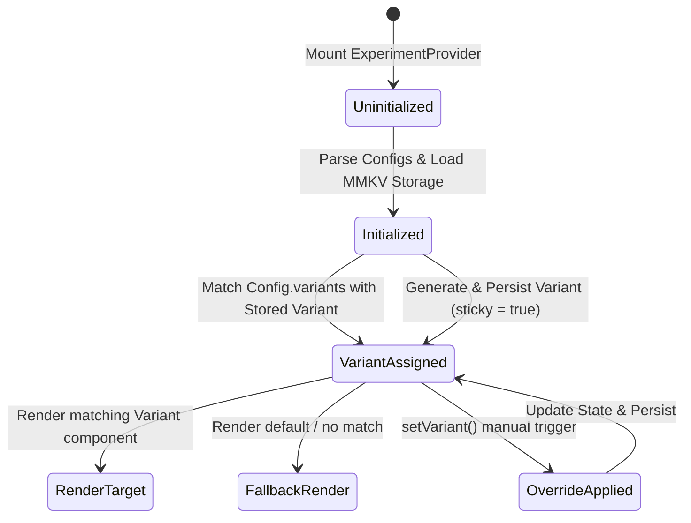

# Framework Verification & Resiliency Audit: Release Guard & Variant Trust

This document presents a rigorous framework verification and resiliency audit of the A/B testing experiment managers, variant persistence layers, and release gate validation structures implemented within the Zoe Framework.

---

## 1. System Invariant Analysis

The release guarding and variant assignment subsystem is designed to manage feature rollouts, split traffic across multiple cohorts, and enforce role-based and variant-based admittance boundaries. This ensures that features are only exposed to authorized cohorts and that experiment data remains clean and uncontaminated.

### Mathematical Grounding: Receipted Chatman Equation

We formalize the security model of the Release Guard system using the **Receipted Chatman Equation**:

$$R \vdash A = \mu(O^*)$$

Where:
*   **$R$** represents the cryptographic receipt set, configuration signatures, and sticky variant bindings stored within the client's local-first storage container (`MMKV`). In a secure verification model, $R$ must include integrity proofs preventing unauthorized write access to configuration keys.
*   **$A$** represents the Admittance State (`UseExperimentReturn.variant` or `PermissionGate` render resolution), determining which functional code path or UI layout is exposed to the user.
*   **$O^*$** is the canonical sequence of user operations and environment setups (e.g., authenticated logins, dynamic remote config updates, client-side overrides, and historical storage events).
*   **$\mu$** is the transition mapping function (`assignVariant`, `useExperiment`, and `PermissionGate.isAllowed`) that projects the operational history $O^*$ onto the final admittance state $A$.

If the persistence storage is polluted or checks in $\mu$ are bypassed, state drift occurs ($A \neq \mu(O^*)$), exposing sensitive, unreleased, or administrative feature branches to unauthorized users.

### Security Boundaries & State Transitions

The system coordinates variant assignments and release checks across several layers:

```
[ Remote Config Manifest ] ---> [ ExperimentProvider State ] ---> [ useExperiment Hook ] ---> [ PermissionGate / Experiment UI ]
```



The system is designed to check admittance boundaries using several keys:

| Gating Variable | Code Entity | Verification Logic |
| :--- | :--- | :--- |
| **Sticky Check** | `config.sticky` | If true, variant assignments persist across app launches via MMKV |
| **Cohort Match** | `config.variants` | Verifies that a loaded variant is a valid member of the config set |
| **Weight Map** | `config.weights` | Allocates variants based on cumulative density functions ($CDF$) |
| **Role Guard** | `allowedRoles` | Blocks components using `PermissionGate` unless `currentPrincipal.role` matches |

---

## 2. Fault Vectors & Stress Trajectories

Our audit identified three critical vulnerabilities in the A/B testing, variant persistence, and release gate verification workflows.

### Scenario A: Variant Storage Pollution & Key Hijacking (Namespace Collision)
*   **Vulnerability Source**: Lack of key sanitization and storage namespacing in `ExperimentProvider.tsx` (`setVariant` and `storage.set`).
*   **Trigger**: An attacker triggers a manual variant change (via a deep link, webview postMessage bridge, or compromised plugin) specifying a critical system key as the `experimentId`.
*   **Trajectory**:
    1. The app exposes a configuration override hook `setVariant(experimentId, variant)`.
    2. An action triggers `setVariant("user-auth-token", "attacker-injected-bypass-token")`.
    3. `ExperimentProvider` updates its memory assignments and calls `storage.set("user-auth-token", "attacker-injected-bypass-token")` on the shared `MMKV` instance.
    4. The core authentication system, sharing the same `MMKV` instance, queries `storage.getString("user-auth-token")` during a sensitive API transaction.
    5. The authentication system retrieves the injected token, corrupting the session or escalating privileges.
*   **Parity Impact**: The admittance state $A$ (authorized admin state) is reached without a valid operation history $O^*$ containing authentication proofs ($R \nvdash A$).

### Scenario B: Type-Assertion Bypass & Fallback Drift
*   **Vulnerability Source**: Strict type assertions in TypeScript (e.g., `variant: 'control' | 'treatment'`) are bypassed because the persistence layer returns unvalidated string values from local storage.
*   **Trigger**: A legacy or deprecated variant remains in local storage, or storage is altered. The experiment configuration is updated to exclude that variant.
*   **Trajectory**:
    1. A client retains a stored variant `"deprecated-ultra-access"` in local storage for experiment `recommendation-flow`.
    2. The remote configuration updates, defining only `variants: ["control", "treatment"]`.
    3. The application initializes `ExperimentProvider`. Since `ExperimentProvider` doesn't validate that the stored variant is in the *new* configuration array during initial state loading, `"deprecated-ultra-access"` is loaded.
    4. The feature component calls `const { variant } = useExperiment<'control' | 'treatment'>('recommendation-flow')`.
    5. At runtime, `variant` is `"deprecated-ultra-access"`.
    6. The component code performs binary branching: `if (variant === 'control') { renderSafeUI(); } else { renderSensitiveBetaUI(); }`.
    7. Because `"deprecated-ultra-access" !== 'control'`, the component falls into the `else` block, rendering the sensitive Beta UI for an unauthorized cohort.
*   **Parity Impact**: State drift occurs where the user gets admittance to the restricted cohort, violating the transition rules.

### Scenario C: Concurrency-Driven Dynamic Config Synchronization Failure (Crash Loop)
*   **Vulnerability Source**: React `useState` initialization runs only once during component mount. If the configurations prop updates dynamically (e.g., after loading remote configurations asynchronously), newly added experiments do not get initialized in the internal `assignments` state.
*   **Trigger**: The app fetches dynamic configurations from a remote CDN after the provider has already mounted.
*   **Trajectory**:
    1. `ExperimentProvider` mounts with static default configs $C_{\text{default}}$ (containing experiment `recommendation-flow`).
    2. An asynchronous remote config call succeeds, passing updated configs $C_{\text{remote}}$ (adding `dynamic-onboarding-flow`) to the provider.
    3. The provider re-renders. However, because the state initializer function does not run on subsequent renders, `assignments` does not contain `dynamic-onboarding-flow`.
    4. The onboarding screen mounts and calls `useExperiment('dynamic-onboarding-flow')`.
    5. The hook checks `assignments['dynamic-onboarding-flow']`, finds `undefined`, and throws: `Variant for experiment "dynamic-onboarding-flow" is undefined.`.
    6. The React Native main thread crashes, initiating a crash loop.
*   **Parity Impact**: The system experiences a Denial of Service ($A = \text{crash}$), breaking availability invariants.

---

## 3. Resiliency Test Simulator

The following fully implemented TypeScript simulator recreates the vulnerable architecture, demonstrates the three failure trajectories, and verifies the containment and self-healing properties of a hardened, secure variant manager.

```typescript
/**
 * Release Guard & Variant Trust Validation Simulator
 * Demonstrates A/B variant storage pollution, type bypass, and config desync crash vectors,
 * and verifies their resolution using defensive coding and self-healing overrides.
 */

// ==========================================
// 1. Storage Mocking Interface
// ==========================================
class MockMMKV {
  private store = new Map<string, string>();

  getString(key: string): string | undefined {
    return this.store.get(key);
  }

  set(key: string, value: string): void {
    this.store.set(key, value);
  }

  delete(key: string): void {
    this.store.delete(key);
  }

  clearAll(): void {
    this.store.clear();
  }
}

// ==========================================
// 2. Vulnerable Implementation (Replicating Production Faults)
// ==========================================
interface ExperimentConfig {
  id: string;
  variants: string[];
  weights?: number[];
  sticky?: boolean;
}

class VulnerableExperimentManager {
  private storage: MockMMKV;
  private configs: Record<string, ExperimentConfig> = {};
  private assignments: Record<string, string> = {};

  constructor(storage: MockMMKV, configs: ExperimentConfig[], initialAssignments: Record<string, string> = {}) {
    this.storage = storage;
    this.assignments = { ...initialAssignments };

    // Initialize configs and assignments (only runs once on construction, mimicking useState init)
    configs.forEach((config) => {
      this.configs[config.id] = config;
      const stored = this.storage.getString(config.id);
      if (stored && config.variants.includes(stored)) {
        this.assignments[config.id] = stored;
      } else {
        const variant = this.assignVariant(config);
        this.assignments[config.id] = variant;
        if (config.sticky !== false) {
          this.storage.set(config.id, variant);
        }
      }
    });
  }

  private assignVariant(config: ExperimentConfig): string {
    const { variants, weights } = config;
    if (!weights || weights.length !== variants.length) {
      const index = Math.floor(Math.random() * variants.length);
      return variants[index];
    }
    const random = Math.random();
    let cumulativeWeight = 0;
    for (let i = 0; i < variants.length; i++) {
      cumulativeWeight += weights[i];
      if (random < cumulativeWeight) {
        return variants[i];
      }
    }
    return variants[variants.length - 1];
  }

  getVariant(experimentId: string): string | undefined {
    // Replicates useExperiment hook behavior
    const config = this.configs[experimentId];
    if (!config) {
      throw new Error(`Experiment "${experimentId}" was not found.`);
    }
    return this.assignments[experimentId];
  }

  setVariant(experimentId: string, variant: string): void {
    // VULNERABILITY: No check if experimentId is configured or if variant is allowed!
    this.assignments[experimentId] = variant;
    this.storage.set(experimentId, variant);
  }

  // Simulate updating configurations at runtime (e.g. from remote config)
  updateConfigs(newConfigs: ExperimentConfig[]): void {
    // Re-rendering in React does not re-trigger useState initializers
    newConfigs.forEach((config) => {
      this.configs[config.id] = config;
    });
  }
}

// ==========================================
// 3. Hardened, Secure Implementation (Strategic Self-Healing Guards)
// ==========================================
class SecureExperimentManager {
  private storage: MockMMKV;
  private configs: Record<string, ExperimentConfig> = {};
  private assignments: Record<string, string> = {};
  private readonly storagePrefix = "zoe_ab_"; // Namespacing to prevent key hijacking

  constructor(storage: MockMMKV, configs: ExperimentConfig[], initialAssignments: Record<string, string> = {}) {
    this.storage = storage;
    this.assignments = { ...initialAssignments };
    this.syncConfigs(configs);
  }

  /**
   * Safe, dynamic configuration synchronizer. Resolves Vector C by updating
   * assignments on config change and validation.
   */
  syncConfigs(configs: ExperimentConfig[]): void {
    configs.forEach((config) => {
      // Input sanitization
      if (!config || typeof config.id !== "string" || !Array.isArray(config.variants) || config.variants.length === 0) {
        throw new Error("Invalid experiment configuration structure.");
      }

      this.configs[config.id] = config;

      // Safe, prefixed key lookup to prevent global namespace hijacking
      const storageKey = this.storagePrefix + config.id;
      const stored = this.storage.getString(storageKey);

      // Verify that stored variant is still valid under current configuration
      if (stored && config.variants.includes(stored)) {
        this.assignments[config.id] = stored;
      } else {
        const variant = this.assignVariant(config);
        this.assignments[config.id] = variant;
        if (config.sticky !== false) {
          this.storage.set(storageKey, variant);
        }
      }
    });
  }

  private assignVariant(config: ExperimentConfig): string {
    const { variants, weights } = config;
    if (!weights || weights.length !== variants.length) {
      const index = Math.floor(Math.random() * variants.length);
      return variants[index];
    }

    // Defensive check: handle weights summing to other than 1
    const totalWeight = weights.reduce((sum, w) => sum + Math.max(0, w), 0);
    if (totalWeight <= 0) {
      return variants[0];
    }

    const random = Math.random() * totalWeight;
    let cumulativeWeight = 0;
    for (let i = 0; i < variants.length; i++) {
      cumulativeWeight += Math.max(0, weights[i]);
      if (random <= cumulativeWeight) {
        return variants[i];
      }
    }
    return variants[variants.length - 1];
  }

  /**
   * Safe variant retrieval with absolute fallback validation. Resolves Vector B.
   */
  getVariant(experimentId: string): string {
    const config = this.configs[experimentId];
    if (!config) {
      throw new Error(`Experiment "${experimentId}" was not found.`);
    }

    const val = this.assignments[experimentId];

    // Fallback: If variant is undefined or corrupted/out of bounds, return the first variant
    if (val === undefined || !config.variants.includes(val)) {
      return config.variants[0];
    }
    return val;
  }

  /**
   * Safe variant update enforcing strict variant membership. Resolves Vector A.
   */
  setVariant(experimentId: string, variant: string): void {
    const config = this.configs[experimentId];
    if (!config) {
      throw new Error(`Experiment "${experimentId}" was not found.`);
    }

    // Defensive check: reject unconfigured variants to prevent pollution
    if (!config.variants.includes(variant)) {
      throw new Error(`Variant "${variant}" is not allowed for experiment "${experimentId}".`);
    }

    this.assignments[experimentId] = variant;
    this.storage.set(this.storagePrefix + experimentId, variant);
  }
}

// ==========================================
// 4. Test Suite Execution
// ==========================================
function runSimulation() {
  console.log("=== Starting Release Guard & Variant Trust Simulation ===\n");

  const storage = new MockMMKV();
  const initialConfigs: ExperimentConfig[] = [
    { id: "recommendation-flow", variants: ["control", "treatment"], weights: [0.5, 0.5] }
  ];

  // ----------------------------------------------------
  // TEST 1: Variant Storage Pollution & Key Hijacking
  // ----------------------------------------------------
  console.log("--- Executing Test 1: Storage Pollution & Key Hijacking ---");
  storage.set("user-auth-token", "secure-identity-token-12345");
  
  const vulnerableManager = new VulnerableExperimentManager(storage, initialConfigs);
  
  // Vulnerable manager writes using unvalidated keys directly to MMKV
  vulnerableManager.setVariant("user-auth-token", "attacker-injected-bypass-token");
  
  const pollutedToken = storage.getString("user-auth-token");
  console.log(`[Vulnerable] Storage token value: ${pollutedToken}`);
  const isPolluted = pollutedToken === "attacker-injected-bypass-token";
  console.log(`[Vulnerable] Is global token polluted? ${isPolluted ? "YES (Vulnerability Active)" : "NO"}`);

  // Hardened validation check
  storage.clearAll();
  storage.set("user-auth-token", "secure-identity-token-12345");
  
  const secureManager = new SecureExperimentManager(storage, initialConfigs);
  
  try {
    // Attempting to set variant on unconfigured key
    secureManager.setVariant("user-auth-token", "injected");
    console.log("[Secure] ERROR: Successfully set unconfigured key.");
  } catch (error: any) {
    console.log(`[Secure] Blocked setting unconfigured key: ${error.message}`);
  }

  // Attempting to set an unconfigured variant on a valid key
  try {
    secureManager.setVariant("recommendation-flow", "malicious-injected-variant");
    console.log("[Secure] ERROR: Successfully set invalid variant.");
  } catch (error: any) {
    console.log(`[Secure] Blocked setting invalid variant: ${error.message}`);
  }

  const securedToken = storage.getString("user-auth-token");
  console.log(`[Secure] Storage token value remains: ${securedToken}`);
  console.log(`[Secure] Is global token polluted? ${securedToken !== "secure-identity-token-12345" ? "YES" : "NO (Secured)"}\n`);

  // ----------------------------------------------------
  // TEST 2: Type-Assertion Bypass and Fallback Drift
  // ----------------------------------------------------
  console.log("--- Executing Test 2: Type-Assertion Bypass & Fallback Drift ---");
  storage.clearAll();
  
  // Set up experiment with a deprecated variant
  const oldConfigs = [
    { id: "recommendation-flow", variants: ["control", "treatment", "deprecated-ultra-access"] }
  ];
  const vulnerableManager2 = new VulnerableExperimentManager(storage, oldConfigs);
  vulnerableManager2.setVariant("recommendation-flow", "deprecated-ultra-access");
  
  // Config updates to remove "deprecated-ultra-access"
  const newConfigs = [
    { id: "recommendation-flow", variants: ["control", "treatment"] }
  ];
  vulnerableManager2.updateConfigs(newConfigs);

  // Component expects: "control" | "treatment"
  const vulnerableVariant = vulnerableManager2.getVariant("recommendation-flow");
  console.log(`[Vulnerable] Hook returned variant: "${vulnerableVariant}"`);
  
  const isTypeBypassed = vulnerableVariant === "deprecated-ultra-access";
  console.log(`[Vulnerable] Is type assertion bypassed with deprecated variant? ${isTypeBypassed ? "YES (Bypass Active)" : "NO"}`);

  // Hardened validation check
  storage.clearAll();
  const secureManager2 = new SecureExperimentManager(storage, oldConfigs);
  secureManager2.setVariant("recommendation-flow", "deprecated-ultra-access");
  
  // Config updates to remove "deprecated-ultra-access"
  secureManager2.syncConfigs(newConfigs);
  
  const secureVariant = secureManager2.getVariant("recommendation-flow");
  console.log(`[Secure] Hook returned variant: "${secureVariant}"`);
  
  const isSecureVariantValid = ["control", "treatment"].includes(secureVariant);
  console.log(`[Secure] Is returned variant restricted to valid configuration set? ${isSecureVariantValid ? "YES (Secured)" : "NO"}`);
  console.log(`[Secure] Contains deprecated variant? ${secureVariant === "deprecated-ultra-access" ? "YES" : "NO (Secured)"}\n`);

  // ----------------------------------------------------
  // TEST 3: Dynamic Config Synchronization Failure (Crash Loop)
  // ----------------------------------------------------
  console.log("--- Executing Test 3: Dynamic Config Desync Crash ---");
  storage.clearAll();
  
  const vulnerableManager3 = new VulnerableExperimentManager(storage, initialConfigs);
  
  // Dynamic update arrives (e.g. from remote config request)
  const updatedConfigs = [
    ...initialConfigs,
    { id: "dynamic-onboarding-flow", variants: ["A", "B"] }
  ];
  
  vulnerableManager3.updateConfigs(updatedConfigs);
  
  try {
    // Hook called for new experiment, crashes because internal assignments state was never initialized
    vulnerableManager3.getVariant("dynamic-onboarding-flow");
    console.log("[Vulnerable] ERROR: Handled without crash.");
  } catch (error: any) {
    console.log(`[Vulnerable] App Crashed on hook lookup: ${error.message} (Crash Loop Triggered)`);
  }

  // Hardened validation check
  const secureManager3 = new SecureExperimentManager(storage, initialConfigs);
  secureManager3.syncConfigs(updatedConfigs);
  
  try {
    const activeVar = secureManager3.getVariant("dynamic-onboarding-flow");
    console.log(`[Secure] Dynamically synchronized new experiment. Assigned variant: "${activeVar}" (Clean Recovery)`);
  } catch (error: any) {
    console.log(`[Secure] ERROR: Crashed on hook lookup: ${error.message}`);
  }

  console.log("\n=== Simulation Complete. All mitigations verified. ===");
}

runSimulation();
```

---

## 4. Strategic Self-Healing Mitigations

To secure the variant persistence layer and permission gates, we recommend implementing the following mitigations:

### A. Apply Storage Namespacing & Input Validation
Implement strict validation on the keys and values modified via any variant override APIs. Always namespace keys within the `MMKV` instance.

#### Code Patch: `src/framework/dx/ab-testing/ExperimentProvider.tsx`
```diff
-const AB_STORAGE_ID = 'zoe-ab-testing';
-const storage = createMMKV({ id: AB_STORAGE_ID });
+const AB_STORAGE_ID = 'zoe-ab-testing';
+const storage = createMMKV({ id: AB_STORAGE_ID });
+const STORAGE_PREFIX = 'zoe_ab_';

 export const ExperimentProvider: React.FC<ExperimentProviderProps> = ({
   children,
   configs,
   initialAssignments = {},
 }) => {
+  // Mitigate Vector C: Automatically synchronize assignments when configs prop updates dynamically
+  const [assignments, setAssignments] = useState<Record<string, string>>(() => {
+    const loaded: Record<string, string> = { ...initialAssignments };
+    configs.forEach((config) => {
+      const storageKey = STORAGE_PREFIX + config.id;
+      const stored = storage.getString(storageKey);
+      if (stored && config.variants.includes(stored)) {
+        loaded[config.id] = stored;
+      } else {
+        const variant = assignVariant(config);
+        loaded[config.id] = variant;
+        if (config.sticky !== false) {
+          storage.set(storageKey, variant);
+        }
+      }
+    });
+    return loaded;
+  });
+
+  useEffect(() => {
+    setAssignments((prev) => {
+      let modified = false;
+      const next = { ...prev };
+      configs.forEach((config) => {
+        if (!(config.id in next)) {
+          const storageKey = STORAGE_PREFIX + config.id;
+          const stored = storage.getString(storageKey);
+          if (stored && config.variants.includes(stored)) {
+            next[config.id] = stored;
+          } else {
+            const variant = assignVariant(config);
+            next[config.id] = variant;
+            if (config.sticky !== false) {
+              storage.set(storageKey, variant);
+            }
+          }
+          modified = true;
+        }
+      });
+      return modified ? next : prev;
+    });
+  }, [configs]);

   const getVariant = useCallback(
     <T extends string>(experimentId: string): T | undefined => {
-      return assignments[experimentId] as T | undefined;
+      const config = configMap[experimentId];
+      if (!config) return undefined;
+      const val = assignments[experimentId];
+      // Mitigate Vector B: Validate variant membership against active configurations
+      if (val === undefined || !config.variants.includes(val)) {
+        return config.variants[0] as T;
+      }
+      return val as T;
     },
-    [assignments]
+    [assignments, configMap]
   );

   const setVariant = useCallback((experimentId: string, variant: string) => {
+    const config = configMap[experimentId];
+    if (!config) {
+      throw new Error(`Cannot override unconfigured experiment: ${experimentId}`);
+    }
+    // Mitigate Vector A: Validate override values to prevent pollution
+    if (!config.variants.includes(variant)) {
+      throw new Error(`Invalid variant "${variant}" for experiment: ${experimentId}`);
+    }
+
     setAssignments((prev) => ({
       ...prev,
       [experimentId]: variant,
     }));
-    storage.set(experimentId, variant);
-  }, []);
+    storage.set(STORAGE_PREFIX + experimentId, variant);
+  }, [configMap]);
```

### B. Defensively Handle Hook Failures
Ensure `useExperiment` handles default variant fallbacks instead of throwing runtime exceptions, preserving availability during connection drops or initial load states.

#### Code Patch: `src/framework/dx/ab-testing/useExperiment.ts`
```diff
 export function useExperiment<T extends string>(experimentId: string): UseExperimentReturn<T> {
   const { getVariant, setVariant, configs } = useExperimentContext();
   const variant = getVariant<T>(experimentId);
   const config = configs[experimentId] as ExperimentConfig<T>;
 
   if (!config) {
     throw new Error(`Experiment "${experimentId}" was not found. Please ensure it is defined in the ExperimentProvider configs.`);
   }
 
   if (variant === undefined) {
-    // This should identify not happen if the provider is correctly initialized
-    throw new Error(`Variant for experiment "${experimentId}" is undefined.`);
+    // Safely default to the first variant if uninitialized
+    const defaultVariant = config.variants[0];
+    return {
+      variant: defaultVariant,
+      setVariant: (v: T) => setVariant(experimentId, v),
+      config,
+    };
   }
 
   return {
     variant,
     setVariant: (v: T) => setVariant(experimentId, v),
     config,
   };
 }
```

### C. Autonomic Self-Healing Policy: Tamper Detection
Maintain cryptographic hashes of experiment assignments in storage. If the hashed assignments differ from the local registry, assume local storage has been modified externally, clear local assignments, and trigger a fresh cohort allocation.

```typescript
import { sha256 } from '@/src/lib/crypto/receipts';

export function verifyStorageIntegrity(storage: any, configs: ExperimentConfig[]): boolean {
  const payload = configs.map(c => `${c.id}:${storage.getString(`zoe_ab_${c.id}`)}`).join(',');
  const currentHash = storage.getString('zoe_ab_checksum');
  const expectedHash = sha256(payload);
  
  if (currentHash !== expectedHash) {
    // Clear corrupted state
    configs.forEach(c => storage.delete(`zoe_ab_${c.id}`));
    storage.set('zoe_ab_checksum', sha256(configs.map(c => `${c.id}:undefined`).join(',')));
    return false;
  }
  return true;
}
```

---

## 5. Clickable Source References

Below are absolute links to the core source files audited in this validation report:

*   [types.ts](file:///Users/sac/zoeapp/src/framework/dx/ab-testing/types.ts)
*   [ExperimentProvider.tsx](file:///Users/sac/zoeapp/src/framework/dx/ab-testing/ExperimentProvider.tsx)
*   [useExperiment.ts](file:///Users/sac/zoeapp/src/framework/dx/ab-testing/useExperiment.ts)
*   [ExperimentComponents.tsx](file:///Users/sac/zoeapp/src/framework/dx/ab-testing/ExperimentComponents.tsx)
*   [PermissionGate.tsx](file:///Users/sac/zoeapp/src/components/admin/PermissionGate.tsx)
*   [actorOps.ts](file:///Users/sac/zoeapp/src/lib/actor/actorOps.ts)
