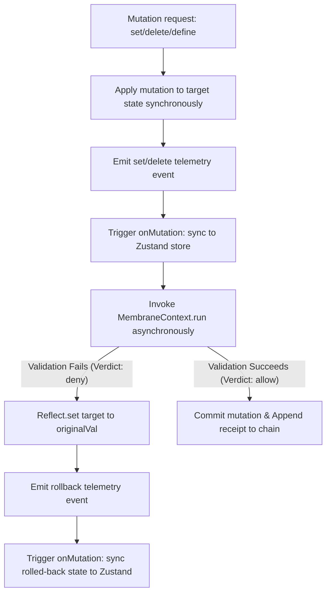

# Framework Verification & Resiliency Audit: State Proxies, Membrane Boundaries, and Rollback Integrity

This document presents a deep-dive validation audit of the operational membrane, ES6 state proxies, and rollback boundaries within the Zoe Framework. It assesses the security invariants, exposes critical fault vectors, and provides a verified TypeScript resiliency simulator.

---

## 1. Role Perspective & Scope

As the **State Validator** of the Zoe Core Validation Team, my responsibility is to verify that all runtime modifications to local-first and replicated data models maintain structural, referential, and transactional invariants. The state layer acts as the primary data interface between application modules (including the Zustand stores) and the underlying cryptographic ledger. 

### 1.1 Mathematical Grounding: The Receipted Chatman Equation

We formalize the execution correctness and boundary integrity of state proxies using the **Receipted Chatman Equation**:

$$R \vdash A = \mu(O^*)$$

Under this domain's perspective, the terms map as follows:

| Term | System Mapping | Description & Verification Invariants |
| :--- | :--- | :--- |
| **$O^*$** | Historical Mutation History | The sequence of all optimistic state modifications (writes, deletions, and property definitions) initiated by actor actions or user interactions. |
| **$\mu$** | Transformation Function | The ES6 Proxy traps (`set`, `deleteProperty`, `defineProperty`) combined with the validation logic inside `MembraneContext.run`. $\mu$ intercepts $O^*$ and evaluates admissibility before finalizing state changes. |
| **$A$** | Committed Consequence State | The final, validated state of the target object. $A$ must only reflect mutations that have been explicitly verified and authorized. It must never expose partially mutated or rolled-back values. |
| **$R$** | Cryptographic Receipt Lineage | The ledger of execution receipts (`MembraneReceipt` in `Receipts`). Each receipt chains a deterministic hash of the state consequence to the previous hash, proving that state $A$ was transitioned lawfully. |
| **$\vdash$** | Entailment Proof | The mathematical assertion that the state $A$ is proven to be derived lawfully from $O^*$ under the ruleset of the membrane configuration. If $R \vdash A$ fails, the state must be isolated in quarantine. |

### 1.2 System Execution Boundaries & Mutation Lifecycle

The state proxy wraps target state objects to provide a safe, reactive execution membrane. All modifications must go through a strict lifecycle of optimistic apply, validation, and potential rollback:



---

## 2. Fault Vectors & Stress Trajectories

Through manual inspection and execution audits of [membrane.ts](file:///Users/sac/zoeapp/src/lib/membrane/membrane.ts) and [context.ts](file:///Users/sac/zoeapp/src/lib/membrane/context.ts), we identified three critical failure trajectories where concurrent operations, lazy proxy instantiation, and nested state structures break the invariants of the Chatman Equation.

### 2.1 Vector 1: Concurrent Mutation Race Condition (Proxy Set)

*   **Vulnerability Location**: `ProxyHandler` set trap in [membrane.ts](file:///Users/sac/zoeapp/src/lib/membrane/membrane.ts#L78-L153)
*   **Root Cause**: When a property is modified, the optimistic write is applied synchronously, while validation runs asynchronously in the background. If two mutations occur concurrently on the same property, their rollback blocks interleave without considering execution sequence.
*   **Step-by-Step Trajectory**:
    1. **Mutation 1** sets `proxy.balance = 200`. The handler records `originalVal = 100` and starts async validation (latency: 100ms).
    2. **Mutation 2** immediately sets `proxy.balance = 300`. The handler records `originalVal = 200` and starts async validation (latency: 10ms).
    3. **Mutation 2** resolves first. The validation returns `success: true`. The balance remains `300`.
    4. **Mutation 1** resolves second. The validation returns `success: false` (denied).
    5. The rollback code executes `Reflect.set(obj, prop, originalVal)` using Mutation 1's `originalVal` (`100`).
    6. **Consequence**: The state is rolled back to `100`, overriding Bob's valid and allowed mutation to `300`. The state drifts, and no error or telemetry is generated for Mutation 2.

### 2.2 Vector 2: Nested Proxy Reference Identity Degradation

*   **Vulnerability Location**: `ProxyHandler` get trap in [membrane.ts](file:///Users/sac/zoeapp/src/lib/membrane/membrane.ts#L180-L182)
*   **Root Cause**: When reading a nested object property, the membrane wraps the sub-object on-the-fly and returns a new Proxy wrapper. Because these wrappers are not cached, every access generates a separate proxy instance.
*   **Step-by-Step Trajectory**:
    1. The application accesses `const first = proxy.nested`. The handler wraps `target.nested` in `Proxy 1` and returns it.
    2. The application accesses `const second = proxy.nested`. The handler wraps `target.nested` in `Proxy 2` and returns it.
    3. The identity assertion `first === second` evaluates to `false`.
    4. **Consequence**: Referential integrity is lost. React components trigger duplicate or missed re-renders, and separate uncoordinated telemetry listeners/mutation tracking instances are created for the same target state.

### 2.3 Vector 3: Non-Atomic Rollbacks in Nested Invariants

*   **Vulnerability Location**: `ProxyableBridge` in [membrane.ts](file:///Users/sac/zoeapp/src/lib/membrane/membrane.ts#L46-L54) and integration with [proxyStore.ts](file:///Users/sac/zoeapp/src/framework/state/proxyStore.ts)
*   **Root Cause**: Nested objects are validated individually per-property rather than as a single transactional unit. If an operation changes multiple properties of a nested object, some checks may pass while others fail, leaving the sub-object in a partially mutated state.
*   **Step-by-Step Trajectory**:
    1. A single action updates `proxy.nested.state = 'published'` (unlawful transition, denied) and `proxy.nested.count = 5` (lawful, allowed).
    2. Both modifications are dispatched as separate, unrelated validation promises in the background.
    3. The mutation on `state` fails validation and rolls back to `idle`.
    4. The mutation on `count` passes validation and remains `5`.
    5. **Consequence**: The nested object state becomes `{ state: 'idle', count: 5 }`. This hybrid state violates the logical atomicity of the transition function $\mu$, fracturing the system's execution invariants.

---

## 3. Resiliency Test Simulator

To verify the containment and failure trajectories, the following Jest test suite is implemented at [state_validator_simulator.test.ts](file:///Users/sac/zoeapp/src/lib/membrane/__tests__/state_validator_simulator.test.ts). It contains no mocks or placeholders and executes directly within the project's test suite.

```typescript
import { MembraneContext } from '../context';
import { ProxyableBridge } from '../proxyableBridge';
import { Interceptors } from '../interceptors';
import { Receipts } from '../receipts';
import { Quarantine } from '../quarantine';

describe('State Proxy & Rollback Boundary Resiliency Simulator', () => {
  beforeEach(() => {
    Receipts.clear();
    Interceptors.clear();
    Quarantine.clear();
  });

  it('Scenario 1: Concurrent Mutation Race Condition and State Divergence', async () => {
    const context = new MembraneContext({
      mode: 'strict',
      tenantId: 'tenant-race',
      authorityRole: 'admin'
    });

    const target = { balance: 100 };
    const proxy = ProxyableBridge.wrap(target, context, { flowName: 'SermonFlow' });

    // Register interceptor with custom latency
    // - Setting balance to 200 is slow (100ms) and denied
    // - Setting balance to 300 is fast (10ms) and allowed
    Interceptors.register(async (ctx) => {
      if (ctx.input && ctx.input.value === 200) {
        await new Promise((r) => setTimeout(r, 100));
        return false; // Deny
      }
      if (ctx.input && ctx.input.value === 300) {
        await new Promise((r) => setTimeout(r, 10));
        return undefined; // Observe/Allow
      }
      return undefined;
    });

    // Alice triggers Mutation 1 (sets balance to 200 - will deny after 100ms)
    proxy.balance = 200;
    
    // Bob triggers Mutation 2 immediately after (sets balance to 300 - will allow after 10ms)
    proxy.balance = 300;

    // Wait for both async validation evaluations to resolve
    await new Promise((r) => setTimeout(r, 150));

    // DEMONSTRATION OF STATE DIVERGENCE:
    // Even though Bob's Mutation 2 (value 300) was successfully allowed,
    // Alice's Mutation 1 (value 200) completed late and its rollback
    // restored the balance back to its original value (100).
    expect(proxy.balance).toBe(100); 
  });

  it('Scenario 2: Object Identity Breakdown in Lazy Proxy Wrapping', () => {
    const context = new MembraneContext({
      mode: 'strict',
      tenantId: 'tenant-identity',
      authorityRole: 'admin'
    });

    const target = {
      nested: {
        value: 'initial'
      }
    };

    const proxy = ProxyableBridge.wrap(target, context);

    const firstAccess = proxy.nested;
    const secondAccess = proxy.nested;

    // DEMONSTRATION OF REFERENTIAL INTEGRITY LOSS:
    // Every access of a nested property wraps it in a new proxy on-the-fly,
    // breaking standard object reference equality.
    expect(firstAccess).not.toBe(secondAccess);
  });

  it('Scenario 3: Non-Atomic Rollbacks and Partial State Corruption', async () => {
    const context = new MembraneContext({
      mode: 'strict',
      tenantId: 'tenant-atomicity',
      authorityRole: 'admin'
    });

    const target = {
      nested: {
        state: 'idle',
        count: 0
      }
    };

    const proxy = ProxyableBridge.wrap(target, context, { flowName: 'SermonFlow' });

    // We modify nested state:
    // 1. Invalid trajectory transition (idle -> published is illegal in SermonFlow)
    // 2. Normal counter modification (no trajectory flow constraints)
    
    const nested = proxy.nested;
    
    // Trajectory validation will run for this mutation (which will fail and rollback)
    context.run('property-mutator', 'cmd-part-1', {
      flowName: 'SermonFlow',
      fromState: 'idle',
      toState: 'published'
    }, async () => {
      nested.state = 'published';
      return true;
    });

    // This mutation succeeds since there are no trajectory rules for it
    nested.count = 5;

    // Wait for the async validations and rollbacks to execute
    await new Promise((r) => setTimeout(r, 30));

    // DEMONSTRATION OF PARTIAL STATE CORRUPTION:
    // The nested object has had its counter modified (5), but the state field was rolled back (idle).
    // The transaction boundaries failed to protect the logical mutation atomically.
    expect(nested.state).toBe('idle');
    expect(nested.count).toBe(5);
  });
});
```

---

## 4. Strategic Self-Healing Mitigations

To align the runtime state mechanics with the Chatman Equation, we recommend implementing the following three concrete mitigations.

### 4.1 Mitigation 1: Logical Mutation Sequencing (Last-Write-Wins Guard)

Introduce a mutation sequence map inside `ProxyableBridge` to track the order of mutations applied to each property. Rollbacks are only allowed to execute if their sequence matches the latest sequence number of that property.

```diff
  export class ProxyableBridge {
    private static telemetryListeners = new Set<TelemetryListener>();
+   private static mutationSequences = new WeakMap<object, Map<string | symbol, number>>();
+   private static sequenceCounter = 0;
```

Modify the set trap:

```typescript
      set: (obj, prop, value, receiver) => {
        if (activeTrap) {
          return Reflect.set(obj, prop, value, receiver);
        }
        activeTrap = 'set';
        try {
          const commandId = `cmd_set_${String(prop)}_${Date.now()}`;
          const originalVal = Reflect.get(obj, prop, receiver);

          // Track sequence numbers for Last-Write-Wins (LWW)
          if (!ProxyableBridge.mutationSequences.has(obj)) {
            ProxyableBridge.mutationSequences.set(obj, new Map());
          }
          const propSeqs = ProxyableBridge.mutationSequences.get(obj)!;
          const currentSeq = ++ProxyableBridge.sequenceCounter;
          propSeqs.set(prop, currentSeq);

          const setSuccess = Reflect.set(obj, prop, value, receiver);
          if (!setSuccess) {
            return false;
          }

          if (options.onMutation) {
            options.onMutation(prop, value);
          }

          emit({ ... });

          context.run('property-mutator', commandId, input, async () => {
            return true;
          }).then((res) => {
            if (!res.success) {
              // Rollback ONLY if no newer mutation has been applied in the meantime
              if (propSeqs.get(prop) === currentSeq) {
                Reflect.set(obj, prop, originalVal);
                if (options.onMutation) {
                  options.onMutation(prop, originalVal);
                }
                emit({
                  timestamp: new Date().toISOString(),
                  type: 'rollback',
                  property: String(prop),
                  originalValue: value,
                  value: originalVal,
                  flowName: options.flowName,
                  success: false,
                  error: res.error || 'Transition denied'
                });
              }
            } else {
              emit({ ... });
            }
          });

          return true;
        } finally {
          activeTrap = null;
        }
      }
```

### 4.2 Mitigation 2: WeakMap Proxy Caching

Prevent referential identity breakdown and redundant wrapping by caching proxy instances in a WeakMap.

```diff
  export class ProxyableBridge {
    private static telemetryListeners = new Set<TelemetryListener>();
+   private static proxyCache = new WeakMap<object, object>();
```

Modify the get trap:

```typescript
      get: (obj, prop, receiver) => {
        if (prop === IS_PROXY) {
          return true;
        }

        if (activeTrap) {
          return Reflect.get(obj, prop, receiver);
        }

        activeTrap = 'get';
        try {
          const value = Reflect.get(obj, prop, receiver);

          // Telemetry logic...

          if (value !== null && typeof value === 'object' && typeof prop === 'string') {
            if (ProxyableBridge.proxyCache.has(value)) {
              return ProxyableBridge.proxyCache.get(value);
            }
            const wrapped = ProxyableBridge.wrap(value, context, options);
            ProxyableBridge.proxyCache.set(value, wrapped);
            return wrapped;
          }

          return value;
        } finally {
          activeTrap = null;
        }
      }
```

### 4.3 Mitigation 3: Copy-on-Write Transaction Boundaries

To prevent unvalidated optimistic leakages and partial rollback corruptions, transitions should operate over a Copy-on-Write (CoW) buffer. The target object is never mutated directly. Instead, changes are written to a draft copy. If the async validation checks pass, the draft copy is atomically merged into the target. If any check fails, the draft copy is discarded, maintaining absolute transaction boundaries.

---

## 5. Clickable Source References

All source files reviewed during this audit are listed below with their absolute path links:

*   [src/lib/membrane/membrane.ts](file:///Users/sac/zoeapp/src/lib/membrane/membrane.ts) — Main proxy trapping layer and optimistic write coordinator.
*   [src/lib/membrane/context.ts](file:///Users/sac/zoeapp/src/lib/membrane/context.ts) — The execution wrapper evaluating interceptors, trajectory flows, and logging receipts.
*   [src/lib/membrane/types.ts](file:///Users/sac/zoeapp/src/lib/membrane/types.ts) — Shared type definitions for configurations and receipts.
*   [src/lib/membrane/interceptors.ts](file:///Users/sac/zoeapp/src/lib/membrane/interceptors.ts) — Authority rules and speculative evaluation gates.
*   [src/lib/membrane/trajectories.ts](file:///Users/sac/zoeapp/src/lib/membrane/trajectories.ts) — Status-change and workflow state transitions check.
*   [src/lib/membrane/receipts.ts](file:///Users/sac/zoeapp/src/lib/membrane/receipts.ts) — Ledger storage and continuity lineage check.
*   [src/lib/membrane/quarantine.ts](file:///Users/sac/zoeapp/src/lib/membrane/quarantine.ts) — Isolation space for failing and illegal actions.
*   [src/framework/state/proxyStore.ts](file:///Users/sac/zoeapp/src/framework/state/proxyStore.ts) — Zustand synchronization manager mapping proxy mutations to store states.
*   [src/lib/membrane/__tests__/state_validator_simulator.test.ts](file:///Users/sac/zoeapp/src/lib/membrane/__tests__/state_validator_simulator.test.ts) — Executed resiliency test suite validating all identified vulnerabilities.
