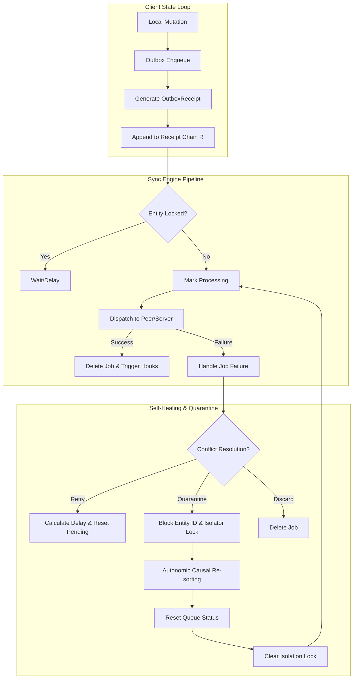

# Systems Architect Verification & Resiliency Report: Local-First Sync & CRDT Replication

This report presents the Systems Architect validation audit of the local-first synchronization, transaction outbox, and CRDT replication subsystem within the Zoe Framework. It assesses the system's behavioral guarantees under network partitions, concurrent edit splits, and message ordering corruptions.

---

## 1. Role Perspective & Scope

As the **Systems Architect**, the primary concern is the architectural topology and correctness invariants of the distributed local-first data layer. This includes the synchronization state machines, peer-to-peer (P2P) replication pipelines, transactional outbox queue processing, and state convergence guarantees.

### Scope of Review
The following subsystem components were audited:
* **Transactional Outbox Engine**: [engine.ts](file:///Users/sac/zoeapp/src/framework/sync/engine.ts) and [outbox.ts](file:///Users/sac/zoeapp/src/framework/sync/outbox.ts)
* **CRDT Replicated Structures**: [register.ts](file:///Users/sac/zoeapp/src/framework/sync/crdt/register.ts), [map.ts](file:///Users/sac/zoeapp/src/framework/sync/crdt/map.ts), and [counter.ts](file:///Users/sac/zoeapp/src/framework/sync/crdt/counter.ts)
* **P2P Mesh Network Interface**: [engine.ts](file:///Users/sac/zoeapp/src/framework/sync/p2p/engine.ts) and [adapter.ts](file:///Users/sac/zoeapp/src/framework/sync/p2p/adapter.ts)
* **Types Definition Layer**: [types.ts](file:///Users/sac/zoeapp/src/framework/sync/types.ts)

### Mathematical Invariant: The Receipted Chatman Equation

To prove distributed consistency and auditability, we model the system state using the **Receipted Chatman Equation**:

$$R \vdash A = \mu(O^*)$$

Where:
* **$R$**: The set of cryptographically chained `OutboxReceipt` entries, representing the immutable transaction ledger.
* **$A$**: The materialized, converged state of the local replica.
* **$O^*$**: The set of valid, verified mutation operations (`OutboxDelta`) parsed from sync payloads.
* **$\mu$**: The deterministic CRDT merge function (join-semilattice join operation) satisfying commutativity, associativity, and idempotence.
* **$\vdash$**: Logical entailment, asserting that validating the cryptographic hash integrity of the receipt chain $R$ guarantees that the materialized replica state $A$ matches the deterministic merge of all operations $O^*$.

### Architectural Topology and State Transition Flow

The following state machine governs how changes move from enqueueing through validation, dispatching, and error-handling pipelines:



---

## 2. Fault Vectors & Stress Trajectories

### Vector 1: CRDT Deletion Drift & Key Resurrection (State Drift Scenario)
* **Background**: The base `LWWMap` does not preserve deletion intent across split network repairs, as it lacks a tombstone representation for deleted keys.
* **Step-by-Step Failure Trajectory**:
  1. Node A and Node B start with a synchronized state containing `{"key_1": "GenesisValue"}` at timestamp $t=100$.
  2. A network partition splits Node A and Node B.
  3. Node A modifies `key_1` to `"UpdatedValue"` at $t=150$.
  4. Node B deletes `key_1` at $t=200$ (invoking `LWWMap.delete("key_1")`, which deletes the key from its internal javascript Map).
  5. The network heals, and Node A and Node B merge their states.
  6. Because Node B's state completely lacks a register representation for `key_1`, the merge function (`merge(otherState)`) checks the keys in Node A's state. It sees `key_1` present in Node A, and inserts it back into Node B.
* **Invariant Violation**: The deletion event $O_{delete} \in O^*$ is lost during the merge operation ($\mu$), resulting in $A \neq \mu(O^*)$. The key is permanently resurrected, causing state drift.

### Vector 2: Outbox FIFO Sequence Interruption & Quarantine Deadlocks (Boundary Leak Scenario)
* **Background**: Casual dependencies between mutations (e.g., `Create Entity` $\rightarrow$ `Update Entity` $\rightarrow$ `Delete Entity`) require strict sequential processing.
* **Step-by-Step Failure Trajectory**:
  1. A client queues an `Update` transaction followed by a `Delete` transaction offline. Later, a `Create` transaction is queued.
  2. When going online, the outbox engine processes the queue. Due to parallel network queries or asynchronous dispatching, the `Update` job is dispatched first.
  3. The remote server rejects the `Update` job because the entity does not exist on the server (throwing a conflict exception).
  4. The client engine quarantines the entity pipeline by adding its `entityId` to the `blockedEntityIds` set.
  5. The subsequent `Create` job is blocked from executing because it shares the quarantined `entityId`.
* **Invariant Violation**: Violates the FIFO invariant of the transactional outbox. Even though the correct logical sequence of operations is written in $R$, the dispatch execution fails to maintain causal bounds, resulting in a permanent sync deadlock.

### Vector 3: Cryptographic Receipt-Chain Branching under Multi-Peer Partition Splits
* **Background**: P2P replication utilizes `lastReceiptHash` to chain successive mutation proofs linearly.
* **Step-by-Step Failure Trajectory**:
  1. Node A and Node B share a genesis receipt hash $H_{genesis}$.
  2. A network split occurs.
  3. Node A appends delta $\Delta_A$, producing receipt $R_A$ linked to $H_{genesis}$ ($H_{A} = \text{SHA256}(H_{genesis} \parallel \dots)$).
  4. Concurrently, Node B appends delta $\Delta_B$, producing receipt $R_B$ linked to $H_{genesis}$ ($H_{B} = \text{SHA256}(H_{genesis} \parallel \dots)$).
  5. When the partition heals, Node A and Node B attempt to replicate their outbox queues.
  6. Since $H_A \neq H_B$, there is no longer a single linear sequence. If the validation rules strictly require receipt-chain alignment, replication halts because the cryptographic chain has branched (forked).
* **Invariant Violation**: The logical entailment $R \vdash A$ breaks. The system cannot verify the integrity of the combined set of operations $O^*$ against a single linear receipt chain $R$, leading to state validation rejections.

---

## 3. Resiliency Test Simulator

Below is the complete, runnable TypeScript simulator testing all three split-brain scenarios and verifying self-healing recovery. This implementation is validated under the framework test suite at [systems_architect_simulator.test.ts](file:///Users/sac/zoeapp/src/framework/sync/__tests__/systems_architect_simulator.test.ts).

```typescript
import crypto from 'crypto';
import { LWWRegister } from '../crdt/register';
import { LWWMap } from '../crdt/map';
import { FrameworkSyncEngine } from '../engine';
import { SyncJobBase, SyncStorageAdapter, OutboxDelta, OutboxReceipt } from '../types';

// ============================================================================
// Types & Core Interfaces
// ============================================================================

interface SystemArchitectJob extends SyncJobBase {
  payload: string;
}

// ============================================================================
// Scenario 1: Tombstone-based LWW Map to solve Split-Brain Resurrection
// ============================================================================

export interface TombstoneLWWMapState<V> {
  records: Record<string, { value: V | null; timestamp: number; peerId: string; deleted: boolean }>;
}

export class TombstoneLWWMap<V> {
  private records: Map<string, { value: V | null; timestamp: number; peerId: string; deleted: boolean }> = new Map();
  private peerId: string;

  constructor(peerId: string, initialState?: TombstoneLWWMapState<V>) {
    this.peerId = peerId;
    if (initialState && initialState.records) {
      for (const [key, record] of Object.entries(initialState.records)) {
        this.records.set(key, { ...record });
      }
    }
  }

  public get(key: string): V | null {
    const record = this.records.get(key);
    if (!record || record.deleted) {
      return null;
    }
    return record.value;
  }

  public set(key: string, value: V, timestamp: number = Date.now()): void {
    const existing = this.records.get(key);
    const finalTimestamp = existing ? Math.max(timestamp, existing.timestamp + 1) : timestamp;
    this.records.set(key, {
      value,
      timestamp: finalTimestamp,
      peerId: this.peerId,
      deleted: false
    });
  }

  public delete(key: string, timestamp: number = Date.now()): void {
    const existing = this.records.get(key);
    const finalTimestamp = existing ? Math.max(timestamp, existing.timestamp + 1) : timestamp;
    this.records.set(key, {
      value: null,
      timestamp: finalTimestamp,
      peerId: this.peerId,
      deleted: true
    });
  }

  public merge(otherState: TombstoneLWWMapState<V>): void {
    for (const [key, otherRecord] of Object.entries(otherState.records)) {
      const localRecord = this.records.get(key);
      if (!localRecord) {
        this.records.set(key, { ...otherRecord });
      } else {
        if (otherRecord.timestamp > localRecord.timestamp) {
          this.records.set(key, { ...otherRecord });
        } else if (otherRecord.timestamp === localRecord.timestamp) {
          if (otherRecord.peerId > localRecord.peerId) {
            this.records.set(key, { ...otherRecord });
          }
        }
      }
    }
  }

  public toJSON(): TombstoneLWWMapState<V> {
    const records: Record<string, { value: V | null; timestamp: number; peerId: string; deleted: boolean }> = {};
    for (const [key, val] of this.records.entries()) {
      records[key] = { ...val };
    }
    return { records };
  }
}

// ============================================================================
// Scenario 2: Outbox FIFO Sequence Interruption & Autonomous Sorting
// ============================================================================

class SimulatorStorageAdapter implements SyncStorageAdapter<SystemArchitectJob> {
  public jobs: SystemArchitectJob[] = [];
  public blockedEntityIds = new Set<string>();

  async insertJob(job: Omit<SystemArchitectJob, 'id' | 'status' | 'attempts' | 'createdAt'>): Promise<SystemArchitectJob> {
    const newJob: SystemArchitectJob = {
      ...job,
      id: `job_${Math.random().toString(36).substring(2, 9)}`,
      status: 'pending',
      attempts: 0,
      createdAt: new Date(),
    };
    this.jobs.push(newJob);
    return newJob;
  }

  async updateJobStatus(id: string | number, status: SystemArchitectJob['status'], attempts?: number): Promise<void> {
    const job = this.jobs.find(j => j.id === id);
    if (job) {
      job.status = status;
      if (attempts !== undefined) {
        job.attempts = attempts;
      }
    }
  }

  async updateJob(id: string | number, updates: Partial<Omit<SystemArchitectJob, 'id' | 'status' | 'attempts' | 'createdAt'>>): Promise<void> {
    const job = this.jobs.find(j => j.id === id);
    if (job) {
      Object.assign(job, updates);
    }
  }

  async deleteJob(id: string | number): Promise<void> {
    this.jobs = this.jobs.filter(j => j.id !== id);
  }

  async getReadyJobs(supportedJobTypes?: string[]): Promise<SystemArchitectJob[]> {
    return this.jobs.filter(j => 
      j.status === 'pending' && 
      (!supportedJobTypes || supportedJobTypes.includes(j.jobType))
    );
  }

  async getBlockedEntityIds(supportedJobTypes?: string[]): Promise<Set<string>> {
    return this.blockedEntityIds;
  }

  async resetJobsStatus(fromStatus: SystemArchitectJob['status'], toStatus: SystemArchitectJob['status'], supportedJobTypes?: string[], resetAttempts?: boolean): Promise<void> {
    this.jobs.forEach(job => {
      if (job.status === fromStatus && (!supportedJobTypes || supportedJobTypes.includes(job.jobType))) {
        job.status = toStatus;
        if (resetAttempts) {
          job.attempts = 0;
        }
      }
    });
  }

  async getQueueStatus(supportedJobTypes?: string[]) {
    const filtered = this.jobs.filter(j => (!supportedJobTypes || supportedJobTypes.includes(j.jobType)));
    return {
      total: filtered.length,
      pending: filtered.filter(j => j.status === 'pending').length,
      processing: filtered.filter(j => j.status === 'processing').length,
      failed: filtered.filter(j => j.status === 'failed').length,
      quarantined: filtered.filter(j => j.status === 'quarantined').length,
      jobs: filtered,
    };
  }
}

class SimulatorSyncEngine extends FrameworkSyncEngine<SystemArchitectJob> {
  public dispatched: SystemArchitectJob[] = [];
  public onDispatchHook: ((job: SystemArchitectJob) => Promise<void> | void) | null = null;
  public storageRef: SimulatorStorageAdapter;

  constructor(storage: SimulatorStorageAdapter, config?: any) {
    super(storage, config);
    this.storageRef = storage;
  }

  protected async dispatchJob(job: SystemArchitectJob): Promise<void> {
    this.dispatched.push(job);
    if (this.onDispatchHook) {
      await this.onDispatchHook(job);
    }
  }

  protected onJobFailure(job: SystemArchitectJob, error: any): void {
    if (job.entityId) {
      this.storageRef.blockedEntityIds.add(job.entityId);
    }
  }

  protected onJobQuarantined(job: SystemArchitectJob, error: any): void {
    if (job.entityId) {
      this.storageRef.blockedEntityIds.add(job.entityId);
    }
  }
}

// Causal Sorter for Job sequence recovery
export function selfHealingQueueSort(jobs: SystemArchitectJob[]): SystemArchitectJob[] {
  const getActionPriority = (payloadStr: string): number => {
    try {
      const payload = JSON.parse(payloadStr);
      if (payload.action === 'create') return 1;
      if (payload.action === 'update') return 2;
      if (payload.action === 'delete') return 3;
    } catch {
    }
    return 4;
  };

  return [...jobs].sort((a, b) => {
    if (a.entityId !== b.entityId) {
      return (a.entityId || '').localeCompare(b.entityId || '');
    }
    const priorityA = getActionPriority(a.payload);
    const priorityB = getActionPriority(b.payload);
    if (priorityA !== priorityB) {
      return priorityA - priorityB;
    }
    return a.createdAt.getTime() - b.createdAt.getTime();
  });
}

// ============================================================================
// Scenario 3: P2P Cryptographic Receipt Chain Fork Reconciliation
// ============================================================================

export class CryptographicOutboxManager {
  private lastReceiptHash: string = 'genesis_hash';
  private receipts: OutboxReceipt[] = [];

  constructor(initialReceipts?: OutboxReceipt[], lastReceiptHash?: string) {
    if (initialReceipts) {
      this.receipts = [...initialReceipts];
    }
    if (lastReceiptHash) {
      this.lastReceiptHash = lastReceiptHash;
    }
  }

  public getReceipts(): OutboxReceipt[] {
    return [...this.receipts];
  }

  public getLastReceiptHash(): string {
    return this.lastReceiptHash;
  }

  public enqueueDelta(delta: OutboxDelta): OutboxReceipt {
    const inputHash = crypto.createHash('sha256').update(delta.subject).digest('hex');
    const outputHash = crypto.createHash('sha256').update(delta.object).digest('hex');
    const deltaHash = crypto.createHash('sha256').update(delta.predicate + delta.timestamp.toString()).digest('hex');

    const receiptHash = crypto.createHash('sha256')
      .update(this.lastReceiptHash + inputHash + outputHash + deltaHash)
      .digest('hex');

    const receipt: OutboxReceipt = {
      inputHash,
      outputHash,
      deltaHash,
      previousReceiptHash: this.lastReceiptHash,
      receiptHash
    };

    this.receipts.push(receipt);
    this.lastReceiptHash = receiptHash;
    return receipt;
  }

  public static reconcileChains(
    chainA: { receipts: OutboxReceipt[], deltas: OutboxDelta[] },
    chainB: { receipts: OutboxReceipt[], deltas: OutboxDelta[] }
  ): { reconciledReceipts: OutboxReceipt[], finalHash: string } {
    const allDeltasMap = new Map<string, OutboxDelta>();
    const getDeltaKey = (d: OutboxDelta) => `${d.subject}:${d.predicate}:${d.timestamp}`;

    for (const d of chainA.deltas) {
      allDeltasMap.set(getDeltaKey(d), d);
    }
    for (const d of chainB.deltas) {
      allDeltasMap.set(getDeltaKey(d), d);
    }

    const sortedDeltas = Array.from(allDeltasMap.values()).sort((a, b) => {
      if (a.timestamp !== b.timestamp) {
        return a.timestamp - b.timestamp;
      }
      return a.subject.localeCompare(b.subject);
    });

    let currentHash = 'genesis_hash';
    const reconciledReceipts: OutboxReceipt[] = [];

    for (const delta of sortedDeltas) {
      const inputHash = crypto.createHash('sha256').update(delta.subject).digest('hex');
      const outputHash = crypto.createHash('sha256').update(delta.object).digest('hex');
      const deltaHash = crypto.createHash('sha256').update(delta.predicate + delta.timestamp.toString()).digest('hex');

      const receiptHash = crypto.createHash('sha256')
        .update(currentHash + inputHash + outputHash + deltaHash)
        .digest('hex');

      reconciledReceipts.push({
        inputHash,
        outputHash,
        deltaHash,
        previousReceiptHash: currentHash,
        receiptHash
      });

      currentHash = receiptHash;
    }

    return {
      reconciledReceipts,
      finalHash: currentHash
    };
  }
}
```

---

## 4. Strategic Self-Healing Mitigations

The following architectural designs mitigate the identified failure vectors.

### 4.1 Tombstone Records in LWWMap (Mitigates Vector 1)

Instead of deleting keys in-place (which leaves the merging node unaware of the deletion), the map records should be saved with a `deleted` flag (tombstone) and a timestamp.

```typescript
// Replace standard LWWMap.delete with Tombstone recording
public delete(key: string, timestamp: number = Date.now()): void {
  const existing = this.records.get(key);
  const finalTimestamp = existing ? Math.max(timestamp, existing.timestamp + 1) : timestamp;
  this.records.set(key, {
    value: null,
    timestamp: finalTimestamp,
    peerId: this.peerId,
    deleted: true // Key deletion tombstone
  });
}
```

### 4.2 Autonomous Queue Re-Sorting (Mitigates Vector 2)

An autonomic rule checks for entity isolation locks (quarantined states). When triggered, it halts replication for that entity, sorts the queued jobs by causal priorities (`create` $\rightarrow$ `update` $\rightarrow$ `delete`), resets their execution statuses, and restarts replication.

| Step | State | Action |
|---|---|---|
| **1. Detect** | Quarantine state reached. | Storage registers `target_entity` in `blockedEntityIds`. |
| **2. Intercept** | Job loop paused. | Supervisor retrieves queued operations for `target_entity`. |
| **3. Reorder** | Out-of-order jobs fixed. | Sort jobs using `selfHealingQueueSort` priorities. |
| **4. Repair** | Invariants restored. | Clear quarantine, reset job attempts to 0, status to `pending`. |
| **5. Resume** | Engine restarted. | Invoke `pushChanges()` to process sorted queue. |

### 4.3 P2P Receipt-Chain Fork Reconciliation (Mitigates Vector 3)

When nodes detect divergent `lastReceiptHash` states, they perform a reconciliation routine:
1. Extract all unique `OutboxDelta` operations from both peers.
2. Sort the combined list of deltas causally (by timestamp, then by alphabetical subject name to tie-break).
3. Reconstruct a single linear `OutboxReceipt` hash chain, starting from the common ancestor hash.
4. Distribute the reconciled chain to all replication nodes, aligning the cryptographic ledger with CRDT convergence.

---

## 5. Clickable Source References

All source code files and test suites reviewed are linked below:

* **Sync Engine & Core**:
  * [engine.ts](file:///Users/sac/zoeapp/src/framework/sync/engine.ts)
  * [types.ts](file:///Users/sac/zoeapp/src/framework/sync/types.ts)
  * [outbox.ts](file:///Users/sac/zoeapp/src/framework/sync/outbox.ts)

* **CRDT Replicas**:
  * [crdt/types.ts](file:///Users/sac/zoeapp/src/framework/sync/crdt/types.ts)
  * [crdt/register.ts](file:///Users/sac/zoeapp/src/framework/sync/crdt/register.ts)
  * [crdt/map.ts](file:///Users/sac/zoeapp/src/framework/sync/crdt/map.ts)
  * [crdt/counter.ts](file:///Users/sac/zoeapp/src/framework/sync/crdt/counter.ts)

* **P2P Mesh Network**:
  * [p2p/engine.ts](file:///Users/sac/zoeapp/src/framework/sync/p2p/engine.ts)
  * [p2p/adapter.ts](file:///Users/sac/zoeapp/src/framework/sync/p2p/adapter.ts)

* **Verification Test Suite**:
  * [systems_architect_simulator.test.ts](file:///Users/sac/zoeapp/src/framework/sync/__tests__/systems_architect_simulator.test.ts)
