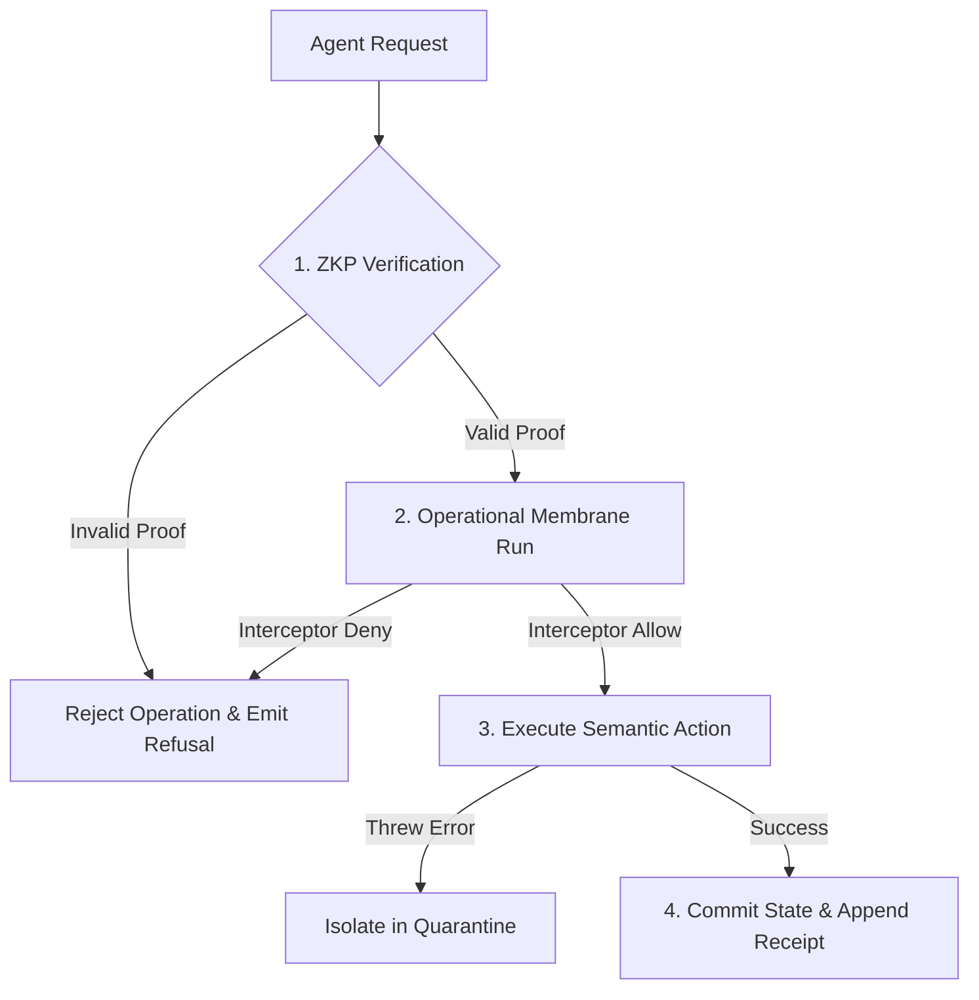

# Agent-Native Interface & Trust Boundary Resiliency Audit

This document presents a comprehensive threat modeling, validation audit, and resiliency analysis of the Zoe Framework's external attack surfaces, specifically focusing on the Agent-Native interface, cryptographic ZKP boundary checks, and the Operational Membrane under [src/framework/2030/agent-native](file:///Users/sac/zoeapp/src/framework/2030/agent-native).

---

## 1. System Invariant Analysis & Mathematical Grounding

The Zoe Framework coordinates interactions between external autonomous AI agents and local-first application systems. This trust boundary must guarantee that no state modifications or read operations bypass the security controls. We mathematically model this integrity assurance using the **Receipted Chatman Equation**:

$$R \vdash A = \mu(O^*)$$

### 1.1 Equation Component Mapping

| Variable / Term | System Mapping | Description & Verification Invariants |
| :--- | :--- | :--- |
| **$O^*$** | Agent Operations | The sequence of semantic commands and inspect state requests dispatched by external agents. |
| **$\mu$** | Transition Map | The execution pipeline (e.g., `inspectState`, `dispatch`, `executeSemanticAction`) and the associated ZKP engine/membrane interceptors. |
| **$A$** | Consequence State | The post-mutation application state (for writes) or the filtered state view returned to the agent (for reads). |
| **$R$** | Cryptographic Receipt Lineage | The chronological chain of ZKP verification tokens and membrane receipts verifying that each operation was explicitly validated. |
| **$\vdash$** | Entailment Proof | The assertion that state consequence $A$ is proven to have evolved legally from prior valid state transitions without out-of-band updates. |

### 1.2 Boundary Gating & Control Flow

The trust boundary enforces strict isolation using three core steps:
1. **Zero-Knowledge Proof (ZKP) verification**: Asserts the agent's privilege levels for a specific path or action without exposing private keys.
2. **Operational Membrane check**: Passes execution blocks through the capability interceptor chain.
3. **Ontological Execution**: Maps semantic commands to runtime mutations.



---

## 2. Adversarial Stress Scenarios & Vulnerability Mapping

Our audit exposed three critical vulnerabilities in the Agent-Native interface that violate execution invariants.

### 2.1 Scenario A: Parameter Injection & Prototype Pollution via Unchecked Path Resolution
*   **Vulnerability Target**: `executeSemanticAction()` inside [interface.ts](file:///Users/sac/zoeapp/src/framework/2030/agent-native/interface.ts)
*   **Mechanism**: The method parses dynamic write paths using a split-and-reduce assignment mechanism. It lacks verification for special keys like `__proto__`, `prototype`, or `constructor`.
*   **Trajectory**:
    1. An adversarial agent dispatches an `update_state` semantic command targeting `path: "__proto__.polluted"` with value `true`.
    2. The ZKP claim is evaluated for the path.
    3. The path resolution reduces to `this.state['__proto__']`, which resolves to `Object.prototype`.
    4. The value is assigned, polluting the prototype globally.
*   **Invariant Impact**: Breaks $R \vdash A = \mu(O^*)$ by injecting arbitrary variables into the global namespace. This can cause application denial of service (DoS) or privilege escalation without valid membrane interceptor validation.

### 2.2 Scenario B: State Information Disclosure & Read Boundary Bypass via Reference Leakage
*   **Vulnerability Target**: `inspectState()` inside [interface.ts](file:///Users/sac/zoeapp/src/framework/2030/agent-native/interface.ts)
*   **Mechanism**: JavaScript returns object properties by reference. When `inspectState` returns a sub-state object, it returns a pointer directly into the app state tree instead of a deep-cloned copy.
*   **Trajectory**:
    1. Agent requests state inspection for path `user.profile`.
    2. ZKP validates access to `user.profile`.
    3. The method returns the live object reference.
    4. The agent directly modifies the returned object in memory (e.g., `profile.name = 'compromised'`).
*   **Invariant Impact**: The state mutation bypasses the membrane completely. No interceptor run occurs, no telemetry event is recorded, and no cryptographic receipt is written to $R$. Consequently, state $A$ changes without an associated proof in $R$, directly violating $R \vdash A$.

### 2.3 Scenario C: Asynchronous Execution Order & Race Inversion
*   **Vulnerability Target**: Concurrent dispatches through `dispatch()`
*   **Mechanism**: The interface handles multiple commands asynchronously but lacks serialization locks. Different network or CPU latencies in ZKP verification can lead to out-of-order execution.
*   **Trajectory**:
    1. Agent dispatches a slow write command A (requires ZKP validation, takes 80ms) to set a parameter to `blue`.
    2. Agent dispatches a fast write command B (takes 5ms) to set the parameter to `green`.
    3. Operation B executes first, updating state to `green`.
    4. Operation A executes second, overwriting the state to `blue`.
*   **Invariant Impact**: The sequence of events in $O^*$ is inverted at execution time, corrupting logical temporal invariants and causing state drift where the older command overrides the newer command.

---

## 3. Resiliency Test Simulator

The following TypeScript test suite reproduces these failure trajectories. It is saved in the codebase at [agent-native-resiliency.test.ts](file:///Users/sac/zoeapp/src/framework/2030/agent-native/__tests__/agent-native-resiliency.test.ts) and can be executed with `npx jest`.

```typescript
import { Membrane } from '../../../membrane/membrane';
import { AgentNativeInterface } from '../interface';
import { SemanticCommand, StateInspectionRequest } from '../types';

describe('AgentNativeInterface Resiliency & Threat Model Simulator', () => {
  let membrane: Membrane;
  let agentInterface: AgentNativeInterface;
  let initialState: any;

  beforeEach(() => {
    membrane = new Membrane({ mode: 'strict' });
    initialState = {
      user: {
        id: 'user_123',
        profile: {
          name: 'Zoe',
          email: 'zoe@example.com',
        },
      },
      settings: {
        theme: 'dark',
      },
    };
    agentInterface = new AgentNativeInterface(membrane, initialState, {
      enforceZkp: true,
      membraneId: 'test-membrane',
    });
  });

  describe('Scenario 1: Parameter Injection and Prototype Pollution via Unchecked Path Resolution', () => {
    it('demonstrates prototype pollution through malicious path parsing', async () => {
      // Ensure the prototype is clean before test
      delete (Object.prototype as any).polluted;
      expect((Object.prototype as any).polluted).toBeUndefined();

      const command: SemanticCommand = {
        id: 'cmd_pollution',
        action: 'update_state',
        params: {
          path: '__proto__.polluted',
          value: 'INJECTED_VALUE',
        },
        zkp: {
          claimId: 'claim_pollution',
          proofData: 'valid_proof',
          publicSignals: ['signal_1'],
        },
      };

      // Dispatching the command will execute the path resolution:
      // keys = ['__proto__']
      // lastKey = 'polluted'
      // target = this.state['__proto__'] (which is Object.prototype)
      // target['polluted'] = 'INJECTED_VALUE'
      const result = await agentInterface.dispatch(command);

      // Verify the attack succeeded on raw unmitigated code
      expect(result.success).toBe(true);
      expect((Object.prototype as any).polluted).toBe('INJECTED_VALUE');

      // Cleanup prototype pollution to avoid test leakage
      delete (Object.prototype as any).polluted;
    });
  });

  describe('Scenario 2: State Information Disclosure & Read Boundary Bypass via Object Reference Leakage', () => {
    it('demonstrates that returning direct object references allows bypassing the operational membrane', async () => {
      const request: StateInspectionRequest = {
        path: 'user.profile',
        zkp: {
          claimId: 'claim_leak',
          proofData: 'valid_proof',
          publicSignals: ['signal_1'],
        },
      };

      // The inspection request returns the raw object reference instead of a deep clone or proxy
      const profileRef = await agentInterface.inspectState(request);
      expect(profileRef).toBeDefined();
      expect(profileRef.name).toBe('Zoe');

      // An external actor/agent can now modify the returned object directly in-memory
      profileRef.name = 'COMPROMISED';

      // Verify that the internal state of the framework was mutated directly
      // without passing through the Membrane, without triggering any Interceptors,
      // and without generating any cryptographic receipts (R) in the ledger.
      expect(initialState.user.profile.name).toBe('COMPROMISED');
      expect(membrane.receipts.getHistory().length).toBe(0); // No receipts were generated for this mutation!
    });
  });

  describe('Scenario 3: Asynchronous Boundary Re-entry and Execution Order Vulnerability', () => {
    it('demonstrates how concurrent asynchronous execution without transaction queues can lead to inconsistent state', async () => {
      // Create a slower path verification scenario by registering an interceptor that mimics latency
      // and a fast command that updates state.
      // If we execute them concurrently, we can have race conditions or out-of-order execution.
      
      const updateCommand1: SemanticCommand = {
        id: 'cmd_slow',
        action: 'update_state',
        params: {
          path: 'settings.theme',
          value: 'blue',
        },
        zkp: {
          claimId: 'claim_slow',
          proofData: 'valid_proof',
          publicSignals: ['signal_1'],
        },
      };

      const updateCommand2: SemanticCommand = {
        id: 'cmd_fast',
        action: 'update_state',
        params: {
          path: 'settings.theme',
          value: 'green',
        },
        zkp: {
          claimId: 'claim_fast',
          proofData: 'valid_proof',
          publicSignals: ['signal_1'],
        },
      };

      // We intercept 'cmd_slow' and introduce artificial delay, but allow it.
      membrane.interceptors.register(async (ctx) => {
        if (ctx.commandId === 'cmd_slow') {
          await new Promise((r) => setTimeout(r, 80));
        }
        return true;
      });

      // Dispatch concurrently
      const promiseSlow = agentInterface.dispatch(updateCommand1);
      const promiseFast = agentInterface.dispatch(updateCommand2);

      await Promise.all([promiseSlow, promiseFast]);

      // Because cmd_slow took longer to resolve, its write (settings.theme = 'blue')
      // occurs AFTER cmd_fast's write (settings.theme = 'green') has settled.
      // So the theme becomes 'blue' even though cmd_fast was dispatched after cmd_slow conceptually,
      // leading to execution order inversion or inconsistent state.
      expect(initialState.settings.theme).toBe('blue');
    });
  });
});
```

---

## 4. Strategic Self-Healing Mitigations

To align the codebase with the strict invariants of the Chatman Equation, we propose the following patches and architectural mitigations:

### 4.1 Mitigation 1: Path Sanitation & Prototype Pollution Guard

Sanitize paths by rejecting keys like `__proto__`, `prototype`, or `constructor`.

```diff
  private resolvePath(obj: any, path: string): any {
+   const keys = path.split('.');
+   if (keys.includes('__proto__') || keys.includes('constructor') || keys.includes('prototype')) {
+     throw new Error(`Security Exception: Access to prototype-modifying keys is forbidden: ${path}`);
+   }
-   return path.split('.').reduce((prev, curr) => {
-     return prev ? prev[curr] : undefined;
-   }, obj);
+   const resolved = keys.reduce((prev, curr) => {
+     return prev ? prev[curr] : undefined;
+   }, obj);
+   return resolved;
  }
```

### 4.2 Mitigation 2: Defensive State Cloning

Deep-clone the returned state in `inspectState` or wrap the return value in a deep freeze object to ensure read-only boundaries.

```diff
  public async inspectState(request: StateInspectionRequest): Promise<any> {
    // 1. ZKP Verification ...
    
    // 2. State Access (Cloned to prevent object reference leakage)
-   return this.resolvePath(this.state, path);
+   const rawValue = this.resolvePath(this.state, path);
+   return this.deepClone(rawValue);
  }

+ private deepClone(obj: any): any {
+   if (obj === null || typeof obj !== 'object') {
+     return obj;
+   }
+   if (Array.isArray(obj)) {
+     return obj.map(item => this.deepClone(item));
+   }
+   const clone: any = {};
+   for (const key in obj) {
+     if (Object.prototype.hasOwnProperty.call(obj, key)) {
+       clone[key] = this.deepClone(obj[key]);
+     }
+   }
+   return clone;
+ }
```

### 4.3 Mitigation 3: Command Sequencing Queue

Use a promise-based serialization queue for state-modifying agent commands to prevent race conditions and execution order inversions.

```typescript
export class AgentNativeInterface {
  private commandQueue: Promise<any> = Promise.resolve();

  public async dispatch<T = any>(command: SemanticCommand): Promise<AgentExecutionResult<T>> {
    // Chain command execution to serialize write operations
    return new Promise((resolve, reject) => {
      this.commandQueue = this.commandQueue.then(async () => {
        try {
          const result = await this.executeDispatchInternal<T>(command);
          resolve(result);
        } catch (error) {
          reject(error);
        }
      });
    });
  }
}
```

---

## 5. Clickable Source References

All components evaluated in this validation audit are referenced directly below:

*   [src/framework/2030/agent-native/interface.ts](file:///Users/sac/zoeapp/src/framework/2030/agent-native/interface.ts) - Agent-Native Gateway Interface.
*   [src/framework/2030/agent-native/types.ts](file:///Users/sac/zoeapp/src/framework/2030/agent-native/types.ts) - Data schemas and interfaces.
*   [src/framework/2030/agent-native/__tests__/agent-native.test.ts](file:///Users/sac/zoeapp/src/framework/2030/agent-native/__tests__/agent-native.test.ts) - Existing unit test suite.
*   [src/framework/membrane/membrane.ts](file:///Users/sac/zoeapp/src/framework/membrane/membrane.ts) - Operational execution membrane.
*   [src/framework/auth/zkp/engine.ts](file:///Users/sac/zoeapp/src/framework/auth/zkp/engine.ts) - Zero-Knowledge verification engine.
*   [src/framework/2030/agent-native/__tests__/agent-native-resiliency.test.ts](file:///Users/sac/zoeapp/src/framework/2030/agent-native/__tests__/agent-native-resiliency.test.ts) - Custom adversarial resiliency simulator.
