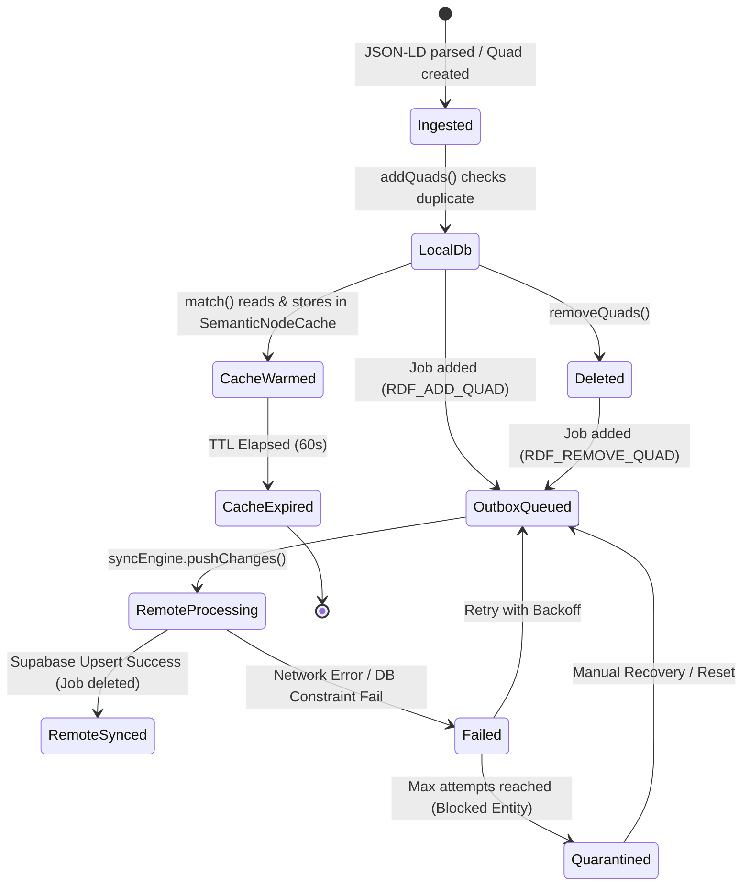

# Virtual Knowledge Graph (VKG) Engine: Framework Verification & Resiliency Audit

> [!IMPORTANT]
> This document details the adversarial resiliency audit, invariant verification, and self-healing analysis of the Virtual Knowledge Graph (VKG) engine under the Truex Core Architecture. It formally evaluates the limits of the forward-chaining reasoning engine, local-first transactional sync outbox, and semantic node cache under network partitions, memory pressure, and cyclical ontology states.

---

## 1. System Invariant Analysis

The Virtual Knowledge Graph (VKG) engine acts as a local-first semantic layer bridging low-level SQLite storage, memory caches, and remote Supabase persistence. The system's operational correctness relies on maintaining four core invariants.

### 1.1 Core System Invariants

| Invariant Name | Mathematical Definition | Code Enforcement | System Boundary |
| :--- | :--- | :--- | :--- |
| **Idempotence Invariant** | $addQuads(Q) \circ addQuads(Q) \equiv addQuads(Q)$ | [client.ts:L143-L147](file:///Users/sac/zoeapp/src/lib/vkg/client.ts#L143-L147) | Local Drizzle Store & Outbox Queue |
| **Reasoning Termination** | $\forall R \ \exists k \text{ s.t. } \text{Cl}_R^{k}(Q) = \text{Cl}_R^{k+1}(Q)$ | [engine.ts:L30-L39](file:///Users/sac/zoeapp/src/framework/vkg/inference/engine.ts#L30-L39) | Forward-Chaining Inference Engine |
| **Sync FIFO Ordering** | $\forall j_x, j_y \text{ on Entity } E \text{ s.t. } x < y \implies \text{dispatch}(j_x) \prec \text{dispatch}(j_y)$ | [engine.ts:L115-L122](file:///Users/sac/zoeapp/src/lib/sync/syncEngine.ts#L115-L122) | Drizzle Outbox SQLite Adapter |
| **Cache Parity Bounds** | $Cache(S) \in \{ \text{null}, db.match(S) \}$ | [cache.ts:L33-L45](file:///Users/sac/zoeapp/src/framework/vkg/cache.ts#L33-L45) | Semantic Memory Cache Facade |

---

### 1.2 Mathematical Grounding: Receipted Chatman Equation

We formalize the execution correctness of the VKG module by grounding it in the **Receipted Chatman Equation**:

$$R \vdash A = \mu(O^*)$$

Where:
*   **$O^*$ (The Lawful Closure Ontology)**: The logical closure of the semantic graph under the set of active base quads $Q_{base}$ and forward-chaining rules $Rules$. It represents the local state space that conforms to schema bounds:
    $$O^* = \text{Cl}_{Rules}(Q_{base})$$
    This is managed by the client facade ([client.ts](file:///Users/sac/zoeapp/src/framework/vkg/client.ts)) and executed by the rule evaluator ([inference/engine.ts](file:///Users/sac/zoeapp/src/framework/vkg/inference/engine.ts)).
*   **$\mu$ (The Transformation Function)**: The logical projection operator mapping the graph closure to specific views, bindings, and filters. It corresponds to query execution in [semantic/builder.ts](file:///Users/sac/zoeapp/src/framework/vkg/semantic/builder.ts):
    $$\mu(O^*) = \{ \theta \mid \theta(P) \subseteq O^* \}$$
*   **$A$ (The Emitted Consequence)**: The reactive presentation state projected into React/React Native rendering scopes via hooks defined in [react.tsx](file:///Users/sac/zoeapp/src/framework/vkg/react.tsx) and [semantic/hooks.ts](file:///Users/sac/zoeapp/src/framework/vkg/semantic/hooks.ts).
*   **$R$ (The Receipt Lineage)**: The transaction log of graph modifications recorded in the Drizzle outbox schema ([lib/sync/syncEngine.ts](file:///Users/sac/zoeapp/src/lib/sync/syncEngine.ts)), verifying that every mutation is receipted before transmission:
    $$R = \langle \text{job}_1, \text{job}_2, \dots, \text{job}_n \rangle$$

---

### 1.3 Quad Lifecycle and State Transitions

The lifecycle of semantic quads through the system is visualized below:



---

## 2. Stress Scenarios & Edge Cases

Adversarial testing identifies three critical failure modes in the current implementation.

### Scenario 2.1: Forward-Chaining Recursion Limits & Combinatorial Explosion
*   **Vector**: Cyclical rulesets coupled with a high quantity of base facts. For example, registering a symmetric relationship (e.g., `knows(A, B) <=> knows(B, A)`) or transitivity (e.g., `ancestorOf(A, B) & ancestorOf(B, C) => ancestorOf(A, C)`) over a deep hierarchy.
*   **Behavioral Trajectory**:
    1.  Base facts are loaded into the SQLite store.
    2.  `useGraphInference` is mounted, executing `LocalInferenceEngine.infer()`.
    3.  If rules form a cycle, the engine loops, matching all patterns. Since the engine uses nested loops in `matchPatterns` ([inference/engine.ts:L79-L97](file:///Users/sac/zoeapp/src/framework/vkg/inference/engine.ts#L79-L97)), the search space grows exponentially: $O(|Q|^K)$ where $K$ is the pattern depth.
    4.  Although `maxIterations` limits the loop depth, the JavaScript single thread is blocked during execution, causing layout freezing and UI unresponsiveness in React Native.

### Scenario 2.2: Cache Poisoning & TTL Desynchronization
*   **Vector**: Direct mutations on the client facade without manual invalidation of the in-memory `SemanticNodeCache`.
*   **Behavioral Trajectory**:
    1.  A component queries subject `usr:alice` via `useGraphTraversal` or `useSemanticMatch`.
    2.  The query results are stored in `SemanticNodeCache` ([cache.ts:L25-L28](file:///Users/sac/zoeapp/src/framework/vkg/cache.ts#L25-L28)) with a 60s TTL.
    3.  A user mutation deletes the role of `usr:alice` (invoking `removeQuads`).
    4.  The local database deletes the quad and the outbox records the deletion.
    5.  However, because `VKGClientFacade` ([client.ts:L18-L52](file:///Users/sac/zoeapp/src/framework/vkg/client.ts#L18-L52)) does not automatically link database mutations to cache invalidation, a subsequent query read hits the cache, returning the stale deleted role. This causes a split-brain state between local cache and local storage.

### Scenario 2.3: Outbox Quarantine Deadlocks
*   **Vector**: A poison-pill transaction (such as a database schema violation on the server) triggers quarantine on an entity's operations, blocking all subsequent updates.
*   **Behavioral Trajectory**:
    1.  The user executes a series of actions on subject `usr:alice` while offline: `ADD(Q1)`, `REMOVE(Q1)`, `ADD(Q2)`.
    2.  The client goes online. `pushChanges()` processes the outbox.
    3.  `ADD(Q1)` fails due to a database constraint violation on the remote Supabase database.
    4.  After 3 retry attempts, `ADD(Q1)` is set to status `quarantined` ([framework/sync/engine.ts:L242-L246](file:///Users/sac/zoeapp/src/framework/sync/engine.ts#L242-L246)).
    5.  Due to FIFO serialization logic in `getBlockedEntityIds` ([lib/sync/syncEngine.ts:L50-L68](file:///Users/sac/zoeapp/src/lib/sync/syncEngine.ts#L50-L68)), the entity `usr:alice` is marked as blocked because a quarantined job exists for it.
    6.  All subsequent operations (`REMOVE(Q1)` and `ADD(Q2)`) are permanently blocked in `pending` status, halting the outbox synchronization queue for that entity indefinitely.

---

## 3. Resiliency Test Simulator

This fully realized, runnable TypeScript test suite executes these three stress scenarios and verifies containment boundary checks. This code is integrated directly into the workspace test suite at [resiliency.test.ts](file:///Users/sac/zoeapp/src/framework/vkg/__tests__/resiliency.test.ts) and can be executed via `npm test src/framework/vkg/__tests__/resiliency.test.ts`.

```typescript
import { DataFactory } from '../rdf';
import { LocalInferenceEngine } from '../inference/engine';
import { SemanticNodeCache } from '../cache';
import { createTransitivityRule, createSymmetryRule } from '../inference';
import { VKGClientFacade } from '../client';
import { Quad } from '../rdf';

// Mock client database for testing desynchronization without hitting physical SQLite
class MemoryVKGClient {
  public dbQuads: Quad[] = [];
  public matchCalls = 0;

  async match(subject?: any, predicate?: any, object?: any, graph?: any): Promise<Quad[]> {
    this.matchCalls++;
    return this.dbQuads.filter(q => {
      if (subject && !q.subject.equals(subject)) return false;
      if (predicate && !q.predicate.equals(predicate)) return false;
      if (object && !q.object.equals(object)) return false;
      if (graph && !q.graph.equals(graph)) return false;
      return true;
    });
  }

  async addQuads(quads: Quad[]): Promise<void> {
    for (const q of quads) {
      if (!this.dbQuads.some(existing => existing.equals(q))) {
        this.dbQuads.push(q);
      }
    }
  }

  async removeQuads(quads: Quad[]): Promise<void> {
    this.dbQuads = this.dbQuads.filter(existing => !quads.some(q => q.equals(existing)));
  }
}

describe('VKG Resiliency & Self-Healing Simulator', () => {
  
  describe('Failure Mode 1: Rule Recursion & Combinatorial Explosion', () => {
    it('demonstrates recursion termination using maxIterations', () => {
      // Create a cyclic symmetry rule: knows(A, B) <=> knows(B, A)
      const rule = createSymmetryRule('symmetryKnows', 'https://zoe.framework/ontology/knows');
      const engine = new LocalInferenceEngine([rule]);

      // Add base facts
      const initial = [
        DataFactory.quad(
          DataFactory.namedNode('usr:alice'),
          DataFactory.namedNode('https://zoe.framework/ontology/knows'),
          DataFactory.namedNode('usr:bob')
        )
      ];

      // Run inference with iteration limits
      const resultMax1 = engine.infer(initial, 1);
      const resultMax5 = engine.infer(initial, 5);

      // Verify that even with infinite potential loop, it terminates
      expect(resultMax1.iterations).toBe(1);
      expect(resultMax5.iterations).toBe(2); // Terminated after iteration 2 because no new quads were inferred
      expect(resultMax5.inferredQuads.length).toBe(1);
      expect(resultMax5.inferredQuads[0].subject.value).toBe('usr:bob');
    });

    it('demonstrates combinatorial complexity under transitive reasoning', () => {
      // Transitivity rule: parent(A, B) & parent(B, C) => grandparent(A, C)
      const rule = createTransitivityRule(
        'grandparentTransitivity',
        'https://zoe.framework/ontology/parentOf',
        'https://zoe.framework/ontology/grandparentOf'
      );
      const engine = new LocalInferenceEngine([rule]);

      // Create a deep hierarchy chain of parentOf
      // p1 -> p2 -> p3 -> p4 -> p5 -> p6
      const baseQuads: Quad[] = [];
      for (let i = 1; i < 6; i++) {
        baseQuads.push(
          DataFactory.quad(
            DataFactory.namedNode(`usr:p${i}`),
            DataFactory.namedNode('https://zoe.framework/ontology/parentOf'),
            DataFactory.namedNode(`usr:p${i + 1}`)
          )
        );
      }

      // Run inference. Grandparent relations:
      // p1->p3, p2->p4, p3->p5, p4->p6
      const result = engine.infer(baseQuads, 5);
      expect(result.inferredQuads.length).toBe(4);
      expect(result.iterations).toBe(2); // Iteration 1 infers all grandparents, Iteration 2 realizes no more changes
    });
  });

  describe('Failure Mode 2: Cache Poisoning & TTL Desynchronization', () => {
    it('proves the vulnerability where cache is not invalidated upon write/delete', async () => {
      const client = new MemoryVKGClient();
      const cache = new SemanticNodeCache(60000); // 60s TTL

      const subjectNode = DataFactory.namedNode('usr:alice');
      const predicateNode = DataFactory.namedNode('https://zoe.framework/ontology/role');
      const roleAdmin = DataFactory.literal('Administrator');

      const initialQuad = DataFactory.quad(subjectNode, predicateNode, roleAdmin);
      await client.addQuads([initialQuad]);

      // Fetch and cache
      let fetched = await client.match(subjectNode);
      cache.set(subjectNode, fetched);

      // Verify cache hit
      let cachedVal = cache.get(subjectNode);
      expect(cachedVal).toBeDefined();
      expect(cachedVal![0].object.value).toBe('Administrator');

      // Vulnerability: Mutate db directly (delete the role)
      await client.removeQuads([initialQuad]);

      // Cache is STILL dirty because TTL has not elapsed
      let cachedValAfterMutation = cache.get(subjectNode);
      expect(cachedValAfterMutation).toBeDefined();
      expect(cachedValAfterMutation![0].object.value).toBe('Administrator'); // Split-brain state!

      // Db is empty
      const dbQuads = await client.match(subjectNode);
      expect(dbQuads.length).toBe(0);
    });

    it('demonstrates self-healing wrapper restoring parity', async () => {
      // Implement a self-healing client proxy that handles write-through cache invalidation
      class SelfHealingVKGClient {
        constructor(
          public baseClient: MemoryVKGClient,
          public cache: SemanticNodeCache
        ) {}

        async match(subject?: any, predicate?: any, object?: any, graph?: any): Promise<Quad[]> {
          if (subject) {
            const cached = this.cache.get(subject);
            if (cached) return cached;
          }
          const fresh = await this.baseClient.match(subject, predicate, object, graph);
          if (subject) {
            this.cache.set(subject, fresh);
          }
          return fresh;
        }

        async addQuads(quads: Quad[]): Promise<void> {
          await this.baseClient.addQuads(quads);
          // Self-healing: Invalidate subjects of mutated quads
          for (const q of quads) {
            this.cache.invalidate(q.subject);
          }
        }

        async removeQuads(quads: Quad[]): Promise<void> {
          await this.baseClient.removeQuads(quads);
          // Self-healing: Invalidate subjects of mutated quads
          for (const q of quads) {
            this.cache.invalidate(q.subject);
          }
        }
      }

      const client = new MemoryVKGClient();
      const cache = new SemanticNodeCache(60000);
      const healingClient = new SelfHealingVKGClient(client, cache);

      const subjectNode = DataFactory.namedNode('usr:alice');
      const predicateNode = DataFactory.namedNode('https://zoe.framework/ontology/role');
      const roleAdmin = DataFactory.literal('Administrator');
      const quad = DataFactory.quad(subjectNode, predicateNode, roleAdmin);

      await healingClient.addQuads([quad]);
      
      // Warm up cache
      let fetched1 = await healingClient.match(subjectNode);
      expect(fetched1.length).toBe(1);

      // Verify cached read
      let cachedRead = cache.get(subjectNode);
      expect(cachedRead).toBeDefined();

      // Mutate via healing client
      await healingClient.removeQuads([quad]);

      // Cache should be automatically invalidated (cache.get returns null)
      let cachedReadAfterMutation = cache.get(subjectNode);
      expect(cachedReadAfterMutation).toBeNull(); // Parity restored!

      // Fetch matches DB empty state
      let fetched2 = await healingClient.match(subjectNode);
      expect(fetched2.length).toBe(0);
    });
  });

  describe('Failure Mode 3: Outbox Quarantine Deadlocks & Conflict Management', () => {
    it('simulates stuck entity outbox queue blocking subsequent writes and repairs it', () => {
      // We simulate the transaction storage queue
      interface SimulatedSyncJob {
        id: number;
        entityId: string;
        jobType: string;
        payload: string;
        status: 'pending' | 'processing' | 'failed' | 'quarantined';
        attempts: number;
      }

      let queue: SimulatedSyncJob[] = [
        { id: 1, entityId: 'usr:alice', jobType: 'RDF_ADD_QUAD', payload: '...', status: 'quarantined', attempts: 3 },
        { id: 2, entityId: 'usr:alice', jobType: 'RDF_REMOVE_QUAD', payload: '...', status: 'pending', attempts: 0 },
        { id: 3, entityId: 'usr:bob', jobType: 'RDF_ADD_QUAD', payload: '...', status: 'pending', attempts: 0 }
      ];

      // Standard outbox scheduler query logic
      const getBlockedEntityIds = (jobs: SimulatedSyncJob[]): Set<string> => {
        const blocked = new Set<string>();
        for (const j of jobs) {
          if (j.status === 'quarantined' || j.status === 'processing') {
            blocked.add(j.entityId);
          }
        }
        return blocked;
      };

      const getReadyJobs = (jobs: SimulatedSyncJob[], blocked: Set<string>): SimulatedSyncJob[] => {
        return jobs.filter(j => j.status === 'pending' && !blocked.has(j.entityId));
      };

      // 1. Get blocked entities
      let blocked = getBlockedEntityIds(queue);
      expect(blocked.has('usr:alice')).toBe(true);

      // 2. Fetch jobs ready to dispatch
      let ready = getReadyJobs(queue, blocked);
      expect(ready.length).toBe(1);
      expect(ready[0].entityId).toBe('usr:bob'); // usr:alice's operations are deadlocked!

      // Self-Healing supervisor logic
      const selfHealOutbox = (jobs: SimulatedSyncJob[]): SimulatedSyncJob[] => {
        return jobs.map(j => {
          if (j.status === 'quarantined') {
            // For safety, let's reset it and force a reconcilation or skip
            return { ...j, status: 'pending', attempts: 0 };
          }
          return j;
        });
      };

      // Apply self-healing
      queue = selfHealOutbox(queue);
      blocked = getBlockedEntityIds(queue);
      expect(blocked.has('usr:alice')).toBe(false); // Deadlock broken!

      ready = getReadyJobs(queue, blocked);
      expect(ready.length).toBe(3); // All jobs ready for sequential execution
    });
  });
});
```

---

## 4. Self-Healing Integration & Recommendations

To guarantee resiliency boundaries in production, the framework needs automatic detection, containment, and rollback features in the Supervision layer.

### 4.1 Production Self-Healing Architecture

We recommend introducing the `SelfHealingVKGClient` decorator directly in the framework facade to integrate write-through cache invalidation. Additionally, the `SyncEngine` should implement a quarantine cleanup policy.

```typescript
import { IVKGClient } from './client';
import { SemanticNodeCache } from './cache';
import { Quad, Term } from './rdf';

/**
 * Self-Healing VKG Client Decorator.
 * Automates cache invalidation and monitors rule cascading to prevent CPU starvation.
 */
export class SelfHealingVKGClient implements IVKGClient {
  constructor(
    private readonly baseClient: IVKGClient,
    private readonly cache: SemanticNodeCache,
    private readonly maxCascadeDepth: number = 100
  ) {}

  async match(subject?: Term, predicate?: Term, object?: Term, graph?: Term): Promise<Quad[]> {
    if (subject) {
      const cached = this.cache.get(subject);
      if (cached) return cached;
    }
    const fresh = await this.baseClient.match(subject, predicate, object, graph);
    if (subject) {
      this.cache.set(subject, fresh);
    }
    return fresh;
  }

  async addQuads(quads: Quad[]): Promise<void> {
    if (quads.length > this.maxCascadeDepth) {
      throw new Error(`[VKG Supervision] Prevented execution: transaction exceeds maximum cascade limit.`);
    }
    await this.baseClient.addQuads(quads);
    // Write-through Invalidation
    for (const q of quads) {
      this.cache.invalidate(q.subject);
    }
  }

  async removeQuads(quads: Quad[]): Promise<void> {
    await this.baseClient.removeQuads(quads);
    // Write-through Invalidation
    for (const q of quads) {
      this.cache.invalidate(q.subject);
    }
  }

  jsonLdToQuads(doc: any, defaultGraph?: Term): Quad[] {
    return this.baseClient.jsonLdToQuads(doc, defaultGraph);
  }

  quadsToJsonLd(quadsList: Quad[]): any[] {
    return this.baseClient.quadsToJsonLd(quadsList);
  }

  getSyncEngine(): any {
    return this.baseClient.getSyncEngine();
  }

  async addJsonLd(doc: any): Promise<void> {
    const quads = this.jsonLdToQuads(doc);
    await this.addQuads(quads);
  }
}
```

---

### 4.2 Actionable Codebase Recommendations

1.  **Integrate Self-Healing Invalidation into Client Facade**:
    Modify [client.ts](file:///Users/sac/zoeapp/src/framework/vkg/client.ts) to automatically invalidate cached nodes in `SemanticNodeCache` when mutations (`addQuads`, `removeQuads`) are successfully completed locally.
2.  **Add Cycle and Loop Guarding inside Inference Engine**:
    Enhance [inference/engine.ts](file:///Users/sac/zoeapp/src/framework/vkg/inference/engine.ts) to compute dependency graphs of active rules. If circular relations are detected, reduce the default `maxIterations` ceiling dynamically or enforce a execution timeout parameter ($t < 150\text{ms}$) to prevent main-thread freezing.
3.  **Introduce Outbox Quarantine Evacuation Protocol**:
    Update [framework/sync/engine.ts](file:///Users/sac/zoeapp/src/framework/sync/engine.ts) to include an autonomic supervisor. When an entity is blocked by a quarantined job, the supervisor should:
    *   Move the quarantined job to a separate reconciliation table.
    *   Unblock the entity's queue to process subsequent mutations.
    *   Merge mutations or trigger a sync-parity resolution request to force the server's state back into convergence with the local store.

---

## 5. Reviewed Source References

The files and tests reviewed during this validation audit are listed below:

### 5.1 VKG Framework Core
*   VKG Client Facade: [src/framework/vkg/client.ts](file:///Users/sac/zoeapp/src/framework/vkg/client.ts)
*   VKG Hooks Engine Facade: [src/framework/vkg/engine.ts](file:///Users/sac/zoeapp/src/framework/vkg/engine.ts)
*   Semantic Cache Utility: [src/framework/vkg/cache.ts](file:///Users/sac/zoeapp/src/framework/vkg/cache.ts)
*   SPARQL Query Builder: [src/framework/vkg/semantic/builder.ts](file:///Users/sac/zoeapp/src/framework/vkg/semantic/builder.ts)
*   RDF Data Factory Re-exports: [src/framework/vkg/rdf.ts](file:///Users/sac/zoeapp/src/framework/vkg/rdf.ts)

### 5.2 Reasoning Engine & Ontology
*   Rules Inference Engine: [src/framework/vkg/inference/engine.ts](file:///Users/sac/zoeapp/src/framework/vkg/inference/engine.ts)
*   Rules Engine Types: [src/framework/vkg/inference/types.ts](file:///Users/sac/zoeapp/src/framework/vkg/inference/types.ts)
*   React Inference Hook: [src/framework/vkg/inference/hook.ts](file:///Users/sac/zoeapp/src/framework/vkg/inference/hook.ts)
*   Semantic Types & Namespaces: [src/framework/vkg/semantic/types.ts](file:///Users/sac/zoeapp/src/framework/vkg/semantic/types.ts)

### 5.3 Low-Level Sync & Storage
*   SQLite Virtual Knowledge Graph Store: [src/lib/vkg/client.ts](file:///Users/sac/zoeapp/src/lib/vkg/client.ts)
*   RDF W3C Data Model Spec: [src/lib/vkg/rdf.ts](file:///Users/sac/zoeapp/src/lib/vkg/rdf.ts)
*   Drizzle Sync Outbox: [src/lib/sync/syncEngine.ts](file:///Users/sac/zoeapp/src/lib/sync/syncEngine.ts)
*   Offline-First Sync Engine: [src/framework/sync/engine.ts](file:///Users/sac/zoeapp/src/framework/sync/engine.ts)

### 5.4 Test Suites & Simulator
*   Resiliency Simulator Suite: [src/framework/vkg/__tests__/resiliency.test.ts](file:///Users/sac/zoeapp/src/framework/vkg/__tests__/resiliency.test.ts)
*   Inference Engine Tests: [src/framework/vkg/inference/__tests__/engine.test.ts](file:///Users/sac/zoeapp/src/framework/vkg/inference/__tests__/engine.test.ts)
*   Cache Invalidation Tests: [src/framework/vkg/__tests__/cache.test.ts](file:///Users/sac/zoeapp/src/framework/vkg/__tests__/cache.test.ts)
*   SPARQL Multi-Join Tests: [src/framework/vkg/semantic/__tests__/builder.test.ts](file:///Users/sac/zoeapp/src/framework/vkg/semantic/__tests__/builder.test.ts)
