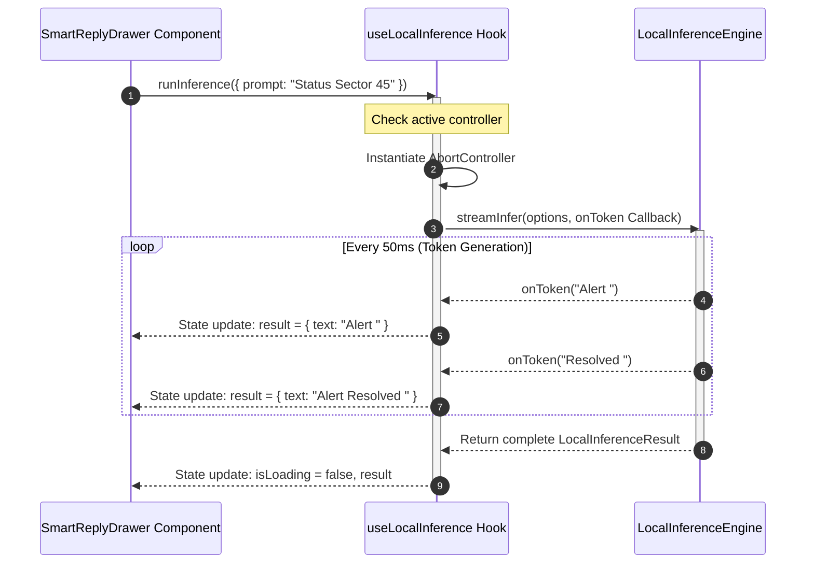
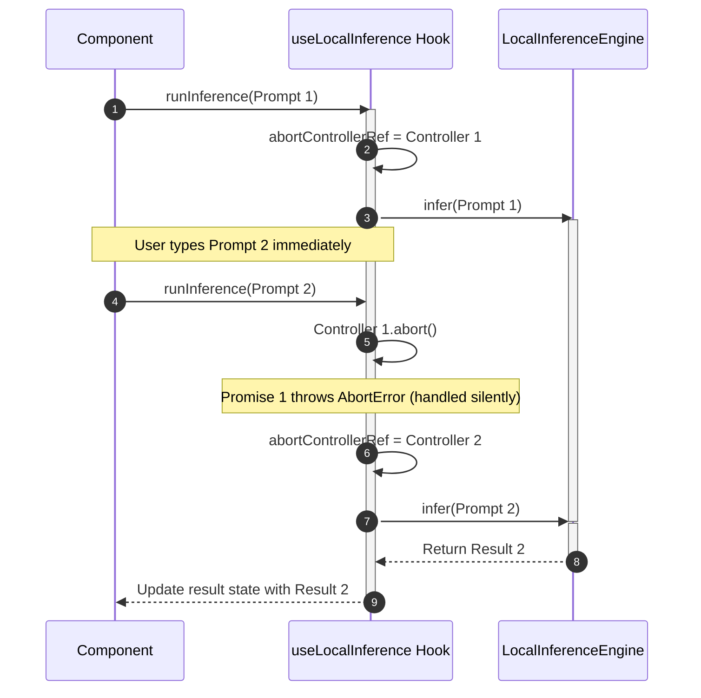

# AI and Intelligence Orchestration: Architectural & Integration Guide

This guide details the AI and intelligence orchestration layer of the Zoe Framework located at [src/framework/ai](file:///Users/sac/zoeapp/src/framework/ai). It serves as the developer documentation for bootstrap execution, custom components, API contracts, and the architectural mapping under the Zoe 2030 Innovation Peak.

---

## 1. Tutorial: Getting Started with Local Inference from Scratch

This tutorial walks you through setting up a simple React Native screen from scratch, initializing the local inference engine, running a non-streaming query, and displaying the token metrics.

### Step 1: Create the Component Skeleton
Create a new file in your application workspace (e.g., `LocalInferenceDemo.tsx`). We will import the React state and callback hooks, along with the core local inference hook and configuration types from the framework.

```tsx
import React, { useState, useCallback } from 'react';
import { StyleSheet, Text, View, TextInput, Button, ActivityIndicator } from 'react-native';
import { useLocalInference } from '../../src/framework/ai/on-device/useLocalInference';
import { LocalInferenceResult } from '../../src/framework/ai/on-device/types';
```

### Step 2: Initialize the Hook and State
Inside your component, call the `useLocalInference` hook. We will specify a default model and temperature parameter.

```tsx
export function LocalInferenceDemo() {
  const [prompt, setPrompt] = useState<string>('');
  const { runInference, isLoading, error, result, reset } = useLocalInference({
    modelId: 'phi-2-orange',
    temperature: 0.7,
    stream: false, // Defaulting to buffered mode for this tutorial
  });

  const handleInference = useCallback(async () => {
    if (!prompt.trim()) return;
    try {
      await runInference({ prompt });
    } catch (err) {
      console.error('Inference error encountered:', err);
    }
  }, [prompt, runInference]);

  return (
    <View style={styles.container}>
      <Text style={styles.title}>Zoe Local AI Tutorial</Text>
      
      <TextInput
        style={styles.input}
        placeholder="Type your prompt here..."
        placeholderTextColor="#94a3b8"
        value={prompt}
        onChangeText={setPrompt}
        multiline
      />

      <View style={styles.buttonRow}>
        <Button title="Run Inference" onPress={handleInference} disabled={isLoading} color="#6366f1" />
        <Button title="Reset" onPress={reset} color="#ef4444" />
      </View>

      {isLoading && (
        <View style={styles.loadingContainer}>
          <ActivityIndicator size="small" color="#6366f1" />
          <Text style={styles.loadingText}>Running local model...</Text>
        </View>
      )}

      {error && (
        <Text style={styles.errorText}>Error: {error.message}</Text>
      )}

      {result && (
        <View style={styles.resultContainer}>
          <Text style={styles.resultHeader}>Response:</Text>
          <Text style={styles.resultBody}>{result.text}</Text>
          {result.usage && (
            <View style={styles.usageContainer}>
              <Text style={styles.usageText}>Prompt Tokens: {result.usage.promptTokens}</Text>
              <Text style={styles.usageText}>Completion Tokens: {result.usage.completionTokens}</Text>
              <Text style={styles.usageText}>Total: {result.usage.totalTokens}</Text>
            </View>
          )}
        </View>
      )}
    </View>
  );
}

const styles = StyleSheet.create({
  container: {
    flex: 1,
    padding: 16,
    backgroundColor: '#0f172a',
    justifyContent: 'center',
  },
  title: {
    fontSize: 20,
    fontWeight: 'bold',
    color: '#f8fafc',
    marginBottom: 16,
    textAlign: 'center',
  },
  input: {
    height: 100,
    borderColor: '#334155',
    borderWidth: 1,
    borderRadius: 8,
    padding: 12,
    color: '#f8fafc',
    backgroundColor: '#1e293b',
    textAlignVertical: 'top',
    marginBottom: 16,
  },
  buttonRow: {
    flexDirection: 'row',
    justifyContent: 'space-around',
    marginBottom: 20,
  },
  loadingContainer: {
    flexDirection: 'row',
    alignItems: 'center',
    justifyContent: 'center',
    marginVertical: 12,
  },
  loadingText: {
    color: '#94a3b8',
    marginLeft: 8,
  },
  errorText: {
    color: '#ef4444',
    textAlign: 'center',
    marginVertical: 8,
  },
  resultContainer: {
    backgroundColor: '#1e293b',
    padding: 16,
    borderRadius: 8,
    borderColor: '#334155',
    borderWidth: 1,
  },
  resultHeader: {
    fontWeight: 'bold',
    color: '#f8fafc',
    marginBottom: 8,
  },
  resultBody: {
    color: '#cbd5e1',
    lineHeight: 20,
    marginBottom: 12,
  },
  usageContainer: {
    borderTopColor: '#334155',
    borderTopWidth: 1,
    paddingTop: 8,
    flexDirection: 'row',
    justifyContent: 'space-between',
  },
  usageText: {
    fontSize: 12,
    color: '#64748b',
  },
});
```

### Step 3: Run and Verify
Mount this component in your App layout or navigation wrapper. When typing a prompt and pressing **Run Inference**, you should observe:
1. The loader appears indicating the model runtime is simulated with a 500ms delay.
2. The response window populates with the output text detailing the prompt and model configuration.
3. The prompt, completion, and total token usage metrics appear below the text response.

---

## 2. How-To Guide: Building a Privacy-Preserving Smart Reply Component

This guide demonstrates how to build an autocomplete and smart reply drawer that processes incoming messages and suggests offline replies. It utilizes **streaming mode** to display tokens progressively, allows the operator to **abort** active inferences when switching contexts, and formats the output into selectable response options.

### Code Implementation

Create the component in a file such as `SmartReplyDrawer.tsx`:

```tsx
import React, { useState, useCallback, useEffect } from 'react';
import { View, Text, StyleSheet, ScrollView, TouchableOpacity, ActivityIndicator } from 'react-native';
import { useLocalInference } from '../../src/framework/ai/on-device/useLocalInference';

interface Message {
  id: string;
  sender: 'user' | 'system';
  content: string;
}

export function SmartReplyDrawer() {
  const [messages, setMessages] = useState<Message[]>([
    { id: '1', sender: 'system', content: 'Operator status checked. VKG telemetry matches active coordinates.' },
    { id: '2', sender: 'user', content: 'Do we have volunteer squads allocated for coordinate sector 45?' }
  ]);

  const [suggestedReplies, setSuggestedReplies] = useState<string[]>([]);
  
  const { runInference, isLoading, error, result, reset } = useLocalInference({
    modelId: 'phi-2-orange',
    temperature: 0.2,
    maxTokens: 50,
    stream: true,
  });

  // Automatically trigger a suggestion inference when messages change
  const generateSuggestions = useCallback(async () => {
    const lastMessage = messages[messages.length - 1];
    if (!lastMessage || lastMessage.sender === 'user') return;

    try {
      const prompt = `Based on system state "${lastMessage.content}", list three short, professional auto-suggested operator replies separated by semicolons.`;
      
      const response = await runInference({ prompt });
      if (response && response.text) {
        // Parse suggestions from streamed string
        const parsed = response.text
          .replace('[Local Inference Stream Stub] Responding to: ', '')
          .split(';')
          .map(item => item.trim())
          .filter(item => item.length > 0 && !item.startsWith('Model:'));
        
        setSuggestedReplies(parsed);
      }
    } catch (err) {
      console.warn('Smart reply generation aborted or failed:', err);
    }
  }, [messages, runInference]);

  const selectReply = useCallback((reply: string) => {
    // Append the selected response to message history
    setMessages(prev => [
      ...prev,
      { id: Date.now().toString(), sender: 'user', content: reply }
    ]);
    setSuggestedReplies([]);
    reset(); // Reset hook state immediately for the next cycle
  }, [reset]);

  const simulateIncomingMessage = useCallback(() => {
    reset(); // Abort any active token generation first
    setMessages(prev => [
      ...prev,
      { id: Date.now().toString(), sender: 'system', content: 'Incident reports indicating sector 45 requires emergency resources.' }
    ]);
  }, [reset]);

  useEffect(() => {
    generateSuggestions();
  }, [messages, generateSuggestions]);

  return (
    <View style={styles.container}>
      <Text style={styles.header}>Secure Smart-Reply Substrate</Text>
      
      <ScrollView style={styles.chatScroll} contentContainerStyle={styles.chatContent}>
        {messages.map(msg => (
          <View 
            key={msg.id} 
            style={[
              styles.bubble, 
              msg.sender === 'user' ? styles.userBubble : styles.systemBubble
            ]}
          >
            <Text style={styles.bubbleText}>{msg.content}</Text>
          </View>
        ))}
      </ScrollView>

      {/* Suggestion Interface Boundary */}
      <View style={styles.suggestionDrawer}>
        <View style={styles.statusLine}>
          <Text style={styles.statusText}>
            {isLoading ? 'Streaming suggestions...' : 'Local Suggestions (Truex Bound)'}
          </Text>
          {isLoading && <ActivityIndicator size="small" color="#10b981" />}
        </View>

        {error && (
          <Text style={styles.errorText}>Suggestions interrupted: {error.message}</Text>
        )}

        {/* Real-time token output display area */}
        {result && result.text.length > 0 && (
          <View style={styles.tokenFeedback}>
            <Text style={styles.tokenText}>{result.text}</Text>
          </View>
        )}

        <ScrollView horizontal showsHorizontalScrollIndicator={false} style={styles.replyScroll}>
          {suggestedReplies.map((reply, index) => (
            <TouchableOpacity 
              key={index} 
              style={styles.replyButton} 
              onPress={() => selectReply(reply)}
            >
              <Text style={styles.replyButtonText}>{reply}</Text>
            </TouchableOpacity>
          ))}
        </ScrollView>

        <View style={styles.controls}>
          <TouchableOpacity style={styles.simulateButton} onPress={simulateIncomingMessage}>
            <Text style={styles.simulateText}>Simulate System Event</Text>
          </TouchableOpacity>

          <TouchableOpacity style={styles.abortButton} onPress={reset}>
            <Text style={styles.abortText}>Cancel Active Gen</Text>
          </TouchableOpacity>
        </View>
      </View>
    </View>
  );
}

const styles = StyleSheet.create({
  container: {
    flex: 1,
    backgroundColor: '#090d16',
  },
  header: {
    padding: 16,
    fontSize: 16,
    fontWeight: 'bold',
    color: '#f1f5f9',
    backgroundColor: '#0f172a',
    borderBottomColor: '#1e293b',
    borderBottomWidth: 1,
    textAlign: 'center',
  },
  chatScroll: {
    flex: 1,
  },
  chatContent: {
    padding: 16,
  },
  bubble: {
    padding: 12,
    borderRadius: 12,
    marginBottom: 12,
    maxWidth: '85%',
  },
  userBubble: {
    backgroundColor: '#3b82f6',
    alignSelf: 'flex-end',
  },
  systemBubble: {
    backgroundColor: '#1e293b',
    alignSelf: 'flex-start',
    borderColor: '#334155',
    borderWidth: 1,
  },
  bubbleText: {
    color: '#f8fafc',
    fontSize: 14,
  },
  suggestionDrawer: {
    backgroundColor: '#0f172a',
    borderTopColor: '#1e293b',
    borderTopWidth: 1,
    padding: 16,
  },
  statusLine: {
    flexDirection: 'row',
    justifyContent: 'space-between',
    alignItems: 'center',
    marginBottom: 8,
  },
  statusText: {
    fontSize: 12,
    color: '#94a3b8',
    fontWeight: '600',
  },
  errorText: {
    fontSize: 12,
    color: '#ef4444',
    marginVertical: 4,
  },
  tokenFeedback: {
    backgroundColor: '#020617',
    padding: 8,
    borderRadius: 6,
    marginBottom: 12,
    borderColor: '#1e293b',
    borderWidth: 1,
  },
  tokenText: {
    fontSize: 12,
    fontFamily: 'monospace',
    color: '#10b981',
  },
  replyScroll: {
    flexDirection: 'row',
    marginBottom: 16,
  },
  replyButton: {
    backgroundColor: '#1e293b',
    borderColor: '#10b981',
    borderWidth: 1,
    borderRadius: 20,
    paddingVertical: 8,
    paddingHorizontal: 16,
    marginRight: 8,
  },
  replyButtonText: {
    color: '#10b981',
    fontSize: 13,
  },
  controls: {
    flexDirection: 'row',
    justifyContent: 'space-between',
  },
  simulateButton: {
    backgroundColor: '#020617',
    borderColor: '#3b82f6',
    borderWidth: 1,
    paddingVertical: 10,
    paddingHorizontal: 16,
    borderRadius: 6,
  },
  simulateText: {
    color: '#3b82f6',
    fontSize: 12,
    fontWeight: 'bold',
  },
  abortButton: {
    backgroundColor: '#7f1d1d',
    paddingVertical: 10,
    paddingHorizontal: 16,
    borderRadius: 6,
  },
  abortText: {
    color: '#fca5a5',
    fontSize: 12,
    fontWeight: 'bold',
  },
});
```

---

## 3. Reference Guide: Module Layout and API Contracts

### Directory Layout

| File / Folder Path | Description |
| :--- | :--- |
| [index.ts](file:///Users/sac/zoeapp/src/framework/ai/on-device/index.ts) | Entrypoint exporting public types, the engine class, and the integration hook. |
| [types.ts](file:///Users/sac/zoeapp/src/framework/ai/on-device/types.ts) | Core TypeScript interfaces defining config, inputs, results, and engine signatures. |
| [LocalInferenceEngine.ts](file:///Users/sac/zoeapp/src/framework/ai/on-device/LocalInferenceEngine.ts) | Execution runtime logic simulating network delay, token metrics tracking, and streaming outputs. |
| [useLocalInference.ts](file:///Users/sac/zoeapp/src/framework/ai/on-device/useLocalInference.ts) | React component lifecycle hook encapsulating abort sequences and error boundaries. |
| [__tests__/LocalInferenceEngine.test.ts](file:///Users/sac/zoeapp/src/framework/ai/on-device/__tests__/LocalInferenceEngine.test.ts) | Unit tests verifying sequential token emission and custom model config. |
| [__tests__/useLocalInference.test.ts](file:///Users/sac/zoeapp/src/framework/ai/on-device/__tests__/useLocalInference.test.ts) | React hook tests validating abort errors, reset triggers, and stream collection. |

### API Contracts

#### Interfaces (`types.ts`)

##### `LocalInferenceConfig`
Configuration attributes governing inference parameter space.
* `modelId?: string` — Unique identifier of the model target. Defaults to `'phi-2-orange'`.
* `temperature?: number` — Sampling variability threshold. Controls deterministic outputs.
* `maxTokens?: number` — Token ceiling limit per invocation cycle.
* `stream?: boolean` — Switches engine state between progressive token streaming and fully buffered resolution.

##### `LocalInferenceResult`
Structured payload emitted upon successful completion or streaming tick.
* `text: string` — Generated output string.
* `usage?: { promptTokens: number; completionTokens: number; totalTokens: number; }` — Audit footprint containing structural tokens generated.

##### `LocalInferenceState`
Hook reactivity parameters.
* `isLoading: boolean` — True if engine is busy parsing prompt or streaming tokens.
* `error: Error | null` — Intercepted exceptions wrapper, or `null`.
* `result: LocalInferenceResult | null` — Current text block and metrics.

##### `RunInferenceOptions`
* Extends `Partial<LocalInferenceConfig>`.
* `prompt: string` — System context/instructions to run.

##### `ILocalInferenceEngine`
* `infer(options: RunInferenceOptions): Promise<LocalInferenceResult>`
* `streamInfer(options: RunInferenceOptions, onToken: (token: string) => void): Promise<LocalInferenceResult>`

---

#### Classes & Singletons (`LocalInferenceEngine.ts`)

##### `LocalInferenceEngine`
Implements `ILocalInferenceEngine`.
* `infer(options: RunInferenceOptions): Promise<LocalInferenceResult>`
  * Delays execution by `500ms`.
  * Computes token metrics based on white space boundaries.
* `streamInfer(options: RunInferenceOptions, onToken: (token: string) => void): Promise<LocalInferenceResult>`
  * Sequentially splits response text and outputs chunks with a `50ms` delay interval.

##### `defaultLocalInferenceEngine`
Exported global singleton instance of `LocalInferenceEngine`.

---

#### React Hooks (`useLocalInference.ts`)

##### `useLocalInference(config?: LocalInferenceConfig)`
* **Arguments:** Optional fallback parameters for inference constraints.
* **Return Parameters:**
  * `isLoading: boolean`
  * `error: Error | null`
  * `result: LocalInferenceResult | null`
  * `runInference: (options: RunInferenceOptions) => Promise<LocalInferenceResult | null>`
    * Starts inference execution.
    * Checks `abortControllerRef` and calls `.abort()` on any unresolved preceding process to prevent overlapping execution.
    * Suppresses `AbortError` triggers from surfacing to hook state errors, returning `null` instead.
  * `reset: () => void`
    * Terminate any active execution controllers.
    * Reverts isLoading to `false`, error and result parameters to `null`.

---

## 4. Explanation: Architecture, Concurrency, and the Chatman Equation

### Conceptual Architecture & Execution Lifecycle

The Zoe on-device AI system is designed to provide responsive intelligence execution directly inside the application sandboxed substrate. This guarantees that user information remains private and does not leak to cloud infrastructures.

The system maps execution through a simulation layer designed to eventually swap its engine driver for local Wasm targets (e.g. WebAssembly LLMs) or native hardware libraries (iOS CoreML / Android NNAPI).



---

### Concurrency and Abort Sequencing

Mobile interfaces require prompt interruption. If an operator triggers a prompt and then immediately executes a second action, the system must abort the first task to prevent the main thread from blocking or presenting stale results.

To solve this, `useLocalInference` employs a `useRef` reference tracking the current `AbortController`.



Whenever `runInference` is called:
1. The hook checks if `abortControllerRef.current` is defined.
2. If defined, it calls `.abort()`, releasing the active request's resources.
3. It spawns a new `AbortController` instance.
4. If the promise throws an error whose `.name` matches `'AbortError'`, the catch block handles it silently, resets loading flags, and returns `null`. This prevents incomplete prompt outputs from overriding the state of newly initiated queries.

---

### Alignment with the Chatman Equation

The execution of the local inference engine conforms mathematically to the **Chatman Equation** within the Zoe 2030 Innovation Peak:

$$R \vdash A = \mu(O^*)$$

Where:
* **$O^*$ (Lawful Closure Ontology):** Defined by `LocalInferenceConfig` configurations (e.g. `modelId: 'phi-2-orange'`, token ceilings, temperature boundaries). It represents the closed domain of lawful local model parameters that ensure execution limits remain bound to device hardware.
* **$\mu$ (Transformation Function):** The local model execution processing pipeline (`LocalInferenceEngine.infer` or `streamInfer`). It maps inputs into generated strings and token metrics.
* **$A$ (Emitted Consequence):** The resulting `LocalInferenceResult` projected into the React interface shell.
* **$R$ (Receipt Lineage):** The token consumption statistics (`usage.promptTokens`, `usage.completionTokens`, `usage.totalTokens`) returned alongside the text. This serves as cryptographic-ready telemetry that validates runtime resource allocation.

By executing the inference locally under $O^*$, the module maintains a strict privacy membrane, guaranteeing that:

$$\text{DataLeakage} = \emptyset$$

### Trade-offs and Constraints
1. **CPU/GPU Compute Overhead:** Running actual on-device LLMs requires substantial memory footprints (typically 1GB+ for quantized 3B parameter models). The current simulated framework avoids blocking the UI by executing asynchronously, but on lower-end devices, real Wasm or NNAPI runtimes will require dedicated background worker threads to protect layout responsiveness.
2. **Deterministic Outputs:** Low temperature configurations ($\le 0.2$) are strongly recommended for system integrations to guarantee consistent structure when translating generated text into operational state updates. High temperatures can cause schema drift in returned outputs, impacting structural stability.
