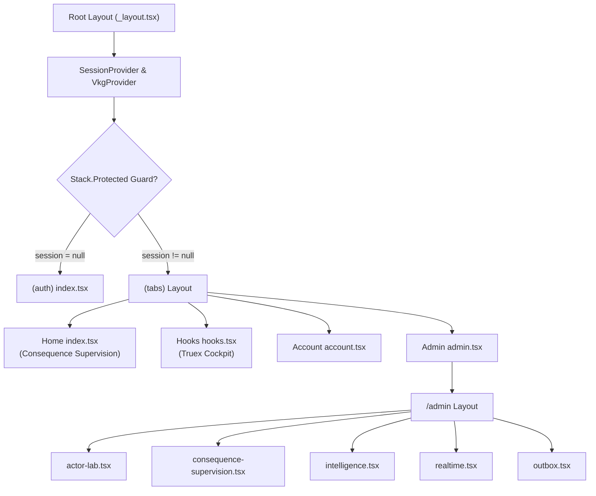

# Zoe 2030 App Routing and Pages

This document provides a comprehensive guide to the routing architecture, layouts, page structures, and authorization membranes under the `/Users/sac/zoeapp/src/app` directory. The routing mechanism is implemented using Expo Router (React Native) with custom extensions to facilitate role-based state projection and optimistic sync boundaries.

---

## 1. Tutorial: Adding and Protecting a New Admin Screen

This tutorial guides a developer from absolute scratch through the process of adding a new page under the protected `admin` route stack, hooking it up to the Virtual Knowledge Graph (VKG) engine, and authorizing actions based on the current user's active role.

### Step 1: Create the Screen Component File
Create a new file named `compliance-guard.tsx` under the [src/app/admin/](file:///Users/sac/zoeapp/src/app/admin) directory. This screen will render security logs and let operators trigger compensating rollbacks.

Write the following code into `compliance-guard.tsx`:

```tsx
import React from 'react';
import { View, Text, StyleSheet, ScrollView, TouchableOpacity } from 'react-native';
import { AdminShell } from '../../components/admin/AdminShell';
import { AdminCard } from '../../components/admin/AdminCard';
import { useVkgEngine } from '@/src/components/VkgProvider';

export default function AdminComplianceGuard() {
  const { avatar, projection, triggerHook } = useVkgEngine();

  const handleTriggerAudit = async () => {
    // Dispatch an optimistic graph delta mutation hook
    await triggerHook(
      'compliance_system',
      'audit_triggered_by',
      avatar
    );
  };

  return (
    <AdminShell 
      title="Compliance Guard" 
      subtitle="System validation and regulatory compliance membrane logs"
    >
      <ScrollView contentContainerStyle={styles.container}>
        <AdminCard title="Active Role Context" subtitle="Current authorization level">
          <View style={styles.roleContainer}>
            <Text style={styles.label}>Avatar Role:</Text>
            <Text style={styles.value}>{avatar.toUpperCase()}</Text>
          </View>
        </AdminCard>

        {projection && projection.visible ? (
          <AdminCard title="Active State Projection" subtitle={projection.surface.toUpperCase()}>
            <Text style={styles.messageText}>
              {projection.payload?.message || 'State is valid and fully synchronized.'}
            </Text>
            
            <View style={styles.actionContainer}>
              <Text style={styles.label}>Allowed Actions:</Text>
              {projection.allowedActions.length > 0 ? (
                projection.allowedActions.map((action) => (
                  <View key={action} style={styles.actionBadge}>
                    <Text style={styles.actionBadgeText}>⚡ {action}</Text>
                  </View>
                ))
              ) : (
                <Text style={styles.noActions}>No actions permitted for this role.</Text>
              )}
            </View>
          </AdminCard>
        ) : (
          <AdminCard title="Unauthorized" subtitle="Access Denied">
            <Text style={styles.errorText}>
              Your current avatar role does not have authorization to view this state projection.
            </Text>
          </AdminCard>
        )}

        <TouchableOpacity 
          style={styles.triggerButton} 
          onPress={handleTriggerAudit}
        >
          <Text style={styles.buttonText}>Run Diagnostic Audit</Text>
        </TouchableOpacity>
      </ScrollView>
    </AdminShell>
  );
}

const styles = StyleSheet.create({
  container: {
    paddingBottom: 32,
  },
  roleContainer: {
    flexDirection: 'row',
    alignItems: 'center',
    gap: 12,
    marginTop: 8,
  },
  label: {
    color: '#94A3B8',
    fontSize: 13,
    fontWeight: '600',
  },
  value: {
    color: '#38BDF8',
    fontFamily: 'monospace',
    fontWeight: '700',
    fontSize: 14,
  },
  messageText: {
    color: '#E2E8F0',
    fontSize: 14,
    lineHeight: 22,
    marginVertical: 10,
  },
  actionContainer: {
    marginTop: 12,
    borderTopWidth: 1,
    borderTopColor: 'rgba(255, 255, 255, 0.08)',
    paddingTop: 12,
  },
  actionBadge: {
    backgroundColor: 'rgba(16, 185, 129, 0.1)',
    borderColor: 'rgba(16, 185, 129, 0.2)',
    borderWidth: 1,
    borderRadius: 8,
    paddingVertical: 6,
    paddingHorizontal: 12,
    alignSelf: 'flex-start',
    marginTop: 8,
  },
  actionBadgeText: {
    color: '#34D399',
    fontSize: 12,
    fontWeight: '600',
  },
  noActions: {
    color: '#64748B',
    fontSize: 13,
    fontStyle: 'italic',
    marginTop: 6,
  },
  errorText: {
    color: '#F87171',
    fontSize: 13,
    lineHeight: 20,
    marginTop: 8,
  },
  triggerButton: {
    backgroundColor: '#3B82F6',
    borderRadius: 12,
    paddingVertical: 14,
    alignItems: 'center',
    marginTop: 20,
  },
  buttonText: {
    color: '#FFFFFF',
    fontWeight: '700',
    fontSize: 14,
  },
});
```

### Step 2: Register the Screen in the Admin Layout Router
Open the admin group layout configuration file located at [src/app/admin/_layout.tsx](file:///Users/sac/zoeapp/src/app/admin/_layout.tsx). Add a new `<Stack.Screen>` element inside the `<Stack>` component matching the file name:

```tsx
import React from 'react';
import { Stack } from 'expo-router';

export default function AdminLayout() {
  return (
    <Stack
      screenOptions={{
        headerShown: false,
        animation: 'slide_from_right',
      }}
    >
      <Stack.Screen name="index" />
      <Stack.Screen name="consequence-supervision" />
      <Stack.Screen name="actor-lab" />
      <Stack.Screen name="compliance-guard" /> {/* Register the new screen */}
      {/* Other admin screens... */}
    </Stack>
  );
}
```

### Step 3: Link the Page in the Admin Shell Menu
To let administrators navigate to this page, link it in the admin shell index route file [src/app/admin/consequence-supervision.tsx](file:///Users/sac/zoeapp/src/app/admin/consequence-supervision.tsx). Locate the `adminModules` array and append the configuration:

```typescript
const adminModules = [
  { name: 'Consequence Supervision', route: '/admin/consequence-supervision', icon: 'dashboard', color: '#3B82F6' },
  { name: 'Compliance Guard', route: '/admin/compliance-guard', icon: 'shield', color: '#10B981' },
  // Additional admin modules...
];
```

### Step 4: Run and Verify
1. Start the React Native development bundler using `npm run start` or `expo start`.
2. Login to the application to enter the protected context.
3. Tap on the **Admin** tab. The tab automatically redirects to `/admin/actor-lab`.
4. Click on the **Consequence Supervision** module, and tap the newly added **Compliance Guard** link.
5. Toggle your active avatar context to verify the visibility/actions authorization changes live.

---

## 2. How-To Guide: Securing a Stack with Custom Guards

This guide details how to configure custom route protection, ensuring only authenticated users can access the application, and restricting pages to specific roles at render time.

### Restricting Access via root `_layout.tsx`

The root level route layout is managed in [src/app/_layout.tsx](file:///Users/sac/zoeapp/src/app/_layout.tsx). It uses a custom `Stack` component from [src/components/AvatarRelativeProjection.tsx](file:///Users/sac/zoeapp/src/components/AvatarRelativeProjection.tsx) which exposes `Stack.Protected` to restrict screens.

Here is a complete, production-ready implementation of a protected routing tree configuration:

```tsx
import React from 'react';
import { View } from 'react-native';
import { ThemeProvider } from 'expo-router/react-navigation';
import { Stack } from '@/src/components/AvatarRelativeProjection';
import { useSession } from '@/context/SessionProvider';
import { VkgProvider } from '@/src/components/VkgProvider';
import { TransitionOverlay } from '@/src/components/TransitionOverlay';
import { useColorScheme } from '@/src/components/useColorScheme';
import { DefaultTheme, DarkTheme } from '@react-navigation/native';

export default function RootLayoutNav() {
  const colorScheme = useColorScheme();
  const { session } = useSession();

  // Route security is governed dynamically through the Stack.Protected guard condition.
  return (
    <VkgProvider>
      <ThemeProvider value={colorScheme === 'dark' ? DarkTheme : DefaultTheme}>
        <View style={{ flex: 1 }}>
          <Stack
            screenOptions={{
              animation: 'fade',
              animationDuration: 300,
            }}
          >
            {/* Protected block for Authenticated Sessions */}
            <Stack.Protected guard={!!session}>
              <Stack.AvatarRelativeProjection name="(tabs)" options={{ headerShown: false }} />
              <Stack.AvatarRelativeProjection name="admin" options={{ headerShown: false }} />
              <Stack.AvatarRelativeProjection name="modal" options={{ presentation: 'modal' }} />
            </Stack.Protected>

            {/* Protected block for Unauthenticated Sessions */}
            <Stack.Protected guard={!session}>
              <Stack.AvatarRelativeProjection name="(auth)" options={{ headerShown: false }} />
            </Stack.Protected>
          </Stack>
          <TransitionOverlay />
        </View>
      </ThemeProvider>
    </VkgProvider>
  );
}
```

### Implementing Role-Based UI Gating (Mantle Shield)
To enforce granular view permissions within a page once inside the authenticated layout, use the `useVkgEngine()` hook to fetch the active projection visibility and restrict actions:

```tsx
import React from 'react';
import { View, Text, StyleSheet } from 'react-native';
import { useVkgEngine } from '@/src/components/VkgProvider';

export function SecuredControlPanel() {
  const { avatar, projection } = useVkgEngine();

  // If projection is marked hidden for the active role, block the UI immediately
  if (!projection || !projection.visible) {
    return (
      <View style={styles.restrictedContainer}>
        <Text style={styles.restrictedTitle}>🔒 Content Blocked</Text>
        <Text style={styles.restrictedText}>
          This projection is quarantined. Your active role ({avatar}) is unauthorized.
        </Text>
      </View>
    );
  }

  // Confirm action authorization before rendering operation triggers
  const canReconcile = projection.allowedActions.includes('adjust_staff_allocation');

  return (
    <View style={styles.panelContainer}>
      <Text style={styles.title}>System Control Interface ({projection.surface})</Text>
      <Text style={styles.subtitle}>Welcome, authorized {avatar}.</Text>
      
      {canReconcile ? (
        <View style={styles.actionPanel}>
          <Text style={styles.actionText}>Administrative controls are active.</Text>
        </View>
      ) : (
        <Text style={styles.readOnlyText}>ReadOnly Mode: Action authorization denied.</Text>
      )}
    </View>
  );
}

const styles = StyleSheet.create({
  restrictedContainer: {
    backgroundColor: '#1E293B',
    borderRadius: 16,
    padding: 24,
    borderWidth: 1,
    borderColor: '#EF4444',
    alignItems: 'center',
  },
  restrictedTitle: {
    color: '#EF4444',
    fontSize: 16,
    fontWeight: '700',
    marginBottom: 8,
  },
  restrictedText: {
    color: '#94A3B8',
    fontSize: 13,
    textAlign: 'center',
    lineHeight: 18,
  },
  panelContainer: {
    backgroundColor: '#0F172A',
    borderRadius: 16,
    padding: 20,
    borderWidth: 1,
    borderColor: '#334155',
  },
  title: {
    color: '#F8FAFC',
    fontSize: 16,
    fontWeight: '700',
  },
  subtitle: {
    color: '#64748B',
    fontSize: 12,
    marginTop: 4,
  },
  actionPanel: {
    marginTop: 16,
    backgroundColor: 'rgba(59, 130, 246, 0.1)',
    borderRadius: 8,
    padding: 12,
    borderWidth: 1,
    borderColor: '#3B82F6',
  },
  actionText: {
    color: '#60A5FA',
    fontSize: 13,
    fontWeight: '600',
  },
  readOnlyText: {
    color: '#94A3B8',
    fontSize: 12,
    fontStyle: 'italic',
    marginTop: 16,
  },
});
```

---

## 3. Reference: Routing Layout & API Specifications

### Directory Structure & Clickable File Links

Below is the layout of files under the application routing path:

* [src/app/_layout.tsx](file:///Users/sac/zoeapp/src/app/_layout.tsx) — Root application shell layout, provider initializing site.
* [src/app/+html.tsx](file:///Users/sac/zoeapp/src/app/+html.tsx) — Configure global document templates for Web platforms.
* [src/app/+not-found.tsx](file:///Users/sac/zoeapp/src/app/+not-found.tsx) — Fallback route for unmatched links.
* [src/app/modal.tsx](file:///Users/sac/zoeapp/src/app/modal.tsx) — App info overlay modal screen.
* [src/app/(auth)/_layout.tsx](file:///Users/sac/zoeapp/src/app/(auth)/_layout.tsx) — Layout navigation wrapper for sign in/up routes.
* [src/app/(auth)/index.tsx](file:///Users/sac/zoeapp/src/app/(auth)/index.tsx) — Secure gateway node login/register with validation.
* [src/app/(tabs)/_layout.tsx](file:///Users/sac/zoeapp/src/app/(tabs)/_layout.tsx) — Navigation bar setup for home, hooks, account settings, and admin redirection.
* [src/app/(tabs)/index.tsx](file:///Users/sac/zoeapp/src/app/(tabs)/index.tsx) — Consequence Supervision home dashboard with BLAKE3 receipt validation.
* [src/app/(tabs)/hooks.tsx](file:///Users/sac/zoeapp/src/app/(tabs)/hooks.tsx) — Truex Hook Cockpit dashboard mapping local projections.
* [src/app/(tabs)/openai.tsx](file:///Users/sac/zoeapp/src/app/(tabs)/openai.tsx) — AI chat gateway quarantined from tab selection.
* [src/app/(tabs)/account.tsx](file:///Users/sac/zoeapp/src/app/(tabs)/account.tsx) — Account profile editor and developer node settings.
* [src/app/(tabs)/admin.tsx](file:///Users/sac/zoeapp/src/app/(tabs)/admin.tsx) — Simple redirect entry point pointing directly to `/admin/actor-lab`.
* [src/app/admin/_layout.tsx](file:///Users/sac/zoeapp/src/app/admin/_layout.tsx) — Slide stack transition mapping for admin-level dashboards.
* [src/app/admin/index.tsx](file:///Users/sac/zoeapp/src/app/admin/index.tsx) — Redirect entry pointing directly to `/admin/actor-lab`.
* [src/app/admin/actor-lab.tsx](file:///Users/sac/zoeapp/src/app/admin/actor-lab.tsx) — Digital twin actor simulation playground.
* [src/app/admin/consequence-supervision.tsx](file:///Users/sac/zoeapp/src/app/admin/consequence-supervision.tsx) — Conformance evaluator dashboard monitoring local errors.
* [src/app/admin/realtime.tsx](file:///Users/sac/zoeapp/src/app/admin/realtime.tsx) — Database command/event stream telemetry viewer.
* [src/app/admin/receipts.tsx](file:///Users/sac/zoeapp/src/app/admin/receipts.tsx) — Ledger page displaying signed transaction receipts.
* [src/app/admin/outbox.tsx](file:///Users/sac/zoeapp/src/app/admin/outbox.tsx) — Outbox queue and quarantined event state viewer.
* [src/app/admin/intelligence.tsx](file:///Users/sac/zoeapp/src/app/admin/intelligence.tsx) — wasm4pm process capability audit dashboard.

---

### API Interfaces

#### `Stack` & `Tabs` Components
Imported from `@/src/components/AvatarRelativeProjection` to manage layout routes.

```typescript
export const Stack: React.FC<StackProps> & {
  AvatarRelativeProjection: React.FC<ScreenProps>;
  Protected: React.FC<{ guard: boolean; children: React.ReactNode }>;
};

export const Tabs: React.FC<TabsProps> & {
  AvatarRelativeProjection: React.FC<ScreenProps>;
  Protected: React.FC<{ guard: boolean; children: React.ReactNode }>;
};
```

| Component | Prop Name | Type | Description |
| :--- | :--- | :--- | :--- |
| `Stack.Protected` / `Tabs.Protected` | `guard` | `boolean` | Gating boolean: if true, children are mounted. If false, children are omitted from rendering. |
| `Stack.Protected` / `Tabs.Protected` | `children` | `React.ReactNode` | Navigator screen configurations to mount conditionally. |

---

#### `VkgProvider` and `useVkgEngine`
Provides the local Virtual Knowledge Graph (VKG) state synchronization, role contexts, and transaction receipt arrays.

```typescript
export type AvatarRole = 'guest' | 'member' | 'volunteer' | 'teamLead' | 'pastor' | 'admin' | 'operator';

export interface AvatarProjection {
  role: AvatarRole;
  visible: boolean;
  surface: string;
  allowedActions: string[];
  payload: any;
}

export interface VkgContextType {
  pendingReceipts: number;
  processedReceipts: number;
  quarantinedHooks: string[];
  lastReceipt: HookReceipt | null;
  avatar: AvatarRole;
  setAvatar: (role: AvatarRole) => void;
  projection: AvatarProjection | null;
  triggerHook: (subject: string, predicate: string, object: string) => Promise<void>;
  repairLastQuarantine: () => Promise<void>;
}
```

---

#### Database Synchronization Schemas (Drizzle ORM)
The sync outbox status is visually monitored through [src/app/admin/outbox.tsx](file:///Users/sac/zoeapp/src/app/admin/outbox.tsx). These schemas map local SQLite tables:

```typescript
// Local Sync Outbox Queue
export const actorOutbox = sqliteTable('actor_outbox', {
  id: text('id').primaryKey(),
  actorRef: text('actor_ref').notNull(),
  messageType: text('message_type').notNull(),
  payload: text('payload').notNull(),
  createdAt: integer('created_at', { mode: 'timestamp' }).notNull(),
});

// Quarantined Events due to Supervisor Interventions
export const actorQuarantine = sqliteTable('actor_quarantine', {
  id: text('id').primaryKey(),
  actorRef: text('actor_ref').notNull(),
  error: text('error'),
  payload: text('payload').notNull(),
  createdAt: integer('created_at', { mode: 'timestamp' }).notNull(),
});

// Signed Transaction Receipts Ledger
export const actorReceipts = sqliteTable('actor_receipts', {
  id: text('id').primaryKey(),
  commandId: text('command_id').notNull(),
  actorRef: text('actor_ref').notNull(),
  status: text('status').notNull(), // Confirmed, Rejected_Remote, accepted_pending
  deltaHash: text('delta_hash'),
  error: text('error'),
  eventIds: text('event_ids'),
  createdAt: integer('created_at', { mode: 'timestamp' }).notNull(),
});
```

---

## 4. Explanation: Architectural Layout and Rationale

The Zoe 2030 application routing model operates on **Membrane-Based Routing** to ensure deterministic synchronization, zero-latency user flows, and decentralized state consensus.



### The Role-Relative Dynamic Membrane
Instead of standard static routing where security is checked at screen load, the routing structure is designed with **Avatar-Relative Projections**. 

The app integrates the current user's profile role with the underlying local database status. Rather than querying the server for raw records, screens load locally projected views of states. When a change happens, it triggers local actor hooks, updates the local SQLite/MMKV instance, and evaluates permissions inside a synchronous projection function.

### The Chatman Equation in UI Projections
The dynamic layout and allowed actions rendered on each screen satisfy the **Chatman Equation**:

$$R \vdash A = \mu(O^*)$$

Where:
* $O^*$: The authoritative state (Virtual Knowledge Graph ledger status, local event histories, and database values).
* $R$: The user's active context or role ($R \in \text{AvatarRole}$).
* $\mu$: The projection membrane mapping function (`PROJECTION_MATRIX`).
* $A$: The resulting Authorized Actions and Visible UI Surface payload.

By enforcing the Chatman Equation at layout level, screens automatically toggle visible options or completely isolate content. For example, if a `volunteer_shortage` occurs ($O^*$), the `pastor` ($R$) views a "risk summary" dashboard and can trigger an acknowledgement action, while a `volunteer` ($R$) views a "shift prompt" and can choose to accept the shift. If a user tries to access a surface without authorization, the membrane renders it invisible ($\text{visible} = \text{false}$), keeping private data secure.

### Sync Concurrency and Compensation Boundaries
To maintain high offline capability:
1. **Optimistic Mutators**: Actions taken on pages are written immediately to local sqlite tables (`actorOutbox`) and evaluated locally to provide a lag-free UI experience.
2. **Autonomic Outbox Sync**: In the background, local command streams synchronize with Supabase Edge Functions.
3. **Compensating Rollbacks**: If the edge functions return rejection receipts (e.g. state validation fails at the remote authority), the local `Consequence Supervision` supervisor acts as a fault boundary, intercepting the failure, performing local rollbacks, and shifting the state into `actorQuarantine` for recovery.
