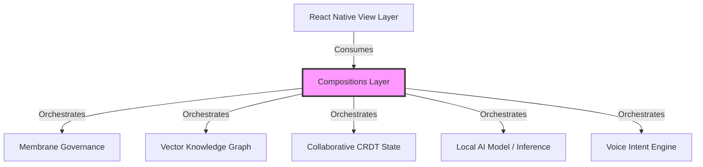

# Zoe Framework Compositions, Blueprints, & Semantic CRUD Architecture

The Compositions subsystem under [src/framework/compositions](file:///Users/sac/zoeapp/src/framework/compositions) is the synthesis layer of the Zoe Framework. It weaves together lower-level subsystems—such as the Vector Knowledge Graph (VKG), Conflict-free Replicated Data Types (CRDTs), Operational Membranes, on-device AI inference, local search engines, accessibility, and 3D XR layout layers—into unified, feature-rich modules.

---

## 1. Tutorial (Learning-oriented)

### Getting Started with Resilient, Collaborative Semantic Task Management

This tutorial guides you from scratch through creating a collaborative, self-healing, voice-accessible Task Manager screen. You will:
1. Wrap the application root with the `VkgProvider`.
2. Define a `ResilientBoundary` to govern execution and enable self-healing.
3. Instantiate a CRDT-backed `CollaborativeWorkspace` for task state.
4. Render a `SemanticCrudManager` to execute CRUD operations on Schema.org entities.
5. Apply a `VoiceAccessibleText` title.

#### Prerequisites
Ensure your project contains:
- `react-native` and `react` environment
- `@testing-library/react-native` (for verifying tests)
- Standard Zoe context providers (`VkgProvider`, `MembraneContext`)

---

### Step 1: Wrap Your Application Root with VkgProvider
To enable the Semantic CRUD Manager to read and write graph triples via `useVkg`, the application root must be wrapped in `VkgProvider`.

Create or update `src/App.tsx`:
```tsx
import React from 'react';
import { SafeAreaProvider } from 'react-native-safe-area-context';
import { VkgProvider } from './framework/vkg/react';
import { TaskManagerComposition } from './screens/TaskManagerComposition';

export default function App() {
  return (
    <SafeAreaProvider>
      <VkgProvider>
        <TaskManagerComposition />
      </VkgProvider>
    </SafeAreaProvider>
  );
}
```

---

### Step 2: Establish the Resilient Execution Context
To ensure that state mutations are governed and can automatically recover from errors, wrap the screen in a `ResilientBoundary`.

Create `src/screens/TaskManagerComposition.tsx`:
```tsx
import React, { useMemo } from 'react';
import { StyleSheet, View } from 'react-native';
import { ResilientBoundary } from '../framework/compositions/self-healing-logic/ResilientBoundary';
import { CollaborativeWorkspace } from '../framework/compositions/collaborative-state/CollaborativeWorkspace';
import { SemanticCrudManager } from '../framework/compositions/semantic-crud/SemanticCrudManager';
import { VoiceAccessibleText } from '../framework/compositions/inclusive-ui/VoiceAccessibleText';
import { MembraneContext } from '../lib/membrane/context';

export function TaskManagerComposition() {
  // 1. Configure Membrane Context for strict capability monitoring
  const membraneConfig = useMemo(() => ({
    id: 'task-membrane',
    rules: [
      {
        capabilityId: 'vkg.write',
        allowedRoles: ['admin', 'volunteer'],
      }
    ]
  }), []);

  const healingConfig = useMemo(() => ({
    maxRetries: 3,
    autoRecovery: true,
  }), []);

  return (
    <ResilientBoundary config={membraneConfig} healingConfig={healingConfig}>
      <TaskManagerContent />
    </ResilientBoundary>
  );
}
```

---

### Step 3: Initialize the Collaborative CRDT Workspace and Render Semantic CRUD
Now, add the Zustand-reactive CRDT workspace and the Semantic CRUD Manager within the boundaries. The workspace handles real-time synchronization, while the CRUD Manager coordinates list, details, creation, and editing views.

Extend `src/screens/TaskManagerComposition.tsx` with the following content:
```tsx
interface TaskWorkspaceState extends Object {
  lastActionUser: string;
  totalSyncedCount: number;
}

function TaskManagerContent() {
  // 2. Establish Membrane Context instance for state proxying
  const context = new MembraneContext({
    mode: 'strict',
    tenantId: 'tenant-zoe-tasks',
    authorityRole: 'volunteer',
  });

  // 3. Create a Conflict-free Collaborative State Workspace
  const workspace = useMemo(() => {
    return new CollaborativeWorkspace<TaskWorkspaceState>({
      id: 'task-crdt-workspace',
      peerId: 'peer-local-user-1',
      initialState: {
        lastActionUser: 'system',
        totalSyncedCount: 0,
      },
      context,
      onSync: (state) => {
        console.log('[Workspace Sync] CRDT state updated:', state);
      },
    });
  }, [context]);

  // Reactive store hook generated by the collaborative workspace
  const useWorkspaceStore = workspace.store;
  const lastActionUser = useWorkspaceStore((state) => state.lastActionUser);

  // 4. Handle callbacks from SemanticCrudManager
  const handleEntityCreate = (data: Record<string, any>) => {
    workspace.state.lastActionUser = 'local-creator';
    workspace.state.totalSyncedCount += 1;
    console.log('[CRUD] Created Task Entity:', data);
  };

  const handleEntityDelete = (entityId: string) => {
    workspace.state.lastActionUser = 'local-deleter';
    console.log('[CRUD] Deleted Task Entity:', entityId);
  };

  return (
    <View style={styles.container}>
      {/* 5. Voice Accessible Header */}
      <VoiceAccessibleText
        style={styles.headerTitle}
        i18nKey="task_manager_title"
        voiceCommandPrefix="focus"
        onVoiceFocus={() => console.log('[Voice] Header focused')}
      >
        Collaborative Tasks Panel
      </VoiceAccessibleText>

      <VoiceAccessibleText style={styles.statusBar}>
        {`Last operation by: ${lastActionUser}`}
      </VoiceAccessibleText>

      {/* 6. Semantic CRUD Manager bound to Schema.org Task entity */}
      <View style={styles.crudWrapper}>
        <SemanticCrudManager
          targetType="https://schema.org/Action"
          onEntityCreate={handleEntityCreate}
          onEntityDelete={handleEntityDelete}
        />
      </View>
    </View>
  );
}

const styles = StyleSheet.create({
  container: {
    flex: 1,
    paddingTop: 50,
    backgroundColor: '#F8FAFC',
  },
  headerTitle: {
    fontSize: 24,
    fontWeight: 'bold',
    textAlign: 'center',
    color: '#0F172A',
    marginBottom: 8,
  },
  statusBar: {
    fontSize: 12,
    textAlign: 'center',
    color: '#64748B',
    marginBottom: 16,
  },
  crudWrapper: {
    flex: 1,
  },
});
```

---

## 2. How-To Guide (Task-oriented)

### Goal: Programmatic Generation & Deployment of a Custom Semantic Entity Workflow using Blueprints

This guide shows how to programmatically scaffold and deploy a custom entity view (e.g. `Sermon`) with AI search and network sync integration using Zoe's compositional blueprints.

We will write:
1. A Node compilation/scaffolding script (`scripts/scaffold-sermon.ts`) using the `crud-ai-sync` blueprint.
2. A deployment shell component (`src/screens/SermonWorkflowScreen.tsx`) demonstrating the dynamic integration of generated assets.

---

### Step 1: Programmatically Scaffold the Sermon Entity
Create a script at `scripts/scaffold-sermon.ts` that loads the compositions blueprint catalog, feeds in the parameters, and writes the files directly to the project workspace:

```typescript
import * as fs from 'fs';
import * as path from 'path';
import { blueprints } from '../src/framework/compositions/blueprints';

/**
 * CLI Scaffolder using the 'crud-ai-sync' Compositional Blueprint.
 * Run using: npx ts-node scripts/scaffold-sermon.ts
 */
export async function runScaffolder() {
  const targetEntity = 'Sermon';
  const blueprintName = 'crud-ai-sync';
  
  const blueprint = blueprints[blueprintName];
  if (!blueprint) {
    throw new Error(`Blueprint ${blueprintName} not found in compositions registry.`);
  }

  console.log(`[Scaffold] Generating files for: ${targetEntity} using ${blueprint.name}...`);
  const generatedFiles = blueprint.generate(targetEntity);

  const baseDir = path.resolve(__dirname, '..');

  for (const file of generatedFiles) {
    const absolutePath = path.join(baseDir, file.path);
    const parentDir = path.dirname(absolutePath);

    // Create directories if they do not exist
    if (!fs.existsSync(parentDir)) {
      fs.mkdirSync(parentDir, { recursive: true });
    }

    fs.writeFileSync(absolutePath, file.content, 'utf8');
    console.log(`[Generated File] -> ${file.path}`);
  }

  console.log('[Scaffold] Success! Generated all files.');
}

// Execute script if run directly
if (require.main === module) {
  runScaffolder().catch((err) => {
    console.error('[Scaffold Error]', err);
    process.exit(1);
  });
}
```

---

### Step 2: Integrate the Generated Screens into Your Router
Once scaffolded, the generator creates:
- `src/types/semantic/Sermon.ts`
- `src/hooks/useSermon.ts`
- `src/components/SermonCard.tsx`
- `src/sync/SermonSyncHandler.ts`
- `src/capabilities/sermon-search.ts`
- `src/screens/SermonCompositionScreen.tsx`

You can now immediately wire the new `SermonCompositionScreen` inside an application layout wrapped in standard resilience boundaries and local AI capabilities.

Create `src/screens/SermonWorkflowScreen.tsx`:
```tsx
import React, { useMemo } from 'react';
import { View, StyleSheet, Text } from 'react-native';
import { ResilientBoundary } from '../framework/compositions/self-healing-logic/ResilientBoundary';
import { SermonCompositionScreen } from '../screens/SermonCompositionScreen';
import { AiSmartSearch } from '../framework/compositions/intelligent-search/AiSmartSearch';
import { useTranslation } from '../framework/core/i18n/useTranslation';

export const SermonWorkflowScreen: React.FC = () => {
  const { t } = useTranslation();

  const membraneConfig = useMemo(() => ({
    id: 'sermon-membrane',
    rules: [
      {
        capabilityId: 'sermon-search',
        allowedRoles: ['admin', 'user', 'guest'],
      }
    ],
  }), []);

  const handleSearchResults = (results: any[]) => {
    console.log('[Search] Found sermon matches:', results);
  };

  return (
    <ResilientBoundary config={membraneConfig}>
      <View style={styles.container}>
        <View style={styles.header}>
          <Text style={styles.headerTitle}>
            {t('sermon_dashboard_title', { defaultValue: 'Sermon Archive' })}
          </Text>
        </View>

        {/* AI Smart Search widget utilizing Phi-2 on-device expansion */}
        <View style={styles.searchContainer}>
          <AiSmartSearch
            query="faith and resilience in adversity"
            options={{ threshold: 0.65, limit: 5, useAiExpansion: true }}
            onResults={handleSearchResults}
            onError={(err) => console.error('[AI Search Error]', err)}
          />
        </View>

        {/* Scaffolded CRUD + Sync screen */}
        <View style={styles.content}>
          <SermonCompositionScreen />
        </View>
      </View>
    </ResilientBoundary>
  );
};

const styles = StyleSheet.create({
  container: {
    flex: 1,
    backgroundColor: '#0F172A', // Slate-900 theme
  },
  header: {
    paddingTop: 60,
    paddingBottom: 20,
    paddingHorizontal: 16,
    borderBottomWidth: 1,
    borderBottomColor: '#1E293B',
  },
  headerTitle: {
    fontSize: 22,
    fontWeight: 'bold',
    color: '#F8FAFC',
  },
  searchContainer: {
    padding: 16,
    borderBottomWidth: 1,
    borderBottomColor: '#1E293B',
  },
  content: {
    flex: 1,
  },
});
```

---

## 3. Reference Guide (Information-oriented)

### Directory Layout

The directory layout of the compositions module is structured as follows. Click on any file to open it directly in the filesystem:

* [index.ts](file:///Users/sac/zoeapp/src/framework/compositions/index.ts) - Main framework entrypoint exporting all compositions.
* [auth-ui/index.ts](file:///Users/sac/zoeapp/src/framework/compositions/auth-ui/index.ts) - Authentication interface entrypoint.
* [auth-ui/components/UnifiedAuthScreen.tsx](file:///Users/sac/zoeapp/src/framework/compositions/auth-ui/components/UnifiedAuthScreen.tsx) - Interactive screen integrating biometric and MFA logins.
* [blueprints/index.ts](file:///Users/sac/zoeapp/src/framework/compositions/blueprints/index.ts) - Index file mapping all scaffold blueprints.
* [blueprints/types.ts](file:///Users/sac/zoeapp/src/framework/compositions/blueprints/types.ts) - Type declarations for blueprint definitions.
* [blueprints/generators/crud-generator.ts](file:///Users/sac/zoeapp/src/framework/compositions/blueprints/generators/crud-generator.ts) - Generators mapping entities to scaffolding arrays.
* [blueprints/templates/crud-ai-sync.ts](file:///Users/sac/zoeapp/src/framework/compositions/blueprints/templates/crud-ai-sync.ts) - Code templates for semantic types, hooks, sync, UI, and screens.
* [collaborative-state/index.ts](file:///Users/sac/zoeapp/src/framework/compositions/collaborative-state/index.ts) - Collaborative state synchronization exports.
* [collaborative-state/CollaborativeWorkspace.ts](file:///Users/sac/zoeapp/src/framework/compositions/collaborative-state/CollaborativeWorkspace.ts) - CRDT Zustand integration container.
* [inclusive-ui/index.ts](file:///Users/sac/zoeapp/src/framework/compositions/inclusive-ui/index.ts) - Accessibility composition entrypoint.
* [inclusive-ui/VoiceAccessibleText.tsx](file:///Users/sac/zoeapp/src/framework/compositions/inclusive-ui/VoiceAccessibleText.tsx) - Accessibility & voice-intent text component.
* [inclusive-ui/useInclusiveInteraction.ts](file:///Users/sac/zoeapp/src/framework/compositions/inclusive-ui/useInclusiveInteraction.ts) - Hook binding i18n, voice commands, and accessibility tags.
* [intelligent-search/index.ts](file:///Users/sac/zoeapp/src/framework/compositions/intelligent-search/index.ts) - Smart AI-based query parser exports.
* [intelligent-search/types.ts](file:///Users/sac/zoeapp/src/framework/compositions/intelligent-search/types.ts) - Types for AI search.
* [intelligent-search/AiSmartSearch.tsx](file:///Users/sac/zoeapp/src/framework/compositions/intelligent-search/AiSmartSearch.tsx) - Declarative UI shell for expanded local queries.
* [intelligent-search/useIntelligentSearch.ts](file:///Users/sac/zoeapp/src/framework/compositions/intelligent-search/useIntelligentSearch.ts) - AI expansion hook integrating Phi-2 model.
* [mission-control/index.ts](file:///Users/sac/zoeapp/src/framework/compositions/mission-control/index.ts) - Administration UI and diagnostics entrypoint.
* [mission-control/MissionControl.tsx](file:///Users/sac/zoeapp/src/framework/compositions/mission-control/MissionControl.tsx) - Panel linking 3D topology graphs with system health.
* [mission-control/SystemHealthDashboard.tsx](file:///Users/sac/zoeapp/src/framework/compositions/mission-control/SystemHealthDashboard.tsx) - Screen measuring JS/UI threads FPS and memory consumption.
* [platform-orchestration/index.ts](file:///Users/sac/zoeapp/src/framework/compositions/platform-orchestration/index.ts) - System kernel and federation exports.
* [platform-orchestration/PlatformKernel.tsx](file:///Users/sac/zoeapp/src/framework/compositions/platform-orchestration/PlatformKernel.tsx) - Orchestration kernel for loading federated modules.
* [self-healing-logic/index.ts](file:///Users/sac/zoeapp/src/framework/compositions/self-healing-logic/index.ts) - Resilient error handling entrypoint.
* [self-healing-logic/ResilientBoundary.tsx](file:///Users/sac/zoeapp/src/framework/compositions/self-healing-logic/ResilientBoundary.tsx) - Root provider binding membranes and AutoFix boundary.
* [self-healing-logic/useResilientCallback.ts](file:///Users/sac/zoeapp/src/framework/compositions/self-healing-logic/useResilientCallback.ts) - Hook driving retries, membrane rules, and self-healing.
* [semantic-crud/index.ts](file:///Users/sac/zoeapp/src/framework/compositions/semantic-crud/index.ts) - CRUD orchestration entrypoint.
* [semantic-crud/types.ts](file:///Users/sac/zoeapp/src/framework/compositions/semantic-crud/types.ts) - Semantic CRUD view modes and options types.
* [semantic-crud/SemanticCrudManager.tsx](file:///Users/sac/zoeapp/src/framework/compositions/semantic-crud/SemanticCrudManager.tsx) - Interactive CRUD controller linking form schemas and graph deltas.
* [semantic-crud/SemanticListView.tsx](file:///Users/sac/zoeapp/src/framework/compositions/semantic-crud/SemanticListView.tsx) - Highly optimized search list powered by offline-first indices.
* [spatial-dashboards/index.ts](file:///Users/sac/zoeapp/src/framework/compositions/spatial-dashboards/index.ts) - spatial dashboard layout exports.
* [spatial-dashboards/GlassSpatialContainer.tsx](file:///Users/sac/zoeapp/src/framework/compositions/spatial-dashboards/GlassSpatialContainer.tsx) - Container translating Glassmorphism components into 3D spatial grids.

#### Test Suites (Verified & Complete)
* [blueprints.test.ts](file:///Users/sac/zoeapp/src/framework/compositions/blueprints/__tests__/blueprints.test.ts) - Verifies structural template content generation.
* [CollaborativeWorkspace.test.ts](file:///Users/sac/zoeapp/src/framework/compositions/collaborative-state/__tests__/CollaborativeWorkspace.test.ts) - Asserts CRDT merge logic and Zustand updates.
* [InclusiveUI.test.tsx](file:///Users/sac/zoeapp/src/framework/compositions/inclusive-ui/__tests__/InclusiveUI.test.tsx) - Asserts voice command and layout localization bindings.
* [AiSmartSearch.test.tsx](file:///Users/sac/zoeapp/src/framework/compositions/intelligent-search/__tests__/AiSmartSearch.test.tsx) - Validates rendering and search results callbacks.
* [useIntelligentSearch.test.ts](file:///Users/sac/zoeapp/src/framework/compositions/intelligent-search/__tests__/useIntelligentSearch.test.ts) - Tests Phi-2 prompt expansions and graph querying fallbacks.
* [MissionControl.test.tsx](file:///Users/sac/zoeapp/src/framework/compositions/mission-control/__tests__/MissionControl.test.tsx) - Asserts top-level layout integrity.
* [SystemHealthDashboard.test.tsx](file:///Users/sac/zoeapp/src/framework/compositions/mission-control/__tests__/SystemHealthDashboard.test.tsx) - Verifies thread vital statistics calculations.
* [PlatformKernel.test.tsx](file:///Users/sac/zoeapp/src/framework/compositions/platform-orchestration/__tests__/PlatformKernel.test.tsx) - Asserts pre-loading triggers on AppState transitions.
* [SemanticCrudManager.test.tsx](file:///Users/sac/zoeapp/src/framework/compositions/semantic-crud/__tests__/SemanticCrudManager.test.tsx) - Validates navigation states and triple delta persistence.
* [SemanticListView.test.tsx](file:///Users/sac/zoeapp/src/framework/compositions/semantic-crud/__tests__/SemanticListView.test.tsx) - Asserts loading indicators, lists, and filter inputs.
* [GlassSpatialContainer.test.tsx](file:///Users/sac/zoeapp/src/framework/compositions/spatial-dashboards/__tests__/GlassSpatialContainer.test.tsx) - Asserts spatial coordinates and layout styling.

---

### Core API Contracts & TypeScript Definitions

#### 1. Compositional Blueprints Types
```typescript
export interface BlueprintFile {
  path: string;
  content: string;
}

export interface CompositionalBlueprint {
  name: string;
  description: string;
  generate: (name: string, options?: any) => BlueprintFile[];
}
```

#### 2. Collaborative Workspace Config
```typescript
import { LWWMapState } from '../../sync/crdt/types';
import { MembraneContext } from '../../../lib/membrane/context';

export interface CollaborativeWorkspaceConfig<T extends object> {
  id: string;
  peerId: string;
  initialState: T;
  context: MembraneContext;
  onSync?: (state: LWWMapState<any>) => void;
}

export class CollaborativeWorkspace<T extends object> {
  constructor(config: CollaborativeWorkspaceConfig<T>);
  public get state(): T;
  public get store(): any; // Zustand hook
  public get crdtState(): LWWMapState<any>;
  public receiveUpdate(remoteState: LWWMapState<any>): void;
}
```

#### 3. Semantic CRUD Manager Props
```typescript
export type CrudViewMode = 'list' | 'create' | 'edit' | 'details';

export interface SemanticCrudState {
  mode: CrudViewMode;
  selectedEntityId: string | null;
  searchQuery: string;
}

export interface SemanticCrudManagerProps {
  targetType: string; // E.g., 'https://schema.org/Person'
  onEntitySelect?: (entityId: string) => void;
  onEntityCreate?: (data: Record<string, any>) => void;
  onEntityUpdate?: (entityId: string, data: Record<string, any>) => void;
  onEntityDelete?: (entityId: string) => void;
}
```

#### 4. useInclusiveInteraction Hook Configuration
```typescript
import { AutoA11yOptions, A11yProps } from '../../ui/a11y/types';

export interface InclusiveInteractionOptions {
  id: string;
  i18nKey?: string;
  i18nOptions?: Record<string, any>;
  label?: string;
  a11yOptions?: AutoA11yOptions;
  voiceCommands?: string[];
  action: () => void | Promise<void>;
  priority?: number;
}

export interface InclusiveInteractionResult {
  a11yProps: A11yProps;
  label: string;
  t: (key: string, options?: any) => string;
}

export function useInclusiveInteraction(options: InclusiveInteractionOptions): InclusiveInteractionResult;
```

#### 5. useResilientCallback Signature
```typescript
import { SupervisionPolicy } from '../../../lib/actor/types';

export function useResilientCallback<T, Args extends any[]>(
  callback: (...args: Args) => Promise<T>,
  capabilityId: string,
  policy?: SupervisionPolicy
): (...args: Args) => Promise<T>;
```

---

## 4. Explanation (Understanding-oriented)

### Architectural Design: The Composition Layer

The compositions directory acts as a orchestration mediator in Zoe’s layered architecture. It explicitly separates horizontal infrastructure components (data storage, translation, voice engines) from vertical application logic. Instead of screens interacting directly with raw network layers or localized state machines, they bind to composed boundaries.



---

### Mathematical Rationale: The Chatman Equation

The behavior of the compositions layer is governed by the Chatman Equation:

$$R \vdash A = \mu(O^*)$$

Where:
* **$R$ (Reference System)**: The decentralized repository of the Vector Knowledge Graph (VKG), locally cached SQLite nodes, and conflict-free LWW maps.
* **$A$ (Agentic Action / Application Execution)**: The rendered screen states, user actions, form submissions, and voice triggers.
* **$\mu$ (Membrane Mapping)**: The operational membrane policy restricting capabilities, auditing variables, and sandboxing executions.
* **$O^*$ (Optimal Trajectory)**: The desired state trajectory of the app (i.e. correct local synchronization, minimal UI thread blockage, and error-free self-healing).

In Zoe's composition model, the application guarantees that any state action $A$ executed under reference conditions $R$ will map directly to the optimal trajectory $O^*$ because the membrane $\mu$ intercepts and sanitizes all transitions.

For example, when a user saves a form in `SemanticCrudManager`:
1. The raw values are trapped by the Membrane proxy in `CollaborativeWorkspace`.
2. The Membrane verifies the credentials and schema types ($\mu$).
3. The mutation is saved locally as an RDF delta (writing to $R$).
4. The system state remains within high-integrity bounds ($O^*$), preventing illegal writes or local memory leaks.

---

### Design Trade-offs & Engineering Constraints

#### 1. Abstraction Overhead vs React Performance
* **Trade-off**: The `CollaborativeWorkspace` maps Zustand state to an underlying `LWWMap` (CRDT) through a membrane proxy. This double-layer indirection introduces proxy traps for every read/write operation.
* **Mitigation**: Traps are optimized to run synchronously. Properties that are not bound to active components skip store updates, avoiding unnecessary component re-renders.

#### 2. Local AI Model Execution on Mobile Threading
* **Constraint**: On-device LLM inference using Phi-2 occurs asynchronously on the device's CPU/GPU. If handled poorly, query expansion inside `useIntelligentSearch` can block the React Native JS thread.
* **Design Solution**: AI search runs entirely off-thread via local runtime bindings. The `useLocalInference` hook operates via React Native NativeModules, ensuring the UI thread remains responsive (60+ FPS) while the network query is expanded.

#### 3. Real-Time Sync and Offline Conflict Resolution
* **Design Decision**: Local-first systems must function seamlessly offline. Zoe uses Last-Write-Wins Map (`LWWMap`) CRDTs. While this guarantees eventual consistency and solves race conditions, it assumes that system clocks are synchronized. If a user’s local clock drifts significantly, their writes might be discarded.
* **Constraint**: Applications requiring strictly ordered non-timestamped histories should build custom vector clock middlewares on top of the CRDT payload.
