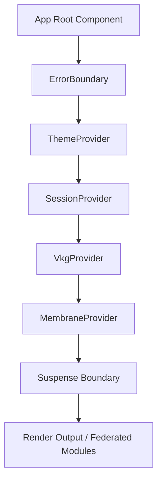

# Core Wrapper Provider and Lifecycles: Architectural & Integration Guide

This guide details the core wrapper provider structure, unified contexts, and execution lifecycles of the Zoe Framework located at [framework/core](file:///Users/sac/zoeapp/src/framework/core). It serves as the master entrypoint for bootstrap orchestration, error boundaries, security membranes, internationalization, theme propagation, session gating, and Visual Knowledge Graph (VKG) telemetry under the Zoe 2030 Innovation Peak.

---

## 1. Tutorial: Bootstrapping Zoe Framework Core from Scratch

This tutorial walks through creating a React Native application shell, configuring context overrides, nesting the providers within the `ZoeFrameworkProvider`, and verifying active execution lifecycle hooks.

### Step 1: Install & Set Up Core Context Dependencies
Ensure you have the required native libraries and environment configurations. The core wrapper relies on the following subsystems:
1. **Supabase Auth**: Managed via [SessionProvider.tsx](file:///Users/sac/zoeapp/context/SessionProvider.tsx)
2. **Local MMKV/Storage Store**: Managed for theme persistence and cryptographic receipts
3. **NativeWind**: Tailwind CSS styles injection via variables
4. **Vector Knowledge Graph (VKG)**: Implemented in [VkgProvider.tsx](file:///Users/sac/zoeapp/src/components/VkgProvider.tsx)

### Step 2: Configure the Global Root Wrapper
In your application root entry point (e.g., `App.tsx` or `app/_layout.tsx`), import and mount the `<ZoeFrameworkProvider>`:

```tsx
import React from 'react';
import { StyleSheet, View, ActivityIndicator } from 'react-native';
import { ZoeFrameworkProvider } from '/Users/sac/zoeapp/src/framework/core/ZoeFrameworkProvider';
import { Text } from 'react-native';

// Provide custom styling for the global loading states
const AppLoadingFallback = () => (
  <View style={styles.loadingContainer}>
    <ActivityIndicator size="large" color="#6366f1" />
  </View>
);

// Custom Error boundary UI recovery screen
const AppErrorFallback = (error: Error, resetError: () => void) => (
  <View style={styles.errorContainer}>
    <Text style={styles.errorTitle}>Critical System Interruption</Text>
    <Text style={styles.errorMessage}>{error.message}</Text>
    <Text style={styles.errorButton} onPress={resetError}>
      Perform System Reset
    </Text>
  </View>
);

export default function App() {
  return (
    <ZoeFrameworkProvider
      membraneConfig={{
        mode: 'strict',
        tenantId: 'tutorial-tenant-id',
        authorityRole: 'member',
      }}
      suspenseFallback={<AppLoadingFallback />}
      errorFallback={AppErrorFallback}
      onError={(error, errorInfo) => {
        console.error('Core Error boundary intercepted:', error, errorInfo);
      }}
    >
      <MainAppShell />
    </ZoeFrameworkProvider>
  );
}

const styles = StyleSheet.create({
  loadingContainer: {
    flex: 1,
    justifyContent: 'center',
    alignItems: 'center',
    backgroundColor: '#0f172a',
  },
  errorContainer: {
    flex: 1,
    justifyContent: 'center',
    alignItems: 'center',
    backgroundColor: '#1e1b4b',
    padding: 24,
  },
  errorTitle: {
    color: '#f8fafc',
    fontSize: 22,
    fontWeight: 'bold',
    marginBottom: 12,
  },
  errorMessage: {
    color: '#fda4af',
    fontSize: 14,
    textAlign: 'center',
    marginBottom: 24,
  },
  errorButton: {
    color: '#ffffff',
    backgroundColor: '#6366f1',
    paddingHorizontal: 20,
    paddingVertical: 10,
    borderRadius: 8,
    fontWeight: 'bold',
    overflow: 'hidden',
  },
});
```

### Step 3: Implement Context Accessors
Create a workspace panel component inside the wrapper that accesses the resolved states of the session, the membrane boundary, and the VKG engines.

```tsx
import React, { useEffect } from 'react';
import { View, Text, StyleSheet, Button } from 'react-native';
import { useSession } from '/Users/sac/zoeapp/context/SessionProvider';
import { useMembrane } from '/Users/sac/zoeapp/src/framework/core/MembraneProvider';
import { useVkgEngine } from '/Users/sac/zoeapp/src/components/VkgProvider';
import { useTheme } from '/Users/sac/zoeapp/src/framework/ui/theme/useTheme';

export function MainAppShell() {
  const { session, loading } = useSession();
  const membrane = useMembrane();
  const vkg = useVkgEngine();
  const { theme, updateTheme } = useTheme();

  // Print context state triggers to console for lifecycle observation
  useEffect(() => {
    console.log('MainAppShell Mounted. Context configurations verified:');
    console.log('Membrane Tenant Mode:', membrane.getConfig().mode);
    console.log('Active Avatar Role:', vkg.avatar);
  }, [membrane, vkg]);

  if (loading) {
    return <Text style={{ color: theme.colors.text }}>Initializing Authentication Session...</Text>;
  }

  return (
    <View style={[styles.container, { backgroundColor: theme.colors.background }]}>
      <Text style={[styles.text, { color: theme.colors.text }]}>
        Active User: {session?.user?.email || 'Guest User (Anonymous)'}
      </Text>
      <Text style={[styles.text, { color: theme.colors.text }]}>
        Security Context: {membrane.getConfig().authorityRole} / Tenant {membrane.getConfig().tenantId}
      </Text>
      <Text style={[styles.text, { color: theme.colors.text }]}>
        VKG State (Processed Receipts): {vkg.processedReceipts}
      </Text>
      
      <View style={styles.buttonSpacing}>
        <Button
          title="Trigger VKG Action"
          onPress={() => vkg.triggerHook('volunteers', 'cancel_shift', 'shift_45')}
        />
      </View>

      <View style={styles.buttonSpacing}>
        <Button
          title="Switch to Dark Mode Palette"
          onPress={() => updateTheme({ colors: { ...theme.colors, background: '#020617', text: '#f8fafc' } })}
        />
      </View>
    </View>
  );
}

const styles = StyleSheet.create({
  container: {
    flex: 1,
    justifyContent: 'center',
    alignItems: 'center',
    padding: 16,
  },
  text: {
    fontSize: 16,
    marginBottom: 8,
  },
  buttonSpacing: {
    marginVertical: 6,
    width: '80%',
  }
});
```

---

## 2. How-To Guide: Rendering a Responsive Projection View with Route Gate Enforcements

This guide shows how to leverage the core provider wrapper sub-components to solve a common complex task: **Protecting a route segment using a custom disclosure and rendering a responsive visual projection mapped to the active role state.**

### Goal
Create a dashboard component gated by a route rule checking for MFA/Verified identity parameters and rendering a responsive list of pending roles loaded via the visual knowledge graph.

```tsx
import React from 'react';
import { View, Text, StyleSheet, ScrollView, ActivityIndicator } from 'react-native';
import { ProtectedRoute } from '/Users/sac/zoeapp/src/route-law/ProtectedRoute';
import { RouteDefinition } from '/Users/sac/zoeapp/src/route-law/types';
import { useVkgEngine } from '/Users/sac/zoeapp/src/components/VkgProvider';
import { useTheme } from '/Users/sac/zoeapp/src/framework/ui/theme/useTheme';

// Define route boundary constraints requiring verified identities and terms disclosure
const secureDashboardRoute: RouteDefinition = {
  path: '/admin/dashboard',
  requiredIdentityBoundary: 'verified',
  requiredDisclosures: ['email_verified', 'terms_accepted'],
};

// Component inside route gate that draws data from VKG provider projections
function DashboardContent() {
  const { projection, pendingReceipts } = useVkgEngine();
  const { theme } = useTheme();

  if (!projection) {
    return (
      <View style={styles.centerContainer}>
        <ActivityIndicator size="small" color={theme.colors.primary} />
        <Text style={{ color: theme.colors.text, marginTop: 8 }}>
          Generating avatar projections...
        </Text>
      </View>
    );
  }

  return (
    <ScrollView style={[styles.scrollContainer, { backgroundColor: theme.colors.background }]}>
      <View style={styles.header}>
        <Text style={[styles.title, { color: theme.colors.text }]}>
          Command Console Projection
        </Text>
        {pendingReceipts > 0 && (
          <View style={styles.pendingBadge}>
            <Text style={styles.pendingText}>{pendingReceipts} Pending Offloads</Text>
          </View>
        )}
      </View>

      <View style={[styles.card, { backgroundColor: theme.colors.card, borderColor: theme.colors.border }]}>
        <Text style={[styles.label, { color: theme.colors.text }]}>
          Mapped Role Identity: {projection.role}
        </Text>
        <Text style={[styles.label, { color: theme.colors.text }]}>
          State Hash Validity: Verified
        </Text>
      </View>

      <View style={styles.section}>
        <Text style={[styles.sectionTitle, { color: theme.colors.text }]}>
          Active Node Variables
        </Text>
        <Text style={{ color: theme.colors.text }}>
          Open Slots: {projection.state?.openSlots ?? 0}
        </Text>
        <Text style={{ color: theme.colors.text }}>
          Shortage Ratio: {((projection.state?.shortageRatio ?? 0) * 100).toFixed(1)}%
        </Text>
      </View>
    </ScrollView>
  );
}

// Wrapper providing gating and fallback behaviors
export function SecureDashboardScreen() {
  const { theme } = useTheme();

  return (
    <ProtectedRoute
      route={secureDashboardRoute}
      loadingComponent={
        <View style={[styles.centerContainer, { backgroundColor: theme.colors.background }]}>
          <ActivityIndicator size="large" color={theme.colors.primary} />
          <Text style={{ color: theme.colors.text, marginTop: 12 }}>
            Checking security clearance...
          </Text>
        </View>
      }
      fallback={(refusal) => (
        <View style={[styles.centerContainer, { backgroundColor: '#1e1b4b' }]}>
          <Text style={{ color: '#fda4af', fontSize: 18, fontrWeight: 'bold' }}>
            Access Refused
          </Text>
          <Text style={{ color: '#f8fafc', marginTop: 8, textAlign: 'center', paddingHorizontal: 24 }}>
            {refusal.message} (Error: {refusal.code})
          </Text>
        </View>
      )}
    >
      <DashboardContent />
    </ProtectedRoute>
  );
}

const styles = StyleSheet.create({
  scrollContainer: {
    flex: 1,
    padding: 16,
  },
  centerContainer: {
    flex: 1,
    justifyContent: 'center',
    alignItems: 'center',
  },
  header: {
    flexDirection: 'row',
    justifyContent: 'space-between',
    alignItems: 'center',
    marginBottom: 20,
  },
  title: {
    fontSize: 24,
    fontWeight: 'bold',
  },
  pendingBadge: {
    backgroundColor: '#f59e0b',
    paddingHorizontal: 8,
    paddingVertical: 4,
    borderRadius: 6,
  },
  pendingText: {
    color: '#ffffff',
    fontSize: 12,
    fontWeight: 'bold',
  },
  card: {
    padding: 16,
    borderRadius: 12,
    borderWidth: 1,
    marginBottom: 16,
  },
  label: {
    fontSize: 14,
    fontWeight: '600',
    marginBottom: 4,
  },
  section: {
    marginTop: 12,
  },
  sectionTitle: {
    fontSize: 18,
    fontWeight: 'bold',
    marginBottom: 8,
  },
});
```

---

## 3. Reference: Core API Contracts & Layouts

### Directory Structure & Links

The foundational framework files located inside [src/framework/core](file:///Users/sac/zoeapp/src/framework/core) include:

- [index.ts](file:///Users/sac/zoeapp/src/framework/core/index.ts) - The module exports registry resolving wrappers and hooks.
- [ZoeFrameworkProvider.tsx](file:///Users/sac/zoeapp/src/framework/core/ZoeFrameworkProvider.tsx) - Root provider composing other sub-contexts.
- [MembraneProvider.tsx](file:///Users/sac/zoeapp/src/framework/core/MembraneProvider.tsx) - Local security membrane orchestrator.
- [ErrorBoundary.tsx](file:///Users/sac/zoeapp/src/framework/core/ErrorBoundary.tsx) - Crash containment block for UI layers.
- [i18n/I18nProvider.tsx](file:///Users/sac/zoeapp/src/framework/core/i18n/I18nProvider.tsx) - Localized text interpolation and pluralization provider.
- [micro-frontend/FederatedComponent.tsx](file:///Users/sac/zoeapp/src/framework/core/micro-frontend/FederatedComponent.tsx) - Dynamic bundle loader and lifecycle management component.

External providers integrated by the root wrapper:
- [SessionProvider.tsx](file:///Users/sac/zoeapp/context/SessionProvider.tsx) - User session management hook and context.
- [VkgProvider.tsx](file:///Users/sac/zoeapp/src/components/VkgProvider.tsx) - Knowledge graph state and avatar projections engine.
- [ThemeContext.tsx](file:///Users/sac/zoeapp/src/framework/ui/theme/ThemeContext.tsx) - NativeWind theme values injector.
- [context.ts](file:///Users/sac/zoeapp/src/lib/membrane/context.ts) - Lower-level membrane runtime wrapper.

---

### Component Interface Specs

#### `<ZoeFrameworkProvider>`
Main orchestrator. Imports all dependencies in the sequence required for reliable hydration.

| Prop | Type | Description |
|---|---|---|
| `children` | `ReactNode` | Children rendering within nested wrappers. |
| `membraneConfig` | `Partial<MembraneConfig>` | Overrides for default security policies. |
| `errorFallback` | `ReactNode \| ((error: Error, reset: () => void) => ReactNode)` | Renders UI when component crashes. |
| `onError` | `(error: Error, info: ErrorInfo) => void` | Event handler dispatched on rendering issues. |
| `suspenseFallback` | `ReactNode` | Shown when lazy loaded elements are parsing. |

```typescript
export interface ZoeFrameworkProviderProps {
  children: ReactNode;
  membraneConfig?: Partial<MembraneConfig>;
  errorFallback?: ReactNode | ((error: Error, resetError: () => void) => ReactNode);
  onError?: (error: Error, errorInfo: React.ErrorInfo) => void;
  suspenseFallback?: ReactNode;
}
```

#### `<ErrorBoundary>`
Stateful React boundary catching rendering loops.

```typescript
export interface ErrorBoundaryProps {
  children: ReactNode;
  fallback?: ReactNode | ((error: Error, resetError: () => void) => ReactNode);
  onError?: (error: Error, errorInfo: ErrorInfo) => void;
}

export interface ErrorBoundaryState {
  hasError: boolean;
  error: Error | null;
}
```

#### `<MembraneProvider>` & `useMembrane`
Hooks into lower level [context.ts](file:///Users/sac/zoeapp/src/lib/membrane/context.ts) to execute operations with capability checks and hash audits.

```typescript
interface MembraneProviderProps {
  children: ReactNode;
  config?: Partial<MembraneConfig>;
}

export interface MembraneConfig {
  mode: 'strict' | 'simulate' | 'audit';
  tenantId: string;
  authorityRole: 'admin' | 'pastor' | 'volunteer' | 'member' | 'guest' | 'anonymous';
}
```

---

## 4. Explanation: Architecture and Execution Lifecycles

This section details how wrappers manage rendering transitions and verify reliability in compliance with the **Zoe 2030 Innovation Peak** standards.

### System Orchestration Diagram



### The Chatman Equation: $R \vdash A = \mu(O^*)$
Zoe Framework operations adhere to the **Receipted Chatman Equation**:
*   $O^*$ represents the **Lawful Closure Ontology**: the only allowed state space.
*   $\mu$ represents the **Manufacturing Function**: mapping state deltas to user-visible screens.
*   $A$ represents the **Execution Action**: performed on behalf of the actor.
*   $R$ represents the **Cryptographic Receipt**: certifying that the action transition is valid.

The core wrappers enforce this equation by nesting context providers:
1.  **Identity Clearance ($O^*$):** The `<SessionProvider>` and route admission rules gate user actions to ensure that only authenticated, verified roles can initiate transitions.
2.  **Encapsulated Execution ($A$):** The `<MembraneProvider>` intercepts call invocations, assessing trajectories via `Trajectories.validateTransition` before execution starts.
3.  **Deterministic Receipts ($R$):** The `<VkgProvider>` processes delta transitions and generates SHA256 receipt proofs. These receipts are persisted synchronously in local MMKV caches and SQLite databases.
4.  **UI Manufacturing ($\mu$):** The theme system, combined with visual projection engines (`projectHookOutput`), converts verified actor states into dynamic component layouts.

### Execution Lifecycles and Hydration

#### 1. Authentication Transitions Lifecycle
The `<SessionProvider>` tracks auth states via Supabase callbacks. Upon sign-in or sign-out:
*   `isTransitioning` is set to `true`, and the `transitionType` is recorded ('signin' | 'signout').
*   An 850ms cooldown is scheduled using `setTimeout` to allow routing transition animations to run.
*   Once finished, `isTransitioning` resets, releasing the layout lock.

#### 2. Visual Knowledge Graph Engine Actor Lifecycle
During the `<VkgProvider>` initialization:
*   An actor representing the target business logic is registered on mount.
*   A telemetry stream listener monitors runtime events.
*   If invalid state updates occur, a supervisor captures the error, isolates the actor (`quarantined`), and prevents corrupt updates.
*   Once resolved, a repair signal resets the state, and operations resume.

#### 3. Dynamic Micro-Frontend Mounting Lifecycle
Dynamic modules loaded via `<FederatedComponent>` follow a strict loading flow:
*   `idle` -> `loading` (triggers custom fallback elements).
*   `ready` (mounts loaded component exports) or `error` (calls localized error component handlers).
*   An `isMounted` guard is kept in memory during rendering to prevent memory leaks or updating states on unmounted trees.

### Design Trade-offs & Security Boundaries
*   **Synchronous State Storage:** The theme settings and verification hashes use MMKV to ensure instant loading during startup. This approach bypasses asynchronous bridging delays, but increases file locks.
*   **Execution Isolation:** Error boundaries catch rendering faults at the UI level, preventing complete app crashes. Below this layer, the membrane provider acts as an execution boundary, quarantining problematic state transitions before they propagate to databases.
