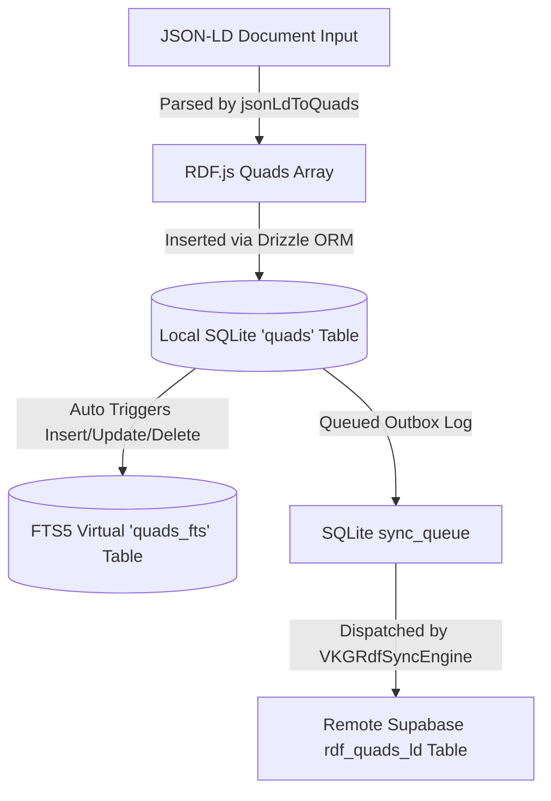

# Data Framework: Ingestion, Offline Search, and Forms Layer

This document outlines the architecture, usage, and contracts of the **Zoe Data Framework**, covering local-first semantic data ingestion, high-performance offline search using SQLite FTS5, dynamic RDF-backed forms, and route-admission security policies.

---

## 1. Tutorial: Local-First Ingestion, Search, and Forms

This tutorial guides you through setting up the Virtual Knowledge Graph (VKG) client, ingesting structured JSON-LD data, executing sub-millisecond offline searches, and rendering a dynamically compiled React Native form based on graph schema definitions.

### Prerequisites

Ensure you have the following core modules imported and available within your workspace:
- `@/src/framework/vkg/client` (Virtual Knowledge Graph Client Facade)
- `@/src/framework/data/offline-search` (FTS5 search engine and hook)
- `@/src/framework/data/forms` (Semantic form and hook)
- `@/src/lib/vkg/rdf` (W3C RDF DataFactory terms)

---

### Step 1: Ingesting Structured JSON-LD Data

The framework stores all data as semantic triples (subject, predicate, object) inside a SQLite database. We can write raw nested JSON-LD objects directly using the `VKGClientFacade`. The facade automatically flattens JSON-LD objects into W3C RDF Quads and saves them locally.

Create a file `src/examples/IngestionExample.ts` to execute a sample ingestion sequence:

```typescript
import { VKGClientFacade } from '@/src/framework/vkg/client';
import { DataFactory } from '@/src/lib/vkg/rdf';

// 1. Instantiate the client facade
const vkgClient = new VKGClientFacade();

// 2. Define a nested JSON-LD document representing a Volunteer
const volunteerJsonLd = {
  '@id': 'https://zoe.framework/volunteers/jane_doe',
  '@type': 'https://schema.org/Person',
  'name': 'Jane Doe',
  'email': 'jane.doe@example.com',
  'skills': ['first-aid', 'coaching'],
  'isAvailable': true,
  'address': {
    '@id': 'https://zoe.framework/addresses/jane_doe_home',
    '@type': 'https://schema.org/PostalAddress',
    'streetAddress': '123 Peak Ave',
    'addressLocality': 'Metropolis',
  }
};

export async function runIngestion() {
  console.log('Starting local-first semantic data ingestion...');
  
  // 3. Ingest document (parses into RDF Quads and commits to SQLite quads table)
  await vkgClient.addJsonLd(volunteerJsonLd);
  
  // 4. Verify quads are stored locally
  const subjectNode = DataFactory.namedNode('https://zoe.framework/volunteers/jane_doe');
  const matchedQuads = await vkgClient.match(subjectNode);
  
  console.log(`Ingestion completed successfully. Saved ${matchedQuads.length} quads.`);
  matchedQuads.forEach(q => {
    console.log(`[Quad] Subject: ${q.subject.value} | Predicate: ${q.predicate.value} | Object: ${q.object.value}`);
  });
}
```

---

### Step 2: Running a High-Performance Offline Search

Once data is written to the `quads` table, SQLite triggers automatically mirror the literal data into the FTS5 virtual table `quads_fts`. We can now perform fuzzy full-text queries over this data using the `useOfflineSearch` hook in React Native.

```tsx
import React, { useState } from 'react';
import { StyleSheet, View, Text, TextInput, FlatList, ActivityIndicator } from 'react-native';
import { useOfflineSearch } from '@/src/framework/data/offline-search';

export const SearchScreen: React.FC = () => {
  const [inputText, setInputText] = useState('');
  const { results, loading, error, search } = useOfflineSearch('', {
    limit: 10,
  });

  const handleTextChange = (text: string) => {
    setInputText(text);
    search(text); // Triggers sub-millisecond SQLite FTS5 prefix match
  };

  return (
    <View style={styles.container}>
      <Text style={styles.title}>Offline Semantic Search</Text>
      <TextInput
        style={styles.searchBar}
        value={inputText}
        onChangeText={handleTextChange}
        placeholder="Type to search volunteers (e.g. 'Jane' or 'first')..."
        placeholderTextColor="#999"
      />

      {loading && <ActivityIndicator size="small" color="#0000ff" style={styles.loader} />}
      {error && <Text style={styles.errorText}>Error: {error.message}</Text>}

      <FlatList
        data={results}
        keyExtractor={(item) => `${item.subject}-${item.predicate}`}
        renderItem={({ item }) => (
          <View style={styles.resultItem}>
            <Text style={styles.resultSubject}>{item.subject.split('/').pop()}</Text>
            <Text style={styles.resultText}>Matched Predicate: {item.predicate.split('/').pop()}</Text>
            <Text style={styles.snippet} numberOfLines={2}>
              Value: {item.objectValue} (Rank: {item.rank.toFixed(2)})
            </Text>
          </View>
        )}
        ListEmptyComponent={
          !loading ? <Text style={styles.emptyText}>No matching profiles found offline</Text> : null
        }
      />
    </View>
  );
};

const styles = StyleSheet.create({
  container: { flex: 1, padding: 16, backgroundColor: '#f9f9f9' },
  title: { fontSize: 20, fontWeight: 'bold', marginBottom: 12 },
  searchBar: { borderWidth: 1, borderColor: '#ccc', borderRadius: 8, padding: 10, backgroundColor: '#fff', fontSize: 16 },
  loader: { marginVertical: 10 },
  errorText: { color: 'red', marginVertical: 5 },
  resultItem: { padding: 12, backgroundColor: '#fff', marginVertical: 6, borderRadius: 6, borderWidth: 1, borderColor: '#eee' },
  resultSubject: { fontSize: 16, fontWeight: 'bold', color: '#333' },
  resultText: { fontSize: 12, color: '#666', marginTop: 2 },
  snippet: { fontSize: 13, color: '#444', marginTop: 4, fontStyle: 'italic' },
  emptyText: { textAlign: 'center', marginTop: 20, color: '#888' }
});
```

---

### Step 3: Rendering a Dynamic Semantic Form

The framework allows you to dynamically render forms by fetching their schema directly from the graph ontology. This is handled by querying the property domains and ranges from the local VKG store.

To set up a form for a `https://schema.org/Person` entity:

```tsx
import React from 'react';
import { StyleSheet, ScrollView, View, Text, Alert } from 'react-native';
import { SemanticForm } from '@/src/framework/data/forms';
import { VKGClientFacade } from '@/src/framework/vkg/client';

const client = new VKGClientFacade();

export const ProfileEditorScreen: React.FC = () => {
  const handleFormSubmit = async (data: Record<string, any>) => {
    try {
      // Data contains predicates mapped to user entered values
      console.log('Submitting profile form data:', data);
      
      const fullNode = {
        '@id': 'https://zoe.framework/volunteers/jane_doe',
        '@type': 'https://schema.org/Person',
        ...data,
      };

      // Commit changes back to the knowledge graph
      await client.addJsonLd(fullNode);
      Alert.alert('Success', 'Profile updated successfully inside the offline graph!');
    } catch (err: any) {
      Alert.alert('Error', `Failed to save changes: ${err.message}`);
    }
  };

  return (
    <ScrollView contentContainerStyle={styles.container}>
      <Text style={styles.header}>Edit Profile Metadata</Text>
      
      {/* 
         SemanticForm dynamically resolves property domains, constraints,
         types (string, integer, double, boolean), and order from the database.
      */}
      <SemanticForm
        targetType="https://schema.org/Person"
        client={client}
        initialData={{
          'https://schema.org/name': 'Jane Doe',
          'https://schema.org/email': 'jane.doe@example.com',
        }}
        onSubmit={handleFormSubmit}
        onCancel={() => console.log('Edit cancelled')}
        submitLabel="Commit to Graph"
      />
    </ScrollView>
  );
};

const styles = StyleSheet.create({
  container: { padding: 16, backgroundColor: '#fff' },
  header: { fontSize: 22, fontWeight: 'bold', marginBottom: 12 }
});
```

---

## 2. How-To Guide: Dynamic Schema Gating & Searchable Profile Management

### Scenario
We want to create a secure, offline-searchable profiles control room in our React Native application. This screen must:
1. **Gate Entrance**: Use `useRouteAdmission` to enforce that only users with the `Administrator` or `Supervisor` boundary role can enter the management layout.
2. **Offline Search**: Query profiles inside SQLite using FTS5.
3. **Optimistic Updates**: Render a form schema retrieved directly from the ontology and commit changes optimistically so changes appear immediately while syncing in the background.

---

### Implementation

Below is the complete, production-ready, copy-pasteable TypeScript file for `src/examples/ProfileManagerScreen.tsx`.

```tsx
import React, { useState } from 'react';
import {
  StyleSheet,
  View,
  Text,
  TextInput,
  FlatList,
  TouchableOpacity,
  ActivityIndicator,
  Alert,
  SafeAreaView
} from 'react-native';

// 1. Framework Imports
import { createRouteAdmissionHook } from '@/src/framework/data/auth/createRouteAdmissionHook';
import { useOfflineSearch } from '@/src/framework/data/offline-search';
import { SemanticForm } from '@/src/framework/data/forms';
import { useOptimisticMutation } from '@/src/framework/data/fetching/useOptimisticMutation';
import { useSemanticNode } from '@/src/framework/data/vkg/useSemanticNode';
import { VKGClientFacade } from '@/src/framework/vkg/client';

// Types for routing simulation
import { RouteDefinition, ParticipantBasis, IdentityBoundary } from '@/src/route-law/types';

// 2. Constants and Mock Session definitions for Gating Laws
const ADMIN_HIERARCHY: readonly IdentityBoundary[] = ['GUEST', 'USER', 'SUPERVISOR', 'ADMINISTRATOR'] as any;

const mockSessionContext = {
  session: {
    user: {
      role: 'SUPERVISOR', // Simulated role matching hierarchy
      userId: 'user_01',
    }
  },
  loading: false,
};

const mockRouteDefinition: RouteDefinition = {
  path: '/admin/profile-manager',
  requiredRole: 'SUPERVISOR', // Must be SUPERVISOR or above
  admissionGating: true,
} as any;

// Instantiate Route Law hook
const useRouteAdmission = createRouteAdmissionHook({
  useSession: () => ({
    session: mockSessionContext.session,
    loading: mockSessionContext.loading,
    isTransitioning: false,
  }),
  defaultResolveParticipant: (session: any): ParticipantBasis => {
    return {
      identity: session?.user?.userId || 'anonymous',
      boundary: session?.user?.role || 'GUEST',
    };
  },
  defaultHierarchy: ADMIN_HIERARCHY,
  admitRoute: (participant, route, hierarchy) => {
    const pIndex = hierarchy.indexOf(participant.boundary as any);
    const rIndex = hierarchy.indexOf((route as any).requiredRole);
    
    if (pIndex >= rIndex) {
      return { admitted: true };
    }
    return {
      admitted: false,
      refusal: {
        reason: 'Insufficient permissions',
        requiredBoundary: (route as any).requiredRole,
        actualBoundary: participant.boundary,
      } as any,
    };
  }
});

// Concrete client facade instance
const vkgClient = new VKGClientFacade();

interface ProfileData {
  '@id': string;
  '@type': string;
  'https://schema.org/name': string;
  'https://schema.org/email': string;
  'https://schema.org/jobTitle'?: string;
  'https://schema.org/knowsAbout'?: string;
}

export const ProfileManagerScreen: React.FC = () => {
  const [selectedProfileId, setSelectedProfileId] = useState<string | null>(null);
  const [searchQuery, setSearchQuery] = useState('');
  
  // A. Check admission gating laws
  const { admitted, loading: authLoading, refusal } = useRouteAdmission(mockRouteDefinition);

  // B. Offline Search configuration
  const { results, loading: searchLoading, search } = useOfflineSearch('', {
    limit: 15,
    predicate: 'https://schema.org/name', // Search specific predicate
  });

  // C. Bind to selected node graph state
  const {
    node: activeProfile,
    loading: nodeLoading,
    mutate: updateLocalNode,
  } = useSemanticNode<ProfileData>(
    'https://schema.org/Person',
    selectedProfileId || undefined,
    { vkgClient: vkgClient as any }
  );

  // D. Setup Optimistic Mutation for UI responsiveness
  const { mutate: commitProfileMutation, isMutating } = useOptimisticMutation<
    { id: string; fields: Record<string, any> },
    void
  >({
    mutationFn: async ({ id, fields }) => {
      // Async database write
      const fullNode = {
        '@id': id,
        '@type': 'https://schema.org/Person',
        ...fields,
      };
      await vkgClient.addJsonLd(fullNode);
    },
    onMutate: async ({ id, fields }) => {
      // Optimistic update of local hook cache immediately
      console.log('Optimistic mutate triggered with data:', fields);
      const previousProfileState = activeProfile;
      
      // Speculatively apply fields to active node
      updateLocalNode({
        ...fields,
      } as any);

      return { previousProfileState };
    },
    onError: (error, variables, context) => {
      Alert.alert('Mutation Failed', `Error: ${error.message}. Rolling back changes.`);
      if (context?.previousProfileState) {
        // Rollback hook state to previous values on failure
        updateLocalNode(context.previousProfileState);
      }
    },
    onSuccess: () => {
      console.log('Write verified and synced to local SQLite store.');
    }
  });

  // Handle Search Input changes
  const handleSearch = (text: string) => {
    setSearchQuery(text);
    search(text);
  };

  // Render gating warning if not authorized
  if (authLoading) {
    return (
      <View style={styles.centered}>
        <ActivityIndicator size="large" />
        <Text style={styles.statusText}>Evaluating Security Membrane...</Text>
      </View>
    );
  }

  if (!admitted) {
    return (
      <View style={styles.centered}>
        <Text style={styles.errorHeader}>Access Denied</Text>
        <Text style={styles.errorSub}>
          Refusal: {refusal?.reason || 'Role criteria failed.'}
        </Text>
        <Text style={styles.errorSub}>
          Required boundary: {refusal?.requiredBoundary || 'None'}
        </Text>
      </View>
    );
  }

  return (
    <SafeAreaView style={styles.safeContainer}>
      <View style={styles.layout}>
        {/* Left Column: Search & Profiles List */}
        <View style={styles.leftCol}>
          <Text style={styles.sectionTitle}>Search Directory</Text>
          <TextInput
            style={styles.input}
            value={searchQuery}
            onChangeText={handleSearch}
            placeholder="Search profiles..."
            placeholderTextColor="#888"
          />

          {searchLoading && <ActivityIndicator size="small" style={styles.margin} />}

          <FlatList
            data={results}
            keyExtractor={(item) => item.subject}
            renderItem={({ item }) => (
              <TouchableOpacity
                style={[
                  styles.profileRow,
                  selectedProfileId === item.subject ? styles.activeRow : null
                ]}
                onPress={() => setSelectedProfileId(item.subject)}
              >
                <Text style={styles.profileName}>{item.objectValue}</Text>
                <Text style={styles.profileId}>{item.subject.split('/').pop()}</Text>
              </TouchableOpacity>
            )}
            ListEmptyComponent={
              <Text style={styles.emptyText}>No matching profiles in local DB</Text>
            }
          />
        </View>

        {/* Right Column: Schema Editor Form */}
        <View style={styles.rightCol}>
          <Text style={styles.sectionTitle}>Semantic Graph Editor</Text>

          {selectedProfileId ? (
            nodeLoading ? (
              <ActivityIndicator size="medium" />
            ) : activeProfile ? (
              <View>
                <Text style={styles.activeLabel}>Editing Node: {selectedProfileId}</Text>
                <SemanticForm
                  targetType="https://schema.org/Person"
                  client={vkgClient}
                  initialData={activeProfile as any}
                  onSubmit={(formData) => {
                    commitProfileMutation({
                      id: selectedProfileId,
                      fields: formData,
                    });
                  }}
                  submitLabel={isMutating ? 'Saving...' : 'Apply Modifications'}
                  cancelLabel="Clear"
                  onCancel={() => setSelectedProfileId(null)}
                />
              </View>
            ) : (
              <Text style={styles.emptyText}>Error loading graph node.</Text>
            )
          ) : (
            <View style={styles.placeholderContainer}>
              <Text style={styles.placeholderText}>Select a profile from the left column to edit</Text>
            </View>
          )}
        </View>
      </View>
    </SafeAreaView>
  );
};

const styles = StyleSheet.create({
  safeContainer: { flex: 1, backgroundColor: '#f0f2f5' },
  layout: { flex: 1, flexDirection: 'row', padding: 8 },
  leftCol: { flex: 1, backgroundColor: '#fff', borderRadius: 8, padding: 12, marginRight: 8, elevation: 2 },
  rightCol: { flex: 1.5, backgroundColor: '#fff', borderRadius: 8, padding: 12, elevation: 2 },
  centered: { flex: 1, justifyContent: 'center', alignItems: 'center', backgroundColor: '#fff' },
  sectionTitle: { fontSize: 18, fontWeight: 'bold', marginBottom: 12, color: '#1a1a1a' },
  statusText: { marginTop: 10, fontSize: 14, color: '#555' },
  errorHeader: { fontSize: 20, fontWeight: 'bold', color: 'red', marginBottom: 8 },
  errorSub: { fontSize: 14, color: '#666', marginTop: 4 },
  input: { borderWidth: 1, borderColor: '#dcdcdc', borderRadius: 6, padding: 8, fontSize: 15, marginBottom: 10 },
  margin: { marginVertical: 8 },
  profileRow: { padding: 12, borderBottomWidth: 1, borderColor: '#f0f0f0' },
  activeRow: { backgroundColor: '#e6f7ff' },
  profileName: { fontSize: 15, fontWeight: '600' },
  profileId: { fontSize: 12, color: '#888', marginTop: 2 },
  emptyText: { textAlign: 'center', color: '#999', marginVertical: 12 },
  activeLabel: { fontSize: 13, color: '#0050b3', marginBottom: 8, fontStyle: 'italic' },
  placeholderContainer: { flex: 1, justifyContent: 'center', alignItems: 'center' },
  placeholderText: { fontSize: 14, color: '#888', textAlign: 'center' },
});
```

---

## 3. Reference Guide: API Contract and File Layout

### File Layout

Click the links below to access source code definitions directly:

- [index.ts](file:///Users/sac/zoeapp/src/framework/data/index.ts) - Public entrypoint of the data framework. Bundles exports for fetching, semantic hooks, and routing controllers.
- [auth/createRouteAdmissionHook.ts](file:///Users/sac/zoeapp/src/framework/data/auth/createRouteAdmissionHook.ts) - Factory for generating admission-control React hooks.
- [export/portability.ts](file:///Users/sac/zoeapp/src/framework/data/export/portability.ts) - Backup packager. Serializes SQLite base64 db and MMKV state with BLAKE3 cryptographic signing.
- [export/useDataPortability.ts](file:///Users/sac/zoeapp/src/framework/data/export/useDataPortability.ts) - Hook to trigger exports or verify and restore incoming backup json files.
- [fetching/useOptimisticMutation.ts](file:///Users/sac/zoeapp/src/framework/data/fetching/useOptimisticMutation.ts) - Handles local mutation updates, error rollbacks, and success verification callback actions.
- [fetching/useSuspenseQuery.ts](file:///Users/sac/zoeapp/src/framework/data/fetching/useSuspenseQuery.ts) - Global Suspense state caching utility for asynchronous graph queries.
- [forms/SemanticForm.tsx](file:///Users/sac/zoeapp/src/framework/data/forms/SemanticForm.tsx) - React Native input layout renderer. Matches types from schema specifications.
- [forms/types.ts](file:///Users/sac/zoeapp/src/framework/data/forms/types.ts) - Interface contracts for schemas, fields, states, and properties.
- [forms/useSemanticForm.ts](file:///Users/sac/zoeapp/src/framework/data/forms/useSemanticForm.ts) - Hook driving form states, field updates, and dynamic validations.
- [forms/utils.ts](file:///Users/sac/zoeapp/src/framework/data/forms/utils.ts) - Graph traverser fetching labels, ranges, requirements, and orders.
- [neuro-symbolic/builder.ts](file:///Users/sac/zoeapp/src/framework/data/neuro-symbolic/builder.ts) - Fluent query constructor combining exact matches with vector search limits.
- [neuro-symbolic/types.ts](file:///Users/sac/zoeapp/src/framework/data/neuro-symbolic/types.ts) - Structures for symbolic constraints, prompts, confidence scores, and refetch functions.
- [neuro-symbolic/useNeuroSymbolicQuery.ts](file:///Users/sac/zoeapp/src/framework/data/neuro-symbolic/useNeuroSymbolicQuery.ts) - Evaluates queries, performing exact graph traversals followed by neural vector scoring.
- [offline-search/SearchEngine.ts](file:///Users/sac/zoeapp/src/framework/data/offline-search/SearchEngine.ts) - Core SQLite interface setting up virtual quads_fts and executing queries.
- [offline-search/types.ts](file:///Users/sac/zoeapp/src/framework/data/offline-search/types.ts) - Schema definitions for offline search result arrays and filters.
- [offline-search/useOfflineSearch.ts](file:///Users/sac/zoeapp/src/framework/data/offline-search/useOfflineSearch.ts) - Hook driving user input search parameters and FTS matching results.
- [predictive/usePredictivePrefetch.ts](file:///Users/sac/zoeapp/src/framework/data/predictive/usePredictivePrefetch.ts) - Crawls and pre-caches nearby nodes from active predicates.
- [vkg/createSemanticHook.ts](file:///Users/sac/zoeapp/src/framework/data/vkg/createSemanticHook.ts) - Factory yielding strongly-typed semantic node hooks bound to URIs.
- [vkg/usePaginatedSemanticNode.ts](file:///Users/sac/zoeapp/src/framework/data/vkg/usePaginatedSemanticNode.ts) - Hook managing lists of same-type semantic nodes with page limit slices.
- [vkg/useSemanticNode.ts](file:///Users/sac/zoeapp/src/framework/data/vkg/useSemanticNode.ts) - Hook driving standard JSON-LD CRUD mappings over graph nodes.

---

### Core Interfaces and Type Signatures

#### Offline Search Types

```typescript
export interface SearchResult {
  subject: string;      // The subject URI (entity identifier)
  predicate: string;    // The predicate URI that matched
  objectValue: string;  // The literal value matching the search string
  rank: number;         // The BM25 score (lower is better)
  snippet?: string;     // Match highlight text wrapper (e.g. <b>search_word</b>)
}

export interface SearchOptions {
  limit?: number;       // Maximum number of results to fetch (default: 20)
  predicate?: string;   // Filter results by exact predicate URI matching
  graph?: string;       // Filter results by graph node URI matching
}

export interface UseOfflineSearchReturn {
  results: SearchResult[];
  loading: boolean;
  error: Error | null;
  search: (query: string) => Promise<void>;
  query: string;
}
```

#### Dynamic Forms Types

```typescript
export interface FormFieldMetadata {
  predicate: string;
  label: string;
  description?: string;
  required: boolean;
  range: string;        // The expected datatype (e.g., xsd:string, xsd:boolean, or Class URI)
  order?: number;       // Custom display layout priority
}

export interface SemanticFormSchema {
  targetType: string;   // Schema Class URI (e.g. https://schema.org/Person)
  fields: FormFieldMetadata[];
}

export interface SemanticFormProps {
  targetType: string;
  client?: any;         // IVKGClient interface implementation instance
  initialData?: Record<string, any>;
  onSubmit: (data: Record<string, any>) => void;
  onCancel?: () => void;
  submitLabel?: string;
  cancelLabel?: string;
}

export interface SemanticFormState {
  values: Record<string, any>;
  errors: Record<string, string>;
  isSubmitting: boolean;
  schema: SemanticFormSchema | null;
  isLoadingSchema: boolean;
}
```

---

## 4. Explanation: Architectural Design & The Chatman Equation Conformance

### Architectural Layout

The Zoe Data Framework is designed with local-first, decentralized graph semantics. High-performance offline experiences are achieved through a three-layer synchronization pipeline:



### 1. Data Ingestion Lifecycle
To bypass static schema constraints, all domain models are represented using W3C RDF.js standard compliant triples inside SQLite.
1. **Intake Processing**: The `VKGClientFacade` accepts nested, readable JSON-LD documents. It parses them recursively using `jsonLdToQuads()`, yielding semantic assertions.
2. **Local Commit**: Triples are written to the SQLite `quads` table.
3. **Outbox Synchronization**: An entry containing the serialized quad and action (`RDF_ADD_QUAD` or `RDF_REMOVE_QUAD`) is written inside the `sync_queue` table under the same database transaction.
4. **Cloud Dissemination**: The `VKGRdfSyncEngine` worker polls the outbox and attempts to perform remote mutations on Supabase using HTTP clients. If connection fails, the jobs are kept for retry, maintaining local-first data integrity.

### 2. Sub-Millisecond Offline Search Indexing
Searching dynamic graph triples natively requires expensive joins. To achieve instant search, the framework utilizes SQLite FTS5:
- **External Content virtual table**: The FTS table is created with `content='quads'`, referencing the primary table row IDs. It indexes the `objectValue` field but stores subject and predicate coordinates as non-indexed variables. Because literal values are not copied inside the database pages, this design saves device flash storage.
- **Triggers**: Atomic database triggers (`quads_ai`, `quads_ad`, `quads_au`) keep the index in sync:
  - **INSERT**: `INSERT INTO quads_fts(rowid, subject, predicate, objectValue) VALUES (new.id, new.subject, new.predicate, new.objectValue);`
  - **DELETE**: `INSERT INTO quads_fts(quads_fts, rowid, subject, predicate, objectValue) VALUES('delete', old.id, old.subject, old.predicate, old.objectValue);`
- **Fuzzy Matching**: Queries are sanitized and mapped into prefix operations (`term*`) with standard `bm25` weight ranking.

---

### Alignment with the Chatman Equation

The gating of data flows and screen mutations conforms to the **Chatman Equation**:

$$R \vdash A = \mu(O^*)$$

Where:
- $O^*$ (**Lawful Closure Ontology**): Represents the state of the active, local W3C RDF triples stored inside the `quads` database. It contains the data attributes, relationships, and metadata that model user profiles, access credentials, and system settings.
- $R$ (**Admission Policy**): The route laws, credentials, and identity boundaries (e.g. `ADMINISTRATOR`, `SUPERVISOR`) evaluated before a route is admitted or a database mutation transaction is executed.
- $\mu$ (**Transformation Function**): The algorithmic evaluations performing queries, form schemas construction, and inputs validation.
- $A$ (**Emitted Consequence**): The runtime admission decision (true/false), the dynamically rendered UI layout, and the validation results output by the system.

In our Dynamic Gating and Profile Management scene, this equation acts as an immediate runtime barrier. When navigating to the screen:
1. The hook resolves the active participant's `IdentityBoundary` role from the local context, representing the policy rules $R$.
2. The system queries the local graph database $O^*$ to retrieve the gating profile definitions.
3. The matching function $\mu$ evaluates whether the participant meets the role priority threshold.
4. If valid, the system grants the admission result $A$ (`admitted: true`), authorizing the UI renderer to load the search indexes and schema editing forms.

---

### Trade-offs and Constraints

1. **Memory & Performance vs Storage Complexity**:
   Creating a dynamic form schema requires multiple asynchronous queries to resolve domains, ranges, labels, and order for each property. To prevent rendering bottlenecks and layout flickering, the VKG uses a Time-To-Live (TTL) cache facade.
2. **Synchronous Trigger Overhead**:
   SQLite FTS5 external content triggers execute inside the same transaction as quads insertions. While this ensures the search index never diverges from the true database state, it increases write latencies. Heavy write ingestion tasks must bundle transactions to avoid I/O bottlenecks.
3. **Data Integrity and Backup Signatures**:
   The backup export utility signs base64 SQLite databases and MMKV state files using BLAKE3 hashes. Any manual modification of data inside the package will cause verification failure, preventing corrupted state imports.
