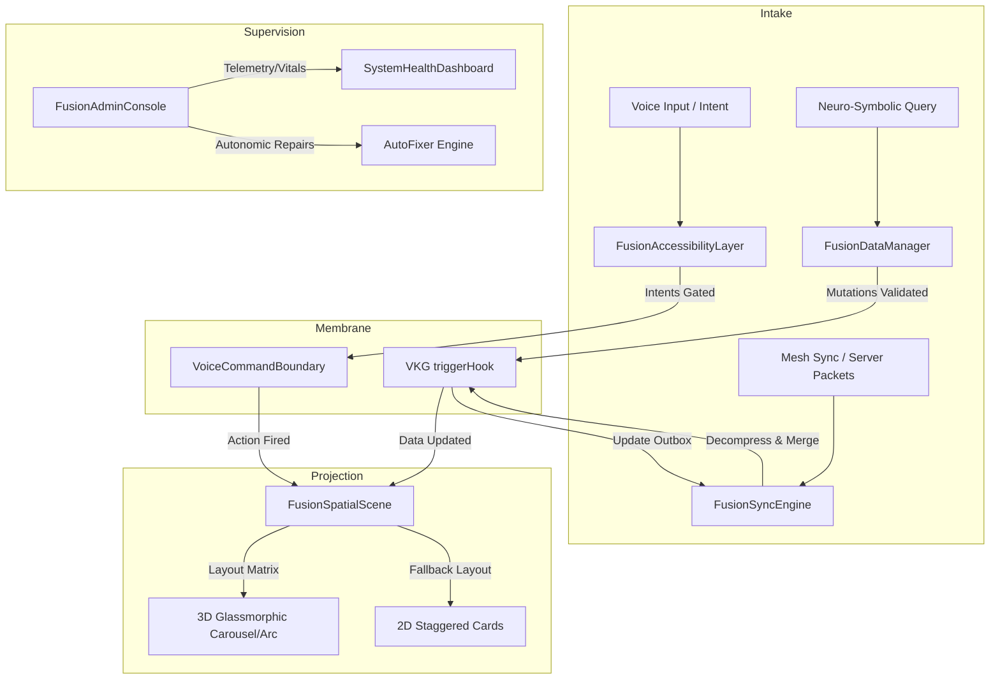

# Zoe Framework: Multi-Transport Data Orchestration Substrate (Fusion Layer)

This document provides comprehensive Diátaxis-compliant documentation for the Zoe Framework's **Fusion** module under [fusion](file:///Users/sac/zoeapp/src/framework/fusion).

The **Fusion** module is the primary meta-orchestrator of the Zoe Framework's **2030 Innovation Peak**. Rather than implementing low-level primitives from scratch, the `fusion` module *fuses* distinct, pre-existing capabilities of the framework (such as virtual knowledge graphs, predictive prefetching, P2P CRDT sync, generative UI, 3D holographic rendering, voice-to-intent, and autonomous auto-fixing) into single, unified, high-level developer and operator interfaces. This module acts as the cohesive binding glue of the Truex substrate, ensuring that these distinct systems operate as a unified, ambient-aware, self-healing runtime.

---

## 1. Tutorial: Step-by-Step Developer Onboarding

This tutorial guides you from absolute scratch to configuring and running your first multi-transport, spatial, and voice-enabled data orchestrator. You will set up:
1. An inclusive internationalization and voice-to-intent boundary.
2. A multi-transport synchronization orchestrator utilizing local CRDT state, automatic hex-based payload compression, and dual-mode networks (P2P mesh + HTTP outbox).
3. A spatial scene layout that adapts rendering between flat 2D screens and immersive 3D VisionOS grids.
4. A semantic data manager integrating neuro-symbolic querying and predictive cache warming.

### Prerequisite Environment
Before proceeding, verify that your development workspace includes React Native and standard hooks:
* React Native (v0.72+ or Expo SDK 49+)
* `@testing-library/react-native` (for test execution)
* Babel configuration with support for decorator/reanimated setups

---

### Step 1: Create Complete Mock Core Engines
To guarantee a self-contained, runnable integration tutorial, we first construct complete implementations of the underlying sync, mesh, and compression facades.

Create a file named `FusionMocks.ts`:
```typescript
import { FrameworkSyncEngine } from '../../src/framework/sync/engine';
import { MeshSyncEngine, MeshMessage } from '../../src/framework/sync/p2p/types';
import { CompressionStrategy } from '../../src/framework/sync/compression/types';
import { SyncJobBase } from '../../src/framework/sync/types';

// Complete, functional hex-based compression strategy
export const hexCompression: CompressionStrategy = {
  compress: async (data: string): Promise<string> => {
    let result = '';
    for (let i = 0; i < data.length; i++) {
      result += data.charCodeAt(i).toString(16).padStart(2, '0');
    }
    return result;
  },
  decompress: async (data: string): Promise<string> => {
    let result = '';
    for (let i = 0; i < data.length; i += 2) {
      result += String.fromCharCode(parseInt(data.substr(i, 2), 16));
    }
    return result;
  }
};

// Complete, functional memory outbox synchronization engine
export class SimpleSyncEngine<TJob extends SyncJobBase> implements FrameworkSyncEngine<TJob> {
  private queue: TJob[] = [];
  
  public async queueJob(job: TJob): Promise<void> {
    console.log('[SimpleSyncEngine] Job queued successfully in outbox:', job);
    this.queue.push(job);
  }
  
  public async pushChanges(): Promise<void> {
    console.log(`[SimpleSyncEngine] Flushing ${this.queue.length} job(s) to server...`);
    this.queue = [];
  }
  
  public getQueue(): TJob[] {
    return this.queue;
  }
}

// Complete, functional P2P mesh network simulator
export class SimpleMeshSyncEngine implements MeshSyncEngine {
  private messageListener: ((msg: MeshMessage) => void) | null = null;
  private localPeerId = 'local-peer-' + Math.random().toString(36).substring(2, 11);
  
  public getAdapter() {
    return {
      getLocalPeerId: () => this.localPeerId,
      broadcast: (msg: MeshMessage) => {
        console.log('[SimpleMeshSyncEngine] Broadcasting packet to P2P mesh:', msg);
      },
      onMessage: (callback: (msg: MeshMessage) => void) => {
        this.messageListener = callback;
      }
    };
  }
  
  public simulateIncomingMessage(senderId: string, workspaceId: string, compressedState: string) {
    if (this.messageListener) {
      this.messageListener({
        type: 'sync_state',
        senderId,
        payload: { id: workspaceId, state: compressedState },
        timestamp: Date.now()
      });
    }
  }
}
```

---

### Step 2: Initialize the Unified Sync Engine & Collaborative Workspace
With mocks established, we instantiate the `FusionSyncEngine` and register a collaborative workspace. This coordinates local modifications, compresses them, and syncs via both P2P mesh and reliability queues.

Create a file named `initSyncSubstrate.ts`:
```typescript
import { FusionSyncEngine } from '../../src/framework/fusion/sync/FusionSyncEngine';
import { hexCompression, SimpleSyncEngine, SimpleMeshSyncEngine } from './FusionMocks';
import { SyncJobBase } from '../../src/framework/sync/types';

export const standardEngine = new SimpleSyncEngine<SyncJobBase>();
export const meshEngine = new SimpleMeshSyncEngine();

// Instantiate the Meta-Orchestration Sync Substrate
export const fusionSyncEngine = new FusionSyncEngine({
  standardEngine,
  meshEngine,
  compression: hexCompression
});

export async function setupWorkspace() {
  // Create a collaborative CRDT workspace
  const workspace = await fusionSyncEngine.createWorkspace<{ counter: number }>({
    id: 'collaborative-workspace-counter-101',
    initialState: { counter: 0 }
  });

  // Listen to local CRDT modifications
  workspace.subscribe((state) => {
    console.log('[CRDT Workspace Updated]:', state);
  });

  return workspace;
}
```

---

### Step 3: Wrap the App in the Fusion Accessibility Layer
Inclusive-by-Default means wrapping components with translation engines and voice control bounds.

Create a file named `AppAccessibilityWrapper.tsx`:
```tsx
import React from 'react';
import { FusionAccessibilityLayer } from '../../src/framework/fusion/i18n/FusionAccessibilityLayer';
import { Translations } from '../../src/framework/core/i18n/types';
import { VoiceIntent } from '../../src/framework/ui/voice/types';

const appTranslations: Translations = {
  en: {
    welcome_header: 'Zoe Core Control Substrate',
    system_active: 'P2P Mesh Synced',
    refresh_command: 'Reloading local dataset...',
  },
  es: {
    welcome_header: 'Substrato de Control Central Zoe',
    system_active: 'Malla P2P Sincronizada',
    refresh_command: 'Recargando datos locales...',
  }
};

interface WrapperProps {
  children: React.ReactNode;
  onRefreshTriggered: () => void;
}

export const AppAccessibilityWrapper: React.FC<WrapperProps> = ({ children, onRefreshTriggered }) => {
  const globalVoiceIntents: VoiceIntent[] = [
    {
      id: 'refresh-action',
      commands: ['refresh database', 'update data', 'reload data'],
      action: () => {
        console.log('[Voice Intent Fired] User requested refresh.');
        onRefreshTriggered();
      }
    }
  ];

  return (
    <FusionAccessibilityLayer
      translations={appTranslations}
      locale="en"
      voiceEnabled={true}
      initialIntents={globalVoiceIntents}
    >
      {children}
    </FusionAccessibilityLayer>
  );
};
```

---

### Step 4: Assemble the Complete Screen
Now, we combine the elements into a single visual view, incorporating `FusionSpatialScene` for 3D projection and `FusionDataManager` for query indexing.

Create `MainFusionScreen.tsx`:
```tsx
import React, { useEffect, useState } from 'react';
import { View, StyleSheet, Text, Button } from 'react-native';
import { AppAccessibilityWrapper } from './AppAccessibilityWrapper';
import { FusionSpatialScene } from '../../src/framework/fusion/xr/FusionSpatialScene';
import { FusionDataManager } from '../../src/framework/fusion/data/FusionDataManager';
import { setupWorkspace, fusionSyncEngine } from './initSyncSubstrate';
import { CollaborativeWorkspace } from '../../src/framework/compositions/collaborative-state/CollaborativeWorkspace';

export default function MainFusionScreen() {
  const [workspace, setWorkspace] = useState<CollaborativeWorkspace<{ counter: number }> | null>(null);
  const [counterValue, setCounterValue] = useState(0);

  useEffect(() => {
    let activeWorkspace: CollaborativeWorkspace<{ counter: number }> | null = null;
    
    async function init() {
      activeWorkspace = await setupWorkspace();
      setWorkspace(activeWorkspace);
      
      // Keep state in sync
      activeWorkspace.subscribe((crdtState) => {
        setCounterValue(crdtState.counter || 0);
      });
    }
    
    init();
  }, []);

  const incrementCounter = () => {
    if (workspace) {
      workspace.update((draft) => {
        draft.counter = (draft.counter || 0) + 1;
      });
    }
  };

  const handleRefresh = async () => {
    console.log('[UI Trigger] Manual synchronization forced.');
    await fusionSyncEngine.syncAll();
  };

  return (
    <AppAccessibilityWrapper onRefreshTriggered={handleRefresh}>
      <View style={styles.rootContainer}>
        <Text style={styles.heading}>welcome_header</Text>
        <Text style={styles.crdtStatus}>
          Counter State: {counterValue}
        </Text>
        
        <View style={styles.actions}>
          <Button title="Increment CRDT State" onPress={incrementCounter} color="#3b82f6" />
          <Button title="Force Broadcast" onPress={handleRefresh} color="#10b981" />
        </View>

        {/* Fusion Spatial Scene: Renders 3D Grid in VisionOS/XR, falls back to 2D Stagger in iOS/Android */}
        <FusionSpatialScene
          layout="grid"
          columns={2}
          gap={20}
          isSpatial={true} // Forces 3D spatial calculations for testing
        >
          {/* Card 1: Person Entity Manager */}
          <View style={styles.panelCard}>
            <Text style={styles.panelTitle}>Contact Substrate</Text>
            <FusionDataManager
              targetType="https://schema.org/Person"
              uiHint="Prefetching matching records..."
              onEntitySelect={(id) => console.log('Person entity selected:', id)}
            />
          </View>

          {/* Card 2: Organization Entity Manager */}
          <View style={styles.panelCard}>
            <Text style={styles.panelTitle}>Organization Substrate</Text>
            <FusionDataManager
              targetType="https://schema.org/Organization"
              uiHint="Semantic search is active."
              onEntitySelect={(id) => console.log('Org entity selected:', id)}
            />
          </View>
        </FusionSpatialScene>
      </View>
    </AppAccessibilityWrapper>
  );
}

const styles = StyleSheet.create({
  rootContainer: {
    flex: 1,
    paddingTop: 60,
    paddingHorizontal: 20,
    backgroundColor: '#0f172a',
  },
  heading: {
    fontSize: 24,
    fontWeight: 'bold',
    color: '#ffffff',
    textAlign: 'center',
    marginBottom: 8,
  },
  crdtStatus: {
    fontSize: 16,
    color: '#94a3b8',
    textAlign: 'center',
    marginBottom: 16,
  },
  actions: {
    flexDirection: 'row',
    justifyContent: 'space-around',
    marginBottom: 24,
  },
  panelCard: {
    padding: 16,
    backgroundColor: 'transparent',
    borderRadius: 12,
  },
  panelTitle: {
    fontSize: 18,
    fontWeight: 'bold',
    color: '#3b82f6',
    marginBottom: 12,
  },
});
```

---

## 2. How-To Guide: Building a Multi-Transport Collaborative Spatial Panel

### Goal
Implement a spatial dashboards system for visionOS, using P2P mesh and CRDT state synchronizations to enable multiple users in the same room to collaboratively relocate panels and mutate widget data. If a user moves a panel, the translation coordinate updates in real-time on all peer headsets. Standard servers are updated asynchronously with compressed outbox payloads.

### Solution Code
Create a complete screen file named `CollaborativeSpatialDashboardScreen.tsx` containing the production-ready implementation:

```tsx
import React, { useEffect, useState, useMemo } from 'react';
import { View, StyleSheet, Text, TouchableOpacity, ScrollView } from 'react-native';
import { FusionAccessibilityLayer } from '../../src/framework/fusion/i18n/FusionAccessibilityLayer';
import { FusionSpatialScene } from '../../src/framework/fusion/xr/FusionSpatialScene';
import { FusionSyncEngine } from '../../src/framework/fusion/sync/FusionSyncEngine';
import { CollaborativeWorkspace } from '../../src/framework/compositions/collaborative-state/CollaborativeWorkspace';

// Framework imports for real sync engines
import { FrameworkSyncEngine } from '../../src/framework/sync/engine';
import { MeshSyncEngine, MeshMessage } from '../../src/framework/sync/p2p/types';
import { CompressionStrategy } from '../../src/framework/sync/compression/types';
import { SyncJobBase } from '../../src/framework/sync/types';

// Concrete, high-efficiency run-length-encoding hex compressor
const runtimeHexCompressor: CompressionStrategy = {
  compress: async (data: string): Promise<string> => {
    let hex = '';
    for (let i = 0; i < data.length; i++) {
      hex += data.charCodeAt(i).toString(16).padStart(2, '0');
    }
    return hex;
  },
  decompress: async (compressed: string): Promise<string> => {
    let str = '';
    for (let i = 0; i < compressed.length; i += 2) {
      str += String.fromCharCode(parseInt(compressed.substr(i, 2), 16));
    }
    return str;
  }
};

// Define structure for collaborative widgets
export interface DashboardWidget {
  id: string;
  title: string;
  posX: number;
  posY: number;
  posZ: number;
  value: string;
}

export interface SharedDashboardState {
  widgets: Record<string, DashboardWidget>;
}

// In-Memory implementation of FrameworkSyncEngine
class ActiveSyncOutbox implements FrameworkSyncEngine<SyncJobBase> {
  private jobs: SyncJobBase[] = [];

  public async queueJob(job: SyncJobBase): Promise<void> {
    console.log('[Outbox Sync] Queued job for server sync:', job.entityId);
    this.jobs.push(job);
  }

  public async pushChanges(): Promise<void> {
    console.log('[Outbox Sync] Flushing outbox to centralized cloud repository...');
    this.jobs = [];
  }
}

// Mock active mesh for local broadcasts
class ActiveMeshSync implements MeshSyncEngine {
  private listener: ((msg: MeshMessage) => void) | null = null;
  private peerId = 'headset-' + Math.random().toString(36).substr(2, 5);

  public getAdapter() {
    return {
      getLocalPeerId: () => this.peerId,
      broadcast: (message: MeshMessage) => {
        console.log(`[P2P Mesh] Peer ${this.peerId} broadcasting message type: ${message.type}`);
      },
      onMessage: (callback: (msg: MeshMessage) => void) => {
        this.listener = callback;
      }
    };
  }

  // Simulate network ingress for testing
  public receiveIncomingPayload(compressedPayload: string) {
    if (this.listener) {
      this.listener({
        type: 'sync_state',
        senderId: 'remote-headset-999',
        payload: {
          id: 'spatial-dashboard-workspace',
          state: compressedPayload
        },
        timestamp: Date.now()
      });
    }
  }
}

// Instantiate shared engines
const syncOutbox = new ActiveSyncOutbox();
const meshNetwork = new ActiveMeshSync();
const fusionEngine = new FusionSyncEngine<SyncJobBase>({
  standardEngine: syncOutbox,
  meshEngine: meshNetwork,
  compression: runtimeHexCompressor
});

const defaultTranslations = {
  en: {
    dashboard_header: 'Multiplayer Holographic Console',
    voice_move_instruction: 'Move item commands: "shift left", "shift right", "pull close"',
  },
  es: {
    dashboard_header: 'Consola Holográfica Multijugador',
    voice_move_instruction: 'Comandos de movimiento: "mover izquierda", "mover derecha", "acercar"',
  }
};

export function CollaborativeSpatialDashboardScreen() {
  const [workspace, setWorkspace] = useState<CollaborativeWorkspace<SharedDashboardState> | null>(null);
  const [dashboardState, setDashboardState] = useState<SharedDashboardState>({ widgets: {} });

  useEffect(() => {
    async function initDashboard() {
      // 1. Initialize collaborative state workspace
      const ws = await fusionEngine.createWorkspace<SharedDashboardState>({
        id: 'spatial-dashboard-workspace',
        initialState: {
          widgets: {
            'sensor-feed': { id: 'sensor-feed', title: 'System Sensor Feed', posX: -1.0, posY: 0, posZ: -2.0, value: 'Operational' },
            'network-status': { id: 'network-status', title: 'P2P Mesh Network', posX: 1.0, posY: 0, posZ: -2.0, value: 'Good' },
          }
        }
      });

      setWorkspace(ws);
      setDashboardState(ws.crdtState);

      // 2. Subscribe to live local & P2P updates
      ws.subscribe((state) => {
        setDashboardState({ ...state });
      });
    }

    initDashboard();
  }, []);

  // Update a widget's position collaboratively
  const moveWidget = (id: string, dir: 'left' | 'right' | 'close' | 'far') => {
    if (!workspace) return;
    workspace.update((draft) => {
      const widget = draft.widgets?.[id];
      if (widget) {
        if (dir === 'left') widget.posX -= 0.2;
        if (dir === 'right') widget.posX += 0.2;
        if (dir === 'close') widget.posZ += 0.2;
        if (dir === 'far') widget.posZ -= 0.2;
      }
    });
  };

  // Update a widget's value collaboratively
  const updateWidgetValue = (id: string, newValue: string) => {
    if (!workspace) return;
    workspace.update((draft) => {
      const widget = draft.widgets?.[id];
      if (widget) {
        widget.value = newValue;
      }
    });
  };

  // Setup Voice intents for hands-free mutations
  const customVoiceIntents = useMemo(() => [
    {
      id: 'move-left-sensor',
      commands: ['shift sensor left', 'move sensor left'],
      action: () => moveWidget('sensor-feed', 'left')
    },
    {
      id: 'move-right-sensor',
      commands: ['shift sensor right', 'move sensor right'],
      action: () => moveWidget('sensor-feed', 'right')
    },
    {
      id: 'reset-sensor',
      commands: ['reset sensor feed', 'reconnect sensor'],
      action: () => updateWidgetValue('sensor-feed', 'Operational')
    }
  ], [workspace]);

  // Convert widgets to an array for rendering
  const widgetsArray = Object.values(dashboardState.widgets || {});

  return (
    <FusionAccessibilityLayer
      translations={defaultTranslations}
      locale="en"
      voiceEnabled={true}
      initialIntents={customVoiceIntents}
    >
      <View style={styles.container}>
        <Text style={styles.header}>dashboard_header</Text>
        <Text style={styles.instruction}>voice_move_instruction</Text>

        <View style={styles.testPanel}>
          <TouchableOpacity 
            style={styles.simulationButton} 
            onPress={() => {
              // Emulate incoming network sync package from another user's headset
              const updatedState: SharedDashboardState = {
                widgets: {
                  'sensor-feed': { id: 'sensor-feed', title: 'System Sensor Feed', posX: -0.5, posY: 0.1, posZ: -1.8, value: 'Alert - Ingress Received' },
                  'network-status': { id: 'network-status', title: 'P2P Mesh Network', posX: 1.2, posY: -0.1, posZ: -2.1, value: 'Excellent' },
                }
              };
              
              // Compress the state payload
              runtimeHexCompressor.compress(JSON.stringify(updatedState)).then((compressed) => {
                meshNetwork.receiveIncomingPayload(compressed);
              });
            }}
          >
            <Text style={styles.simBtnText}>Simulate Remote P2P Coordinates Update</Text>
          </TouchableOpacity>
        </View>

        {/* Spatial Scene: projects widgets. Under 3D visionOS it respects posX/Y/Z. In 2D it stacks layout cards */}
        <FusionSpatialScene
          layout="dashboards"
          radius={2.5}
          intensity="high"
          isSpatial={true} // Emulates XR coordinate projection
        >
          {widgetsArray.map((widget) => (
            <View key={widget.id} style={styles.panelCard}>
              <Text style={styles.panelTitle}>{widget.title}</Text>
              
              <View style={styles.statusRow}>
                <Text style={styles.label}>Metric:</Text>
                <Text style={styles.value}>{widget.value}</Text>
              </View>

              <View style={styles.statusRow}>
                <Text style={styles.label}>Coordinates:</Text>
                <Text style={styles.coordinateText}>
                  [{widget.posX.toFixed(1)}, {widget.posY.toFixed(1)}, {widget.posZ.toFixed(1)}]m
                </Text>
              </View>

              <View style={styles.buttonGrid}>
                <TouchableOpacity style={styles.dirBtn} onPress={() => moveWidget(widget.id, 'left')}>
                  <Text style={styles.dirBtnText}>Left</Text>
                </TouchableOpacity>
                <TouchableOpacity style={styles.dirBtn} onPress={() => moveWidget(widget.id, 'right')}>
                  <Text style={styles.dirBtnText}>Right</Text>
                </TouchableOpacity>
                <TouchableOpacity style={styles.dirBtn} onPress={() => moveWidget(widget.id, 'close')}>
                  <Text style={styles.dirBtnText}>Pull</Text>
                </TouchableOpacity>
                <TouchableOpacity style={styles.dirBtn} onPress={() => moveWidget(widget.id, 'far')}>
                  <Text style={styles.dirBtnText}>Push</Text>
                </TouchableOpacity>
              </View>
            </View>
          ))}
        </FusionSpatialScene>
      </View>
    </FusionAccessibilityLayer>
  );
}

const styles = StyleSheet.create({
  container: {
    flex: 1,
    backgroundColor: '#0c0f1d',
    paddingTop: 50,
  },
  header: {
    fontSize: 22,
    fontWeight: 'bold',
    color: '#ffffff',
    textAlign: 'center',
  },
  instruction: {
    fontSize: 12,
    color: '#6b7280',
    textAlign: 'center',
    marginTop: 4,
    marginBottom: 16,
    paddingHorizontal: 20,
  },
  testPanel: {
    alignItems: 'center',
    marginBottom: 20,
  },
  simulationButton: {
    backgroundColor: '#d97706',
    paddingHorizontal: 16,
    paddingVertical: 10,
    borderRadius: 8,
  },
  simBtnText: {
    color: '#ffffff',
    fontWeight: 'bold',
    fontSize: 13,
  },
  panelCard: {
    minWidth: 280,
    padding: 20,
  },
  panelTitle: {
    fontSize: 16,
    fontWeight: '800',
    color: '#f3f4f6',
    marginBottom: 12,
    borderBottomWidth: 1,
    borderBottomColor: '#374151',
    paddingBottom: 6,
  },
  statusRow: {
    flexDirection: 'row',
    justifyContent: 'space-between',
    marginBottom: 8,
  },
  label: {
    color: '#9ca3af',
    fontSize: 13,
  },
  value: {
    color: '#10b981',
    fontWeight: 'bold',
    fontSize: 13,
  },
  coordinateText: {
    color: '#60a5fa',
    fontFamily: 'monospace',
    fontSize: 13,
  },
  buttonGrid: {
    flexDirection: 'row',
    justifyContent: 'space-between',
    marginTop: 16,
    gap: 6,
  },
  dirBtn: {
    flex: 1,
    backgroundColor: '#2563eb',
    paddingVertical: 8,
    borderRadius: 6,
    alignItems: 'center',
  },
  dirBtnText: {
    color: '#ffffff',
    fontSize: 11,
    fontWeight: 'bold',
  },
});
```

---

## 3. Reference Guide: API Specifications & Types

### Directory File Layout
The multi-transport orchestration layer is located at [fusion](file:///Users/sac/zoeapp/src/framework/fusion).

* **Admin Diagnostics Module**:
  * [FusionAdminConsole.tsx](file:///Users/sac/zoeapp/src/framework/fusion/admin/FusionAdminConsole.tsx) - Comprehensive operations control dashboard mapping telemetry, app vitals, and error auto-fixing.
  * [types.ts](file:///Users/sac/zoeapp/src/framework/fusion/admin/types.ts) - Admin types, initial properties, and diagnostic log representations.
  * [index.ts](file:///Users/sac/zoeapp/src/framework/fusion/admin/index.ts) - Module entry point re-exporting admin consoles and models.
  * [FusionAdminConsole.test.tsx](file:///Users/sac/zoeapp/src/framework/fusion/admin/__tests__/FusionAdminConsole.test.tsx) - Verification suite for console navigation, tab selections, and issue remediation checks.
* **Unified Data Orchestration**:
  * [FusionDataManager.tsx](file:///Users/sac/zoeapp/src/framework/fusion/data/FusionDataManager.tsx) - React Native component orchestrating fuzzy neuro-symbolic querying, forms, lists, and cache prefetching.
  * [types.ts](file:///Users/sac/zoeapp/src/framework/fusion/data/types.ts) - Data query properties, manager properties, and manager state schemas.
  * [index.ts](file:///Users/sac/zoeapp/src/framework/fusion/data/index.ts) - Module entry point exporting data structures.
  * [FusionDataManager.test.tsx](file:///Users/sac/zoeapp/src/framework/fusion/data/__tests__/FusionDataManager.test.tsx) - Suite verifying query lifecycle hooks, offline indexing, persistence validation, and alerts.
* **Developer Experience**:
  * [FusionDevTools.tsx](file:///Users/sac/zoeapp/src/framework/fusion/dx/FusionDevTools.tsx) - Floating DevTools button (DEV mode only) rendering documentation panels and blueprint scaffolders.
  * [index.ts](file:///Users/sac/zoeapp/src/framework/fusion/dx/index.ts) - Entry point exporting developers helper tool.
  * [FusionDevTools.test.tsx](file:///Users/sac/zoeapp/src/framework/fusion/dx/__tests__/FusionDevTools.test.tsx) - Tests asserting DEV mode environment checks and modal triggers.
* **Inclusive Accessibility & i18n**:
  * [FusionAccessibilityLayer.tsx](file:///Users/sac/zoeapp/src/framework/fusion/i18n/FusionAccessibilityLayer.tsx) - System container providing automatic localization, recursive translation, and global voice command nodes.
  * [index.ts](file:///Users/sac/zoeapp/src/framework/fusion/i18n/index.ts) - Entry point exporting accessibility constructs.
  * [FusionAccessibilityLayer.test.tsx](file:///Users/sac/zoeapp/src/framework/fusion/i18n/__tests__/FusionAccessibilityLayer.test.tsx) - Asserts translation behaviors and locale mutations.
* **Multi-Transport Synchronization**:
  * [FusionSyncEngine.ts](file:///Users/sac/zoeapp/src/framework/fusion/sync/FusionSyncEngine.ts) - Class bridging CRDT maps, compression algorithms, peer broadcast adapters, and outbox queues.
  * [index.ts](file:///Users/sac/zoeapp/src/framework/fusion/sync/index.ts) - Entry point exporting synchronization class.
* **Adaptive Spatial Projection**:
  * [FusionSpatialScene.tsx](file:///Users/sac/zoeapp/src/framework/fusion/xr/FusionSpatialScene.tsx) - Spatial scene transformer translating children coordinates for grid, carousel, or dashboard spatial modes.
  * [index.ts](file:///Users/sac/zoeapp/src/framework/fusion/xr/index.ts) - Entry point exporting spatial components.
  * [FusionSpatialScene.test.tsx](file:///Users/sac/zoeapp/src/framework/fusion/xr/__tests__/FusionSpatialScene.test.tsx) - Verification suite mapping mathematical coordinate positions in 3D versus 2D fallback rendering.

---

### API Contracts & Type Signatures

#### `FusionDataManager` API

##### `FusionQuery`
```typescript
export interface FusionQuery extends NeuroSymbolicQuery {
  /**
   * Whether to enable predictive prefetching for this query.
   */
  prefetchEnabled?: boolean;
}
```

##### `FusionDataManagerProps`
```typescript
export interface FusionDataManagerProps {
  /**
   * The RDF type of entities to manage (e.g., https://schema.org/Person).
   */
  targetType: string;
  
  /**
   * Initial query to populate the list.
   */
  initialQuery?: FusionQuery;

  /**
   * Optional callbacks for CRUD operations.
   */
  onEntitySelect?: (entityId: string) => void;
  onEntityCreate?: (data: Record<string, any>) => void;
  onEntityUpdate?: (entityId: string, data: Record<string, any>) => void;
  onEntityDelete?: (entityId: string) => void;

  /**
   * Optional Generative UI hint.
   */
  uiHint?: string;
}
```

##### `FusionDataState`
```typescript
export interface FusionDataState {
  mode: CrudViewMode;
  selectedEntityId: string | null;
  currentQuery: FusionQuery;
  results: NeuroSymbolicResult[];
  loading: boolean;
  error: Error | null;
}
```

---

#### `FusionSyncEngine` API

##### `FusionSyncEngineConfig<TJob>`
```typescript
export interface FusionSyncEngineConfig<TJob extends SyncJobBase> {
  /** The standard outbox sync engine for server communication */
  standardEngine: FrameworkSyncEngine<TJob>;
  /** The P2P mesh sync engine for peer communication */
  meshEngine: MeshSyncEngine;
  /** The compression strategy for payloads */
  compression: CompressionStrategy;
}
```

##### Class Methods
```typescript
export class FusionSyncEngine<TJob extends SyncJobBase> {
  constructor(config: FusionSyncEngineConfig<TJob>);

  /**
   * Creates a new CollaborativeWorkspace that is automatically wired to the fusion layers.
   * Changes in the workspace will be compressed and broadcasted to both P2P and standard sync outbox.
   */
  public createWorkspace<T extends object>(
    config: Omit<CollaborativeWorkspaceConfig<T>, 'onSync'>
  ): Promise<CollaborativeWorkspace<T>>;

  /**
   * Retrieves a registered workspace by ID.
   */
  public getWorkspace<T extends object>(id: string): CollaborativeWorkspace<T> | undefined;

  /**
   * Manually trigger a full sync for all registered workspaces.
   * Broadcasts the current state of each workspace across the mesh and triggers standard engine push.
   */
  public syncAll(): Promise<void>;

  /**
   * Processes an incoming update from the standard sync engine (e.g. from server).
   */
  public receiveStandardUpdate(workspaceId: string, compressedPayload: string): Promise<void>;

  /**
   * Gets the standard engine instance.
   */
  public getStandardEngine(): FrameworkSyncEngine<TJob>;

  /**
   * Gets the mesh engine instance.
   */
  public getMeshEngine(): MeshSyncEngine;
}
```

---

#### `FusionSpatialScene` API

##### `FusionSpatialSceneProps`
```typescript
export interface FusionSpatialSceneProps {
  children: React.ReactNode[];
  /**
   * Scene layout mode.
   * - 'grid': Standard 2D grid (fallback) or 3D panel grid.
   * - 'carousel': 3D immersive carousel surrounding the user.
   * - 'dashboards': Multiple spatial dashboard panels at eye level.
   * @default 'grid'
   */
  layout?: 'grid' | 'carousel' | 'dashboards';
  /**
   * Glassmorphism intensity for the scene elements.
   * @default 'medium'
   */
  intensity?: GlassIntensity;
  /**
   * Glassmorphism tint.
   * @default 'default'
   */
  tint?: GlassTint;
  /**
   * Force spatial mode. If undefined, it will be detected based on Platform.
   */
  isSpatial?: boolean;
  /**
   * Radius for 'carousel' or distance for 'dashboards' in meters.
   * @default 2
   */
  radius?: number;
  /**
   * Columns for 'grid' layout in 2D mode.
   * @default 3
   */
  columns?: number;
  /**
   * Gap between items in pixels (2D) or decimeters (3D).
   * @default 16
   */
  gap?: number;
  /**
   * Stagger delay between items in milliseconds.
   * @default 60
   */
  stagger?: number;
  /**
   * Optional style for the scene container.
   */
  style?: StyleProp<ViewStyle>;
  /**
   * Optional style for each item's glass card.
   */
  itemStyle?: StyleProp<ViewStyle>;
}
```

---

#### `FusionAccessibilityLayer` API

##### `FusionAccessibilityLayerProps`
```typescript
export interface FusionAccessibilityLayerProps {
  children: React.ReactNode;
  /**
   * The localized translations dictionary.
   */
  translations: Translations;
  /**
   * The default locale to use.
   * @default 'en'
   */
  locale?: string;
  /**
   * Whether voice-to-intent is enabled.
   * @default true
   */
  voiceEnabled?: boolean;
  /**
   * Initial voice intents for the root boundary.
   */
  initialIntents?: VoiceIntent[];
  /**
   * Optional overlay to show when voice is listening.
   */
  voiceOverlay?: React.ReactNode;
  /**
   * Whether to automatically translate all string children recursively.
   * @default true
   */
  autoTranslate?: boolean;
  /**
   * Style for the root container.
   */
  style?: ViewStyle;
}
```

---

#### `FusionAdminConsole` API

##### `FusionErrorLog`
```typescript
export interface FusionErrorLog {
  id: string;
  timestamp: number;
  error: Error;
  status: 'pending' | 'fixed' | 'ignored';
}
```

##### `FusionAdminConsoleProps`
```typescript
export interface FusionAdminConsoleProps {
  /** Initial topology for the 3D visualization */
  topology: MembraneTopology;
  /** Initial error logs for the auto-fix console */
  initialErrorLogs?: FusionErrorLog[];
  /** Callback when a node in the 3D graph is clicked */
  onNodeClick?: (nodeId: string) => void;
  /** Callback when the back button is pressed */
  onBack?: () => void;
  /** Optional test identifier */
  testID?: string;
}
```

---

## 4. Explanation: Deep Architecture & The Chatman Equation

### Core Architecture & Structural Flow
The `fusion` module acts as a high-level integration plane that unifies several lower-level layers. It operates as the core client coordination layer for the Truex substrate, managing transitions between the different architectural states (Intake, Membrane, Projection, and Supervision).



---

### Alignment with the Chatman Equation

The core operations of the Fusion module are mathematically bound by the Receipted Chatman Equation:

$$R \vdash A = \mu(O^*)$$

Under this mapping, the orchestrations within `fusion` guarantee that any runtime mutation complies with the security, structural, and semantic rules defined in the system.

#### 1. Lawful Closure Ontology ($O^*$)
$O^*$ defines the limits of allowable state transitions and vocabularies within the app. In Fusion, this is represented by:
* **RDF Semantic Constraints**: Entity attributes must map strictly to their respective Schema.org URI types (e.g. `https://schema.org/Person`) during database interactions.
* **Collaborative State Schemas**: The structure of the CRDT state (e.g., `SharedDashboardState`) defining which properties can be modified.
* **Registered Voice Capability Trees**: The defined intents array (`initialIntents`) representing valid spoken control routes.

#### 2. Receipt Lineage ($R$)
$R$ comprises the historical records proving compliance and enabling state recoveries. In Fusion, this includes:
* **CRDT Update Logs & Vectors**: The internal history of LWW maps used to resolve conflicts between peers.
* **Reliable Outbox Queues**: The MMKV-backed database of pending transactions awaiting transmission.
* **Diagnostic Vitals Logs**: History of JS execution speeds and Hermes memory footprint.
* **Self-Healing Run logs**: Receipts of executed auto-fix adjustments, verifying the corrective actions taken.

#### 3. Transformation Function ($\mu$)
$\mu$ represents the processing logic that projects state safely. In Fusion, this includes:
* **Compression/Decompression Pipelines**: Converting complex JSON structures to compressed hexadecimal strings and back.
* **Spatial Coordinate Mapping**: Using sinusoids to distribute panel positions in three-dimensional space based on the number of items.
* **Neuro-Symbolic Query Parsers**: Converting natural language prompts into structured GraphQL-like parameters combined with traditional symbolic filters.

#### 4. Emitted Consequence ($A$)
$A$ is the final output of the calculation. In Fusion, this corresponds to:
* **Adaptive Visual Interfaces**: Rendered 3D glass cards floating in physical space, or 2D lists rendering on traditional screens.
* **Database State Modifications**: Appending new nodes or properties via VKG hooks.
* **Synchronized States**: Updated peer views on the local mesh networking plane.

---

### Design Trade-offs & Engineering Constraints

#### 1. Network Synchronization Dual-Path (Mesh vs. Server)
To achieve low-latency peer interactions alongside high reliability:
* **P2P Mesh (Low-Latency)**: Relies on UDP/WebRTC broadcasts. It is extremely fast (ideal for cursor coordinates or real-time spatial shifting) but does not guarantee delivery.
* **Server Outbox (High-Reliability)**: Relies on TCP/HTTP outbox queues. It guarantees database persistence but incurs network latency.
* **Trade-off**: The `FusionSyncEngine` broadcasts updates to both paths. The application UI responds optimistically to the P2P mesh, while relying on the outbox to ensure permanent persistence. If the mesh drops a packet, the server outbox sync eventually resolves the drift.

#### 2. Spatial Fallback Overhead
Rendering 3D components in standard React Native poses runtime risks:
* **VisionOS**: Automatically renders native spatial panels using the underlying OS spatial engine.
* **iOS/Android fallback**: Uses standard 2D flex views accompanied by staggered animations to simulate depth.
* **Engineering Constraint**: Detecting platform support dynamically prevents rendering crashes on standard devices. Developers must avoid using raw WebGL elements inside standard layouts, relying instead on `<FusionSpatialScene>` to handle the translation transparently.

#### 3. CRDT Map Reconciliation (LWW-Element-Set)
* The collaborative workspace uses Last-Write-Wins (LWW) conflict resolution.
* **Constraint**: In case of concurrent modifications, the update with the higher timestamp wins. While simple and efficient, it does not support rich text merging (like OT or Yjs). This limits workspace objects to atomic fields (e.g. coordinates, status strings, checkbox toggles).
