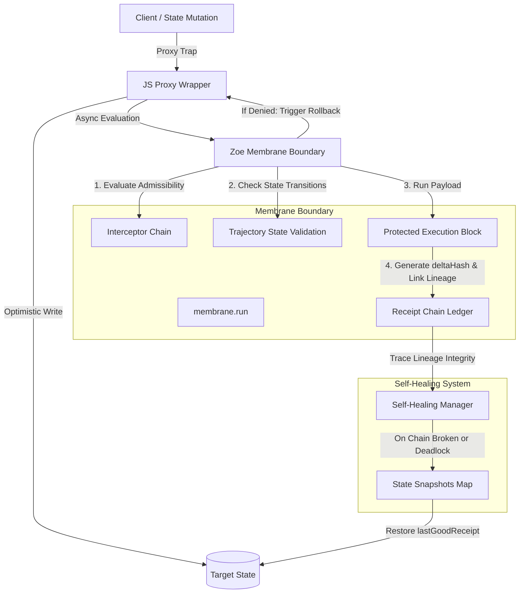

# Zoe Execution Membrane, State Traps, and Validation Managers

This documentation details the execution membrane boundary, deep reactive state traps, and validation managers that form the core security and recovery architecture under [src/framework/membrane](file:///Users/sac/zoeapp/src/framework/membrane).

---

## 1. Tutorial: Getting Started with the Zoe Membrane

This tutorial guides you through setting up a basic execution membrane from scratch, validating state transitions, and trapping object mutations with automatic rollbacks.

### Setup and Initialization

First, we will set up a project environment and initialize the `Membrane` container. We assume a TypeScript execution environment.

```typescript
import { Membrane } from './src/framework/membrane/membrane';
import { ProxyFactory } from './src/framework/membrane/proxy';

// 1. Define the system configuration
const config = {
  mode: 'strict' as const,
  tenantId: 'tutorial-tenant',
  authorityRole: 'operator',
};

// 2. Instantiate the Membrane
const membrane = new Membrane(config);

console.log('Membrane successfully initialized with mode:', membrane.getConfig().mode);
```

### Defining a Trajectory Flow

The `TrajectoryManager` enforces validation rules on the states through which an object can transition. Let's register a flow called `ProcessFlow` that allows an object to transition from `idle` to `running`, and from `running` to either `success` or `failed`.

```typescript
// Register a state machine trajectory flow
membrane.trajectories.registerFlow('ProcessFlow', {
  idle: ['running'],
  running: ['success', 'failed'],
});

console.log('Trajectory flow "ProcessFlow" registered.');
```

### Running an Operation within the Membrane

The execution membrane acts as a protective sandbox. Any exception thrown inside is caught, logged, and the payload is sent to quarantine.

```typescript
async function runTutorial() {
  const commandId = 'cmd_101';
  const capabilityId = 'process.start';
  
  const payload = {
    flowName: 'ProcessFlow',
    fromState: 'idle',
    toState: 'running',
    value: 42
  };

  // Execute under membrane governance
  const execution = await membrane.run(
    capabilityId,
    commandId,
    payload,
    async () => {
      // Your core business logic goes here
      return { status: 'running', timestamp: Date.now() };
    }
  );

  if (execution.success) {
    console.log('Execution succeeded! Receipt ID:', execution.receipt.id);
    console.log('Current receipt hash chain hash:', execution.receipt.deltaHash);
  } else {
    console.error('Execution rejected by membrane:', execution.error);
  }
}

runTutorial();
```

### Trapping State Mutations using Proxies

The `ProxyFactory` wraps a target object in a reactive proxy. Any mutation attempt undergoes asynchronous validation by the membrane. If validation fails, the proxy automatically rolls back the mutation to its previous state.

```typescript
async function runProxyTutorial() {
  // Target object to protect
  const vault = {
    balance: 100,
    status: 'active'
  };

  // Wrap the object using the proxy factory
  const protectedVault = ProxyFactory.wrap(vault, membrane);

  console.log('Initial vault balance:', protectedVault.balance);

  // Register an interceptor that denies mutations reducing the balance below 0
  membrane.interceptors.register(async (ctx) => {
    if (ctx.capabilityId === 'property-mutator') {
      const input = ctx.input;
      if (input.property === 'balance' && input.value < 0) {
        // Return false to deny admissibility
        return false;
      }
    }
    return undefined; // Neutral stance, defer to other interceptors
  });

  // Attempt 1: Valid mutation
  protectedVault.balance = 150;
  console.log('Balance set optimistically to:', protectedVault.balance); // 150
  
  // Wait for asynchronous membrane validation cycle
  await new Promise(resolve => setTimeout(resolve, 50));
  console.log('Balance after validation check:', protectedVault.balance); // 150

  // Attempt 2: Invalid mutation (triggers rollback)
  protectedVault.balance = -50;
  console.log('Balance set optimistically to:', protectedVault.balance); // -50
  
  // Wait for asynchronous membrane validation cycle
  await new Promise(resolve => setTimeout(resolve, 50));
  console.log('Balance rolled back after validation check failed:', protectedVault.balance); // 150
}

runProxyTutorial();
```

---

## 2. How-To Guide: Enforcing Governance and Self-Healing on State Mutations

This guide demonstrates how to configure a **Self-Healing Membrane** that intercepts high-tension mutations, routes them to multi-step decentralized governance, and automatically recovers its state from cryptographic chain corruption or operation deadlocks.

### Complete, Production-Ready Implementation

Save the following file as `example-governance-selfhealing.ts`. It runs completely out-of-the-box in a Node/TypeScript environment.

```typescript
import { SelfHealingMembrane } from './src/framework/membrane/self-healing/index';
import { ProxyFactory } from './src/framework/membrane/proxy';
import { ApprovalFlowManager } from './src/framework/membrane/governance/manager';
import { createGovernanceInterceptor } from './src/framework/membrane/governance/interceptor';

// 1. Define the system state target
interface VaultState {
  owner: string;
  balance: number;
  securityLevel: string;
}

const targetVault: VaultState = {
  owner: 'Alice',
  balance: 5000,
  securityLevel: 'Standard'
};

// 2. Initialize the Self-Healing Membrane
const membrane = new SelfHealingMembrane(
  { mode: 'strict', tenantId: 'prod-vault' },
  targetVault,
  { deadlockTimeoutMs: 1500, autoHeal: true, maxSnapshots: 10 }
);

// 3. Initialize Governance Approval Flow Manager
const governanceManager = new ApprovalFlowManager();

// Configure governance hooks to log state changes
governanceManager.registerHook({
  onVerificationRequested: async (req) => {
    console.log(`[GOVERNANCE] Verification requested for request ID: ${req.id}. Capability: ${req.capabilityId}`);
  },
  onStepCompleted: async (req, stepId) => {
    console.log(`[GOVERNANCE] Verification step "${stepId}" approved for request ID: ${req.id}`);
  },
  onVerificationResolved: async (req) => {
    console.log(`[GOVERNANCE] Verification request ID: ${req.id} resolved with status: ${req.status}`);
  }
});

// Register rule: Transfers greater than $1,000 are "high-tension" and require two approvals
governanceManager.registerConfig({
  id: 'high-value-vault-transfer',
  capabilityPattern: 'vault.transfer',
  tensionPredicate: (input: any) => input.amount > 1000,
  steps: [
    { id: 'compliance', label: 'Compliance Audit' },
    { id: 'multisig', label: 'Multisig Co-Sign' }
  ]
});

// 4. Inject the Governance Interceptor into the Membrane
membrane.interceptors.register(createGovernanceInterceptor(governanceManager));

// Wrap target state in proxy
const proxiedVault = ProxyFactory.wrap(targetVault, membrane);

async function runScenario() {
  console.log('\n--- SCENARIO 1: Immediate Allowed Operation ---');
  // Operations under $1,000 bypass governance and execute immediately
  const execution1 = await membrane.run('vault.transfer', 'tx_001', { amount: 500 }, async () => {
    proxiedVault.balance -= 500;
    return { balance: proxiedVault.balance };
  });
  console.log('Transfer status:', execution1.success ? 'Success' : 'Failed');
  console.log('Vault Balance after transfer:', proxiedVault.balance);

  console.log('\n--- SCENARIO 2: High-Tension Operation Requiring Governance ---');
  // Attempting a transfer of $2,000 (high tension)
  const execution2 = await membrane.run('vault.transfer', 'tx_002', { amount: 2000 }, async () => {
    proxiedVault.balance -= 2000;
    return { balance: proxiedVault.balance };
  });

  console.log('Immediate transfer result:', execution2.success ? 'Success' : 'Denied (Expected)');
  console.log('Vault Balance remains:', proxiedVault.balance);

  // Retrieve pending requests
  const pendingRequests = governanceManager.getPendingRequests();
  if (pendingRequests.length > 0) {
    const request = pendingRequests[0];
    console.log(`Found pending request. Resolving steps for request: ${request.id}`);

    // Complete the compliance approval step
    await governanceManager.completeStep(request.id, 'compliance', 'compliance_officer_1');
    // Complete the multisig approval step
    await governanceManager.completeStep(request.id, 'multisig', 'custodian_alpha');

    // Once approved, retry the transaction under the approved execution block
    if (request.status === 'approved') {
      const retryExecution = await membrane.run('vault.transfer', 'tx_002_approved', { amount: 2000 }, async () => {
        proxiedVault.balance -= 2000;
        return { balance: proxiedVault.balance };
      });
      console.log('Retried approved transfer status:', retryExecution.success ? 'Success' : 'Failed');
      console.log('Vault Balance after approved transfer:', proxiedVault.balance);
    }
  }

  console.log('\n--- SCENARIO 3: Automatic Self-Healing on Chain Corruption ---');
  // Inject bad receipt into history manually to corrupt chain lineage
  const history = membrane.receipts.getHistory();
  membrane.receipts.clear();
  membrane.receipts.append(history[0]); // first receipt is good
  membrane.receipts.append({
    id: 'corrupted-receipt',
    commandId: 'cmd_hack_01',
    capabilityId: 'vault.corrupt',
    timestamp: new Date().toISOString(),
    verdict: 'allow',
    success: true,
    deltaHash: 'badhash123',
    previousHash: 'invalid-previous-hash-reference'
  });

  // Verify chain validation fails
  const validation = membrane.receipts.validateChain();
  console.log('Lineage verification valid?', validation.valid); // false

  // Corrupt state data manually bypasses proxy to simulate side-channel attack
  (targetVault as any).balance = 999999;
  console.log('Corrupted vault balance (bypass proxy):', proxiedVault.balance);

  // Attempting to execute any new membrane transaction will automatically run interceptor validation,
  // detect chain corruption, trigger self-healing, restore to last good state, and then run the execution.
  console.log('Triggering new transaction under membrane...');
  const healExecution = await membrane.run('vault.transfer', 'tx_003', { amount: 100 }, async () => {
    proxiedVault.balance -= 100;
    return { balance: proxiedVault.balance };
  });

  console.log('Lineage validation valid after self-healing?', membrane.receipts.validateChain().valid);
  console.log('Vault balance successfully restored and balance updated:', proxiedVault.balance);

  // Cleanup timers
  membrane.dispose();
}

runScenario();
```

---

## 3. Reference Guide: Architecture and API Specifications

This section maps the file layouts and details public API contracts.

### Directory File Layout

Here is the directory structure for the execution membrane. Click the absolute links to open files directly:

*   [src/framework/membrane/index.ts](file:///Users/sac/zoeapp/src/framework/membrane/index.ts) — Framework entrypoint exporting all types and managers.
*   [src/framework/membrane/types.ts](file:///Users/sac/zoeapp/src/framework/membrane/types.ts) — Type definitions for receipts, configs, and telemetry events.
*   [src/framework/membrane/membrane.ts](file:///Users/sac/zoeapp/src/framework/membrane/membrane.ts) — Core membrane coordinator implementing execution isolation.
*   [src/framework/membrane/proxy.ts](file:///Users/sac/zoeapp/src/framework/membrane/proxy.ts) — Proxy factory wrapping JavaScript objects to hook traps.
*   [src/framework/membrane/managers/interceptors.ts](file:///Users/sac/zoeapp/src/framework/membrane/managers/interceptors.ts) — Evaluator chain for operation admissibility.
*   [src/framework/membrane/managers/receipts.ts](file:///Users/sac/zoeapp/src/framework/membrane/managers/receipts.ts) — Ledger of cryptographic execution receipts.
*   [src/framework/membrane/managers/quarantine.ts](file:///Users/sac/zoeapp/src/framework/membrane/managers/quarantine.ts) — Isolation registry for corrupted states and crashing inputs.
*   [src/framework/membrane/managers/trajectories.ts](file:///Users/sac/zoeapp/src/framework/membrane/managers/trajectories.ts) — Configuration and verification for state transitions.
*   [src/framework/membrane/managers/telemetry.ts](file:///Users/sac/zoeapp/src/framework/membrane/managers/telemetry.ts) — Trace telemetry context and duration timers.
*   [src/framework/membrane/managers/audit.ts](file:///Users/sac/zoeapp/src/framework/membrane/managers/audit.ts) — Security log listener hub.
*   [src/framework/membrane/governance/index.ts](file:///Users/sac/zoeapp/src/framework/membrane/governance/index.ts) — Entrypoint for governance interceptors and managers.
*   [src/framework/membrane/governance/types.ts](file:///Users/sac/zoeapp/src/framework/membrane/governance/types.ts) — Types for verification steps and requests.
*   [src/framework/membrane/governance/manager.ts](file:///Users/sac/zoeapp/src/framework/membrane/governance/manager.ts) — State manager for multi-signature/multi-step flows.
*   [src/framework/membrane/governance/interceptor.ts](file:///Users/sac/zoeapp/src/framework/membrane/governance/interceptor.ts) — Governance interceptor factory.
*   [src/framework/membrane/self-healing/index.ts](file:///Users/sac/zoeapp/src/framework/membrane/self-healing/index.ts) — Entrypoint for the self-healing membrane subclass.
*   [src/framework/membrane/self-healing/types.ts](file:///Users/sac/zoeapp/src/framework/membrane/self-healing/types.ts) — Snapshot configurations and recovery schemas.
*   [src/framework/membrane/self-healing/manager.ts](file:///Users/sac/zoeapp/src/framework/membrane/self-healing/manager.ts) — Auto-healing orchestration, deadlock detection, and snapshot rollbacks.

### Classes and Public Methods Overview

| Class Name | Primary Responsibility | Critical Methods |
| :--- | :--- | :--- |
| `Membrane` | Core execution coordinator. | `run<T>()`, `getConfig()` |
| `SelfHealingMembrane` | Extended membrane with snapshots and auto-healing. | `run<T>()`, `dispose()` |
| `ProxyFactory` | Generates deep proxies around target objects. | `wrap<T>()` |
| `ApprovalFlowManager` | Multi-step approval processor. | `registerConfig()`, `initiateApproval()`, `completeStep()`, `rejectRequest()` |
| `InterceptorManager` | Stores and evaluates safety gates. | `register()`, `evaluate()`, `clear()` |
| `ReceiptManager` | Lineage tracing ledger. | `append()`, `getLastHash()`, `validateChain()`, `emitRefusal()` |
| `TrajectoryManager` | Finite-state machine validator. | `registerFlow()`, `validateTransition()` |
| `TelemetryManager` | Operations tracing emitter. | `startSpan()`, `endSpan()`, `emit()` |
| `AuditManager` | Security event logger. | `log()`, `registerListener()`, `getLogs()` |
| `SelfHealingManager` | Snapshot and rollback orchestrator. | `heal()`, `captureSnapshot()`, `getState()` |

---

### Core Interfaces & Type Signatures

#### `MembraneConfig`
Configures the operational safety profile.
```typescript
export interface MembraneConfig {
  mode: 'strict' | 'simulate' | 'audit';
  tenantId?: string;
  authorityRole?: string;
  [key: string]: any;
}
```

#### `MembraneReceipt`
The immutable cryptographic receipt confirming execution metadata.
```typescript
export interface MembraneReceipt {
  id: string;
  commandId: string;
  capabilityId: string;
  timestamp: string;
  verdict: AdmissibilityVerdict;
  success: boolean;
  deltaHash: string;
  previousHash: string;
  error?: string;
}
```

#### `InterceptorContext`
```typescript
export interface InterceptorContext<TInput = any> {
  commandId: string;
  capabilityId: string;
  input: TInput;
  config: MembraneConfig;
}
```

#### `MembraneTelemetryEvent`
```typescript
export interface MembraneTelemetryEvent {
  timestamp: string;
  type: 'set' | 'get' | 'delete' | 'rollback' | 'span_start' | 'span_end';
  property?: string;
  originalValue?: any;
  value?: any;
  flowName?: string;
  success?: boolean;
  error?: string;
  traceId?: string;
  spanId?: string;
  parentSpanId?: string;
  durationMs?: number;
}
```

#### `VerificationRequest`
Defines multi-step manual governance state.
```typescript
export interface VerificationRequest {
  id: string;
  capabilityId: string;
  commandId: string;
  input: any;
  status: VerificationStatus; // 'pending' | 'approved' | 'rejected' | 'waiting'
  steps: VerificationStep[];
  requestedAt: string;
  resolvedAt?: string;
  context: InterceptorContext;
}
```

---

### API Contract Details

#### `Membrane` Class
*   **`constructor(config: MembraneConfig)`**
    Instantiates a new execution membrane with its nested managers (`interceptors`, `receipts`, `quarantine`, `trajectories`, `telemetry`, `audit`).
*   **`run<T>(capabilityId: string, commandId: string, input: any, executionBlock: () => Promise<T>): Promise<ExecutionResult<T>>`**
    Executes an operational block under isolation:
    1.  Evaluates admissibility verdict through the interceptors.
    2.  Checks state transition validation through the `TrajectoryManager`.
    3.  Runs the execution block in a `try/catch` wrapper.
    4.  Appends a validation or crash receipt to the ledger.
    5.  Quarantines payloads on exceptions.

#### `SelfHealingMembrane` Class
*   **`constructor(config: MembraneConfig, target: any, shConfig?: SelfHealingConfig)`**
    Overrides `Membrane` constructor to mount a `SelfHealingManager` referencing the `target` state.
*   **`run<T>(...)`**
    Extends base execution to automatically capture a snapshot serialized using `JSON.stringify` on the target state object whenever execution succeeds.
*   **`dispose()`**
    Cleans up the deadlock interval timer.

#### `ProxyFactory` Class
*   **`static wrap<T extends object>(target: T, membrane: Membrane, options?: ProxyWrapperOptions): T`**
    Wraps the target object in a `Proxy` that traps:
    *   `set` - Optimistically sets the property, pushes an async validation operation through the membrane, and rolls back using `Reflect.set` on target if rejected.
    *   `get` - Reports telemetry and returns a nested proxy dynamically if the returned property value is an object.
    *   `deleteProperty` - Optimistically deletes the key and rolls it back if membrane rejects.
    *   `defineProperty` - Traps configuration changes.

---

## 4. Explanation: Architectural Principles and Foundations

This section details the design rationale of the Zoe Membrane, security guarantees, and its mathematical formulation.

### The Zoe Membrane Design Pattern



The Membrane pattern acts as an **isolated execution wrapper**. It isolates the core system state from directly receiving unvetted inputs. Instead, state modifications are mediated through dynamic traps and cryptographic checks.

### Mathematical Formulation: The Chatman Equation

The behavior of admissibility validation within the Zoe Membrane maps directly to the Chatman Equation for runtime security boundaries:

$$R \vdash A = \mu(O^*)$$

Where:

1.  **$R$ (Rules)** represents the constraints registered within the system (e.g. `InterceptorFunction[]` and `TrajectoryFlow` maps).
2.  **$A$ (Admissibility Verdict)** is the decision resolved by the gatekeepers (e.g., `'allow'`, `'deny'`, `'fork'`, or `'observe'`).
3.  **$\vdash$ (Entailment)** asserts that the admissibility decision $A$ is logically deduced and enforced by the runtime.
4.  **$\mu(O^*)$ (Measure of State History)** is a cryptographic valuation function applied to the history of valid object transitions $O^*$.

In the Zoe Membrane, $O^*$ is materialized as an unbroken chain of cryptographic execution receipts, where each block $i$ is securely chained to its predecessor:

$$\text{deltaHash}_i = \text{SHA-256}(\text{deltaHash}_{i-1} + \text{canonicalStringify}(\text{result}_i))$$

If the verification function $\mu(O^*)$ detects any discontinuity (such as an invalid `previousHash` pointer), the entailment breaks, yielding $A = \text{deny}$ and initiating self-healing procedures.

### State Traps and Dynamic Rollbacks

JavaScript Proxies provide a mechanism to implement **Optimistic UI and Local Mutation Guarantees**. The membrane makes mutation attempts optimistic:

1.  **Mutation Attempt**: A property assignment triggers the `set` trap.
2.  **Optimistic Application**: The value is set on the target object immediately.
3.  **Background Verification**: A command execution is queued via `membrane.run()`.
4.  **Rollback Protocol**: If verification rejects, the proxy restores the original value stored in the closure. This bypasses the trap handler by calling `Reflect.set` on the raw, unproxied target object to prevent circular triggering.

### Self-Healing & Concurrency Trade-Offs

The Membrane framework uses **Deterministic Restorations** to recover from deadlocks or database inconsistencies.

#### State Snapshots and Truncation
Whenever an execution succeeds, the `SelfHealingMembrane` serializes the target object into a snapshot map indexed by the receipt's hash. If corruption is found, the system:
1.  Discovers the most recent valid sub-segment of the receipt ledger.
2.  Retrieves the corresponding serialized state.
3.  Clears the target object using `delete target[key]`.
4.  Re-populates the target object properties using `Object.assign()`.
5.  Truncates the invalid tail of the receipt history.

#### Concurrency and State Drift
Because proxy validation runs asynchronously:
*   **State Drift**: The application state can temporarily drift during the validation latency window.
*   **Race Conditions**: If multiple mutations occur in rapid succession, the rollback of an earlier mutation could overwrite a subsequent valid mutation. To mitigate this risk, the proxy uses a WeakMap to cache proxy instances and ensures that `activeTrap` exclusion scopes prevent circular loops during re-entrant actions.

> [!WARNING]
> While dynamic proxy wrapping simplifies syntax, it is recommended to execute multiple mutations inside a single `membrane.run()` transaction boundary rather than performing fine-grained property assignments, to prevent interleaving race conditions.
