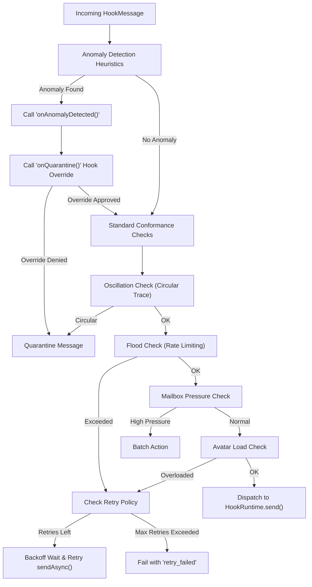

# Truex Autonomic Supervision and Heuristics Layer

The Truex Autonomic Supervision and Heuristics layer provides runtime conformance evaluation, behavioral anomaly detection, automated retry mechanics, and ontological tension-queue mapping for distributed hook actors. By guarding execution boundaries, it prevents circular message cascades, notification floods, mailbox congestion, and deceptive state changes.

---

## 1. Tutorial: Getting Started with Autonomic Supervision

This hands-on tutorial guides you through setting up the Autonomic Supervision system from scratch. You will define a simple stateful hook actor, configure the supervision framework with flood protection and burst detection, spawn the actor, and send messages to observe conformance controls and anomaly quarantine behavior.

### Prerequisites

No prior database configuration is needed for basic runtime supervision. Ensure you have the core Hook OTP modules installed. All imports in this tutorial are resolved from the local source tree.

### Step 1: Initialize the Autonomic Framework

Create a new configuration object that defines the boundaries of the supervision loop. We will set a flood limit of 3 messages within a 1-second window and configure a burst detection heuristic.

```typescript
import { AutonomicFramework } from '../../src/framework/supervision/index';

// Configure the framework boundaries
const framework = new AutonomicFramework({
  supervision: {
    maxFloodLimit: 3,
    floodWindowMs: 1000,
    maxQueueLength: 10,
    maxOscillationDepth: 3,
    maxLoadFactor: 0.85,
    anomalyDetection: {
      enableBurstDetection: true,
      maxBurstRate: 5, // More than 5 messages in 1 second triggers an anomaly
      abnormalPayloadSize: 500 // Payloads > 500 characters trigger quarantine
    },
    retryPolicy: {
      maxRetries: 2,
      baseDelayMs: 50,
      backoffMultiplier: 2
    }
  }
});

console.log("Autonomic Framework initialized successfully!");
```

### Step 2: Define and Spawn a Hook Actor

Define the behavior for a standard counter actor and spawn it using the framework runtime.

```typescript
import { HookActorRef, HookBehavior } from '../../src/lib/truex/hook-otp/types';

// Define the actor reference
const counterRef: HookActorRef = {
  tenantId: 'tenant-omega',
  packId: 'pack-metrics',
  hookId: 'hook-counter',
  instanceId: 'instance-001'
};

// Define actor state transition behavior
const counterBehavior: HookBehavior = {
  init: async () => ({ count: 0 }),
  handleDelta: async (msg, ctx) => {
    const delta = msg.payload.delta || 0;
    const currentCount = ctx.state.count || 0;
    
    console.log(`[Actor] Processing delta: +${delta}. Old count: ${currentCount}`);
    
    // Return a side-effect representation
    return [
      {
        type: 'state_updated',
        payload: { count: currentCount + delta }
      }
    ];
  }
};

// Spawn the actor in the supervision context
const actorInstance = await framework.spawnActor(counterRef, counterBehavior);
console.log(`Actor spawned: ${actorInstance.ref.hookId} (ID: ${actorInstance.ref.instanceId})`);
```

### Step 3: Send Conforming Messages

Send standard messages within the permitted rate limits and observe the successful dispatch behavior.

```typescript
import { HookMessage } from '../../src/lib/truex/hook-otp/types';

const msg1: HookMessage = {
  id: 'msg-001',
  type: 'graph_delta',
  payload: { delta: 5 }
};

// Send message synchronously
const send1 = framework.send(counterRef, msg1);
console.log(`Message 1 send result:`, send1);
// Output: { success: true, action: 'allow' }
```

### Step 4: Trigger and Observe Conformance Limits

Let's violate the configured flood limit (3 messages per second) by sending 4 messages in rapid succession.

```typescript
const msgTemplate = (id: string): HookMessage => ({
  id,
  type: 'graph_delta',
  payload: { delta: 1 }
});

console.log("Sending multiple messages to trigger flood control...");

// Send 3 conforming messages
for (let i = 2; i <= 4; i++) {
  const res = framework.send(counterRef, msgTemplate(`msg-00${i}`));
  console.log(`Message ${i} result: success = ${res.success}, action = ${res.action}`);
}

// The 5th message exceeds the maxFloodLimit (3) and is suppressed
const suppressedRes = framework.send(counterRef, msgTemplate('msg-005'));
console.log(`Message 5 (Suppressed) result:`, suppressedRes);
// Output: { success: false, action: 'suppress', reason: 'Notification flood detected' }
```

### Step 5: Test Asynchronous Message Retries

Using `sendAsync`, messages suppressed due to dynamic conditions (e.g. system load limits or flood recovery delays) will automatically retry according to the backoff schedule.

```typescript
console.log("Starting async retry demonstration...");

// Wait 1.1 seconds to clear the flood window
await new Promise(resolve => setTimeout(resolve, 1100));

// Call sendAsync. If transient load is high (e.g., current load factor = 0.90 > maxLoadFactor = 0.85),
// the system will suppress and retry.
const asyncResult = await framework.sendAsync(counterRef, msgTemplate('msg-async-001'), 0.90);
console.log(`Async send with high load result:`, asyncResult);
// Output: { success: false, action: 'retry_failed', reason: 'Max retries exceeded. Last reason: High avatar load detected' }
```

---

## 2. How-To Guide: Custom Policy & Anomaly Mitigation

This guide demonstrates how to configure complex operational checks by defining a custom heuristic rule, setting up high-precision quarantine overrides, and implementing self-healing recovery actions.

### Scenario
We want to protect a financial ledger actor. We must:
1. Prevent sudden transfers of funds exceeding a delta threshold of \$10,000.
2. Route any blocked transfer message to a human operator quarantine queue.
3. Allow the operator to inspect the payload, log the override, and allow the transaction to proceed asynchronously.

### Implementation

Create a file named `customSupervision.ts` to run this workflow:

```typescript
import { AutonomicFramework } from '../../src/framework/supervision/index';
import { HeuristicEngine } from '../../src/framework/supervision/heuristics/engine';
import { ValueDeltaHeuristic } from '../../src/framework/supervision/heuristics/implementations';
import { HeuristicContext, Heuristic } from '../../src/framework/supervision/heuristics/types';
import { HookActorRef, HookMessage, HookBehavior } from '../../src/lib/truex/hook-otp/types';

// 1. Define a Custom Security Role Heuristic
class RoleConstraintHeuristic implements Heuristic {
  public readonly name = 'role_constraint_heuristic';

  constructor(private readonly allowedRoles: string[]) {}

  public evaluate(context: HeuristicContext) {
    const payload = context.message.payload || {};
    const actorRole = payload.role || 'guest';

    if (!this.allowedRoles.includes(actorRole)) {
      return {
        isAnomaly: true,
        suggestedAction: 'quarantine' as const,
        reason: `Unauthorized actor role '${actorRole}'. Allowed roles: ${this.allowedRoles.join(', ')}`,
        heuristicName: this.name
      };
    }

    return { isAnomaly: false, heuristicName: this.name };
  }
}

// 2. Initialize the Autonomic Framework with Quarantine DX Hooks
const secureFramework = new AutonomicFramework({
  supervision: {
    maxFloodLimit: 10,
    floodWindowMs: 1000,
    anomalyDetection: {
      abnormalPayloadSize: 1000
    },
    quarantineHooks: {
      // Triggered when an anomaly occurs
      onAnomalyDetected: (ref, msg, anomaly) => {
        console.warn(`[ALERT] Anomaly Detected on actor ${ref.hookId}: ${anomaly}`);
      },
      // quarantine resolution hook allows async override
      onQuarantine: async (ref, msg, reason) => {
        console.log(`[QUARANTINE QUEUE] Action Required!`);
        console.log(`- Reason: ${reason}`);
        console.log(`- Payload:`, JSON.stringify(msg.payload));
        
        // Simulate an administrative audit action
        const isApprovedByAdmin = msg.payload.approvedByManager === true;
        console.log(`- Auditing approval status: ${isApprovedByAdmin ? 'APPROVED' : 'REJECTED'}`);
        
        return isApprovedByAdmin;
      }
    }
  }
});

// 3. Define and Spawn the Ledger Actor
const ledgerRef: HookActorRef = {
  tenantId: 'tenant-finance',
  packId: 'pack-ledger',
  hookId: 'hook-vault',
  instanceId: 'vault-01'
};

const ledgerBehavior: HookBehavior = {
  init: async () => ({ balance: 100000 }),
  handleDelta: async (msg, ctx) => {
    const amount = msg.payload.amount || 0;
    const currentBalance = ctx.state.balance || 0;
    console.log(`[Ledger Commit] Modifying balance by ${amount}. Balance: ${currentBalance + amount}`);
    return [
      {
        type: 'balance_changed',
        payload: { balance: currentBalance + amount }
      }
    ];
  }
};

await secureFramework.spawnActor(ledgerRef, ledgerBehavior);

// 4. Dispatch a Normal Message
const normalTx: HookMessage = {
  id: 'tx-001',
  type: 'graph_delta',
  payload: { amount: 50, role: 'pastor', approvedByManager: false }
};

const resultNormal = await secureFramework.sendAsync(ledgerRef, normalTx);
console.log(`Normal transaction result: success = ${resultNormal.success}, action = ${resultNormal.action}\n`);

// 5. Instantiate the Heuristic Engine to run granular checks on State Changes
const securityEngine = new HeuristicEngine({
  heuristics: [
    new ValueDeltaHeuristic('balance', 10000), // Max change in balance
    new RoleConstraintHeuristic(['admin', 'pastor'])
  ]
});

// Run a manual evaluation of a state change using the security engine
const anomalousStateChangeContext = {
  ref: ledgerRef,
  message: { id: 'tx-002', type: 'graph_delta' as const, payload: {} },
  previousState: { balance: 100000 },
  nextState: { balance: 120000 }, // Delta is 20,000 (exceeds 10,000 limit)
  timestamp: Date.now()
};

const anomalies = securityEngine.evaluate(anomalousStateChangeContext);
if (anomalies.length > 0) {
  console.error(`Heuristic Engine flagged state transition anomalies:`);
  anomalies.forEach(a => console.error(`- [${a.heuristicName}] ${a.reason}`));
}

// 6. Dispatch an anomalous transaction without administrative approval
const suspiciousTx: HookMessage = {
  id: 'tx-002',
  type: 'graph_delta',
  payload: { amount: 20000, role: 'guest', approvedByManager: false } // Guest role & large amount
};

const resultSuspicious = await secureFramework.sendAsync(ledgerRef, suspiciousTx);
console.log(`Suspicious transaction result: success = ${resultSuspicious.success}, action = ${resultSuspicious.action}\n`);

// 7. Dispatch same transaction, now with administrative approval
const approvedTx: HookMessage = {
  id: 'tx-003',
  type: 'graph_delta',
  payload: { amount: 20000, role: 'admin', approvedByManager: true } // Admin role & approved
};

const resultApproved = await secureFramework.sendAsync(ledgerRef, approvedTx);
console.log(`Approved transaction result: success = ${resultApproved.success}, action = ${resultApproved.action}\n`);
```

---

## 3. Reference Guide: API Structure and Type Contracts

This section outlines the physical layout of the supervision directory, precise file boundaries, and explicit types of the supervision and heuristic modules.

### Directory File Layout

The supervision codebase contains the following files:

*   [index.ts](file:///Users/sac/zoeapp/src/framework/supervision/index.ts) - The core autonomic runtime wrapper, managing message routing, retry logic, and proxying pack audits.
*   [heuristics/index.ts](file:///Users/sac/zoeapp/src/framework/supervision/heuristics/index.ts) - Aggregates exports for the heuristics sub-module.
*   [heuristics/types.ts](file:///Users/sac/zoeapp/src/framework/supervision/heuristics/types.ts) - Type contracts for the heuristic evaluation environment.
*   [heuristics/engine.ts](file:///Users/sac/zoeapp/src/framework/supervision/heuristics/engine.ts) - Orchestrates execution loops over registered heuristics.
*   [heuristics/implementations.ts](file:///Users/sac/zoeapp/src/framework/supervision/heuristics/implementations.ts) - Concrete heuristic rule sets (Frequency, ValueDelta, Variance, Composite).
*   [__tests__/supervision.test.ts](file:///Users/sac/zoeapp/src/framework/supervision/__tests__/supervision.test.ts) - Automated unit tests for framework rate limits, retry backoffs, and hooks.
*   [heuristics/__tests__/heuristics.test.ts](file:///Users/sac/zoeapp/src/framework/supervision/heuristics/__tests__/heuristics.test.ts) - Detailed unit tests validating metric boundaries and composite logic.

---

### Core Type Signatures

#### Config and Policies (`src/framework/supervision/index.ts`)

```typescript
export interface AnomalyDetectionHeuristics {
  enableBurstDetection?: boolean;
  maxBurstRate?: number;
  abnormalPayloadSize?: number;
}

export interface AutomatedRetryPolicy {
  maxRetries: number;
  baseDelayMs: number;
  backoffMultiplier?: number;
}

export interface QuarantineResolutionHooks {
  onQuarantine?: (ref: HookActorRef, message: HookMessage, reason?: string) => Promise<boolean> | boolean;
  onAnomalyDetected?: (ref: HookActorRef, message: HookMessage, heuristic: string) => void;
}

export interface AutonomicConfig {
  supervision?: {
    maxFloodLimit?: number;
    floodWindowMs?: number;
    maxQueueLength?: number;
    maxOscillationDepth?: number;
    maxLoadFactor?: number;
    anomalyDetection?: AnomalyDetectionHeuristics;
    retryPolicy?: AutomatedRetryPolicy;
    quarantineHooks?: QuarantineResolutionHooks;
  };
}

export interface SendResult {
  success: boolean;
  action: SupervisorAction | 'allow' | 'anomaly_detected' | 'retry_failed';
  reason?: string;
}
```

#### Heuristic Interfaces (`src/framework/supervision/heuristics/types.ts`)

```typescript
export interface HeuristicResult {
  isAnomaly: boolean;
  suggestedAction?: 'quarantine' | 'suppress' | 'allow';
  reason?: string;
  heuristicName: string;
}

export interface HeuristicContext {
  ref: HookActorRef;
  message: HookMessage;
  previousState?: HookState;
  nextState?: HookState;
  timestamp: number;
}

export interface Heuristic {
  readonly name: string;
  evaluate(context: HeuristicContext): HeuristicResult;
}

export interface HeuristicEngineConfig {
  heuristics: Heuristic[];
}
```

---

### API Specifications

#### `AutonomicFramework`

```typescript
export class AutonomicFramework {
  public readonly runtime: HookRuntime;
  public readonly conformance: SupervisionProcessConformanceEvaluator;
  public readonly queueMapper: TensionQueueMapper;

  constructor(config?: AutonomicConfig);

  public spawnActor(
    ref: HookActorRef,
    behavior: HookBehavior,
    supervisor?: HookSupervisor,
    initialState?: HookState
  ): Promise<HookActorInstance>;

  public sendAsync(
    ref: HookActorRef,
    msg: HookMessage,
    currentLoadFactor?: number
  ): Promise<SendResult>;

  public send(
    ref: HookActorRef,
    msg: HookMessage,
    currentLoadFactor?: number
  ): SendResult;

  public auditPackTension(packName: string): Promise<TensionQueueAuditResult>;

  public mapPackTensionQueue(
    packName: string,
    mappingRules: Record<string, string>
  ): Promise<TensionQueueMappingResult>;

  public evaluateTrace(declared: string[], actual: string[]): ConformanceReport;
}
```

#### `HeuristicEngine`

```typescript
export class HeuristicEngine {
  constructor(config: HeuristicEngineConfig);
  public evaluate(context: HeuristicContext): HeuristicResult[];
  public addHeuristic(heuristic: Heuristic): void;
}
```

#### `FrequencyHeuristic`
Evaluates message density over time.
*   **Constructor Parameters**:
    *   `config.threshold`: Maximum occurrences of matching context within the temporal frame.
    *   `config.windowMs`: Window width in milliseconds.
    *   `config.groupBy`: (Optional) Custom criteria function returning grouping keys. Defaults to `tenantId:packId:hookId:instanceId`.

#### `ValueDeltaHeuristic`
Flags state adjustments whose arithmetic difference exceeds configured limits.
*   **Constructor Parameters**:
    *   `path`: Lodash-like dot-separated path to target numerical state value (e.g. `stats.userCount`).
    *   `maxDelta`: Absolute value variance threshold.

#### `VarianceHeuristic`
Uses running sample standard deviation and Z-Score statistics to isolate anomalies.
*   **Constructor Parameters**:
    *   `path`: Dot-separated path to numerical state value.
    *   `zScoreThreshold`: Standard deviation multiple representing boundary limits.
    *   `minSamples`: Minimum warm-up historical queue length before checking metrics (default = 5).

#### `CompositeHeuristic`
Combines multiple heuristics.
*   **Constructor Parameters**:
    *   `name`: Label of the composite heuristic.
    *   `heuristics`: Array of heuristics.
    *   `mode`: `'AND'` (all must fail) or `'OR'` (any one failure triggers).

---

## 4. Explanation: Architectural Design and Mathematical Conformance

The autonomic supervision layer is responsible for enforcing the operational safety limits of the Truex Runtime. Its primary purpose is to safeguard system resources from malfunctioning hooks while providing self-healing mechanisms for state evolution.



### Architectural Subsystems

1.  **Process Conformance Evaluator ([supervision.ts](file:///Users/sac/zoeapp/src/lib/truex/supervision/supervision.ts))**:
    This subsystem runs immediate constraints on message dispatch:
    *   **Circular Message Oscillation**: Inspects the causality tracking array `msg.payload.trace` to ensure depth remains below threshold $D_{max}$ (preventing infinite dispatch loops).
    *   **Notification Flooding**: Keeps track of sliding windows to suppress burst spikes targeting specific instance hooks.
    *   **Mailbox Queue Pressure**: Inspects individual mailboxes. If message density rises too fast, recommends a `'batch'` action, deferring instant execution.
    *   **System Avatar Load**: Reads system performance logs. If resource utilization exceeds `maxLoadFactor`, incoming actions are suppressed.
2.  **Statistical & Numeric Heuristics ([implementations.ts](file:///Users/sac/zoeapp/src/framework/supervision/heuristics/implementations.ts))**:
    Rather than static limits, the Heuristic sub-module applies active analytics over state changes. For instance, the `VarianceHeuristic` records historical values of specific paths and calculates standard deviation:
    $$\sigma = \sqrt{\frac{1}{N}\sum_{i=1}^{N}(x_i - \mu)^2}$$
    An update is quarantined if the Z-Score exceeds threshold $Z_{thresh}$:
    $$Z = \frac{|x_{next} - \mu|}{\sigma} > Z_{thresh}$$
3.  **Ontological Tension-Queue Mapping ([packs.ts](file:///Users/sac/zoeapp/src/lib/truex/packs/packs.ts))**:
    In distributed systems, schemas evolve independently. The `TensionQueueMapper` scans the pre-admission databases `actor_outbox` and `sync_queue`. It matches pending payloads, applies renaming rules on predicates and keys, and commits changes atomically, preventing deadlocks or execution failures due to invalid state mappings.

---

### Alignment with the Chatman Equation

The autonomic supervision layer is mathematically modeled through the **Receipted Chatman Equation**:

$$R \vdash A = \mu(O^*)$$

Under the supervision context, the variables represent concrete components:

*   **$R$ (Role & Policy Context)**: Represents the tenant boundaries, actor definitions, dynamic system load thresholds, and safety policies configured in the `AutonomicConfig` (e.g. `maxLoadFactor`, `maxOscillationDepth`).
*   **$A$ (Action / Conformance Verdict)**: The final execution command dispatched by the supervisor. It represents the mapped state or the specific routing choice, such as `'allow'`, `'suppress'`, `'batch'`, or `'quarantine'`.
*   **$\mu(O^*)$ (Supervisory Transition Function)**: The evaluation function that compiles the state of observables $O^*$ (metrics, history, payload characteristics) into the verdict action.
*   **$\vdash$ (Entails / Security Boundary Validation Gate)**: The conformance check. If the evaluation function finds zero anomalies and conforming trace histories under policy context $R$, the action is allowed ($A = \text{'allow'}$) and executed.

#### Supervision Parameter Mapping

| Component | Mathematical Variable | Concrete Supervision Representation |
| :--- | :--- | :--- |
| **System Rules** | $R$ | `AutonomicConfig`, tenant limits, threshold policy definitions. |
| **Observables** | $O^*$ | Message logs, mailbox depth, current CPU load, delta size, execution traces. |
| **Evaluation** | $\mu(O^*)$ | `conformance.evaluateMessage()`, `HeuristicEngine.evaluate()`, `detectAnomaly()`. |
| **Verdict** | $A$ | `SendResult.action` $\in \{\text{'allow'}, \text{'suppress'}, \text{'quarantine'}, \text{'batch'}, \text{'retry\_failed'}\}$. |

---

### Design Trade-offs and Constraints

*   **Synchronous vs. Asynchronous Conformance Evaluation**:
    *   *Synchronous Execution (`send`)*: Validates rules inside the main process loop. It features zero allocation overhead but cannot run async quarantine hooks or handle retry delays.
    *   *Asynchronous Execution (`sendAsync`)*: Executes non-blocking retries and supports custom quarantine overrides. It incurs minor heap allocation cost due to promise scheduling.
*   **Heuristic History Memory Bounds**:
    The `VarianceHeuristic` and `FrequencyHeuristic` preserve tracking windows. To prevent memory leaks, historical values are shifted when sizes exceed 100 entries.

---

### Conformance Verdict Matrix

| Condition | Suggested Action | Recovery Action |
| :--- | :--- | :--- |
| **$Count_{window} > Limit_{flood}$** | `'suppress'` | Delay and retry via `AutomatedRetryPolicy`. |
| **$Depth_{trace} > Limit_{oscillation}$** | `'quarantine'` | Administrative override via `QuarantineResolutionHooks`. |
| **$Z\text{-Score} > Z_{thresh}$** | `'quarantine'` | Alert operator, request manual confirmation or state rollback. |
| **$Load_{system} > Load_{max}$** | `'suppress'` | Exponential backoff delay until CPU pressure drops. |
| **$Queue_{mailbox} > Limit_{pressure}$** | `'batch'` | Defer processing to batch interval queue. |
