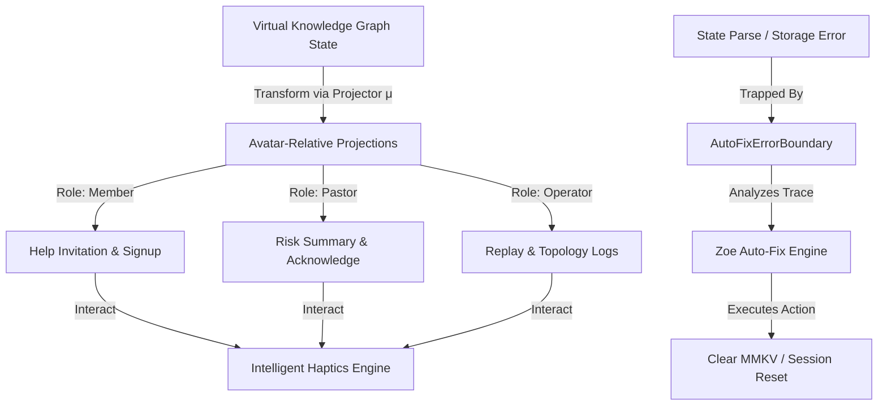

# Zoe UI Framework (Design System, Visual Effects, Theme, & Animations)

This document provides premium-grade, Diátaxis-compliant documentation for the core UI, theme, visual effects, gestures, haptics, and animations subsystem located in the Zoe Framework under [src/framework/ui](file:///Users/sac/zoeapp/src/framework/ui).

---

## 1. Tutorial (Learning-oriented)

This tutorial guides you through setting up the Zoe theme provider and creating your first interactive, animated themed screen in React Native (Expo) from scratch.

### 1.1 Prerequisites
Before using any UI components, make sure your project is configured with `nativewind` (Tailwind CSS for React Native) and `react-native-reanimated`.

### 1.2 Step 1: Wrap Your App Root with ThemeProvider
To enable dynamic theme vars, typography scaling, and light/dark color propagation, wrap your application root inside `ThemeProvider`. This is typically done in your root layout file (e.g., `src/app/_layout.tsx`):

```tsx
import React from 'react';
import { SafeAreaProvider } from 'react-native-safe-area-context';
import { ThemeProvider } from '../framework/ui/theme/ThemeContext';
import { Slot } from 'expo-router';

export default function RootLayout() {
  return (
    <SafeAreaProvider>
      <ThemeProvider>
        <Slot />
      </ThemeProvider>
    </SafeAreaProvider>
  );
}
```

### 1.3 Step 2: Create a Basic Themed Screen
Now, let's create a demo screen utilizing our core typography, layout blocks, and buttons. This screen uses `Themed` primitives to adapt automatically to light and dark modes:

Create `src/screens/DemoScreen.tsx`:
```tsx
import React from 'react';
import { StyleSheet } from 'react-native';
import { Text, View } from '../framework/ui/Themed';
import { Button } from '../framework/ui/Button';
import { Badge } from '../framework/ui/Badge';

export function DemoScreen() {
  return (
    <View className="flex-1 justify-center items-center p-6 bg-background">
      <Badge variant="primary" className="mb-4">
        Zoe UI 2030 Inception
      </Badge>
      
      <Text className="text-3xl font-bold text-center mb-2">
        Welcome to Zoe App
      </Text>
      
      <Text className="text-base text-center mb-8 opacity-75">
        Experience high-performance micro-interactions and atomic themed state propagation.
      </Text>

      <Button
        variant="primary"
        size="lg"
        onPress={() => console.log('Action triggered')}
      >
        Get Started
      </Button>
    </View>
  );
}
```

### 1.4 Step 3: Add entry and interactive micro-animations
To elevate the user experience, wrap UI elements in Entry Animations (`FadeIn`, `SlideTransition`) and Press Animations (`ScalePress`).

Update `src/screens/DemoScreen.tsx` with the following implementation:
```tsx
import React from 'react';
import { View as RNView } from 'react-native';
import { Text, View } from '../framework/ui/Themed';
import { Button } from '../framework/ui/Button';
import { Badge } from '../framework/ui/Badge';
import { FadeIn } from '../framework/ui/animations/FadeIn';
import { SlideTransition } from '../framework/ui/animations/SlideTransition';
import { ScalePress } from '../framework/ui/animations/ScalePress';

export function DemoScreenAnimated() {
  return (
    <View className="flex-1 justify-center items-center p-6 bg-background">
      {/* Entry animation with vertical slide and fade-in */}
      <SlideTransition direction="up" offset={40} delay={100}>
        <Badge variant="success" className="mb-4">
          Online
        </Badge>
      </SlideTransition>

      <FadeIn duration={600} delay={200}>
        <Text className="text-3xl font-extrabold text-center mb-2">
          Autonomic Fluid UI
        </Text>
      </FadeIn>

      <FadeIn duration={600} delay={300}>
        <Text className="text-base text-center mb-8 opacity-75 px-4">
          Haptics, voice controls, and physics-based gesture responses working in harmony.
        </Text>
      </FadeIn>

      {/* Physics-based spring scaling on press */}
      <ScalePress 
        activeScale={0.92}
        onPress={() => console.log('Micro-interaction executed')}
      >
        <RNView className="bg-neutral-900 dark:bg-neutral-100 px-6 py-3 rounded-xl">
          <Text className="text-white dark:text-black font-bold">
            Interactive Button
          </Text>
        </RNView>
      </ScalePress>
    </View>
  );
}
```

Congratulations! You have set up the Zoe theme provider and created a fully functioning animated screen that automatically conforms to user themes and provides native 120fps physics-based scaling feedback.

---

## 2. How-To Guide (Task-oriented)

### Goal: Creating an Autonomic Self-Healing Control Panel with Voice Intents and Gesture-Based Suggestions Dismissal

This guide details how to implement a complex control panel screen. We will:
1. Wrap our screen with an `AutoFixErrorBoundary` to catch local state parse issues and offer one-click automated repairs (wipe MMKV/AsyncStorage).
2. Integrate `VoiceCommandBoundary` and register custom voice commands ("reconnect", "add candidate") that perform transactional actions.
3. Render an `AvatarRelativeProjectionMatrixView` displaying authorized actions based on user roles.
4. Let users dismiss alerts using `SwipeToDismiss` and provide physical feedback using the `useHaptics` hook.

Create `src/screens/AutonomicControlPanel.tsx`:
```tsx
import React, { useState, useCallback } from 'react';
import { View, Text, StyleSheet, ScrollView } from 'react-native';
import { SafeAreaView } from 'react-native-safe-area-context';
import { AutoFixErrorBoundary } from '../framework/ui/auto-fix/AutoFixErrorBoundary';
import { VoiceCommandBoundary } from '../framework/ui/voice/VoiceCommandBoundary';
import { useVoiceIntent } from '../framework/ui/voice/useVoiceIntent';
import { AvatarRelativeProjectionMatrixView } from '../framework/ui/AvatarRelativeProjection';
import { SwipeToDismiss } from '../framework/ui/gestures/SwipeToDismiss';
import { useHaptics } from '../framework/ui/haptics/useHaptics';
import { Button } from '../framework/ui/Button';
import { GlassCard } from '../framework/ui/glassmorphism/GlassCard';

function ControlPanelContent() {
  const haptics = useHaptics();
  const [alerts, setAlerts] = useState<Array<{ id: string; text: string }>>([
    { id: '1', text: 'Stale local cache detected in network buffer.' },
    { id: '2', text: 'Volunteer shortage warning triggered for Sunday.' },
  ]);

  // Voice Intent Hook setup
  const { isListening, startListening, stopListening, registerIntents } = useVoiceIntent({
    onIntentRecognized: (intent) => {
      console.log(`Voice intent executed: ${intent.id}`);
      haptics.success();
    },
    onUnknownCommand: (cmd) => {
      console.warn(`Unknown voice command: ${cmd}`);
      haptics.error();
    },
  });

  // Register voice intents dynamically
  React.useEffect(() => {
    registerIntents([
      {
        id: 'control.clearAlerts',
        commands: ['clear alerts', 'remove notifications', 'clear all'],
        action: () => {
          setAlerts([]);
          haptics.success();
        },
        description: 'Clears all visible notification cards.',
        priority: 10,
      },
      {
        id: 'control.simulateCrash',
        commands: ['simulate crash', 'trigger error'],
        action: () => {
          haptics.warning();
          // Intentionally throw state-related error to trigger AutoFixErrorBoundary
          throw new Error('Null pointer exception: Cannot read property "JSON" of undefined state representation.');
        },
        description: 'Throws a mock state exception to test the self-healing repairs.',
        priority: 5,
      }
    ]);
  }, [registerIntents, haptics]);

  const handleDismissAlert = useCallback((id: string) => {
    setAlerts((prev) => prev.filter((a) => a.id !== id));
    haptics.light();
  }, [haptics]);

  return (
    <ScrollView style={styles.scrollContainer} contentContainerStyle={styles.scrollContent}>
      {/* Header card with glassmorphism */}
      <GlassCard intensity="high" tint="default" className="p-5 mb-6">
        <Text style={styles.headerTitle}>System Control Deck</Text>
        <Text style={styles.headerSubtitle}>
          Hands-free voice recognition, physical feedback, and autonomic self-healing controls.
        </Text>

        <View style={styles.buttonRow}>
          <Button
            variant={isListening ? 'destructive' : 'primary'}
            onPress={isListening ? stopListening : startListening}
            className="flex-1 mr-2"
          >
            {isListening ? 'Stop Voice Listening' : 'Start Voice Control'}
          </Button>
          <Button
            variant="outline"
            onPress={() => haptics.heavy()}
            className="flex-1"
          >
            Test Heavy Haptic
          </Button>
        </View>
      </GlassCard>

      {/* Notifications with Swipe-to-Dismiss */}
      {alerts.length > 0 && (
        <View style={styles.section}>
          <Text style={styles.sectionTitle}>Active Warnings (Swipe Right to Dismiss)</Text>
          {alerts.map((alert) => (
            <SwipeToDismiss
              key={alert.id}
              directions={['right']}
              threshold={0.35}
              onDismiss={() => handleDismissAlert(alert.id)}
            >
              <View style={styles.alertCard}>
                <Text style={styles.alertText}>⚠️ {alert.text}</Text>
              </View>
            </SwipeToDismiss>
          ))}
        </View>
      )}

      {/* Dynamic Authorized Projection Grid */}
      <View style={styles.section}>
        <AvatarRelativeProjectionMatrixView 
          initialData={{
            openSlots: 3,
            candidates: ['Arthur Pendragon', 'Guinevere Du Lac'],
            shortageRatio: 0.38,
            runId: 'run-7744',
            topology: { nodes: 16, channels: 6, supervisorStatus: 'healthy' },
            stateHash: 'vkg_matrix_99bb'
          }}
        />
      </View>
    </ScrollView>
  );
}

export default function AutonomicControlPanel() {
  return (
    <SafeAreaView style={styles.safeContainer}>
      <AutoFixErrorBoundary enableAutoFix={true}>
        <VoiceCommandBoundary enabled={true}>
          <ControlPanelContent />
        </VoiceCommandBoundary>
      </AutoFixErrorBoundary>
    </SafeAreaView>
  );
}

const styles = StyleSheet.create({
  safeContainer: {
    flex: 1,
    backgroundColor: '#09090b',
  },
  scrollContainer: {
    flex: 1,
  },
  scrollContent: {
    padding: 16,
  },
  headerTitle: {
    fontSize: 22,
    fontWeight: 'bold',
    color: '#f8fafc',
    marginBottom: 4,
  },
  headerSubtitle: {
    fontSize: 13,
    color: '#94a3b8',
    marginBottom: 16,
  },
  buttonRow: {
    flexDirection: 'row',
    marginTop: 8,
  },
  section: {
    marginBottom: 24,
  },
  sectionTitle: {
    fontSize: 12,
    fontWeight: 'bold',
    color: '#64748b',
    textTransform: 'uppercase',
    letterSpacing: 1,
    marginBottom: 8,
  },
  alertCard: {
    backgroundColor: '#18181b',
    borderWidth: 1,
    borderColor: '#27272a',
    borderRadius: 12,
    padding: 16,
    marginBottom: 8,
  },
  alertText: {
    color: '#f43f5e',
    fontSize: 13,
    fontWeight: '600',
  },
});
```

---

## 3. Reference Guide (Information-oriented)

### 3.1 Directory File Layout

The core UI package layout is structured as follows:

| Directory/File | Description |
| :--- | :--- |
| [index.ts](file:///Users/sac/zoeapp/src/framework/ui/index.ts) | Consolidates framework-level UI component exports. |
| [Themed.tsx](file:///Users/sac/zoeapp/src/framework/ui/Themed.tsx) | Basic wrappers around Native Text & View elements injected with colors and font scaling. |
| [StyledText.tsx](file:///Users/sac/zoeapp/src/framework/ui/StyledText.tsx) | Specific utility text components (e.g. `MonoText`). |
| [TransitionOverlay.tsx](file:///Users/sac/zoeapp/src/framework/ui/TransitionOverlay.tsx) | Screen transition blocks for blocking UI inputs on session changes. |
| [AvatarRelativeProjection.tsx](file:///Users/sac/zoeapp/src/framework/ui/AvatarRelativeProjection.tsx) | Evaluates and visualizes localized authority grids based on role projection logic. |
| [OfflineBanner.tsx](file:///Users/sac/zoeapp/src/framework/ui/OfflineBanner.tsx) | Connects to state machine indicators to show connection dropouts. |
| [Button.tsx](file:///Users/sac/zoeapp/src/framework/ui/Button.tsx) | Primary custom action button with Reanimated press feedback. |
| [Badge.tsx](file:///Users/sac/zoeapp/src/framework/ui/Badge.tsx) | Visual tags to call out small metadata indicators. |
| [theme/](file:///Users/sac/zoeapp/src/framework/ui/theme) | Core styling, variables mapping, and theme state persistence modules. |
| [glassmorphism/](file:///Users/sac/zoeapp/src/framework/ui/glassmorphism) | Frosted glass cards and buttons utilizing styling utilities. |
| [animations/](file:///Users/sac/zoeapp/src/framework/ui/animations) | Shared entry fades, spring presses, transitions, and stagger lists. |
| [haptics/](file:///Users/sac/zoeapp/src/framework/ui/haptics) | Intelligent vibration feedback engine bound to interaction severity. |
| [voice/](file:///Users/sac/zoeapp/src/framework/ui/voice) | Fuzzy speech pattern command interpreters and scopes. |
| [gestures/](file:///Users/sac/zoeapp/src/framework/ui/gestures) | Native gesture interfaces like PinchToZoom and SwipeToDismiss. |
| [auto-fix/](file:///Users/sac/zoeapp/src/framework/ui/auto-fix) | Autonomic repair context blocks diagnosing and healing runtime crashes. |
| [generative/](file:///Users/sac/zoeapp/src/framework/ui/generative) | Generative view mapping engine generating structural components from schemas. |

---

### 3.2 Core Component API Signatures

#### Theme Subsystem ([theme/types.ts](file:///Users/sac/zoeapp/src/framework/ui/theme/types.ts))

```typescript
export type ThemeColors = {
  primary: string;
  secondary: string;
  background: string;
  text: string;
  card: string;
  border: string;
  notification: string;
};

export type ThemeSettings = {
  colors: ThemeColors;
  fontScale: number;
};

export type ThemeContextType = {
  theme: ThemeSettings;
  updateTheme: (updates: Partial<ThemeSettings> | ((prev: ThemeSettings) => ThemeSettings)) => void;
  resetTheme: () => void;
};
```

---

#### Avatar-Relative Projections ([AvatarRelativeProjection.tsx](file:///Users/sac/zoeapp/src/framework/ui/AvatarRelativeProjection.tsx))

```typescript
export interface AvatarRelativeProjectionMatrixViewProps {
  initialData?: {
    openSlots?: number;
    candidates?: string[];
    shortageRatio?: number;
    runId?: string;
    history?: Array<{ timestamp: string; event: string; detail: string }>;
    topology?: { nodes: number; channels: number; supervisorStatus: string };
    stateHash?: string;
  };
}

export interface AvatarProjectionCardProps {
  role: AvatarRole;
  data: any;
  roleColor: string;
  projectionKey?: string;
}
```

The underlying projection calculations are governed by the mappings defined in [avatar-projection.ts](file:///Users/sac/zoeapp/src/lib/truex/avatar/avatar-projection.ts):

```typescript
export interface AvatarProjection {
  role: AvatarRole;
  visible: boolean;
  surface: string;
  allowedActions: string[];
  payload: any;
}

export const PROJECTION_MATRIX: Record<string, (data: any, role: AvatarRole) => AvatarProjection>;
```

---

#### Intelligent Haptics ([haptics/IntelligentHaptics.ts](file:///Users/sac/zoeapp/src/framework/ui/haptics/IntelligentHaptics.ts))

```typescript
export enum HapticFeedbackPattern {
  SUCCESS = 'SUCCESS',
  WARNING = 'WARNING',
  ERROR = 'ERROR',
  LIGHT = 'LIGHT',
  MEDIUM = 'MEDIUM',
  HEAVY = 'HEAVY',
  SELECTION = 'SELECTION',
}

export class IntelligentHaptics {
  static setEnabled(enabled: boolean): void;
  static trigger(pattern: HapticFeedbackPattern): void;
  static impact(tension: number): void; // Triggers LIGHT, MEDIUM, or HEAVY haptics dynamically based on 0-1 range
}
```

---

#### Gestures ([gestures/SwipeToDismiss.tsx](file:///Users/sac/zoeapp/src/framework/ui/gestures/SwipeToDismiss.tsx))

```typescript
export type SwipeDirection = 'left' | 'right' | 'up' | 'down';

export interface SwipeToDismissProps {
  children: React.ReactNode;
  directions?: SwipeDirection[]; // defaults to ['right']
  threshold?: number;            // percentage (0 to 1), defaults to 0.4
  onDismiss?: () => void;
  onSwipeCancel?: () => void;
  enabled?: boolean;
}
```

---

#### Voice Intent System ([voice/types.ts](file:///Users/sac/zoeapp/src/framework/ui/voice/types.ts))

```typescript
export interface VoiceIntent {
  id: string;
  commands: string[];
  action: (params?: Record<string, any>) => void | Promise<void>;
  description?: string;
  priority?: number; // Defaults to 0. Evaluated if multiple trigger strings overlap
}

export interface UseVoiceIntentOptions {
  autoStart?: boolean;
  onIntentRecognized?: (intent: VoiceIntent) => void;
  onUnknownCommand?: (command: string) => void;
}
```

---

#### Autonomic Self-Healing Boundary ([auto-fix/types.ts](file:///Users/sac/zoeapp/src/framework/ui/auto-fix/types.ts))

```typescript
export interface SuggestedFix {
  id: string;
  title: string;
  description: string;
  impact: 'low' | 'medium' | 'high';
  action: () => void | Promise<void>;
}

export interface ErrorAnalysis {
  causes: string[];
  suggestions: SuggestedFix[];
  isStateRelated: boolean;
}
```

---

## 4. Explanation (Understanding-oriented)

Zoe’s UI framework is an autonomic visual system designed to address three primary needs:
1. **Dynamic Interface Adaptation** based on security boundaries (Avatar-Relative Projections).
2. **Deterministic UI State Transitions** under high load or network offline scenarios.
3. **Resilience** via diagnostic error boundaries that propose self-healing steps.



### 4.1 Relationship to the Chatman Equation: $R \vdash A = \mu(O^*)$

Zoe's projection rendering is a direct representation of the Chatman security membrane formula:

$$R \vdash A = \mu(O^*)$$

Where:
- **$R$ (Relationship/RoleContext)**: Evaluated dynamically using `AvatarRole` ('guest', 'member', 'volunteer', 'teamLead', 'pastor', 'admin', 'operator').
- **$O^*$ (Optimized VKG State Representation)**: Represents the source of truth from the Virtual Knowledge Graph (such as shortage ratios, candidate listings, nodes, or database histories).
- **$\mu$ (Projection Mapping Function)**: Implemented in the codebase as the `PROJECTION_MATRIX` function mapper.
- **$A$ (Allowed Interface Actions)**: Output as the permitted actions (`allowedActions`) and visible surface controls rendering only the parts of state that the given role context has authority to interact with.

Under high load, the projection membrane dynamically degrades capabilities to protect system stability (enforced by the `adjustProjectionForLoad` invariant which slices `allowedActions` to prevent concurrency bottlenecks).

---

### 4.2 Autonomic Self-Healing (Auto-Fix) Mechanics

Standard React Native apps crash when local data cache structures drift or corrupt. The Zoe Auto-Fix system mitigates this:
- **Analysis Phase**: When the React render tree crashes, the `AutoFixErrorBoundary` catches the exception. The stack trace and error message are parsed by `analyzeError`.
- **Diagnostic Mapping**:
  - Null/undefined objects or Zustand stack occurrences map to a suggested fix to clear MMKV/AsyncStorage.
  - Network auth tokens or 401/403 codes map to session resets.
- **Execution**: The user is presented with a non-technical suggestion card listing the repair impact. Pressing the button executes the corrective handler and restarts the local app context.

---

### 4.3 Multi-Modal Gesture & Haptic Micro-Interactions

Visual feedback is paired with physical responses:
- **Continuous Tension Haptics**: During drag gestures (e.g. `SwipeToDismiss`), the displacement is normalized into a tension scale (0 to 1). As the element is dragged closer to its exit threshold, `useTensionHaptics` fires discrete, ascending vibrations (`LIGHT` -> `MEDIUM` -> `HEAVY`), warning the user that dismissal is about to occur.
- **Off-Thread Transitions**: Animations use Native Reanimated shared values running directly on the native rendering thread, keeping the main JS thread free to evaluate complex VKG operations and voice recognition command buffers.

---

### 4.4 Concurrency Concerns and Constraints

When executing voice intents and haptics, concurrency must be managed carefully:
1. **JS thread vs UI thread separation**: Reanimated handles gesture interpolation and styling updates on the UI thread, while voice processing (`useVoiceIntent` fuzzy matching) runs on the JS thread. Interacting with both simultaneously can cause temporary delays if the JS thread is heavily blocked by query computations.
2. **MMKV Multi-Process Safety**: MMKV operations inside the Auto-Fix engine are synchronous and fast. However, clearing storage during an active transaction can lead to state inconsistency if the background sync loops are running. It is recommended to perform storage clears followed by an immediate app reload.
