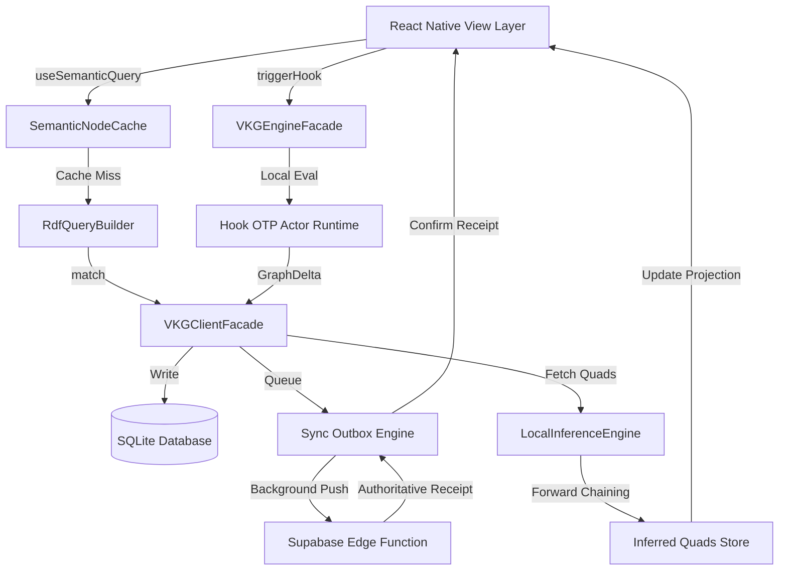

# Virtual Knowledge Graph (VKG) Engine Framework

The Virtual Knowledge Graph (VKG) framework provides a high-performance, reactive ontology mapping layer that connects local relational SQLite databases and remote Supabase storage to a semantic graph model. By providing RDF.js-compliant graph structures, fluent SPARQL-like query builders, local forward-chaining inference engines, and React Native bindings, the VKG allows mobile applications to query, mutate, and reason over semantic data offline-first.

---

## 1. Tutorial: Getting Started with the VKG Engine

This hands-on tutorial guides you through setting up a complete VKG workspace from scratch. You will learn how to:
1. Initialize the `VKGClientFacade` and seed it with standard JSON-LD data.
2. Build and execute semantic queries using `SemanticQueryBuilder`.
3. Configure a `LocalInferenceEngine` to run forward-chaining reasoning.
4. Mount the `VkgProvider` and bind graph states to React components.

### Prerequisites

All imports are resolved relative to the root codebase. Ensure you have the core packages configured. No prior database schema configuration is required for mock or facade operations.

### Step 1: Initialize the Client and Seed Facts

The `VKGClientFacade` provides an abstraction over raw database interactions. Let's initialize a facade and seed it with a JSON-LD description of a community workshop.

```typescript
import { VKGClientFacade } from '../../src/framework/vkg/client';
import { DataFactory } from '../../src/framework/vkg/rdf';

// Instantiate the VKG Client Facade
const client = new VKGClientFacade();

// Define a JSON-LD document describing a local event and its instructor
const workshopJsonLd = {
  '@id': 'https://zoe.framework/ontology/event/workshop-101',
  '@type': 'Event',
  'name': 'Introduction to Semantic Web Architectures',
  'startDate': '2026-06-15T10:00:00Z',
  'location': {
    '@id': 'https://zoe.framework/ontology/location/room-a',
    '@type': 'Place',
    'name': 'Room A - Main Hall'
  },
  'instructor': {
    '@id': 'https://zoe.framework/ontology/person/alice-jones',
    '@type': 'Person',
    'name': 'Dr. Alice Jones',
    'memberOf': 'https://zoe.framework/ontology/organization/zoe-core'
  }
};

// Parse and write JSON-LD to the local store and sync outbox
await client.addJsonLd(workshopJsonLd);
console.log('Successfully seeded local RDF store with JSON-LD quads!');
```

### Step 2: Query the Graph using the Fluent Builder

Now that facts are stored in the local SQLite database, you can construct graph queries using the fluent `SemanticQueryBuilder` to perform triple pattern matching and variable joins.

```typescript
import { semanticQuery } from '../../src/framework/vkg/semantic/builder';

// Find the names of instructors who are members of 'zoe-core'
const results = await semanticQuery(client)
  .match('?event', 'rdf:type', 'schema:Event')
  .match('?event', 'schema:instructor', '?instructor')
  .match('?instructor', 'rdf:type', 'schema:Person')
  .match('?instructor', 'schema:name', '?name')
  .match('?instructor', 'schema:memberOf', 'https://zoe.framework/ontology/organization/zoe-core')
  .select('?name', '?event')
  .execute();

results.forEach((binding) => {
  console.log(`Instructor Name: ${binding.name.value}`);
  console.log(`Event URI: ${binding.event.value}`);
});
```

### Step 3: Define Rules and Run Forward-Chaining Inference

You can register reasoning rules to infer new facts from existing relationships. For example, we can assert a symmetry rule: if Alice is the instructor of the workshop, then the workshop has Alice as a facilitator.

```typescript
import { LocalInferenceEngine } from '../../src/framework/vkg/inference/engine';
import { DataFactory } from '../../src/framework/vkg/rdf';
import { InferenceRule } from '../../src/framework/vkg/inference/types';

// 1. Create a custom rule: instructorOf(Person, Event) => facilitatorOf(Person, Event)
const facilitationRule: InferenceRule = {
  name: 'instructor-facilitation-entailment',
  body: [
    {
      subject: DataFactory.variable('event'),
      predicate: DataFactory.namedNode('https://schema.org/instructor'),
      object: DataFactory.variable('person'),
    }
  ],
  head: {
    subject: DataFactory.variable('person'),
    predicate: DataFactory.namedNode('https://zoe.framework/ontology/facilitatorOf'),
    object: DataFactory.variable('event'),
  }
};

// 2. Load all current quads
const baseQuads = await client.match();

// 3. Initialize the inference engine with rules and compute graph completion
const inferenceEngine = new LocalInferenceEngine([facilitationRule]);
const inferenceResult = inferenceEngine.infer(baseQuads, 5);

console.log(`Inference completed in ${inferenceResult.iterations} iteration(s).`);
console.log(`Inferred ${inferenceResult.inferredQuads.length} new quad(s):`);

inferenceResult.inferredQuads.forEach((quad) => {
  console.log(`[INFERRED] <${quad.subject.value}> <${quad.predicate.value}> "${quad.object.value}"`);
});
```

### Step 4: Bind Graph Queries to React Context

Finally, wrap your React Native tree in `VkgProvider` and leverage react hooks to bind visual representations to graph queries.

```tsx
import React from 'react';
import { View, Text } from 'react-native';
import { VkgProvider, useSemanticQuery } from '../../src/framework/vkg/react';
import { VKGClientFacade } from '../../src/framework/vkg/client';

const clientInstance = new VKGClientFacade();

function InstructorList() {
  // Execute a reactive semantic query bound to the VKG client
  const { results, loading, error } = useSemanticQuery(
    clientInstance,
    (query) => {
      query
        .match('?event', 'schema:instructor', '?instructor')
        .match('?instructor', 'schema:name', '?name')
        .select('?name');
    },
    [] // Re-run query if dependency array updates
  );

  if (loading) return <Text>Loading instructors...</Text>;
  if (error) return <Text>Error: {error.message}</Text>;

  return (
    <View style={{ padding: 16 }}>
      <Text style={{ fontSize: 18, fontWeight: 'bold' }}>Instructors</Text>
      {results.map((res, index) => (
        <Text key={index} style={{ fontSize: 14, marginVertical: 4 }}>
          • {res.name.value}
        </Text>
      ))}
    </View>
  );
}

export default function App() {
  return (
    <VkgProvider>
      <InstructorList />
    </VkgProvider>
  );
}
```

---

## 2. How-To Guide: Build a Real-Time Visual Cache for Community Shortages

This guide explains how to solve a common operational challenge: **identifying, rendering, and reacting to real-time volunteer shortages across community events**. 

We will build a React Native screen that loads event metadata via JSON-LD, executes local forward-chaining rules to infer if there is a shortage, caches the results using `SemanticNodeCache` to prevent visual thrashing, and binds mutations to the background Supabase Outbox sync engine via `triggerHook()`.

### Implementation File: `CommunityShortageDashboard.tsx`

```tsx
import React, { useMemo, useState } from 'react';
import {
  View,
  Text,
  FlatList,
  TouchableOpacity,
  ActivityIndicator,
  StyleSheet,
  SafeAreaView
} from 'react-native';
import { VKGClientFacade } from '../../src/framework/vkg/client';
import { useVkg, useSemanticQuery, useGraphInference } from '../../src/framework/vkg/react';
import { SemanticNodeCache } from '../../src/framework/vkg/cache';
import { InferenceRule } from '../../src/framework/vkg/inference/types';
import { DataFactory } from '../../src/framework/vkg/rdf';

// 1. Instantiate shared API Client and Semantic Cache (TTL: 30 seconds)
const client = new VKGClientFacade();
const visualCache = new SemanticNodeCache(30000);

// 2. Define the Inference Rule: If an event has a target volunteer count and the actual registered count 
// is below the target, infer a zoe:Shortage state.
const shortageInferenceRule: InferenceRule = {
  name: 'event-shortage-entailment',
  body: [
    {
      subject: DataFactory.variable('event'),
      predicate: DataFactory.namedNode('https://schema.org/type'),
      object: DataFactory.namedNode('https://schema.org/VolunteerEvent'),
    },
    {
      subject: DataFactory.variable('event'),
      predicate: DataFactory.namedNode('https://zoe.framework/ontology/hasOpenSlots'),
      object: DataFactory.literal('true'),
    }
  ],
  head: {
    subject: DataFactory.variable('event'),
    predicate: DataFactory.namedNode('https://zoe.framework/ontology/requiresIntervention'),
    object: DataFactory.literal('true'),
  }
};

// Pre-seed some sample facts if local SQLite is empty (idempotent helper)
async function seedDefaultEvents() {
  const existing = await client.match(undefined, DataFactory.namedNode('https://schema.org/type'));
  if (existing.length === 0) {
    await client.addJsonLd({
      '@id': 'https://zoe.framework/ontology/event/sunday-service',
      '@type': 'VolunteerEvent',
      'name': 'Sunday Service Setup',
      'hasOpenSlots': 'true'
    });
    await client.addJsonLd({
      '@id': 'https://zoe.framework/ontology/event/youth-mentoring',
      '@type': 'VolunteerEvent',
      'name': 'Youth Mentoring Group',
      'hasOpenSlots': 'false'
    });
  }
}

export function CommunityShortageDashboard() {
  const {
    pendingReceipts,
    processedReceipts,
    quarantinedHooks,
    triggerHook,
    avatar,
    setAvatar,
    projection,
    repairLastQuarantine
  } = useVkg();

  const [seeding, setSeeding] = useState(false);

  // Hook 1: Fetch all events matching semantic schema
  const { results: eventList, loading: queryLoading, error: queryError } = useSemanticQuery(
    client,
    (q) => {
      q.match('?event', 'rdf:type', 'schema:VolunteerEvent')
       .match('?event', 'schema:name', '?eventName')
       .select('?event', '?eventName');
    },
    [seeding]
  );

  // Hook 2: Execute forward reasoning to identify shortages requiring intervention
  const rules = useMemo(() => [shortageInferenceRule], []);
  const { inferredQuads, loading: inferenceLoading } = useGraphInference(client, rules, {
    maxIterations: 3,
    enabled: !queryLoading
  });

  // Action: Register for service
  const handleClaimSlot = async (eventUri: string) => {
    // Write outbox mutation via the Hook OTP Supervisor loop
    await triggerHook(eventUri, 'https://zoe.framework/ontology/claimedBy', avatar);
    // Invalidate local query cache for this node
    visualCache.invalidate(eventUri);
  };

  const handleSeedData = async () => {
    setSeeding(true);
    await seedDefaultEvents();
    setSeeding(false);
  };

  // Render Item component incorporating the Semantic Node Cache
  const renderItem = ({ item }: { item: any }) => {
    const eventUri = item.event.value;
    const eventName = item.eventName.value;

    // Check if the event requires intervention based on inferred facts
    const requiresIntervention = inferredQuads.some(
      (q) =>
        q.subject.value === eventUri &&
        q.predicate.value === 'https://zoe.framework/ontology/requiresIntervention' &&
        q.object.value === 'true'
    );

    return (
      <View style={styles.card}>
        <View style={styles.cardInfo}>
          <Text style={styles.eventName}>{eventName}</Text>
          <Text style={styles.eventUri}>{eventUri}</Text>
          {requiresIntervention ? (
            <View style={styles.alertBadge}>
              <Text style={styles.alertText}>Inferred Action: Volunteer Shortage</Text>
            </View>
          ) : (
            <View style={styles.okBadge}>
              <Text style={styles.okText}>Status: Fully Staffed</Text>
            </View>
          )}
        </View>
        <TouchableOpacity
          style={[styles.button, requiresIntervention ? styles.accentButton : styles.disabledButton]}
          onPress={() => handleClaimSlot(eventUri)}
        >
          <Text style={styles.buttonText}>Claim Slot</Text>
        </TouchableOpacity>
      </View>
    );
  };

  return (
    <SafeAreaView style={styles.container}>
      {/* Header Telemetry Dashboard */}
      <View style={styles.telemetryContainer}>
        <Text style={styles.headerTitle}>VKG Autonomic Control Plane</Text>
        <View style={styles.statsRow}>
          <View style={styles.statBox}>
            <Text style={styles.statLabel}>Pending Syncs</Text>
            <Text style={styles.statValue}>{pendingReceipts}</Text>
          </View>
          <View style={styles.statBox}>
            <Text style={styles.statLabel}>Authoritative Receipts</Text>
            <Text style={styles.statValue}>{processedReceipts}</Text>
          </View>
          <View style={styles.statBox}>
            <Text style={styles.statLabel}>Avatar Role</Text>
            <Text style={styles.statValue}>{avatar}</Text>
          </View>
        </View>

        {quarantinedHooks.length > 0 && (
          <View style={styles.quarantineWarning}>
            <Text style={styles.quarantineText}>
              Warning: {quarantinedHooks.length} Hook Actor quarantined.
            </Text>
            <TouchableOpacity style={styles.repairBtn} onPress={repairLastQuarantine}>
              <Text style={styles.repairText}>Run Autonomic Repair</Text>
            </TouchableOpacity>
          </View>
        )}
      </View>

      {/* Seeding & Initial Controls */}
      <View style={styles.controlRow}>
        <TouchableOpacity style={styles.controlBtn} onPress={handleSeedData}>
          <Text style={styles.controlBtnText}>Seed Default Events</Text>
        </TouchableOpacity>
        <TouchableOpacity 
          style={styles.controlBtn} 
          onPress={() => setAvatar(avatar === 'member' ? 'leader' : 'member')}
        >
          <Text style={styles.controlBtnText}>Toggle Avatar ({avatar})</Text>
        </TouchableOpacity>
      </View>

      {/* Main List */}
      {queryLoading || seeding ? (
        <ActivityIndicator size="large" color="#005BFF" style={{ marginTop: 40 }} />
      ) : queryError ? (
        <Text style={styles.errorText}>Query failed: {queryError.message}</Text>
      ) : (
        <FlatList
          data={eventList}
          keyExtractor={(item) => item.event.value}
          renderItem={renderItem}
          contentContainerStyle={styles.listContent}
          ListEmptyComponent={
            <Text style={styles.emptyText}>No volunteer events found. Tap "Seed Default Events".</Text>
          }
        />
      )}
    </SafeAreaView>
  );
}

const styles = StyleSheet.create({
  container: {
    flex: 1,
    backgroundColor: '#F8F9FA'
  },
  telemetryContainer: {
    padding: 16,
    backgroundColor: '#1E293B',
    borderBottomWidth: 1,
    borderBottomColor: '#334155'
  },
  headerTitle: {
    fontSize: 20,
    fontWeight: '700',
    color: '#FFFFFF',
    marginBottom: 12
  },
  statsRow: {
    flexDirection: 'row',
    justifyContent: 'space-between'
  },
  statBox: {
    flex: 1,
    alignItems: 'center',
    paddingVertical: 8,
    backgroundColor: '#334155',
    borderRadius: 6,
    marginHorizontal: 4
  },
  statLabel: {
    fontSize: 10,
    color: '#94A3B8',
    marginBottom: 4
  },
  statValue: {
    fontSize: 16,
    fontWeight: 'bold',
    color: '#38BDF8'
  },
  quarantineWarning: {
    marginTop: 12,
    padding: 12,
    backgroundColor: '#7F1D1D',
    borderRadius: 6,
    flexDirection: 'row',
    justifyContent: 'space-between',
    alignItems: 'center'
  },
  quarantineText: {
    color: '#FCA5A5',
    fontSize: 12,
    fontWeight: '500',
    flex: 1
  },
  repairBtn: {
    paddingHorizontal: 12,
    paddingVertical: 6,
    backgroundColor: '#991B1B',
    borderRadius: 4
  },
  repairText: {
    color: '#FFFFFF',
    fontSize: 11,
    fontWeight: '600'
  },
  controlRow: {
    flexDirection: 'row',
    justifyContent: 'space-around',
    padding: 12,
    backgroundColor: '#FFFFFF',
    borderBottomWidth: 1,
    borderBottomColor: '#E2E8F0'
  },
  controlBtn: {
    paddingVertical: 8,
    paddingHorizontal: 16,
    backgroundColor: '#005BFF',
    borderRadius: 6
  },
  controlBtnText: {
    color: '#FFFFFF',
    fontWeight: '600',
    fontSize: 12
  },
  listContent: {
    padding: 16
  },
  card: {
    backgroundColor: '#FFFFFF',
    borderRadius: 8,
    padding: 16,
    marginBottom: 12,
    flexDirection: 'row',
    justifyContent: 'space-between',
    alignItems: 'center',
    shadowColor: '#000',
    shadowOffset: { width: 0, height: 1 },
    shadowOpacity: 0.1,
    shadowRadius: 2,
    elevation: 2
  },
  cardInfo: {
    flex: 1,
    paddingRight: 12
  },
  eventName: {
    fontSize: 16,
    fontWeight: '600',
    color: '#0F172A',
    marginBottom: 4
  },
  eventUri: {
    fontSize: 11,
    color: '#64748B',
    marginBottom: 8
  },
  alertBadge: {
    alignSelf: 'flex-start',
    backgroundColor: '#FEF2F2',
    borderColor: '#FEE2E2',
    borderWidth: 1,
    borderRadius: 4,
    paddingVertical: 4,
    paddingHorizontal: 8
  },
  alertText: {
    color: '#DC2626',
    fontSize: 11,
    fontWeight: '600'
  },
  okBadge: {
    alignSelf: 'flex-start',
    backgroundColor: '#F0FDF4',
    borderColor: '#DCFCE7',
    borderWidth: 1,
    borderRadius: 4,
    paddingVertical: 4,
    paddingHorizontal: 8
  },
  okText: {
    color: '#16A34A',
    fontSize: 11,
    fontWeight: '600'
  },
  button: {
    paddingVertical: 8,
    paddingHorizontal: 12,
    borderRadius: 6,
    justifyContent: 'center',
    alignItems: 'center'
  },
  accentButton: {
    backgroundColor: '#DC2626'
  },
  disabledButton: {
    backgroundColor: '#E2E8F0'
  },
  buttonText: {
    color: '#FFFFFF',
    fontWeight: '600',
    fontSize: 13
  },
  errorText: {
    color: '#DC2626',
    textAlign: 'center',
    marginTop: 20
  },
  emptyText: {
    color: '#64748B',
    textAlign: 'center',
    marginTop: 40
  }
});
```

---

## 3. Reference Guide

### Directory File Layout

Here is the file structure of the VKG module under `src/framework/vkg`:

* [index.ts](file:///Users/sac/zoeapp/src/framework/vkg/index.ts) - Framework API entrypoint and module exports.
* [client.ts](file:///Users/sac/zoeapp/src/framework/vkg/client.ts) - High-level facade for client configuration and parsing.
* [rdf.ts](file:///Users/sac/zoeapp/src/framework/vkg/rdf.ts) - Core RDF term constructors, quads, and data factory utilities.
* [engine.ts](file:///Users/sac/zoeapp/src/framework/vkg/engine.ts) - Architectural facade wrapper for the background hooks execution runtime.
* [query.ts](file:///Users/sac/zoeapp/src/framework/vkg/query.ts) - Fluent query helper for RDF graphs and traversals.
* [cache.ts](file:///Users/sac/zoeapp/src/framework/vkg/cache.ts) - Cache utility for semantic nodes and query segments with built-in TTL.
* [react.tsx](file:///Users/sac/zoeapp/src/framework/vkg/react.tsx) - React Context Provider and hooks wrapping semantic operations.
* [inference/index.ts](file:///Users/sac/zoeapp/src/framework/vkg/inference/index.ts) - Public entrypoint and utility factories for graph inference.
* [inference/engine.ts](file:///Users/sac/zoeapp/src/framework/vkg/inference/engine.ts) - Forward-chaining inference engine processing patterns and substitutions.
* [inference/hook.ts](file:///Users/sac/zoeapp/src/framework/vkg/inference/hook.ts) - React Hook wrapping asynchronous inference over the active store.
* [inference/types.ts](file:///Users/sac/zoeapp/src/framework/vkg/inference/types.ts) - Types and schemas for patterns, rules, and substitution maps.
* [semantic/index.ts](file:///Users/sac/zoeapp/src/framework/vkg/semantic/index.ts) - Module exports for SPARQL-like fluent structures.
* [semantic/builder.ts](file:///Users/sac/zoeapp/src/framework/vkg/semantic/builder.ts) - Triple join execution engine and fluent API builder.
* [semantic/hooks.ts](file:///Users/sac/zoeapp/src/framework/vkg/semantic/hooks.ts) - Custom react hooks wrapper around SPARQL queries.
* [semantic/types.ts](file:///Users/sac/zoeapp/src/framework/vkg/semantic/types.ts) - Namespaces, QueryTerms, and select variables types.

---

### Core Interfaces & Classes

#### `IVKGClient`
Interface representing standard graph match and serialization capabilities.

```typescript
export interface IVKGClient {
  match(subject?: Term, predicate?: Term, object?: Term, graph?: Term): Promise<Quad[]>;
  addQuads(quads: Quad[]): Promise<void>;
  removeQuads(quads: Quad[]): Promise<void>;
  jsonLdToQuads(doc: any, defaultGraph?: Term): Quad[];
  quadsToJsonLd(quadsList: Quad[]): any[];
  getSyncEngine(): any;
  addJsonLd(doc: any): Promise<void>;
}
```

| Method | Parameters | Return Type | Description |
| :--- | :--- | :--- | :--- |
| `match` | `(subject?, predicate?, object?, graph?)` | `Promise<Quad[]>` | Queries the local database for quads fitting the optional term constraints. |
| `addQuads` | `(quads: Quad[])` | `Promise<void>` | Inserts quads into the database and schedules them on the Sync Outbox. |
| `removeQuads` | `(quads: Quad[])` | `Promise<void>` | Deletes quads locally and queues removal synchronization commands. |
| `jsonLdToQuads` | `(doc: any, defaultGraph?)` | `Quad[]` | Recursively translates JSON-LD document nodes to flat RDF quads. |
| `quadsToJsonLd` | `(quadsList: Quad[])` | `any[]` | Resolves child/parent dependencies and translates quads back to JSON-LD. |
| `addJsonLd` | `(doc: any)` | `Promise<void>` | Combines parsing and saving JSON-LD into a single workflow. |

---

#### `VKGEngineFacade`
Provides a streamlined API for executing graph mutations, tracking supervisor policies, and collecting telemetry.

```typescript
export class VKGEngineFacade {
  constructor(outboxManager: OutboxManager);
  registerHook(hook: VkgHook): void;
  registerSupervisor(supervisor: SupervisorHook): void;
  processDelta(delta: GraphDelta): void;
  processMultiple(deltas: GraphDelta[]): void;
  getMetrics(): PropagationMetrics;
  reset(): void;
}
```

| Method | Parameters | Return Type | Description |
| :--- | :--- | :--- | :--- |
| `registerHook` | `(hook: VkgHook)` | `void` | Subscribes a Hook OTP actor to intercept delta notifications. |
| `registerSupervisor` | `(supervisor: SupervisorHook)` | `void` | Installs an autonomic supervisor monitoring execution thresholds. |
| `processDelta` | `(delta: GraphDelta)` | `void` | Dispatches a single graph state change through the evaluation pipe. |
| `processMultiple` | `(deltas: GraphDelta[])` | `void` | Processes a batch of state changes sequentially. |
| `getMetrics` | `()` | `PropagationMetrics` | Returns runtime telemetry (e.g. queue length, fanout rates). |

---

#### `SemanticQueryBuilder`
SPARQL-like builder supporting triple joins.

```typescript
export class SemanticQueryBuilder {
  constructor(client: IVKGClient);
  where(subject: QueryTerm, predicate: QueryTerm, object: QueryTerm): this;
  match(subject: QueryTerm, predicate: QueryTerm, object: QueryTerm): this;
  select(...variables: Variable[]): this;
  execute(): Promise<QueryResult[]>;
}
```

* `where()` / `match()`: Extends the query pattern array.
* `select()`: Configures which variables should populate the binding arrays returned by `execute()`.

---

#### `SemanticNodeCache`
A time-to-live (TTL) node caching map.

```typescript
export class SemanticNodeCache {
  constructor(ttlMs?: number);
  set(nodeUri: string | Term, quads: Quad[]): void;
  get(nodeUri: string | Term): Quad[] | null;
  invalidate(nodeUri?: string | Term): void;
}
```

---

#### `LocalInferenceEngine`
Local forward-chaining deduction engine.

```typescript
export class LocalInferenceEngine {
  constructor(rules?: InferenceRule[]);
  addRule(rule: InferenceRule): void;
  infer(initialQuads: Quad[], maxIterations?: number): InferenceResult;
}
```

---

### React Hooks API

#### `useVkg()`
Exposes the global VKG context. Returns `VkgContextType` properties:
- `pendingReceipts: number`
- `processedReceipts: number`
- `quarantinedHooks: string[]`
- `lastReceipt: HookReceipt | null`
- `avatar: AvatarRole`
- `setAvatar: (role: AvatarRole) => void`
- `projection: AvatarProjection | null`
- `triggerHook: (subject: string, predicate: string, object: string) => Promise<void>`
- `repairLastQuarantine: () => Promise<void>`

#### `useGraphTraversal(client, subject, predicate)`
Queries and resolves objects directly linked to a subject term.

#### `useSemanticQuery(client, buildQuery, deps)`
Asynchronously builds and executes a triple pattern match, updating on dependencies change.

#### `useGraphInference(client, rules, options)`
Provides reactive access to inferred quads computed locally by `LocalInferenceEngine`.

---

## 4. Explanation

### Architectural Overview

The Virtual Knowledge Graph framework acts as a bridge between the standard relational storage engines (SQLite & Supabase) and the object graph projections required by UI components. 



### Forward Chaining on Mobile Clients

Forward chaining works by matching the antecedent patterns (the `body`) of inference rules against existing quads, binding variables, and asserting the consequent (the `head`) as a new fact. The engine loops recursively:
$$\text{Facts}_{t+1} = \text{Facts}_t \cup \text{Infer}(Rules, \text{Facts}_t)$$
The process runs until a fixed point is reached ($\text{Facts}_{t+1} = \text{Facts}_t$) or `maxIterations` is exhausted.

#### Trade-offs & Constraints
* **Memory and Performance**: Mobile environments have restricted execution budgets. Nested-loop joins are computationally expensive ($\mathcal{O}(n^k)$ where $n$ is the quad count and $k$ is the rule body pattern depth).
* **Mitigation**: The `SemanticNodeCache` limits query frequency, and rules must be structured with highly specific predicates to bound candidate graphs.
* **Deterministic Execution**: Rules must be acyclic and non-monotonic hazards avoided to guarantee that execution terminates deterministically on the client.

### Integration with the Zoe 2030 Innovation Peak

The VKG Engine executes the state synchronization model formalized by the **Chatman Equation**:

$$R \vdash A = \mu(O^*)$$

Where:
1. **$R$ (The Rule System)**: Represents the set of ontologies, schema limits, and inference axioms governing semantic validity.
2. **$A$ (The Assertions)**: The local active database store. It acts as the local representation of facts deducible under the system rules: $R \vdash A$.
3. **$O^*$ (The Authority State)**: The authoritative global ledger hosted on Supabase and backed by cryptographic actor receipts.
4. **$\mu$ (The Reconciliation and Projection Operator)**: The avatar role projection logic (`projectHookOutput` based on whether the avatar is configured to `member` or `leader`). It reconciles discrepancies between optimistic local mutations and authoritative server confirmations.

### Sync Engine and Outbox Boundaries

To prevent blockages and handle transient offline status, the VKG decouples mutations from server roundtrips:
1. **Idempotence**: Every addition is checked against existing quads to guarantee that duplicates do not skew local counting or trigger sync errors.
2. **Outbox Pattern**: Changes are written to a local transaction log before being sent over the network. If the device loses internet access, the outbox queues the mutations until connection is restored.
3. **Supervisor Quarantine**: If a mutation creates an illegal pattern or violates supervisor constraints, the autonomic layer isolates the actor state (`quarantinedHooks`), preventing corrupted states from infecting the local graph database.
