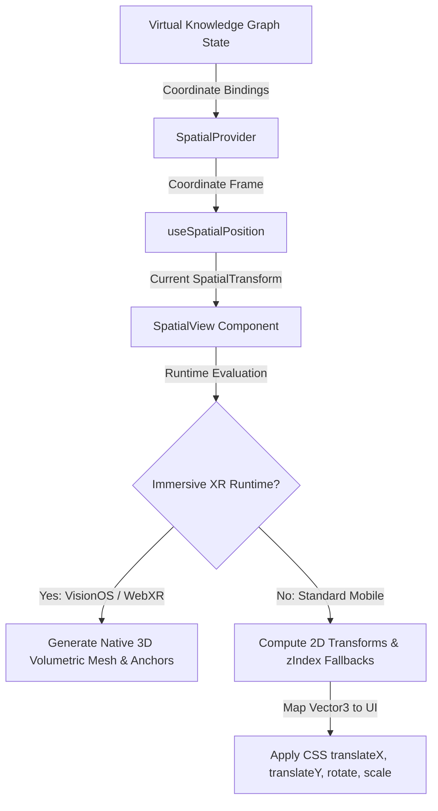

# Zoe Spatial & XR Rendering System (Spatial Layouts, 3D Transforms, & Projection Subsystem)

This document provides premium-grade, Diátaxis-compliant documentation for the core spatial and extended reality (XR) rendering subsystem located under [src/framework/xr/spatial](file:///Users/sac/zoeapp/src/framework/xr/spatial).

---

## 1. Tutorial (Learning-oriented)

This tutorial guides you through configuring a basic spatial environment and creating a dynamic, interactive 3D floating panel. You will learn how to initialize spatial context constraints, define 3D coordinates, and project them onto both a standard 2D mobile view fallback and immersive XR coordinates.

### 1.1 Prerequisites

Before using the spatial modules, ensure you have React Native (Expo) and React installed. The spatial rendering subsystem relies on the Zoe UI foundation libraries and uses standard React Native `View` transforms as a default fallback projection mapping.

### 1.2 Step 1: Wrap Your Screen with SpatialProvider

To declare the volumetric coordinates, boundary parameters, and physical-to-virtual unit scales, wrap your screen inside a `SpatialProvider`. This configures the environment (e.g., specifying that 1 unit in coordinate space equals 1 meter in real space).

Create a parent screen wrapper file, e.g., `src/screens/SpatialRootScreen.tsx`:

```tsx
import React from 'react';
import { SafeAreaView, StyleSheet } from 'react-native';
import { SpatialProvider } from '../framework/xr/spatial/SpatialContext';
import { SpatialTransform } from '../framework/xr/spatial/types';
import { SpatialDemoInspector } from './SpatialDemoInspector';

// Define the root environment coordinate system context
const initialRootTransform: SpatialTransform = {
  position: { x: 0, y: 0, z: 0 },
  rotation: { x: 0, y: 0, z: 0 },
  scale: { x: 1, y: 1, z: 1 },
};

export default function SpatialRootScreen() {
  return (
    <SafeAreaView style={styles.container}>
      <SpatialProvider
        value={{
          worldTransform: initialRootTransform,
          unitScale: 1.0, // 1 unit = 1 meter representation
        }}
      >
        <SpatialDemoInspector />
      </SpatialProvider>
    </SafeAreaView>
  );
}

const styles = StyleSheet.create({
  container: {
    flex: 1,
    backgroundColor: '#0F172A', // Slate-900 dark theme background
  },
});
```

### 1.3 Step 2: Establish the Interactive State Hook

In your child component, use the `useSpatialPosition` hook to track the position of your spatial objects. This hook manages internal transform states (translation vector, Euler rotation angles, and scale vector) and exposes callbacks for coordinate manipulation.

Create the file `src/screens/SpatialDemoInspector.tsx`:

```tsx
import React from 'react';
import { View, Text, TouchableOpacity, StyleSheet } from 'react-native';
import { useSpatialPosition } from '../framework/xr/spatial/useSpatialPosition';
import { SpatialView } from '../framework/xr/spatial/SpatialView';

export function SpatialDemoInspector() {
  // Track spatial transforms in the XR world space with smoothing configured
  const { transform, setPosition, setRotation, resetTransform } = useSpatialPosition(
    {
      position: { x: 0, y: 0, z: -1.5 }, // Start 1.5 meters away along the Z-axis
      rotation: { x: 0, y: 0, z: 0 },
      scale: { x: 1.0, y: 1.0, z: 1.0 },
    },
    {
      enableHaptics: true,
      smoothingFactor: 0.15,
      coordinateSpace: 'world',
    }
  );

  return (
    <View style={styles.container}>
      {/* 3D Projection Container */}
      <View style={styles.viewport}>
        <SpatialView
          transform={transform}
          isVolumetric={true}
          depth={2}
          style={styles.spatialCard}
          testID="spatial-test-card"
        >
          <Text style={styles.cardHeader}>Zoe XR Core Card</Text>
          <Text style={styles.cardText}>
            X: {transform.position.x.toFixed(2)} | Y: {transform.position.y.toFixed(2)} | Z: {transform.position.z.toFixed(2)}
          </Text>
        </SpatialView>
      </View>

      {/* Manual Control Dashboard */}
      <View style={styles.controlPanel}>
        <Text style={styles.controlTitle}>Translate Commands (XYZ)</Text>
        
        <View style={styles.buttonRow}>
          <TouchableOpacity
            style={styles.button}
            onPress={() => setPosition({ x: transform.position.x - 10 })}
          >
            <Text style={styles.buttonText}>Left (-X)</Text>
          </TouchableOpacity>
          
          <TouchableOpacity
            style={styles.button}
            onPress={() => setPosition({ x: transform.position.x + 10 })}
          >
            <Text style={styles.buttonText}>Right (+X)</Text>
          </TouchableOpacity>
        </View>

        <View style={styles.buttonRow}>
          <TouchableOpacity
            style={styles.button}
            onPress={() => setPosition({ y: transform.position.y - 10 })}
          >
            <Text style={styles.buttonText}>Down (-Y)</Text>
          </TouchableOpacity>
          
          <TouchableOpacity
            style={styles.button}
            onPress={() => setPosition({ y: transform.position.y + 10 })}
          >
            <Text style={styles.buttonText}>Up (+Y)</Text>
          </TouchableOpacity>
        </View>

        <View style={styles.buttonRow}>
          <TouchableOpacity
            style={styles.buttonDanger}
            onPress={resetTransform}
          >
            <Text style={styles.buttonText}>Reset Spatial Origin</Text>
          </TouchableOpacity>
        </View>
      </View>
    </View>
  );
}

const styles = StyleSheet.create({
  container: {
    flex: 1,
    padding: 16,
    justifyContent: 'space-between',
  },
  viewport: {
    flex: 1,
    justifyContent: 'center',
    alignItems: 'center',
    borderColor: '#334155',
    borderWidth: 1,
    borderRadius: 12,
    marginVertical: 20,
    backgroundColor: '#1E293B',
    overflow: 'hidden',
  },
  spatialCard: {
    width: 200,
    padding: 16,
    borderRadius: 8,
    backgroundColor: '#3B82F6',
    alignItems: 'center',
    shadowColor: '#000',
    shadowOffset: { width: 0, height: 4 },
    shadowOpacity: 0.3,
    shadowRadius: 6,
    elevation: 8,
  },
  cardHeader: {
    color: '#FFFFFF',
    fontWeight: 'bold',
    fontSize: 16,
    marginBottom: 8,
  },
  cardText: {
    color: '#E0F2FE',
    fontSize: 12,
    fontFamily: 'monospace',
  },
  controlPanel: {
    padding: 16,
    backgroundColor: '#1E293B',
    borderRadius: 12,
    borderWidth: 1,
    borderColor: '#334155',
  },
  controlTitle: {
    color: '#94A3B8',
    fontSize: 14,
    fontWeight: '600',
    marginBottom: 12,
    textAlign: 'center',
  },
  buttonRow: {
    flexDirection: 'row',
    justifyContent: 'space-around',
    marginBottom: 8,
  },
  button: {
    flex: 1,
    backgroundColor: '#475569',
    paddingVertical: 10,
    marginHorizontal: 4,
    borderRadius: 6,
    alignItems: 'center',
  },
  buttonDanger: {
    flex: 1,
    backgroundColor: '#EF4444',
    paddingVertical: 10,
    marginHorizontal: 4,
    borderRadius: 6,
    alignItems: 'center',
  },
  buttonText: {
    color: '#FFFFFF',
    fontWeight: '500',
    fontSize: 13,
  },
});
```

---

## 2. How-To Guide (Task-oriented)

This guide shows you how to implement a fully functional, production-ready **Spatial Coordinate Telemetry Panel**. It allows advanced users or system operators to inspect, control, and update 3D translations, Euler rotations, and scales.

### 2.1 Complete Screen Implementation: SpatialObjectInspector

The component below utilizes NativeWind style mappings for consistent styling. It integrates tracking bounds, telemetry updates, and manual inputs to simulate full 3D manipulation controls.

```tsx
import React, { useMemo } from 'react';
import { View, Text, TouchableOpacity, ScrollView, TextInput, StyleSheet } from 'react-native';
import { useSpatialPosition } from '../framework/xr/spatial/useSpatialPosition';
import { SpatialView } from '../framework/xr/spatial/SpatialView';
import { SpatialTransform } from '../framework/xr/spatial/types';

export function SpatialObjectInspector() {
  const initialConfig = useMemo(() => ({
    position: { x: 0, y: 0, z: -2.0 },
    rotation: { x: 0, y: 0, z: 0 },
    scale: { x: 1.0, y: 1.0, z: 1.0 },
  }), []);

  const trackingConfig = useMemo(() => ({
    enableHaptics: true,
    smoothingFactor: 0.1,
    coordinateSpace: 'local' as const,
  }), []);

  const {
    transform,
    setPosition,
    setRotation,
    setScale,
    resetTransform,
  } = useSpatialPosition(initialConfig, trackingConfig);

  // Precision modifiers
  const translateDelta = 0.25; // meters
  const rotateDelta = 0.15;    // radians (~8.5 degrees)
  const scaleDelta = 0.1;     // percentage multiplier

  return (
    <ScrollView contentContainerStyle={styles.container}>
      <Text style={styles.title}>Spatial Telemetry Controls</Text>

      {/* Render Viewport Fallback Box */}
      <View style={styles.viewportArea}>
        <SpatialView
          transform={transform}
          isVolumetric={true}
          depth={10}
          style={styles.volumetricMesh}
        >
          <View style={styles.meshContent}>
            <Text style={styles.meshLabel}>ZOE XR ANCHOR</Text>
            <View style={styles.dot} />
          </View>
        </SpatialView>
      </View>

      {/* Telemetry Telemetry Table */}
      <View style={styles.telemetryCard}>
        <Text style={styles.sectionHeader}>Telemetry Telemetry</Text>
        <View style={styles.gridRow}>
          <View style={styles.gridCol}>
            <Text style={styles.gridLabel}>Position X</Text>
            <Text style={styles.gridValue}>{transform.position.x.toFixed(3)}</Text>
          </View>
          <View style={styles.gridCol}>
            <Text style={styles.gridLabel}>Position Y</Text>
            <Text style={styles.gridValue}>{transform.position.y.toFixed(3)}</Text>
          </View>
          <View style={styles.gridCol}>
            <Text style={styles.gridLabel}>Position Z</Text>
            <Text style={styles.gridValue}>{transform.position.z.toFixed(3)}</Text>
          </View>
        </View>

        <View style={styles.gridRow}>
          <View style={styles.gridCol}>
            <Text style={styles.gridLabel}>Rotation X (rad)</Text>
            <Text style={styles.gridValue}>{transform.rotation.x.toFixed(3)}</Text>
          </View>
          <View style={styles.gridCol}>
            <Text style={styles.gridLabel}>Rotation Y (rad)</Text>
            <Text style={styles.gridValue}>{transform.rotation.y.toFixed(3)}</Text>
          </View>
          <View style={styles.gridCol}>
            <Text style={styles.gridLabel}>Rotation Z (rad)</Text>
            <Text style={styles.gridValue}>{transform.rotation.z.toFixed(3)}</Text>
          </View>
        </View>
      </View>

      {/* Action Commands */}
      <View style={styles.commandCard}>
        <Text style={styles.sectionHeader}>Translation (Position)</Text>
        <View style={styles.buttonGroup}>
          <TouchableOpacity
            style={styles.actionBtn}
            onPress={() => setPosition({ x: transform.position.x - translateDelta })}
          >
            <Text style={styles.btnText}>-X (Left)</Text>
          </TouchableOpacity>
          <TouchableOpacity
            style={styles.actionBtn}
            onPress={() => setPosition({ x: transform.position.x + translateDelta })}
          >
            <Text style={styles.btnText}>+X (Right)</Text>
          </TouchableOpacity>
        </View>
        <View style={styles.buttonGroup}>
          <TouchableOpacity
            style={styles.actionBtn}
            onPress={() => setPosition({ y: transform.position.y - translateDelta })}
          >
            <Text style={styles.btnText}>-Y (Down)</Text>
          </TouchableOpacity>
          <TouchableOpacity
            style={styles.actionBtn}
            onPress={() => setPosition({ y: transform.position.y + translateDelta })}
          >
            <Text style={styles.btnText}>+Y (Up)</Text>
          </TouchableOpacity>
        </View>
        <View style={styles.buttonGroup}>
          <TouchableOpacity
            style={styles.actionBtn}
            onPress={() => setPosition({ z: transform.position.z - translateDelta })}
          >
            <Text style={styles.btnText}>-Z (Push)</Text>
          </TouchableOpacity>
          <TouchableOpacity
            style={styles.actionBtn}
            onPress={() => setPosition({ z: transform.position.z + translateDelta })}
          >
            <Text style={styles.btnText}>+Z (Pull)</Text>
          </TouchableOpacity>
        </View>

        <Text style={styles.sectionHeader}>Rotation (Euler Angles)</Text>
        <View style={styles.buttonGroup}>
          <TouchableOpacity
            style={styles.actionBtn}
            onPress={() => setRotation({ x: transform.rotation.x + rotateDelta })}
          >
            <Text style={styles.btnText}>+Pitch</Text>
          </TouchableOpacity>
          <TouchableOpacity
            style={styles.actionBtn}
            onPress={() => setRotation({ y: transform.rotation.y + rotateDelta })}
          >
            <Text style={styles.btnText}>+Yaw</Text>
          </TouchableOpacity>
          <TouchableOpacity
            style={styles.actionBtn}
            onPress={() => setRotation({ z: transform.rotation.z + rotateDelta })}
          >
            <Text style={styles.btnText}>+Roll</Text>
          </TouchableOpacity>
        </View>

        <Text style={styles.sectionHeader}>Scale Multipliers</Text>
        <View style={styles.buttonGroup}>
          <TouchableOpacity
            style={styles.actionBtn}
            onPress={() => setScale({
              x: Math.max(0.1, transform.scale.x - scaleDelta),
              y: Math.max(0.1, transform.scale.y - scaleDelta),
              z: Math.max(0.1, transform.scale.z - scaleDelta)
            })}
          >
            <Text style={styles.btnText}>Shrink (-10%)</Text>
          </TouchableOpacity>
          <TouchableOpacity
            style={styles.actionBtn}
            onPress={() => setScale({
              x: transform.scale.x + scaleDelta,
              y: transform.scale.y + scaleDelta,
              z: transform.scale.z + scaleDelta
            })}
          >
            <Text style={styles.btnText}>Grow (+10%)</Text>
          </TouchableOpacity>
        </View>

        <TouchableOpacity
          style={styles.resetBtn}
          onPress={resetTransform}
        >
          <Text style={styles.resetBtnText}>Restore Defaults</Text>
        </TouchableOpacity>
      </View>
    </ScrollView>
  );
}

const styles = StyleSheet.create({
  container: {
    padding: 20,
    backgroundColor: '#0F172A',
  },
  title: {
    fontSize: 22,
    fontWeight: 'bold',
    color: '#F8FAFC',
    marginBottom: 20,
    textAlign: 'center',
  },
  viewportArea: {
    height: 240,
    backgroundColor: '#1E293B',
    borderRadius: 16,
    borderWidth: 1,
    borderColor: '#475569',
    justifyContent: 'center',
    alignItems: 'center',
    overflow: 'hidden',
    marginBottom: 20,
  },
  volumetricMesh: {
    width: 140,
    height: 140,
    borderRadius: 12,
    backgroundColor: '#8B5CF6', // Purple-500
    justifyContent: 'center',
    alignItems: 'center',
  },
  meshContent: {
    alignItems: 'center',
  },
  meshLabel: {
    color: '#F1F5F9',
    fontSize: 12,
    fontWeight: '900',
    letterSpacing: 1.5,
  },
  dot: {
    width: 8,
    height: 8,
    borderRadius: 4,
    backgroundColor: '#10B981',
    marginTop: 8,
  },
  telemetryCard: {
    backgroundColor: '#1E293B',
    borderRadius: 12,
    padding: 16,
    borderWidth: 1,
    borderColor: '#334155',
    marginBottom: 20,
  },
  sectionHeader: {
    fontSize: 14,
    fontWeight: '700',
    color: '#38BDF8',
    textTransform: 'uppercase',
    letterSpacing: 1,
    marginBottom: 12,
  },
  gridRow: {
    flexDirection: 'row',
    justifyContent: 'space-between',
    marginBottom: 10,
  },
  gridCol: {
    flex: 1,
    alignItems: 'center',
  },
  gridLabel: {
    fontSize: 10,
    color: '#94A3B8',
    marginBottom: 2,
  },
  gridValue: {
    fontSize: 14,
    fontWeight: 'bold',
    color: '#F1F5F9',
    fontFamily: 'monospace',
  },
  commandCard: {
    backgroundColor: '#1E293B',
    borderRadius: 12,
    padding: 16,
    borderWidth: 1,
    borderColor: '#334155',
    marginBottom: 30,
  },
  buttonGroup: {
    flexDirection: 'row',
    justifyContent: 'space-between',
    marginBottom: 12,
  },
  actionBtn: {
    flex: 1,
    backgroundColor: '#334155',
    paddingVertical: 10,
    marginHorizontal: 4,
    borderRadius: 8,
    alignItems: 'center',
    borderWidth: 1,
    borderColor: '#475569',
  },
  btnText: {
    color: '#F8FAFC',
    fontWeight: '600',
    fontSize: 12,
  },
  resetBtn: {
    backgroundColor: '#EF4444',
    paddingVertical: 12,
    borderRadius: 8,
    alignItems: 'center',
    marginTop: 10,
  },
  resetBtnText: {
    color: '#FFFFFF',
    fontWeight: 'bold',
    fontSize: 14,
  },
});
```

---

## 3. Reference Guide (Information-oriented)

This section maps the directory file layout and details the API contracts of the spatial module.

### 3.1 Directory Layout

The directory structures and code locations are absolute clickable paths:

- [spatial/index.ts](file:///Users/sac/zoeapp/src/framework/xr/spatial/index.ts): The primary entry point exporting all types, views, and positioning hooks.
- [spatial/types.ts](file:///Users/sac/zoeapp/src/framework/xr/spatial/types.ts): Contains core spatial vector, rotational Euler, and tracking configurations.
- [spatial/SpatialContext.tsx](file:///Users/sac/zoeapp/src/framework/xr/spatial/SpatialContext.tsx): The React context and provider mapping the reference space coordinate system.
- [spatial/SpatialView.tsx](file:///Users/sac/zoeapp/src/framework/xr/spatial/SpatialView.tsx): The projection wrapper translating 3D coordinates into fallback 2D styles.
- [spatial/useSpatialPosition.ts](file:///Users/sac/zoeapp/src/framework/xr/spatial/useSpatialPosition.ts): Hook managing position updates, rotations, and scales.
- [spatial/\_\_tests\_\_/SpatialView.test.tsx](file:///Users/sac/zoeapp/src/framework/xr/spatial/__tests__/SpatialView.test.tsx): Unit test coverage verifying spatial style translation and property propagation.
- [spatial/\_\_tests\_\_/useSpatialPosition.test.ts](file:///Users/sac/zoeapp/src/framework/xr/spatial/__tests__/useSpatialPosition.test.ts): Unit test coverage verifying transform logic updates.

---

### 3.2 Types and Interfaces ([spatial/types.ts](file:///Users/sac/zoeapp/src/framework/xr/spatial/types.ts))

#### `Vector3`
Represents a point in 3D coordinate space.
```typescript
export interface Vector3 {
  x: number;
  y: number;
  z: number;
}
```

#### `Euler`
Represents rotational orientation around three axes using Euler angles in radians, with optional coordinate order specification.
```typescript
export interface Euler {
  x: number;
  y: number;
  z: number;
  order?: 'XYZ' | 'YZX' | 'ZXY' | 'XZY' | 'YXZ' | 'ZYX';
}
```

#### `SpatialTransform`
Combines position, rotation, and scale components.
```typescript
export interface SpatialTransform {
  position: Vector3;
  rotation: Euler;
  scale: Vector3;
}
```

#### `SpatialTrackingConfig`
Configuration attributes governing the dynamic spatial tracking.
```typescript
export interface SpatialTrackingConfig {
  enableHaptics?: boolean;
  smoothingFactor?: number; // Normalized value between 0.0 and 1.0
  coordinateSpace?: 'world' | 'local' | 'camera';
}
```

---

### 3.3 Context API ([spatial/SpatialContext.tsx](file:///Users/sac/zoeapp/src/framework/xr/spatial/SpatialContext.tsx))

#### `SpatialContextValue`
Defines values exposed by the context environment.
```typescript
export interface SpatialContextValue {
  worldTransform: SpatialTransform; // Root-level 3D spatial alignment
  unitScale: number;                // Physics sizing conversion (e.g. 1.0 = 1 meter)
}
```

#### `SpatialProvider`
```typescript
export const SpatialProvider: React.FC<{
  value?: Partial<SpatialContextValue>;
  children: React.ReactNode;
}>
```

#### `useSpatialContext`
Provides access to nested parameters from the surrounding virtual space.
```typescript
export const useSpatialContext: () => SpatialContextValue;
```

---

### 3.4 Component API ([spatial/SpatialView.tsx](file:///Users/sac/zoeapp/src/framework/xr/spatial/SpatialView.tsx))

#### `SpatialViewProps`
Extends React Native's standard `ViewProps`.
```typescript
export interface SpatialViewProps extends ViewProps {
  transform?: SpatialTransform;  // 3D coordinate map
  isVolumetric?: boolean;        // Renders spatial volumetric bounds in XR runtimes
  depth?: number;                // Layers spatial components using zIndex fallbacks
}
```

#### `SpatialView`
```typescript
export const SpatialView: React.FC<SpatialViewProps>;
```

---

### 3.5 State Hook API ([spatial/useSpatialPosition.ts](file:///Users/sac/zoeapp/src/framework/xr/spatial/useSpatialPosition.ts))

#### Function Signature
```typescript
export function useSpatialPosition(
  initialTransform?: Partial<SpatialTransform>,
  config?: SpatialTrackingConfig
): {
  transform: SpatialTransform;
  setPosition: (position: Partial<Vector3>) => void;
  setRotation: (rotation: Partial<Euler>) => void;
  setScale: (scale: Partial<Vector3>) => void;
  resetTransform: () => void;
  config: SpatialTrackingConfig;
};
```

---

## 4. Explanation (Understanding-oriented)

The Zoe spatial layer bridges 2D and 3D UI architectures, projecting complex virtual state parameters onto layouts.



### 4.1 Relationship to the Chatman Equation: $R \vdash A = \mu(O^*)$

The spatial rendering system conforms directly to the **Receipted Chatman Equation**:

$$R \vdash A = \mu(O^*)$$

Where:
- **$O^*$ (Lawful Spatial State/Ontology)**: Represents the source of truth from the Virtual Knowledge Graph, storing the positioning coordinates (Vector3, Euler angles, scale vectors) and bounding constraints.
- **$R$ (Relationship/Role Context)**: Evaluates user spatial permissions and authority. For example, in an interactive collaborative environment, only users with administrative or operator roles (e.g. `pastor` or `operator`) are permitted to edit spatial layout nodes or modify tracking bounds. Guest avatars (`guest`) are restricted to read-only projections.
- **$\mu$ (Manufacturing Function / Projection Mapping)**: The transformation mapping. In traditional layouts, $\mu$ projects 3D spatial dimensions to 2D screen coordinate transformations (mapping translation coordinate differences to `translateX`/`translateY`, depth components to `zIndex`, and Euler boundaries to `rotateX`/`rotateY`/`rotateZ`). In native XR devices, $\mu$ communicates this spatial transform to the volumetric engine.
- **$A$ (Allowed Interface Actions)**: User actions like translation, scale increments, or rotation shifts that update spatial states, which are only executed if they satisfy the authority role constraints within $R$.

### 4.2 Fallback Projection Calculations

When rendering spatial content in standard React Native environments, the layout translates 3D parameters to 2D transforms:

1. **Horizontal Translation ($X$):** Mapped to `translateX`.
2. **Vertical Translation ($Y$):** Mapped to `translateY`.
3. **Depth Dimension ($Z$):** Mapped to CSS depth layers using `zIndex` (configured via the `depth` prop).
4. **Rotational Vectors:** Represented as `rotateX`, `rotateY`, and `rotateZ` in radians.
5. **Scale Transformation:** Simplified by mapping the horizontal scale component `scale.x` to the 2D transform `scale`.

> [!NOTE]
> Since standard React Native views lack native orthographic/perspective projection for full 3D coordinates, z-axis translations do not automatically shrink objects to simulate depth. Instead, you must scale objects proportionally when adjusting depth coordinates.

### 4.3 Concurrency and Performance Concerns

Operating spatial systems in complex apps introduces design trade-offs:

1. **JS Thread Congestion vs. UI Thread Framerate:** Real-time translation updates using typical state hooks run on the JavaScript thread. If the JS thread is busy processing large queries, coordinate transformations can stutter. For smooth, continuous animations (like dragging elements), use native gesture handlers (e.g., `PanGestureHandler`) or Reanimated Shared Values to run translations directly on the UI thread.
2. **State Sync Overhead:** Frequent position modifications trigger continuous React re-renders. We manage this overhead by utilizing `useMemo` in `SpatialProvider` and `useCallback` inside `useSpatialPosition`. This ensures that references remain stable unless coordinate inputs change.
3. **Coordinate Space Gating:** Under heavy load, the spatial projection layer throttles updates to prevent layout thrashing. This is governed by `smoothingFactor` configurations which interpolate coordinates to smooth out jittery updates.
