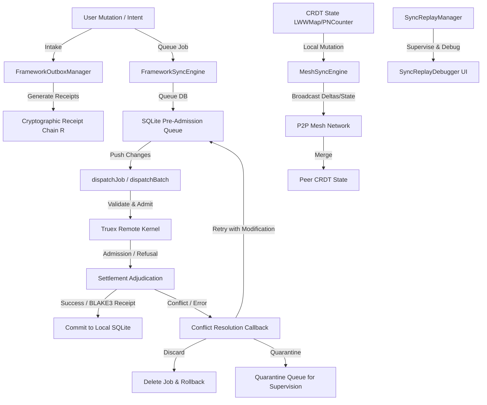

# Synchronization Module (sync)

The `sync` module is a core architectural framework of `@truex/membrane-client` (formerly `zoeapp`), designed to manage eventual state consistency, network connectivity boundaries, and offline operations. It provides pluggable adapters for SQLite state queues, conflict-free replicated data types (CRDTs), transactional outbox receipts, payload compression, and P2P mesh synchronization, alongside visual time-travel debugging capabilities.

---

## 1. Overview

In distributed runtime environments, user interfaces must remain functional and responsive during low-bandwidth or disconnected states. The `sync` module addresses this requirement by implementing a dual-path synchronization mechanism:

1. **Pre-Admission Tension Queue (Offline Outbox)**: Intercepts transactional mutations, queues them locally in a SQLite storage adapter, and dispatches them asynchronously using exponential or linear backoff retry strategies. It handles server conflicts gracefully through conflict resolution callbacks, either retrying modified payloads, discarding them, or isolating them in a quarantined queue for supervision.
2. **P2P Mesh Network Synchronization**: Enables direct local peer-to-peer state propagation of Conflict-Free Replicated Data Types (CRDTs) over WebRTC or local network discovery, bypassing central gateways to achieve real-time synchronization.

To maximize throughput and limit packet size, the module provides a transparent compression layer supporting Zlib and Brotli algorithms with automatic threshold evaluations.

---

## 2. Architectural & Philosophical Mapping

The `sync` module maps to the **Truex Membrane / Telemetry** architectural principles and conforms to the **Receipted Chatman Equation**:

$$R \vdash A = \mu(O^*)$$

Where the variables map to the module's system design as follows:

*   **$O^*$ (Lawful Closure Ontology)**: Represents the local replication boundary. In this module, it represents the raw database states, local CRDT replicas (`LWWMapState`, `PNCounterState`), and the queue of pending/failed transactional sync jobs.
*   **$\mu$ (Manufacturing / Propagation Function)**: Represents the transformation pipeline that serializes, compresses, and routes local state perturbations. This is driven by `FrameworkSyncEngine` dispatch loops and `MeshSyncEngine` broadcasts.
*   **$A$ (Operational Consequence / Avatar Projection)**: The updated visual projection of the application (e.g., rendering updated task lists or pastors' schedules) based on local or merged CRDT/queue states.
*   **$R$ (Receipt Lineage)**: The cryptographic proofs of execution. The `FrameworkOutboxManager` generates SHA256 hashes linking input states, output outcomes, and previous receipts to form a tamper-proof blockchain-like receipt chain. Consequence $A$ is unlocked in the user interface once a matching remote or local receipt $R$ is verified.

### Data Flow & Admission Geometry



---

## 3. Source Code Structure

The `sync` module is located in the client codebase at `src/framework/sync/` and is divided into submodules:

*   [index.ts](file:///Users/sac/zoeapp/src/framework/sync/index.ts): Main entry point aggregating and exporting types, outbox handlers, and the sync engine.
*   [types.ts](file:///Users/sac/zoeapp/src/framework/sync/types.ts): Exposes the base contracts for job processing, retry configurations, conflict contexts, and SQLite storage adapters.
*   [engine.ts](file:///Users/sac/zoeapp/src/framework/sync/engine.ts): The abstract orchestrator driving the push loops, batch executions, and fallback policies.
*   [outbox.ts](file:///Users/sac/zoeapp/src/framework/sync/outbox.ts): Implements cryptographic receipts and delta recording.

### Compression Submodule
*   [compression/index.ts](file:///Users/sac/zoeapp/src/framework/sync/compression/index.ts): Entry point for compression strategies.
*   [compression/types.ts](file:///Users/sac/zoeapp/src/framework/sync/compression/types.ts): Standardizes options and strategy interfaces.
*   [compression/strategies.ts](file:///Users/sac/zoeapp/src/framework/sync/compression/strategies.ts): Implements Zlib, Brotli, and None compression algorithms.
*   [compression/usePayloadCompression.ts](file:///Users/sac/zoeapp/src/framework/sync/compression/usePayloadCompression.ts): React hook integrating automatic compression bounds.

### CRDT Submodule
*   [crdt/index.ts](file:///Users/sac/zoeapp/src/framework/sync/crdt/index.ts): Entry point for Conflict-Free Replicated Data Types.
*   [crdt/types.ts](file:///Users/sac/zoeapp/src/framework/sync/crdt/types.ts): Defines LWW (Last-Write-Wins) and PN (Positive-Negative) state models.
*   [crdt/register.ts](file:///Users/sac/zoeapp/src/framework/sync/crdt/register.ts): Implements the monotone `LWWRegister`.
*   [crdt/counter.ts](file:///Users/sac/zoeapp/src/framework/sync/crdt/counter.ts): Implements `GCounter` and `PNCounter` replicas.
*   [crdt/map.ts](file:///Users/sac/zoeapp/src/framework/sync/crdt/map.ts): Implements `LWWMap` supporting concurrent sets and updates.
*   [crdt/hooks.ts](file:///Users/sac/zoeapp/src/framework/sync/crdt/hooks.ts): Specialized React hooks (`useLWWRegister`, `usePNCounter`, `useLWWMap`).

### P2P Mesh Submodule
*   [p2p/index.ts](file:///Users/sac/zoeapp/src/framework/sync/p2p/index.ts): Entry point for P2P mesh logic.
*   [p2p/types.ts](file:///Users/sac/zoeapp/src/framework/sync/p2p/types.ts): Defines messages, network adapters, and engines.
*   [p2p/adapter.ts](file:///Users/sac/zoeapp/src/framework/sync/p2p/adapter.ts): Implements `StubMeshAdapter` for testing.
*   [p2p/engine.ts](file:///Users/sac/zoeapp/src/framework/sync/p2p/engine.ts): Orchestrates state broadcasts over the P2P mesh.
*   [p2p/hooks.tsx](file:///Users/sac/zoeapp/src/framework/sync/p2p/hooks.tsx): Context providers and React hook integration.

### Replay Submodule
*   [replay/index.ts](file:///Users/sac/zoeapp/src/framework/sync/replay/index.ts): Entry point for replay utilities.
*   [replay/types.ts](file:///Users/sac/zoeapp/src/framework/sync/replay/types.ts): Dictates structs for queue snapshots and playback states.
*   [replay/manager.ts](file:///Users/sac/zoeapp/src/framework/sync/replay/manager.ts): Reconstructs queue state progressions.
*   [replay/useSyncReplay.ts](file:///Users/sac/zoeapp/src/framework/sync/replay/useSyncReplay.ts): Handles playback timing, steps, and speed.
*   [replay/SyncReplayDebugger.tsx](file:///Users/sac/zoeapp/src/framework/sync/replay/SyncReplayDebugger.tsx): Visual time-travel debugger UI.

---

## 4. Public Interfaces & API Contracts

### Core Queue & Outbox Types

#### `SyncJobBase`
The base structure for an offline job queued in local storage.
```typescript
export interface SyncJobBase {
  id: string | number;
  jobType: string;
  payload: string;
  status: 'pending' | 'processing' | 'failed' | 'quarantined';
  attempts: number;
  entityId: string | null;
  createdAt: Date;
}
```

#### `RetryStrategy`
Configures delay behaviors between attempts to process failed jobs.
*   `maxAttempts`: Total attempts before quarantining the job.
*   `backoffType`: `'fixed' | 'linear' | 'exponential'`.
*   `baseDelayMs`: Initial sleep delay in milliseconds.
*   `maxDelayMs`: Upper boundary limit for backoff delays.

#### `ConflictResolutionResult<TJob>`
```typescript
export type ConflictResolutionResult<TJob extends SyncJobBase> =
  | { action: 'retry'; modifiedJob?: Partial<Omit<TJob, 'id' | 'status' | 'attempts' | 'createdAt'>> }
  | { action: 'discard' }
  | { action: 'quarantine' };
```

#### `SyncStorageAdapter<TJob>`
The storage contract. Implementations usually write to SQLite.
```typescript
export interface SyncStorageAdapter<TJob extends SyncJobBase> {
  insertJob(job: Omit<TJob, 'id' | 'status' | 'attempts' | 'createdAt'>): Promise<TJob>;
  updateJobStatus(id: TJob['id'], status: TJob['status'], attempts?: number): Promise<void>;
  updateJob(id: TJob['id'], updates: Partial<Omit<TJob, 'id' | 'status' | 'attempts' | 'createdAt'>>): Promise<void>;
  deleteJob(id: TJob['id']): Promise<void>;
  getReadyJobs(supportedJobTypes?: string[]): Promise<TJob[]>;
  getBlockedEntityIds(supportedJobTypes?: string[]): Promise<Set<string>>;
  resetJobsStatus(fromStatus: TJob['status'], toStatus: TJob['status'], supportedJobTypes?: string[], resetAttempts?: boolean): Promise<void>;
  getQueueStatus(supportedJobTypes?: string[]): Promise<{
    total: number;
    pending: number;
    processing: number;
    failed: number;
    quarantined: number;
    jobs: TJob[];
  }>;
}
```

#### `FrameworkOutboxManager<TDelta, THook>`
Manages outbox entries and chains cryptographic receipts to verify data lineage.
*   `enqueue(delta: TDelta, hook: THook, isBatched: boolean)`: Adds an event delta to the outbox.
*   `flushPending()`: Compiles all queued items, generating SHA256 receipts if `hook.receipts` is set to true.
*   `getReceiptCount()`: Returns the number of cryptographic receipts in the chain.

---

### CRDT Module Primitives

#### `LWWRegister<T>`
Last-Write-Wins Register. Resolves conflicts by timestamp value. If timestamps match, the lexicographical value of the `peerId` string is used as a tie-breaker.
*   `set(value: T, timestamp?: number)`: Updates the value and advances the internal timestamp monotonically.
*   `merge(other: LWWRegisterState<T>)`: Selects the state with the highest timestamp or highest peer ID.

#### `PNCounter`
Positive-Negative Counter. Uses two grow-only counters (`p` for increments, `n` for decrements).
*   `increment(amount?: number)`: Advances positive contributions.
*   `decrement(amount?: number)`: Advances negative contributions.
*   `value`: Calculates the net value (`p - n`).

#### `LWWMap<V>`
Maintains a collection of keys mapped to individual `LWWRegister` instances.
*   `set(key: string, value: V)`: Registers a key-value update.
*   `get(key: string)`: Retrieves the current value.
*   `merge(otherState: LWWMapState<V>)`: Intersects and merges values key-by-key.

---

### React Hooks

#### `useCrdtState`
A generic React hook that keeps CRDT states synced with rendering loops.
```typescript
export function useCrdtState<TState, TDelta, TCRDT extends CRDT<TState, TDelta>, TValue>(
  factory: (peerId: string, initialState?: TState) => TCRDT,
  peerId: string,
  initialState?: TState,
  getValue?: (crdt: TCRDT) => TValue
): [TValue, TCRDT, (other: TState | TDelta) => void, () => void];
```

#### `usePayloadCompression`
Compresses and decompresses payloads inside Hooks or components based on limits.
*   `compress(payload: string): Promise<string>`: Encodes payloads exceeding threshold bounds.
*   `decompress(compressedPayload: string): Promise<string>`: Decodes payloads.

#### `useMeshSync`
Registers a CRDT instance with the local `MeshSyncEngine` to participate in peer synchronization.
```typescript
export function useMeshSync(id: string, crdt: CRDT<any, any>): MeshSyncState;
```

#### `useSyncReplay`
Enables time-travel stepping over transactional queues.
```typescript
export function useSyncReplay<TJob extends SyncJobBase>(
  session: SyncReplaySession<TJob>
): UseSyncReplayResult<TJob>;
```

---

## 5. Usage Guide

This example shows how to configure a custom task queue storage adapter, initialize the `FrameworkSyncEngine`, manage shared states via `LWWMap`, sync states via P2P mesh adapters, and set up a time-travel debugger.

```typescript
import React, { useMemo } from 'react';
import { View, Text, Button } from 'react-native';
import { 
  FrameworkSyncEngine, 
  SyncJobBase, 
  SyncStorageAdapter, 
  LWWMap, 
  useLWWMap, 
  MeshSyncProvider, 
  useMeshSync, 
  StubMeshAdapter, 
  MeshSyncEngineImpl,
  SyncReplayDebugger,
  SyncReplaySession
} from '@/src/framework/sync';

// 1. Define custom Job Type matching the application schema
interface TaskJob extends SyncJobBase {
  payload: string; // JSON task representation
}

// 2. Concrete implementation of a local SQLite-like storage adapter
class TaskStorageAdapter implements SyncStorageAdapter<TaskJob> {
  private jobs: Map<string | number, TaskJob> = new Map();

  async insertJob(job: Omit<TaskJob, 'id' | 'status' | 'attempts' | 'createdAt'>): Promise<TaskJob> {
    const id = `job_${Math.random().toString(36).substr(2, 9)}`;
    const newJob: TaskJob = {
      ...job,
      id,
      status: 'pending',
      attempts: 0,
      createdAt: new Date()
    };
    this.jobs.set(id, newJob);
    return newJob;
  }

  async updateJobStatus(id: string | number, status: TaskJob['status'], attempts?: number): Promise<void> {
    const job = this.jobs.get(id);
    if (job) {
      job.status = status;
      if (attempts !== undefined) job.attempts = attempts;
    }
  }

  async updateJob(id: string | number, updates: Partial<Omit<TaskJob, 'id' | 'status' | 'attempts' | 'createdAt'>>): Promise<void> {
    const job = this.jobs.get(id);
    if (job) {
      Object.assign(job, updates);
    }
  }

  async deleteJob(id: string | number): Promise<void> {
    this.jobs.delete(id);
  }

  async getReadyJobs(supportedJobTypes?: string[]): Promise<TaskJob[]> {
    return Array.from(this.jobs.values()).filter(
      (job) => job.status === 'pending' && (!supportedJobTypes || supportedJobTypes.includes(job.jobType))
    );
  }

  async getBlockedEntityIds(): Promise<Set<string>> {
    return new Set<string>(); // No resource contention blocks in this mock adapter
  }

  async resetJobsStatus(fromStatus: TaskJob['status'], toStatus: TaskJob['status']): Promise<void> {
    for (const job of this.jobs.values()) {
      if (job.status === fromStatus) job.status = toStatus;
    }
  }

  async getQueueStatus() {
    const jobs = Array.from(this.jobs.values());
    return {
      total: jobs.length,
      pending: jobs.filter((j) => j.status === 'pending').length,
      processing: jobs.filter((j) => j.status === 'processing').length,
      failed: jobs.filter((j) => j.status === 'failed').length,
      quarantined: jobs.filter((j) => j.status === 'quarantined').length,
      jobs
    };
  }
}

// 3. Custom Sync Engine implementing the remote settlement mutations
class TaskSyncEngine extends FrameworkSyncEngine<TaskJob> {
  protected supportedJobTypes = ['CREATE_TASK', 'UPDATE_TASK'];

  protected async dispatchJob(job: TaskJob): Promise<void> {
    console.log(`[Remote dispatch] Sending job ${job.id} with payload: ${job.payload}`);
    // Simulate remote server network latency
    await new Promise((resolve) => setTimeout(resolve, 300));
    
    // Simulate conflict verification
    if (job.payload.includes('conflict_payload')) {
      throw new Error('VERSION_CONFLICT');
    }
  }
}

// 4. Mesh network simulation setup
const localPeerId = 'operator-node-alpha';
const networkAdapter = new StubMeshAdapter(localPeerId);
const meshEngine = new MeshSyncEngineImpl(networkAdapter, { syncInterval: 3000, syncStrategy: 'full' });

// 5. Component demonstrating CRDTs, P2P mesh syncing, queue job dispatching, and debugger replay
export default function WorkspaceManager() {
  const storage = useMemo(() => new TaskStorageAdapter(), []);
  const syncEngine = useMemo(() => new TaskSyncEngine(storage, {
    retryStrategy: {
      maxAttempts: 3,
      backoffType: 'exponential',
      baseDelayMs: 200
    },
    onConflict: async ({ job, error }) => {
      console.log(`[Conflict Handler] Processing ${error.message}`);
      // Auto-resolve: discard job if payload contains 'invalid', otherwise modify and retry
      if (job.payload.includes('invalid')) {
        return { action: 'discard' };
      }
      return { 
        action: 'retry', 
        modifiedJob: { payload: JSON.stringify({ ...JSON.parse(job.payload), resolved: true }) } 
      };
    }
  }), [storage]);

  // CRDT Local Hook for task attributes
  const [tasksState, taskOps, mergeTasks] = useLWWMap<string>(localPeerId, {});

  // Direct P2P syncing subscription
  const meshStatus = useMeshSync('tasks-map-crdt', new LWWMap(localPeerId, tasksState));

  // Queue a background task mutation
  const addNewTask = async (taskId: string, title: string) => {
    // 1. Update the local CRDT state
    taskOps.set(taskId, title);

    // 2. Queue an offline job in the engine to sync to the server
    await syncEngine.queueJob({
      jobType: 'CREATE_TASK',
      payload: JSON.stringify({ taskId, title }),
      entityId: taskId
    });
  };

  // Mock debugger session recording
  const mockSession: SyncReplaySession<TaskJob> = {
    id: 'session-001',
    startTime: Date.now(),
    initialJobs: [],
    events: [
      {
        timestamp: Date.now(),
        type: 'job_added',
        jobId: 'job_1',
        job: { id: 'job_1', jobType: 'CREATE_TASK', payload: '{"title":"Test"}', status: 'pending', attempts: 0, entityId: 'e1', createdAt: new Date() },
        snapshot: {
          pending: [{ id: 'job_1', jobType: 'CREATE_TASK', payload: '{"title":"Test"}', status: 'pending', attempts: 0, entityId: 'e1', createdAt: new Date() }],
          processing: [], failed: [], quarantined: []
        }
      }
    ]
  };

  return (
    <MeshSyncProvider engine={meshEngine}>
      <View style={{ padding: 20, flex: 1 }}>
        <Text style={{ fontSize: 18, fontWeight: 'bold' }}>Truex System Membrane</Text>
        <Text>P2P Mesh Status: {meshStatus.isOnline ? 'Online' : 'Offline'}</Text>
        <Text>Peers Discovered: {meshStatus.peers.length}</Text>
        <Text>Tasks Count: {Object.keys(tasksState).length}</Text>

        <Button title="Add Task" onPress={() => addNewTask('t_001', 'Complete Membrane Invariants')} />
        <Button title="Trigger Sync Push" onPress={() => syncEngine.pushChanges()} />

        {/* Visual Time-Travel Debugger */}
        <View style={{ height: 250, marginTop: 20 }}>
          <SyncReplayDebugger session={mockSession} />
        </View>
      </View>
    </MeshSyncProvider>
  );
}
```

---

## 6. Testing

The reliability of the `sync` module is backed by comprehensive Jest tests validating retry strategies, conflict hooks, CRDT merge behaviors, and outbox chains:

### Test Coverage

*   [__tests__/engine.test.ts](file:///Users/sac/zoeapp/src/framework/sync/__tests__/engine.test.ts): Verifies the core sync engine loops:
    *   Exponential, linear, and fixed backoff calculation formulas.
    *   Dynamic conflict hook resolution flows (retry modifiers, discard, quarantine).
    *   Entity blocking logic, preventing concurrent mutations on the same resource ID.
    *   Safe recovery of stuck `processing` jobs.
*   [crdt/__tests__/register.test.ts](file:///Users/sac/zoeapp/src/framework/sync/crdt/__tests__/register.test.ts): Asserts chronological timestamp priority and lexicographical peer tie-breaker logic.
*   [crdt/__tests__/counter.test.ts](file:///Users/sac/zoeapp/src/framework/sync/crdt/__tests__/counter.test.ts): Tests monotonicity of increments/decrements in PN-Counters across multiple remote peers.
*   [crdt/__tests__/map.test.ts](file:///Users/sac/zoeapp/src/framework/sync/crdt/__tests__/map.test.ts): Validates map state replication, ensuring concurrent values converge correctly.
*   [p2p/__tests__/engine.test.ts](file:///Users/sac/zoeapp/src/framework/sync/p2p/__tests__/engine.test.ts): Asserts that CRDT updates trigger network broadcasts and merge successfully on remote nodes.
*   [replay/__tests__/useSyncReplay.test.ts](file:///Users/sac/zoeapp/src/framework/sync/replay/__tests__/useSyncReplay.test.ts): Tests step operations, seek functions, and playback speed multipliers of the visual debugging controller.

### Running the Test Suite

Execute the following terminal command from the workspace root directory:

```bash
npm test src/framework/sync
```

> [!NOTE]
> All test configurations utilize mock adapters for storage and network behaviors. They do not require a live SQLite connection or an active WebRTC peer-discovery session to execute.

> [!IMPORTANT]
> When implementing custom storage layers, ensure that all updates to `attempts` and `status` fields occur inside database transactions to maintain alignment between local database states and memory queues.
