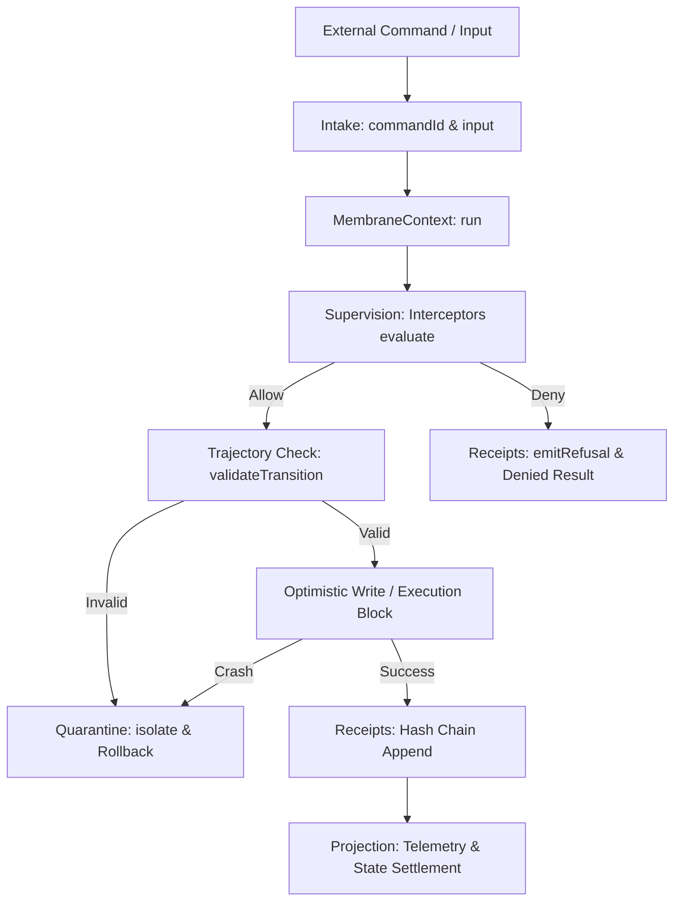

# Universal Operational Membrane

The `membrane` library located at [src/lib/membrane](file:///Users/sac/zoeapp/src/lib/membrane) is a low-level, high-assurance security and validation runtime. It acts as an execution envelope that intercepts operations, validates admissibility, enforces state transition trajectories, manages speculative projections, logs telemetry, and guarantees isolation boundaries with automatic rollback on violation or failure.

---

## 1. Title & Overview

The **Universal Operational Membrane** governs how states within the Truex platform are mutated, queried, and verified. 

In a distributed, high-reliability architecture, uncontrolled state updates are a primary source of data corruption, race conditions, and security breaches. The Membrane library solves this by enclosing critical state variables and operations in a JS Proxy-based protective boundary. Every read, write, property definition, and deletion is trapped, analyzed, and audited before it is permanently settled.

### Key Roles within the Truex Platform:
- **State Mutation Guarding**: Traps and intercepts deep nested object updates.
- **Speculative Dry-Runs**: Executes counterfactual "what-if" simulations on clones before commits.
- **Cryptographic Audit Ledger**: Chains state transition outcomes together with SHA-256 hashes to guarantee data lineage integrity.
- **Fail-Safe Rollback**: Reverts optimistic writes to their original state if interceptors deny the action or if state trajectory invariants are violated.
- **Quarantine Isolation**: Traps crashed operations and illegal transitions, archiving their payloads for supervision.

---

## 2. Architectural & Philosophical Mapping

The Membrane maps directly to the core Truex architecture (Membrane, Intake, Projection, Supervision) and is mathematically formalized through the Chatman Equation.



### The Core Truex Pillars
1. **Membrane**: The core container of state mutation. The `ProxyableBridge` wraps targets inside a JS Proxy, and the `MembraneContext` provides the execution envelope that controls boundaries.
2. **Intake**: Validates commands (`commandId`) and inputs (`input`) before they are admitted to the execution phase.
3. **Projection**: Tracks speculative states via `SimulationContext`, telemetry logging (such as `get`, `set`, `delete`, `rollback` events), and state replays via `ReplayEvaluator` to construct deterministic future states.
4. **Supervision**: Registers policy guards through `Interceptors` to evaluate capability admissibility, isolates faulty/illegal states in `Quarantine`, and writes cryptographic evidence logs via `Receipts`.

### The Chatman Equation Mapping
The Membrane implements the Chatman Equation:

$$R \vdash A = \mu(O^*)$$

Where:
* **$R$ (Rules/Regulations)**: The policy configuration, including `MembraneConfig` authority roles, `Interceptors` chains, `Trajectories` state machines, and `Ontology` vocabulary prefixes.
* **$A$ (Admissibility Verdict)**: Represented by the `AdmissibilityVerdict` enum: `'allow' | 'deny' | 'fork' | 'observe'`.
* **$O^*$ (Optimistic/Speculative Operations or State)**: The target state mutations trapped by the `ProxyableBridge`, speculative runs in `SimulationContext`, or incoming command inputs.
* **$\mu$ (Membrane Mapping)**: The evaluation pipeline implemented by `MembraneContext.run()` and `Interceptors.evaluate()` that maps $O^*$ under rules $R$ to produce verdict $A$.

---

## 3. Source Code Structure

The library is organized in a modular structure under [src/lib/membrane](file:///Users/sac/zoeapp/src/lib/membrane):

* [index.ts](file:///Users/sac/zoeapp/src/lib/membrane/index.ts)  
  *Exposes the public API of the membrane library.*
* [types.ts](file:///Users/sac/zoeapp/src/lib/membrane/types.ts)  
  *Contains type declarations, configurations, receipts, and context definitions.*
* [membrane.ts](file:///Users/sac/zoeapp/src/lib/membrane/membrane.ts)  
  *Implements the `ProxyableBridge` using JS Proxies to trap `get`, `set`, `deleteProperty`, and `defineProperty` traps.*
* [context.ts](file:///Users/sac/zoeapp/src/lib/membrane/context.ts)  
  *Provides the `MembraneContext` execution manager orchestrating interceptors, trajectories, blocks execution, and failures.*
* [interceptors.ts](file:///Users/sac/zoeapp/src/lib/membrane/interceptors.ts)  
  *Houses the admissibility evaluations chain, executing security policy guards.*
* [trajectories.ts](file:///Users/sac/zoeapp/src/lib/membrane/trajectories.ts)  
  *Defines state machines (SermonFlow, OrderFlow, VolunteerFlow) and validates state transition trajectories.*
* [receipts.ts](file:///Users/sac/zoeapp/src/lib/membrane/receipts.ts)  
  *Manages the cryptographic ledger chain, tracking lineage verification and refusals.*
* [quarantine.ts](file:///Users/sac/zoeapp/src/lib/membrane/quarantine.ts)  
  *Implements quarantine storage to isolate faulty commands, input payloads, and transition violations.*
* [simulation.ts](file:///Users/sac/zoeapp/src/lib/membrane/simulation.ts)  
  *Supports speculative counterfactual execution in dry-runs without mutating base states.*
* [replay.ts](file:///Users/sac/zoeapp/src/lib/membrane/replay.ts)  
  *Supports deterministic state replaying of historic inputs.*
* [ontology.ts](file:///Users/sac/zoeapp/src/lib/membrane/ontology.ts)  
  *Validates URIs and semantic drift mappings across schema migrations.*
* [proxyableBridge.ts](file:///Users/sac/zoeapp/src/lib/membrane/proxyableBridge.ts)  
  *Re-exports `ProxyableBridge` from `membrane.ts` to organize import paths.*
* [__tests__/membrane.test.ts](file:///Users/sac/zoeapp/src/lib/membrane/__tests__/membrane.test.ts)  
  *Contains 30 comprehensive Jest unit and integration tests verifying all traps, telemetry, rollback mechanisms, and ZK/ECDSA validation bindings.*

---

## 4. API Contracts

### Types & Interfaces

#### `AdmissibilityVerdict`
```typescript
type AdmissibilityVerdict = 'allow' | 'deny' | 'fork' | 'observe';
```

#### `MembraneConfig`
```typescript
interface MembraneConfig {
  mode: 'strict' | 'simulate' | 'audit';
  tenantId: string;
  authorityRole: 'admin' | 'pastor' | 'volunteer' | 'member' | 'guest' | 'anonymous';
}
```

#### `MembraneReceipt`
```typescript
interface MembraneReceipt {
  id: string;
  commandId: string;
  capabilityId: string;
  timestamp: string;
  verdict: AdmissibilityVerdict;
  success: boolean;
  deltaHash: string;
  previousHash: string;
  error?: string;
}
```

#### `InterceptorContext`
```typescript
interface InterceptorContext {
  commandId: string;
  capabilityId: string;
  input: any;
  config: MembraneConfig;
}
```

#### `InterceptorFunction`
```typescript
type InterceptorFunction = (ctx: InterceptorContext) => Promise<boolean | undefined>;
```

---

### Core Classes

#### `MembraneContext`
* **Constructor**: `constructor(config: MembraneConfig)`
* **Methods**:
  * `run<T>(capabilityId: string, commandId: string, input: any, executionBlock: () => Promise<T>): Promise<{ success: boolean; result: T | null; receipt: MembraneReceipt; error?: string }>`  
    *Runs a block of code under membrane protection, checks admissibility and trajectories, records receipts, and quarantines on failures.*
  * `getConfig(): MembraneConfig`  
    *Returns the current configuration.*

#### `ProxyableBridge`
* **Static Methods**:
  * `wrap<T extends object>(target: T, context: MembraneContext, options?: { onMutation?: (prop: string | symbol, value: any) => void; onTelemetry?: (event: MembraneTelemetryEvent) => void; flowName?: string }): T`  
    *Wraps a target object in a JS Proxy governed by the `MembraneContext`.*
  * `registerTelemetryListener(listener: TelemetryListener): void`
  * `unregisterTelemetryListener(listener: TelemetryListener): void`
  * `clearTelemetryListeners(): void`

#### `Interceptors`
* **Static Methods**:
  * `register(interceptor: InterceptorFunction): void`  
    *Appends a policy rule check to the interceptor chain.*
  * `clear(): void`  
    *Resets the chain.*
  * `evaluate(ctx: InterceptorContext): Promise<AdmissibilityVerdict>`  
    *Evaluates interceptor guards. Returns `'deny'` if any fails, `'fork'` if speculative simulation is flagged, or `'allow'` otherwise.*

#### `Receipts`
* **Static Methods**:
  * `clear(): void`
  * `append(receipt: MembraneReceipt): void`
  * `getLastHash(): string`
  * `getHistory(): MembraneReceipt[]`
  * `emitRefusal(commandId: string, capabilityId: string, prevHash: string, errorMsg: string): Promise<MembraneReceipt>`
  * `validateChain(c: MembraneReceipt[]): { valid: boolean; error?: string }`  
    *Verifies hash-chained integrity lineage.*

#### `Trajectories`
* **Static Methods**:
  * `validateTransition(flowName: string, fromState: string, toState: string): boolean`  
    *Asserts whether a state transition machine allows moving from `fromState` to `toState`.*

#### `Quarantine`
* **Static Methods**:
  * `clear(): void`
  * `getRecords(): QuarantineRecord[]`
  * `isolate(commandId: string, payload: any, errorMsg: string): Promise<QuarantineRecord>`  
    *Stores a quarantined action payload for inspection.*

#### `SimulationContext`
* **Constructor**: `constructor(initialState: any)`
* **Methods**:
  * `simulateRun<T>(commandId: string, input: any, mutateBlock: (state: any, inp: any) => Promise<T>): Promise<{ success: boolean; result: T; speculativeHash: string; drift: boolean }>`
  * `getSpeculativeState(): any`

#### `ReplayEvaluator`
* **Static Methods**:
  * `replay<S, I>(inputs: I[], initialState: S, dispatchBlock: (state: S, input: I) => Promise<S>): Promise<{ finalState: S; canonicalHash: string }>`

---

## 5. Usage Guide

Here is a complete, copy-pasteable TypeScript example of how to use the Membrane library.

```typescript
import { 
  MembraneContext, 
  ProxyableBridge, 
  Interceptors, 
  Receipts, 
  Quarantine 
} from './src/lib/membrane';

async function main() {
  // 1. Initialize Membrane Config and Context
  const config = {
    mode: 'strict' as const,
    tenantId: 'tenant-zoe-777',
    authorityRole: 'admin' as const // Admin has valid permissions
  };
  const context = new MembraneContext(config);

  // 2. Define target state and wrap inside ProxyableBridge
  const baseSermon = {
    title: 'Vision 2030 Launch',
    state: 'idle'
  };

  const proxySermon = ProxyableBridge.wrap(baseSermon, context, {
    flowName: 'SermonFlow',
    onMutation: (prop, value) => {
      console.log(`[Mutation Event] Property '${String(prop)}' updated to:`, value);
    }
  });

  // 3. Register custom interceptor guard
  Interceptors.register(async (ctx) => {
    if (ctx.input.title && ctx.input.title.includes('unauthorized')) {
      return false; // Deny titles with 'unauthorized'
    }
    return undefined; // Continue evaluation
  });

  console.log('--- Case 1: Execute Legal State Transition (idle -> drafted) ---');
  const transition1 = await context.run('sermon-updater', 'cmd_001', {
    flowName: 'SermonFlow',
    fromState: 'idle',
    toState: 'drafted'
  }, async () => {
    proxySermon.state = 'drafted';
    return { status: 'drafted_successfully' };
  });

  console.log('Success:', transition1.success);
  console.log('Receipt Hash:', transition1.receipt.deltaHash);

  console.log('\n--- Case 2: Reject Illegal State Transition (drafted -> published) ---');
  // SermonFlow machine: drafted -> reviewed -> published (skipping reviewed is illegal!)
  const transition2 = await context.run('sermon-updater', 'cmd_002', {
    flowName: 'SermonFlow',
    fromState: 'drafted',
    toState: 'published'
  }, async () => {
    proxySermon.state = 'published';
    return { status: 'published_successfully' };
  });

  console.log('Success:', transition2.success); // false
  console.log('Error:', transition2.error); // "Illegal trajectory transition"
  console.log('Sermon State after failure:', proxySermon.state); // "drafted" (Automatically rolled back!)

  console.log('\n--- Case 3: Check Quarantine Isolation Log ---');
  const quarantinedRecords = Quarantine.getRecords();
  console.log('Quarantined records count:', quarantinedRecords.length);
  console.log('Quarantined detail:', quarantinedRecords[0]);

  console.log('\n--- Case 4: Verify Receipt Cryptographic Hash Chain Lineage ---');
  const history = Receipts.getHistory();
  const validation = Receipts.validateChain(history);
  console.log('Is Hash Chain Validated & Unbroken:', validation.valid); // true
}

main().catch(console.error);
```

---

## 6. Testing

The `membrane` library contains a comprehensive unit and integration suite. The tests verify all proxy traps, telemetry events, nested proxies, delete/define rollbacks, simulation drift, and receipts hash chaining.

### How to Run Tests
Execute the Jest tests from the workspace root:

```bash
npx jest src/lib/membrane/__tests__/membrane.test.ts
```

Output details include confirmation of 30 tests checking:
- Custom interceptors (`allow`, `deny`, `fork` verdicts)
- Trajectory flow boundaries (`SermonFlow`, `OrderFlow`, `VolunteerFlow`)
- Speculative dry-runs in `SimulationContext` without mutating base state
- Automatic rollback of mutations, definitions, and property deletions on failure
- Receipt chain lineages and broken hash validation checks
- Global and option-scoped telemetry listeners, ignoring symbols
- Nested object deep-proxying behavior
