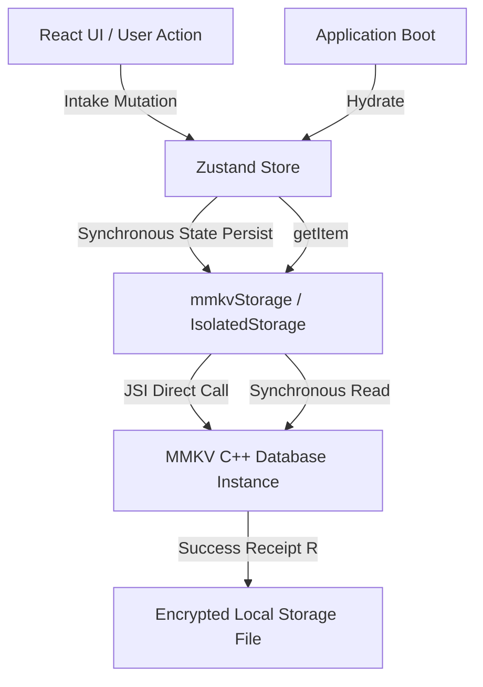

# Storage Module (store)

The `store` module is a high-performance persistence adapter for the **Truex Collaborative Substrate** (under `@truex/membrane-client`), designed to manage synchronous local-first storage. It acts as the bridge between React Native's runtime memory state and persistent disk storage.

---

## 1. Overview

In mobile and local-first environments, asynchronous storage operations introduce race conditions, slow startup sequences, and bridge latency. The `store` module solves this by using `react-native-mmkv`—a fast, synchronous key-value storage framework written in C++ that uses JSI (JavaScript Interface) directly, completely bypassing the asynchronous React Native bridge.

The module's primary purposes are:
1. **Zustand Middleware Integration**: Adapts MMKV to Zustand's synchronous `StateStorage` interface for rapid state hydration.
2. **Modular Data Isolation**: Provides mechanisms to partition local databases to ensure distinct system capabilities (e.g., auth tokens vs. UI preferences) cannot poll or pollute each other's storage boundaries.
3. **Synchronous Direct Access**: Exposes direct low-level MMKV API access for immediate writes and reads of system configuration flags.

---

## 2. Architectural & Philosophical Mapping

The `store` module maps directly to the core pillars of the **Truex Architecture** and aligns with the formal specifications of the **Receipted Chatman Equation**:

$$R \vdash A = \mu(O^*)$$

Where the variables map to the module's system design as follows:

*   **$O^*$ (Lawful Closure Ontology / State)**: Represents the persistent local key-value store. This is the local offline state representing the ground truth. Every piece of stored data—whether user settings, offline transaction queues, or session tokens—is serialized and structured under this ontology.
*   **$\mu$ (Manufacturing / Propagation Function)**: The Zustand state storage middleware adapter (`setItem`, `getItem`, `removeItem`). These actions translate runtime in-memory changes into persistent storage mutations and vice versa, executing state manufacturing.
*   **$A$ (Operational Consequence / Avatar Projection)**: The React components and custom hooks that consume the Zustand state. As state transitions are loaded from/saved to MMKV, the user interface receives the updated state and projects it visually to the user.
*   **$R$ (Receipt Lineage / Verification)**: The MMKV engine's synchronous write confirmation guarantees transactional integrity. An update is admitted and receipted locally once the underlying C++ layer returns a successful write confirmation, preventing race conditions and incomplete state changes.

### Data Flow & Admission Geometry



### Truex Pillars Mapping

*   **Membrane**: The store establishes state boundaries. Through `createIsolatedMMKVStorage`, it acts as a local membrane wrapping distinct capabilities, ensuring that one module's state (e.g., auth tokens) cannot corrupt or leak into another module's state.
*   **Intake**: State modifications are synchronously ingested through `setItem` after passing higher-level validation checks.
*   **Projection**: Synchronously retrieves state (`getItem`) during app boot to project the initial memory layout.
*   **Supervision**: Provides management mechanisms such as database resetting (`clearAll()`) or monitoring via `getAllKeys()` to inspect state integrity under supervised debugging sessions.

---

## 3. Source Code Structure

The `store` module is located in the client codebase at `src/lib/store/` and consists of the following files:

*   [mmkvStorage.ts](file:///Users/sac/zoeapp/src/lib/store/mmkvStorage.ts): Exports the default MMKV instance, the Zustand adapter, and the factory function for isolated databases.
*   [mmkvStorage.test.ts](file:///Users/sac/zoeapp/src/lib/store/mmkvStorage.test.ts): Unit tests verifying adapter contracts, CRUD operations, instance isolation, error conditions, and data preservation.

---

## 4. Public Interfaces & API Contracts

### 4.1 Core Constants and Adapters

#### `mmkvInstance`
The default, shared MMKV database instance used for general application state.
- **Type**: `MMKV` (from `react-native-mmkv`)
- **Configuration ID**: `membrane-client-zustand-storage`

#### `mmkvStorage`
The Zustand `StateStorage` adapter mapping Zustand's middleware interface to the shared `mmkvInstance`.
- **Type**: `StateStorage` (from `zustand/middleware`)
- **Properties**:
  - `setItem(name: string, value: string): void` - Synchronously writes a key-value pair to the default store.
  - `getItem(name: string): string | null` - Synchronously retrieves a key's value. Returns `null` if the key does not exist.
  - `removeItem(name: string): void` - Synchronously deletes a key and its value from the default store.

---

### 4.2 Isolated Storage Builder

#### `createIsolatedMMKVStorage(storeId: string)`
Creates a separate MMKV database instance and returning both the adapter and its underlying MMKV instance. This ensures strict isolation between different state modules.
- **Parameters**:
  - `storeId` (`string`): The unique identifier for the isolated database. Must be a non-empty, non-whitespace string.
- **Returns**: An object containing:
  - `storage` (`StateStorage`): An isolated Zustand adapter.
  - `instance` (`MMKV`): The underlying raw MMKV database instance with ID `membrane-client-zustand-storage-${storeId}`.
- **Throws**: `Error` if `storeId` is empty or only contains whitespace.

---

## 5. Usage Guide

This guide demonstrates how to configure a shared Zustand store, set up an isolated store for sensitive data, and write standalone flags using the raw MMKV instance.

```typescript
import { create } from 'zustand';
import { persist, createJSONStorage } from 'zustand/middleware';
import { mmkvStorage, createIsolatedMMKVStorage, mmkvInstance } from '@/src/lib/store/mmkvStorage';

// ============================================================================
// 1. Shared Store Configuration (using default mmkvStorage)
// ============================================================================

interface PreferencesState {
  theme: 'light' | 'dark';
  toggleTheme: () => void;
}

export const usePreferencesStore = create<PreferencesState>()(
  persist(
    (set) => ({
      theme: 'light',
      toggleTheme: () => set((state) => ({ theme: state.theme === 'light' ? 'dark' : 'light' })),
    }),
    {
      name: 'user-preferences',
      storage: createJSONStorage(() => mmkvStorage),
    }
  )
);

// ============================================================================
// 2. Isolated Store Configuration (using createIsolatedMMKVStorage)
// ============================================================================

interface AuthState {
  token: string | null;
  userId: string | null;
  setAuth: (token: string, userId: string) => void;
  clearAuth: () => void;
}

// Instantiate an isolated MMKV storage dedicated to authentication
const authStorage = createIsolatedMMKVStorage('auth-keys');

export const useAuthStore = create<AuthState>()(
  persist(
    (set) => ({
      token: null,
      userId: null,
      setAuth: (token, userId) => set({ token, userId }),
      clearAuth: () => set({ token: null, userId: null }),
    }),
    {
      name: 'auth-session',
      storage: createJSONStorage(() => authStorage.storage),
    }
  )
);

// ============================================================================
// 3. Direct MMKV Access (using raw mmkvInstance)
// ============================================================================

export class DeveloperDiagnostics {
  /**
   * Reads a raw boolean flag directly and synchronously.
   */
  public static isMockModeEnabled(): boolean {
    return mmkvInstance.getBoolean('dev_mock_mode_enabled') ?? false;
  }

  /**
   * Writes a raw boolean flag directly and synchronously.
   */
  public static setMockMode(enabled: boolean): void {
    mmkvInstance.set('dev_mock_mode_enabled', enabled);
  }

  /**
   * Synchronously wipes all keys in the default store.
   */
  public static resetDefaultCache(): void {
    mmkvInstance.clearAll();
  }
}
```

---

## 6. Testing

The reliability of the `store` library is backed by a unit test suite verifying storage operations, strict store-to-store boundary isolation, and error conditions.

### Test Coverage

*   [mmkvStorage.test.ts](file:///Users/sac/zoeapp/src/lib/store/mmkvStorage.test.ts):
    *   **Default mmkvStorage Adapter**: Verifies core Zustand adapter functions (`setItem`, `getItem`, `removeItem`). Asserts that retrieving missing keys returns `null`.
    *   **Instance Isolation**: Validates that keys modified in one isolated store (`store-a`) do not affect keys in another isolated store (`store-b`), even if they share the same key name (e.g. `user-profile`).
    *   **Data Preservation**: Asserts that re-instantiating an isolated store with the same `storeId` retrieves existing keys properly.
    *   **Input Validation**: Verifies that empty strings or whitespace-only inputs for `storeId` throw appropriate errors.

### Running the Test Suite

Execute the following terminal command from the workspace root directory:

```bash
npm test src/lib/store/mmkvStorage.test.ts
```

> [!NOTE]
> The test suite uses a dynamic mock implementation of `react-native-mmkv` to mock out underlying binary bindings in native environments. It maintains an in-memory dictionary keyed by `id` to mock multiple isolated database instances accurately.
