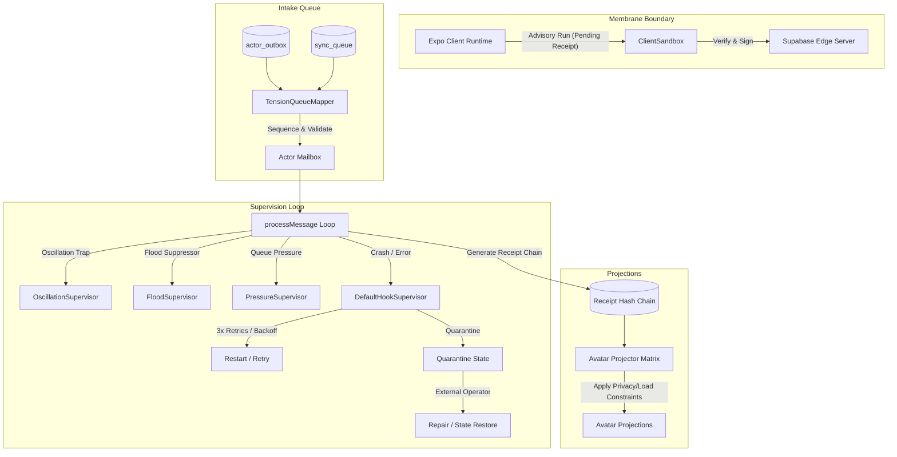

# Truex OTP Actor Runtime & Conformance Engine

The `truex` library is the core behavioral runtime of the Truex platform. It implements an asynchronous, message-driven, environment-agnostic **Actor Model** (inspired by Erlang/OTP principles) built on top of a transactional database outbox and synchronization queue. It features robust supervision, self-healing state quarantine/recovery, role-based **Avatar Projections**, and formal **Process Conformance Evaluation** using process mining trace alignment.

---

## 1. Architectural & Philosophical Mapping

The design of the `truex` library aligns directly with the core pillars of the Truex architectural blueprint and the **Chatman Equation** ($R \vdash A = \mu(O^*)$).



### Architectural Pillars
1. **Membrane (Sandboxed Boundary & Authority Limits)**:
   The Membrane separates client-side React Native (Expo) execution from backend (Supabase) authority.
   * **Local Advisory Runs**: Clients execute hook behaviors locally to produce immediate, low-latency UI updates. These generate `Pending` receipts.
   * **Hard Security Invariant**: Expo files are strictly prohibited from importing direct WASM modules or service-level credentials (e.g., `SERVICE_ROLE_KEY`). The function `clientCanConfirm` always returns `false`.
   * **Server Authorization**: Only the server (via `supabase_edge_service_role_key` or `server_secret_authority_key`) can sign and elevate a receipt to `Confirmed` or `Quarantined`.
2. **Intake (Pre-Admission Tension Queuing)**:
   Before events hit the execution runtime, the `TensionQueueMapper` audits and transforms pending messages from the `actor_outbox` and `sync_queue` database tables. It performs ontological updates (mapping old payload keys/delta predicates to updated ones) and checks hook validation boundaries to ensure queue consistency.
3. **Projection (Avatar-Relative Visibility Mapping)**:
   The state of the system is mapped to user role capabilities through the `PROJECTION_MATRIX`. The projection engine:
   * Maps outputs of hooks (e.g., `volunteer_shortage`, `sermon_publish_failed`, `concept_drift_detected`) to role-specific projections containing distinct UI surfaces, visibility filters, and allowed actions for roles: `guest`, `member`, `volunteer`, `teamLead`, `pastor`, `admin`, and `operator`.
   * Adapts dynamically to load factors (load factor > 0.85 suppresses all but the primary action and flags the payload as `loadMuted`).
   * Suppresses private fields and enforces strict escalation validation boundaries.
4. **Supervision (Self-Healing Conformance)**:
   The system employs autonomic supervisors to isolate failures and maintain trace integrity:
   * **Oscillation Supervisor**: Intercepts circular messaging cascades. If a message trace passes through the same hook more than a specified depth, the actor is quarantined.
   * **Flood Supervisor**: Limits notification storms within defined sliding time windows.
   * **Pressure Supervisor**: Measures mailbox queue length and recommends batching under heavy intake load.
   * **Process Conformance Evaluator**: Performs real-time token/trace alignment between declared workflows and actual event logs. It computes Wil van der Aalst metrics for **Fitness**, **Precision**, and **Simplicity**, yielding conformance verdicts of `TRUTHFUL` (fitness $\ge$ 0.9), `VARIANCE` (fitness $\ge$ 0.6), or `DECEPTIVE` (fitness < 0.6).

---

### The Chatman Equation
$$R \vdash A = \mu(O^*)$$

* **$R$ (Rules/Runtime)**: Represents the environment rules and security boundaries (e.g., Supabase RLS policies, authority validation parameters).
* **$O^*$ (Ontological State / Receipt Chain)**: Represents the verified history, state, and cryptographic receipts produced sequentially by the runtime mailboxes.
* **$\mu$ (Projection Matrix)**: The mapping functions (`projectHookOutput`, `projectAll`) which apply role privileges, privacy suppressions, and load factor adjustments.
* **$A$ (Avatar UI Surface & Allowed Actions)**: The resulting projected object visible to the end-user (e.g., `AvatarProjection`).

The equation asserts that under runtime rules $R$, the avatar capability $A$ is derived by applying the projection function $\mu$ over the ontological state $O^*$.

---

## 2. Source Code Structure

The library is organized in a modular structure under `src/lib/truex/`. Below are the files in the directory with absolute links detailing their roles:

### Core & Root Tests
* [reconciliation.test.ts](file:///Users/sac/zoeapp/src/lib/truex/__tests__/reconciliation.test.ts): Verifies the client/server receipt reconciliation engine and local-to-remote audit lineage preservation.
* [runtime-boundary.test.ts](file:///Users/sac/zoeapp/src/lib/truex/__tests__/runtime-boundary.test.ts): Enforces runtime boundary constraints by scanning Expo client directories for forbidden server/WASM tokens.

### `avatar/` (Projections Membrane)
* [avatar-projection.ts](file:///Users/sac/zoeapp/src/lib/truex/avatar/avatar-projection.ts): Core projection engine implementing role projections, load adjustments, field suppression, and role escalation rules.
* [escalation.ts](file:///Users/sac/zoeapp/src/lib/truex/avatar/escalation.ts): Re-exports escalation helpers.
* [index.ts](file:///Users/sac/zoeapp/src/lib/truex/avatar/index.ts): Main exports of the avatar projection module.
* [load.ts](file:///Users/sac/zoeapp/src/lib/truex/avatar/load.ts): Re-exports load-based adjustment functions.
* [matrix.ts](file:///Users/sac/zoeapp/src/lib/truex/avatar/matrix.ts): Re-exports the projection matrix mapping.
* [projector.ts](file:///Users/sac/zoeapp/src/lib/truex/avatar/projector.ts): Re-exports projecting functions.
* [suppression.ts](file:///Users/sac/zoeapp/src/lib/truex/avatar/suppression.ts): Re-exports field suppression helpers.
* [types.ts](file:///Users/sac/zoeapp/src/lib/truex/avatar/types.ts): Re-exports core projection interfaces.
* [avatar-projection.test.ts](file:///Users/sac/zoeapp/src/lib/truex/avatar/__tests__/avatar-projection.test.ts): Unit tests verifying the projection matrix mappings across all roles, load adjustments, and field suppressions.

### `contracts/` (Authority & Serialization Contracts)
* [authority.ts](file:///Users/sac/zoeapp/src/lib/truex/contracts/authority.ts): Defines rules for client-side advisory confirmation vs. server-side authoritative receipt validation.
* [graphDelta.ts](file:///Users/sac/zoeapp/src/lib/truex/contracts/graphDelta.ts): Data interface representing ontological graph deltas.
* [hookPacket.ts](file:///Users/sac/zoeapp/src/lib/truex/contracts/hookPacket.ts): Interfaces and helper factories for hook network packets.
* [hookReceipt.ts](file:///Users/sac/zoeapp/src/lib/truex/contracts/hookReceipt.ts): Interfaces and factories representing the receipt audit structure.
* [contracts.test.ts](file:///Users/sac/zoeapp/src/lib/truex/contracts/__tests__/contracts.test.ts): Tests authority boundary checks.
* [packets.test.ts](file:///Users/sac/zoeapp/src/lib/truex/contracts/__tests__/packets.test.ts): Tests hook packet construction.

### `evidence/` (Audit Logs & Process Mining Format)
* [compression.ts](file:///Users/sac/zoeapp/src/lib/truex/evidence/compression.ts): Deduplication utility for event/message logs.
* [diff.ts](file:///Users/sac/zoeapp/src/lib/truex/evidence/diff.ts): Generates deep state diff reports mapping diverged attributes.
* [index.ts](file:///Users/sac/zoeapp/src/lib/truex/evidence/index.ts): Re-exports evidence processing utilities.
* [ocel.ts](file:///Users/sac/zoeapp/src/lib/truex/evidence/ocel.ts): Converts receipt histories to and from the Object-Centric Event Log (OCEL) standard.
* [receipts.ts](file:///Users/sac/zoeapp/src/lib/truex/evidence/receipts.ts): Re-exports receipt generation and integrity/chain validation.
* [replay.ts](file:///Users/sac/zoeapp/src/lib/truex/evidence/replay.ts): Re-exports replay proof generators.
* [evidence.test.ts](file:///Users/sac/zoeapp/src/lib/truex/evidence/__tests__/evidence.test.ts): Tests OCEL exports, diffing reports, and log compression.

### `hook-otp/` (Core Actor Model & Mailbox Runtime)
* [actorRef.ts](file:///Users/sac/zoeapp/src/lib/truex/hook-otp/actorRef.ts): Core functions to parse, stringify, hash, and compare actor references. Includes an environment-agnostic pure JS SHA-256 implementation.
* [behavior.ts](file:///Users/sac/zoeapp/src/lib/truex/hook-otp/behavior.ts): Evaluates hook behaviors (`init`, `delta`, `receipt`, `replay`, `terminate`).
* [index.ts](file:///Users/sac/zoeapp/src/lib/truex/hook-otp/index.ts): Main exports of the OTP module.
* [mailbox.ts](file:///Users/sac/zoeapp/src/lib/truex/hook-otp/mailbox.ts): Message mailbox that sequentially processes queued events.
* [receipts.ts](file:///Users/sac/zoeapp/src/lib/truex/hook-otp/receipts.ts): Produces, verifies, and validates chains of receipt hashes.
* [registry.ts](file:///Users/sac/zoeapp/src/lib/truex/hook-otp/registry.ts): In-memory catalog of active hook actor instances.
* [replay.ts](file:///Users/sac/zoeapp/src/lib/truex/hook-otp/replay.ts): Generates replay proofs to verify local execution matches expected outputs.
* [runtime.ts](file:///Users/sac/zoeapp/src/lib/truex/hook-otp/runtime.ts): Main execution supervisor that routes messages, handles retries/quarantine, emits telemetry, and executes side effects.
* [supervisor.ts](file:///Users/sac/zoeapp/src/lib/truex/hook-otp/supervisor.ts): Default actor supervisor mapping exceptions to restart or quarantine actions.
* [telemetry.ts](file:///Users/sac/zoeapp/src/lib/truex/hook-otp/telemetry.ts): Logging system for actor lifetime events.
* [types.ts](file:///Users/sac/zoeapp/src/lib/truex/hook-otp/types.ts): Data contracts for actors, messages, execution context, effects, and supervisor decisions.
* [behavior.test.ts](file:///Users/sac/zoeapp/src/lib/truex/hook-otp/__tests__/behavior.test.ts): Tests behavior invocation.
* [client-runtime.test.ts](file:///Users/sac/zoeapp/src/lib/truex/hook-otp/__tests__/client-runtime.test.ts): Verifies local-only client-side behavior and advisory receipt generation.
* [hook-otp.test.ts](file:///Users/sac/zoeapp/src/lib/truex/hook-otp/__tests__/hook-otp.test.ts): Tests mailbox sequence ordering, isolation, and message routing.
* [runtime.test.ts](file:///Users/sac/zoeapp/src/lib/truex/hook-otp/__tests__/runtime.test.ts): Validates runtime instantiation, error state transition, and messaging.

### `packs/` (Modular Extensions / Hook Packs)
* [index.ts](file:///Users/sac/zoeapp/src/lib/truex/packs/index.ts): Exports packing tools.
* [loader.ts](file:///Users/sac/zoeapp/src/lib/truex/packs/loader.ts): Manifest loader.
* [manifest.ts](file:///Users/sac/zoeapp/src/lib/truex/packs/manifest.ts): Core interface defining pack manifests.
* [migration.ts](file:///Users/sac/zoeapp/src/lib/truex/packs/migration.ts): Migration executer stub wrapper.
* [packs.ts](file:///Users/sac/zoeapp/src/lib/truex/packs/packs.ts): Database queue auditor, ontological mapper, and consistency validator.
* [registry.ts](file:///Users/sac/zoeapp/src/lib/truex/packs/registry.ts): Manifest storage registry.
* [rollback.ts](file:///Users/sac/zoeapp/src/lib/truex/packs/rollback.ts): Rollback processor restoring a pack to a target version.
* [upgrade.ts](file:///Users/sac/zoeapp/src/lib/truex/packs/upgrade.ts): Upgrade engine managing pack version bumps.
* [volunteer/fixtures.ts](file:///Users/sac/zoeapp/src/lib/truex/packs/volunteer/fixtures.ts): Sample fixture files for volunteer shortages.
* [volunteer/hooks.ts](file:///Users/sac/zoeapp/src/lib/truex/packs/volunteer/hooks.ts): Behavior hooks resolving volunteer shortages.
* [volunteer/manifest.ts](file:///Users/sac/zoeapp/src/lib/truex/packs/volunteer/manifest.ts): Volunteer manifest definition.
* [volunteer/projections.ts](file:///Users/sac/zoeapp/src/lib/truex/packs/volunteer/projections.ts): Re-exports projection matrix mappings.
* [volunteer/supervisors.ts](file:///Users/sac/zoeapp/src/lib/truex/packs/volunteer/supervisors.ts): Volunteer supervisor instances.
* [packs.test.ts](file:///Users/sac/zoeapp/src/lib/truex/packs/__tests__/packs.test.ts): Tests upgrade, rollback, loader operations, and state mapper with mocked DB.

### `server/` (Backend constraints)
* [authority.test.ts](file:///Users/sac/zoeapp/src/lib/truex/server/__tests__/authority.test.ts): Verifies Supabase RLS write policy constraints for receipts and messages.

### `supervision/` (Autonomic Supervision)
* [avatarLoad.ts](file:///Users/sac/zoeapp/src/lib/truex/supervision/avatarLoad.ts): Monitors system load factors.
* [floodSupervisor.ts](file:///Users/sac/zoeapp/src/lib/truex/supervision/floodSupervisor.ts): Tracks and checks high-frequency event spikes.
* [index.ts](file:///Users/sac/zoeapp/src/lib/truex/supervision/index.ts): Exports all supervisors.
* [oscillation.ts](file:///Users/sac/zoeapp/src/lib/truex/supervision/oscillation.ts): Traps looping/circular messages.
* [pressure.ts](file:///Users/sac/zoeapp/src/lib/truex/supervision/pressure.ts): Monitors queue sizes.
* [quarantine.ts](file:///Users/sac/zoeapp/src/lib/truex/supervision/quarantine.ts): Transitions actors into quarantined state on failure.
* [repair.ts](file:///Users/sac/zoeapp/src/lib/truex/supervision/repair.ts): Recovers actors from quarantine with a clean state.
* [supervision.ts](file:///Users/sac/zoeapp/src/lib/truex/supervision/supervision.ts): Evaluation coordinator that verifies runtime messages and traces.
* [supervision.test.ts](file:///Users/sac/zoeapp/src/lib/truex/supervision/__tests__/supervision.test.ts): Tests conformance evaluation, oscillation detection, queue pressure, flood limits, load limits, and quarantine transitions.

---

## 3. Core API Contracts

### HookRuntime Class
Executes and coordinates actor mailboxes, applying behavior transformations and supervisor strategies.
```typescript
class HookRuntime {
  public getRegistry(): HookRegistry;
  
  public spawn(
    ref: HookActorRef,
    behavior: HookBehavior,
    supervisor?: HookSupervisor,
    initialState?: HookState
  ): Promise<HookActorInstance>;
  
  public send(ref: HookActorRef, msg: HookMessage): void;
  
  public registerTelemetry(cb: (event: any) => void): void;
  public unregisterTelemetry(cb: (event: any) => void): void;
}
```

### SupervisionProcessConformanceEvaluator Class
Performs real-time supervision checks and formal Van der Aalst process trace conformance audit.
```typescript
class SupervisionProcessConformanceEvaluator {
  constructor(
    maxFloodLimit?: number,
    floodWindowMs?: number,
    maxQueueLength?: number,
    maxOscillationDepth?: number,
    maxLoadFactor?: number
  );

  public evaluateMessage(
    msg: HookMessage,
    instance: HookActorInstance,
    currentLoadFactor?: number
  ): { action: SupervisorAction | 'allow'; reason?: string };

  public evaluateTraceConformance(
    declaredWorkflow: string[],
    actualEvents: string[]
  ): ConformanceReport;
}
```

### TensionQueueMapper Class
Audits and transforms payloads in database-level queues before they hit the memory runtime.
```typescript
class TensionQueueMapper {
  public auditTensionQueue(packName: string): Promise<TensionQueueAuditResult>;
  
  public mapTensionQueueState(
    packName: string,
    mappingRules: Record<string, string>
  ): Promise<TensionQueueMappingResult>;

  public validateQueueConsistency(
    packName: string,
    allowedHooks: string[]
  ): Promise<{ consistent: boolean; issues: string[] }>;
}
```

---

## 4. Usage Guide

Below is a complete, production-ready, copy-pasteable TypeScript code block showing real usage of the `truex` Actor Model and Conformance Engine.

```typescript
import { HookRuntime } from '../hook-otp/runtime';
import { HookActorRef, HookMessage, HookBehavior, HookEffect } from '../hook-otp/types';
import { DefaultHookSupervisor } from '../hook-otp/supervisor';
import { verifyReceiptChain } from '../hook-otp/receipts';
import { projectAll, adjustProjectionForLoad } from '../avatar/avatar-projection';
import { SupervisionProcessConformanceEvaluator } from '../supervision/supervision';

async function executeTruexWorkflow() {
  // 1. Instantiate the runtime and conformance evaluator
  const runtime = new HookRuntime();
  const conformanceEvaluator = new SupervisionProcessConformanceEvaluator(
    3,    // Max flood limit
    1000, // Flood window in milliseconds
    10,   // Max queue pressure limit
    2     // Max oscillation depth
  );

  // 2. Define Actor references
  const volunteerShortageRef: HookActorRef = {
    tenantId: 'tenant-100',
    packId: 'volunteer-pack',
    hookId: 'volunteer_shortage',
    instanceId: 'default-instance',
  };

  // 3. Define Hook Behaviors
  const volunteerShortageBehavior: HookBehavior = {
    init: async () => ({
      openSlots: 5,
      shortageRatio: 0.5,
      serviceDate: '2026-06-07',
    }),
    handleDelta: async (msg: HookMessage, ctx) => {
      if (msg.payload.action === 'cancel') {
        ctx.state.openSlots += 1;
        ctx.state.shortageRatio = ctx.state.openSlots / 10;
        
        // Emits side effect to trigger notifications or other actors
        return [
          {
            type: 'send_message',
            payload: {
              to: volunteerShortageRef,
              message: {
                id: `side-effect-${msg.id}`,
                type: 'receipt_event',
                payload: { event: 'slot_updated_notification' },
              },
            },
          },
        ];
      }
      return [];
    },
    handleReceipt: async (msg, ctx) => {
      console.log(`[Actor Receipt Handler] Processed receipt event: ${msg.payload.event}`);
    },
  };

  // 4. Register a telemetry listener for audit trails
  runtime.registerTelemetry((event) => {
    console.log(`[Telemetry Log] ${event.type} for actor ${event.actorRef?.hookId}`);
  });

  // 5. Spawn actor instance with retry logic
  const supervisor = new DefaultHookSupervisor(3, 20); // 3 retries, 20ms base backoff
  const instance = await runtime.spawn(
    volunteerShortageRef,
    volunteerShortageBehavior,
    supervisor
  );

  console.log('Initial Open Slots:', instance.state.openSlots); // Expected: 5

  // 6. Send message trigger (local simulation run)
  const cancellationMsg: HookMessage = {
    id: 'msg-user-cancellation-01',
    type: 'graph_delta',
    payload: { action: 'cancel' },
    actorRef: volunteerShortageRef,
    timestamp: new Date().toISOString(),
  };

  // Run a pre-flight conformance check on the message
  const preCheck = conformanceEvaluator.evaluateMessage(cancellationMsg, instance, 0.2);
  if (preCheck.action === 'allow') {
    runtime.send(volunteerShortageRef, cancellationMsg);
  } else {
    console.warn(`[Conformance Warning] Message blocked: ${preCheck.reason}`);
  }

  // Allow the asynchronous mailbox queue to process the delta and its side effect
  await new Promise((resolve) => setTimeout(resolve, 100));

  console.log('Updated Open Slots:', instance.state.openSlots); // Expected: 6
  console.log('History Count:', instance.history.length);      // Expected: 2 (delta + side effect)

  // 7. Verify receipt chain integrity
  const receipts = instance.history.map((h) => h.receipt);
  const isChainValid = verifyReceiptChain(receipts);
  console.log('Receipt Chain Cryptographic Integrity Valid:', isChainValid); // Expected: true

  // 8. Project actor state to all Avatar roles
  const projections = projectAll('volunteer_shortage', instance.state);
  console.log('Pastor UI Surface:', projections.pastor.surface);             // Expected: "risk summary"
  console.log('Pastor Actions:', projections.pastor.allowedActions);        // Expected: ["acknowledge_risk"]

  // Apply high load degradation constraints
  const degradedPastor = adjustProjectionForLoad(projections.pastor, 0.9);
  console.log('Degraded Actions (under 90% load):', degradedPastor.allowedActions); // Expected: truncated to length 1
  console.log('Degraded Payload Status:', degradedPastor.payload.loadMuted);         // Expected: true

  // 9. Process conformance trace validation using process mining metrics
  const declaredSequence = ['volunteer_shortage', 'volunteer_shortage'];
  const actualSequence = instance.history.map((h) => h.receipt.actorRef.hookId);

  const conformanceReport = conformanceEvaluator.evaluateTraceConformance(
    declaredSequence,
    actualSequence
  );
  console.log('Trace Alignment Fitness:', conformanceReport.fitness);     // Expected: 1.0
  console.log('Conformance Verdict:', conformanceReport.verdict);          // Expected: "TRUTHFUL"
}

executeTruexWorkflow().catch(console.error);
```

---

## 5. Testing

Unit and integration tests run on Jest and cover:
1. **Mailbox Ordering & Side Effects**: Validating that actors process incoming deltas sequentially and dispatch resulting effects to target actor mailboxes without direct function coupling.
2. **Supervision Autonomics**: Verifying oscillation traps, notification flood limits, queue pressure batching triggers, and quarantine transitions.
3. **Queue State Migration**: Verifying that the `TensionQueueMapper` successfully runs updates on payloads in the outbox database schema.
4. **Replay Proof Verification**: Generating proofs matching observed histories and calculating SHA-256 integrity hashes dynamically.
5. **Trace Conformance Verdicts**: Evaluating edge transitions to calculate conformance report metrics.

### How to Run Tests

Execute the test suites targeting `truex` using the following workspace command:

```bash
npx jest src/lib/truex
```
