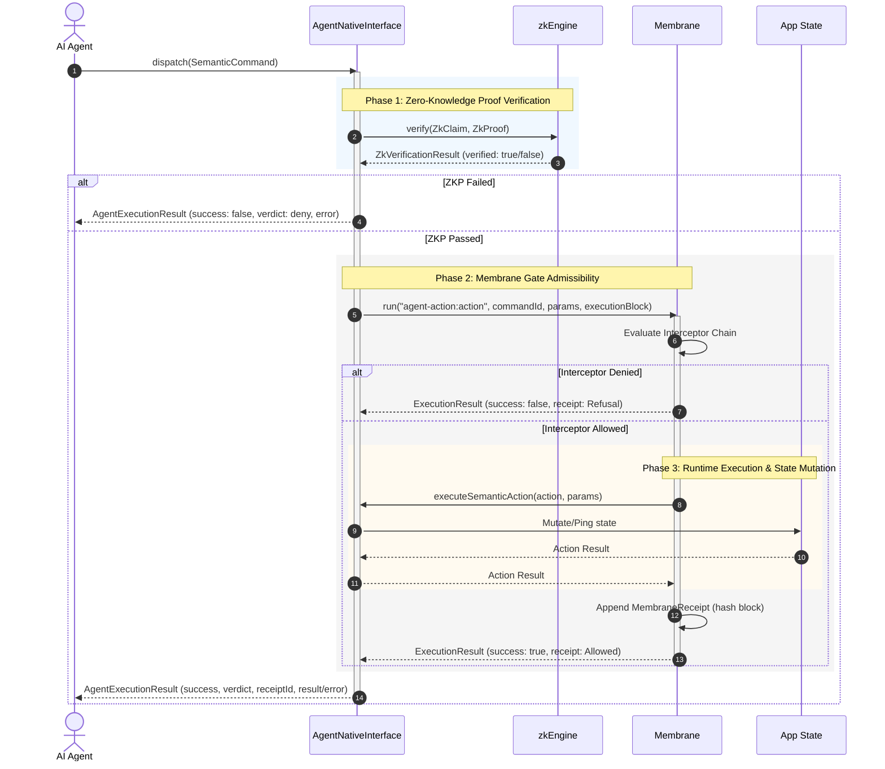

# Agent-Native Module: Secure Autonomous Gateway

The **Agent-Native** module in the Zoe 2030 Innovation Peak provides a cryptographically secured, zero-knowledge verified entry point for autonomous AI agents to query application state and dispatch semantic commands.

Rather than allowing agents direct, unmediated access to database pools or API endpoints, the Agent-Native Interface wraps all interactions in an **Operational Membrane**. This design ensures that every action is governed, audited, and receipted in compliance with safety policies and the overall Zoe ontology.

---

## 1. Architectural & Philosophical Mapping

The design of the Agent-Native module is a direct projection of the **Receipted Chatman Equation**:

$$R \vdash A = \mu(O^*)$$

Where:

- $O^*$ (**Lawful Closure Ontology**): The boundary of all safe and admissible system states. Within the Agent-Native module, the closure is defined by the application's local `state` object combined with the strict policy rules enforced by the `Membrane` interceptors.
- $\mu$ (**Manufacturing/Transformation Function**): The processing logic that translates the agent's high-level semantic intent into runtime state mutations. This is implemented via the path resolution logic (`resolvePath`) and semantic action mapping (`executeSemanticAction`).
- $A$ (**Emitted Consequence**): The result of execution—either the slice of state exposed to the agent or the mutated application state (e.g., updating settings, user records).
- $R$ (**Receipt Lineage**): The verifiable proof of execution correctness. Each dispatch emits a `MembraneReceipt` containing a unique ID, execution success status, admissibility verdict (`allow` or `deny`), and cryptographic hash links (`deltaHash`, `previousHash`). The incoming Zero-Knowledge Proof (`ZkProof`) supplied by the agent serves as the input verification token, completing the safety lineage.

### Execution & Verification Flow

The sequence below illustrates how a semantic command moves from an AI agent, through Zero-Knowledge Proof (ZKP) verification, across the Operational Membrane gatekeepers, and down to the runtime state update.



---

## 2. Source Code Structure

The module is housed under `src/framework/2030/agent-native/` and contains the following files:

```
src/framework/2030/agent-native/
├── __tests__/
│   └── agent-native.test.ts  # Jest unit and integration tests (11 assertions)
├── index.ts                  # Module entry point, re-exporting interfaces and types
├── interface.ts              # Core implementation of AgentNativeInterface
└── types.ts                  # Type definitions for commands, configs, and inspection
```

### File Roles

- **`index.ts`**  
  Acts as the public export boundary. It exposes all configuration and payload interfaces alongside the interface class itself.
- **`types.ts`**  
  Defines the contracts for communication between AI agents and the framework, covering state queries, action execution packets, and ZKP proof wrappers.
- **`interface.ts`**  
  Houses the `AgentNativeInterface` class. Implements ZKP claim construction, state path querying, semantic action dispatcher simulations, and error-to-receipt translation.
- **`__tests__/agent-native.test.ts`**  
  Verifies state queries, path parsing, strict ZKP enforcement bypasses, and membrane interception capabilities.

---

## 3. Public Interfaces & API Contracts

### Data Types (`types.ts`)

#### `SemanticCommand`

Represents an action packet sent by an AI agent requesting state manipulation.

```typescript
export interface SemanticCommand {
  id: string; // Unique ID for tracking and receipt generation
  action: string; // Semantic name of action (e.g. 'update_state', 'ping')
  params: Record<string, any>; // Arbitrary input arguments for the action
  zkp: ZkProof; // Cryptographic proof of authorization for this action
  agentMetadata?: {
    id: string; // Unique agent ID
    model: string; // e.g., 'gpt-4o', 'claude-3.5-sonnet'
    capabilities: string[]; // List of claimed agent scopes
  };
}
```

#### `AgentExecutionResult<T>`

The synchronous payload returned to the agent after membrane execution.

```typescript
export interface AgentExecutionResult<T = any> {
  success: boolean; // True if ZKP passes and Membrane execution succeeds
  commandId: string; // Matches original command.id
  result: T | null; // Data payload returned by action execution
  verdict: AdmissibilityVerdict; // 'allow' | 'deny' | 'fork' | 'observe'
  receiptId: string; // ID of the generated MembraneReceipt ('n/a' on early ZKP fails)
  error?: string; // Execution or ZKP verification failure details
}
```

#### `StateInspectionRequest`

Represents a read-only query to retrieve a segment of application state.

```typescript
export interface StateInspectionRequest {
  path: string; // Dot-separated state location (e.g. 'user.profile.name')
  zkp: ZkProof; // ZKP authorizing read access to the specified path
}
```

#### `AgentNativeConfig`

Module operational configuration flags.

```typescript
export interface AgentNativeConfig {
  enforceZkp: boolean; // If true, throws/fails when ZKP signature is invalid
  membraneId: string; // Identifier of the target Membrane for audit logs
}
```

---

### Core Interfaces & Classes (`interface.ts`)

#### `AgentNativeInterface`

```typescript
export class AgentNativeInterface {
  /**
   * @param membrane The membrane instance used to govern execution
   * @param state The global state object containing system variables
   * @param config Configuration flags including ZKP enforcement toggles
   */
  constructor(membrane: Membrane, state: any, config: AgentNativeConfig);

  /**
   * Queries application state using a dot-notation string if ZKP verifies successfully.
   * Throws an error on failed ZKP authorization.
   */
  public async inspectState(request: StateInspectionRequest): Promise<any>;

  /**
   * Validates a ZKP claim for action execution, and routes execution through the membrane.
   */
  public async dispatch<T = any>(command: SemanticCommand): Promise<AgentExecutionResult<T>>;
}
```

---

## 4. Zero-Knowledge Proof (ZKP) Integration

The Agent-Native gateway integrates with the core `zkEngine` to evaluate cryptographic claims:

1.  **State Reads (`inspectState`)**:
    - Constructs a `ZkClaim` of type `'READ_ACCESS'`.
    - Sets the `resource` field to the target path query.
    - Invokes `zkEngine.verify(claim, zkp)`.
2.  **State Writes / Operations (`dispatch`)**:
    - Constructs a `ZkClaim` of type `'EXECUTE_ACTION'`.
    - Sets the `resource` field to the target semantic action name.
    - Invokes `zkEngine.verify(claim, zkp)`.

> [!NOTE]
> In production environments, the `zkEngine` integrates with the `@truex/zkp` package to verify Groth16 or PLONK proofs generated from circom circuits (e.g. proving knowledge of a private key corresponding to an authorized agent registry without disclosing the key itself). In localized testing environments, it parses validation structures (checking if `proofData` exists and `claimId` matches).

---

## 5. Usage Guide

Below is a complete, copy-pasteable TypeScript integration guide showing how to initialize the Operational Membrane, configure the `AgentNativeInterface`, and process commands.

```typescript
import { Membrane } from '../membrane/membrane';
import { AgentNativeInterface } from './interface';
import { SemanticCommand, StateInspectionRequest } from './types';

async function runAgentGatewayExample() {
  // 1. Initialize application state
  const appState = {
    system: {
      status: 'nominal',
      nodesCount: 42,
    },
    user: {
      profile: {
        name: 'Operator Sean',
        role: 'Administrator',
      },
    },
  };

  // 2. Initialize the Operational Membrane in strict mode
  const membrane = new Membrane({ mode: 'strict' });

  // 3. Register a custom Membrane interceptor to restrict dangerous actions
  membrane.interceptors.register(async (ctx) => {
    // Audit log or intercept rules
    console.log(`[Membrane Interceptor] Evaluating: ${ctx.capabilityId}`);

    // Deny access if a user attempts to edit critical config with invalid role
    if (ctx.capabilityId === 'agent-action:delete_system_logs') {
      return false; // Denies admissibility
    }

    return true; // Allows admissibility
  });

  // 4. Instantiate the Agent-Native gateway
  const agentGateway = new AgentNativeInterface(membrane, appState, {
    enforceZkp: true,
    membraneId: 'main-membrane',
  });

  // ==========================================
  // EXAMPLE 1: Inspecting State with Valid ZKP
  // ==========================================
  const inspectionRequest: StateInspectionRequest = {
    path: 'user.profile.name',
    zkp: {
      claimId: 'read_user_profile',
      proofData: 'valid_zkp_structure_proof',
      publicSignals: ['signal_operator_auth'],
    },
  };

  try {
    const value = await agentGateway.inspectState(inspectionRequest);
    console.log(`[State Inspection Result] resolved value: ${value}`);
    // Output: Operator Sean
  } catch (error) {
    console.error(`[State Inspection Error]:`, error);
  }

  // ==========================================
  // EXAMPLE 2: Dispatching a State Mutation Command
  // ==========================================
  const updateCommand: SemanticCommand = {
    id: 'cmd_tx_998',
    action: 'update_state',
    params: {
      path: 'system.status',
      value: 'maintenance',
    },
    zkp: {
      claimId: 'exec_update_state',
      proofData: 'valid_zkp_structure_proof',
      publicSignals: ['signal_action_auth'],
    },
  };

  const dispatchResult = await agentGateway.dispatch(updateCommand);
  console.log(`[Command Dispatch Result] Success: ${dispatchResult.success}`);
  console.log(`[Command Dispatch Result] Verdict: ${dispatchResult.verdict}`);
  console.log(`[Command Dispatch Result] Receipt: ${dispatchResult.receiptId}`);
  console.log(`[Updated State] new status: ${appState.system.status}`);
  // Output: maintenance
}

runAgentGatewayExample().catch(console.error);
```

---

## 6. Test Suite

The module is verified under a comprehensive Jest test suite located at `__tests__/agent-native.test.ts`.

### Running Tests

To run only the Agent-Native tests, execute:

```bash
npm test -- src/framework/2030/agent-native
```

### Coverage Scope

The test suite covers 11 distinct unit and integration test assertions across two major components:

1.  **State Inspection (`inspectState`)**
    - **ZKP Admission**: Verifies that state queries succeed if the ZKP proof contains valid structure.
    - **Authorization Rejection**: Verifies that invalid ZKP structures reject with a verification failure error.
    - **Deep Paths resolution**: Confirms that nested path strings (e.g., `'user.profile.name'`) resolve correctly.
    - **Bypass Toggle**: Assures that setting `enforceZkp: false` ignores invalid signatures.
    - **Empty Results**: Assures that requesting a non-existent path resolves to `undefined` without throwing runtime crashes.

2.  **Command Dispatch (`dispatch`)**
    - **End-to-End Execution**: Validates dispatching authorized actions, executing them, and creating receipts.
    - **Failure Propagation**: Assures ZKP failures do not trigger internal actions, outputting a refusal receipt instead.
    - **State Mutations**: Tests the `'update_state'` action to ensure it safely resolves and updates references in memory.
    - **Invariant Interception**: Registers custom interceptors on the operational membrane to confirm that actions rejected by membrane rules fail cleanly with execution results set to `verdict: 'deny'`.
