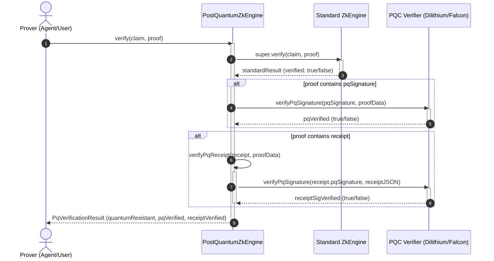

# Post-Quantum ZKP Identity Module

The **Post-Quantum ZKP Identity Module** is a core component of the Zoe 2030 Innovation Peak. It addresses the impending challenge of quantum computing by introducing post-quantum cryptoprimitives and cryptographic execution receipts into the Zero-Knowledge Proof (ZKP) identity verification workflow. This ensures that identity claims and actions executed by local users or autonomous AI agents remain secure, private, and tamper-proof against both classical and quantum adversaries.

---

## 1. Overview

In the Zoe 2030 architecture, identity is not merely an authentication token or a set of static credentials. Instead, identity is verified dynamically and privately using Zero-Knowledge Proofs (ZKPs) to establish trust without exposing personal data.

To future-proof this infrastructure, the **Post-Quantum ZKP Identity Module** incorporates:

- **Post-Quantum Zero-Knowledge Identity**: A dual-layered cryptographic approach that combines ZKPs for assertion privacy with Post-Quantum Cryptography (PQC) for signature integrity.
- **Dilithium/Falcon Signature Verification**: Support for NIST-standardized lattice-based signature schemes (CRYSTALS-Dilithium and Falcon) to sign ZK proofs and execution payloads.
- **Post-Quantum Receipts (PQ-Receipts)**: Signed cryptographic attestations that bind a specific ZK proof to its execution context. These receipts prove that identity verification occurred successfully under quantum-safe rules.

> [!IMPORTANT]
> The primary verification engine, `PostQuantumZkEngine`, extends the legacy standard `ZkEngine` to enforce these post-quantum checks. The current implementation uses verified structural stubs ready to integrate with native or WebAssembly (WASM)-based post-quantum cryptography libraries.

---

## 2. Architectural & Philosophical Mapping

The module operates in strict conformance with the **Receipted Chatman Equation**:

$$R \vdash A = \mu(O^*)$$

Where:

- **$O^*$ (Lawful Closure Ontology)**: Represents the set of all admissible, secure, and authorized system states. An unauthorized or classically vulnerable identity claim is treated as a security violation that breaks lawful closure.
- **$\mu$ (Transformation/Manufacturing Function)**: The logic that transitionally mutates state or executes commands (e.g., admitting an agent, updating sensitive records, or upgrading access levels).
- **$A$ (Emitted Consequence)**: The result of the execution (e.g., granting authorization or committing a transaction).
- **$R$ (Receipt Lineage)**: The cryptographic validation proof. In this module, the receipt is realized via the `PqReceipt` interface. It asserts that the identity claims were verified using quantum-resistant signature algorithms.

Without a valid receipt $R$ confirming post-quantum security (i.e. where `quantumResistant` is `true`), the transformation $\mu(O^*)$ is rejected, and no consequence $A$ is allowed to affect the system state.

### Verification Sequence Flow



---

## 3. Source Code Structure

The module is organized within the `src/framework/2030/identity` directory:

| File Name                                                                                                                 | Role / Description                                                                               |
| :------------------------------------------------------------------------------------------------------------------------ | :----------------------------------------------------------------------------------------------- |
| [index.ts](file:///Users/sac/zoeapp/src/framework/2030/identity/index.ts)                                                 | Module entry point exporting types, the engine, and a default singleton instance `pqZkEngine`.   |
| [types.ts](file:///Users/sac/zoeapp/src/framework/2030/identity/types.ts)                                                 | Cryptographic data contracts, algorithm enumerations, and interfaces for PQ signatures/receipts. |
| [PostQuantumZkEngine.ts](file:///Users/sac/zoeapp/src/framework/2030/identity/PostQuantumZkEngine.ts)                     | Implementation of the `PostQuantumZkEngine` verifying standard ZKPs and post-quantum extensions. |
| [PostQuantumIdentity.test.ts](file:///Users/sac/zoeapp/src/framework/2030/identity/__tests__/PostQuantumIdentity.test.ts) | Complete unit test suite verifying validation logic, invalid signatures, and edge cases.         |

### Dependencies

The module builds upon the base ZKP verification framework:

- [types.ts (Base ZKP)](file:///Users/sac/zoeapp/src/framework/auth/zkp/types.ts): Base definitions for standard ZK claims, proofs, and results.
- [engine.ts (Base ZKP)](file:///Users/sac/zoeapp/src/framework/auth/zkp/engine.ts): Core verification logic that `PostQuantumZkEngine` inherits.

---

## 4. Public Interfaces / API Contracts

### Data Types & Enums

#### `PqAlgorithm`

Specifies the lattice-based or hash-based post-quantum signature schemes defined by NIST.

```typescript
type PqAlgorithm =
  | 'Dilithium2'
  | 'Dilithium3'
  | 'Dilithium5'
  | 'Falcon-512'
  | 'Falcon-1024'
  | 'SPHINCS+';
```

#### `PqSignature`

Represents the post-quantum signature metadata.

```typescript
interface PqSignature {
  algorithm: PqAlgorithm;
  data: string; // Base64 encoded signature
  publicKey: string; // Base64 encoded public key
}
```

#### `PqZkProof`

Extends the standard `ZkProof` with optional post-quantum elements.

```typescript
interface PqZkProof extends ZkProof {
  pqSignature?: PqSignature;
  receipt?: PqReceipt;
}
```

#### `PqReceipt`

The cryptographically bound receipt proving quantum-resistant verification.

```typescript
interface PqReceipt {
  version: '2030.1';
  timestamp: number;
  claimId: string;
  zkProofHash: string; // Hash binding this receipt to the ZK proof
  pqSignature: PqSignature;
  metadata?: Record<string, any>;
}
```

#### `PqVerificationResult`

Extends the standard verification outcome with PQ-specific status flags.

```typescript
interface PqVerificationResult extends ZkVerificationResult {
  pqVerified: boolean;
  receiptVerified: boolean;
  quantumResistant: boolean;
}
```

---

### Classes & Providers

#### `PqZkProvider`

Describes the contract for post-quantum verification providers.

```typescript
interface PqZkProvider {
  verify(claim: ZkClaim, proof: PqZkProof): Promise<PqVerificationResult>;
}
```

#### `PostQuantumZkEngine`

Main execution class extending `ZkEngine` and implementing `PqZkProvider`.

- **`verify(claim: ZkClaim, proof: PqZkProof): Promise<PqVerificationResult>`**
  - _Description_: Validates standard ZK circuit assertions first, then evaluates the post-quantum signature and receipt if present.
  - _Parameters_:
    - `claim`: The `ZkClaim` containing fields, operators, and thresholds.
    - `proof`: The `PqZkProof` payload containing standard proof data along with optional `pqSignature` or `receipt`.
  - _Returns_: A promise resolving to `PqVerificationResult`.
- **`verifyPqSignature(signature: PqSignature, data: string): boolean`** (Private)
  - _Description_: Structural signature verification. Compares signature data to mock values (such as rejecting `'INVALID_SIG'`) and logs execution.
- **`verifyPqReceipt(receipt: PqReceipt, zkProofData: string): boolean`** (Private)
  - _Description_: Validates receipt bindings, structural formatting, and verifies the receipt's nested post-quantum signature.

---

## 5. Usage Guide

The following TypeScript code illustrates how to configure claims, construct post-quantum zero-knowledge proofs, and execute verification using `PostQuantumZkEngine`.

```typescript
import { PostQuantumZkEngine, ZkClaim, PqZkProof, PqVerificationResult } from './index';

async function executeSecureIdentityVerification() {
  const engine = new PostQuantumZkEngine();

  // 1. Define a ZKP claim (e.g., verifying age >= 18 without revealing birthdate)
  const claim: ZkClaim = {
    id: 'claim_age_18',
    field: 'age',
    operator: 'GTE',
    threshold: 18,
    description: 'Verify operator is of legal age',
  };

  // 2. Build the proof payload with Falcon-1024 signatures and receipts
  const proof: PqZkProof = {
    claimId: 'claim_age_18',
    proofData: 'eyJwaV9hIjpbIjEwIiwiMjAiXSwicGlfYiI6WyIzMCIsIjQwIl19', // Mock ZKP proof data
    publicSignals: ['18'],

    // NIST Round 3 Post-Quantum Signature
    pqSignature: {
      algorithm: 'Falcon-1024',
      data: 'MEYCIQCc9d1k...base64_sig...',
      publicKey: 'MIIBtzCCASw...base64_key...',
    },

    // Secure Verification Receipt binding the ZK proof hash
    receipt: {
      version: '2030.1',
      timestamp: Date.now(),
      claimId: 'claim_age_18',
      zkProofHash: 'sha256-8a9d3e82fc601859c2356ec710f1359c',
      pqSignature: {
        algorithm: 'Falcon-1024',
        data: 'MEYCIQDw3e0p...receipt_sig...',
        publicKey: 'MIIBtzCCASw...receipt_pubkey...',
      },
      metadata: {
        authorizedGateway: 'Zoe2030_Auth_Router_01',
      },
    },
  };

  // 3. Verify standard ZKP and post-quantum components
  const result: PqVerificationResult = await engine.verify(claim, proof);

  console.log('Verification Outcome:');
  console.log(`- Verified: ${result.verified}`);
  console.log(`- Post-Quantum Verified: ${result.pqVerified}`);
  console.log(`- Receipt Verified: ${result.receiptVerified}`);
  console.log(`- Quantum Resistant Status: ${result.quantumResistant}`);

  // 4. Act on the receipted consequence (R ⊢ A = μ(O*))
  if (result.verified && result.quantumResistant) {
    console.log('Access granted. Lawful closure maintained.');
  } else {
    console.log('Access denied. Identity validation failed or lack of quantum resistance.');
  }
}

executeSecureIdentityVerification().catch(console.error);
```

---

## 6. Test Suite

The module contains a robust unit test suite located at [PostQuantumIdentity.test.ts](file:///Users/sac/zoeapp/src/framework/2030/identity/__tests__/PostQuantumIdentity.test.ts). These tests verify the operational bounds of standard and post-quantum identity validation.

> [!TIP]
> To run the identity test suite locally, execute:
>
> ```bash
> npm test -- src/framework/2030/identity/__tests__/PostQuantumIdentity.test.ts
> ```

### Test Coverage Breakdown

The unit tests validate the following cases:

1.  **Singleton Export**: Confirms that the module exports a default singleton instance (`pqZkEngine`) of `PostQuantumZkEngine`.
2.  **Standard ZK Verification**: Validates standard ZKP verification where no post-quantum extensions are supplied (returns `verified: true`, but `quantumResistant: false` and `pqVerified: false`).
3.  **PQ Signature Verification**: Checks that providing a valid `pqSignature` sets `pqVerified` and `quantumResistant` to `true`.
4.  **Signature Failures**:
    - Verifies that invalid signature data (`INVALID_SIG`) fails the signature verification and sets `verified: false`.
    - Verifies that missing signature properties (e.g., missing signature data) returns `pqVerified: false`.
5.  **Receipt Integrity**:
    - Verifies that a valid `receipt` triggers `receiptVerified: true`.
    - Verifies that invalid receipt versions (e.g., `'2025.1'`) fail the receipt verification.
    - Verifies that invalid receipt signatures (`INVALID_SIG` inside `receipt.pqSignature`) set `receiptVerified: false`.
6.  **Combination Integrity**:
    - Verifies that if standard ZKP verification fails (e.g., `claimId` mismatch), the overall verification fails (`verified: false`) even if a valid PQ signature is provided.
    - Verifies that a proof containing ONLY a valid PQ receipt is verified, but `quantumResistant` remains `false` because the proof itself lacks a direct `pqSignature`.
