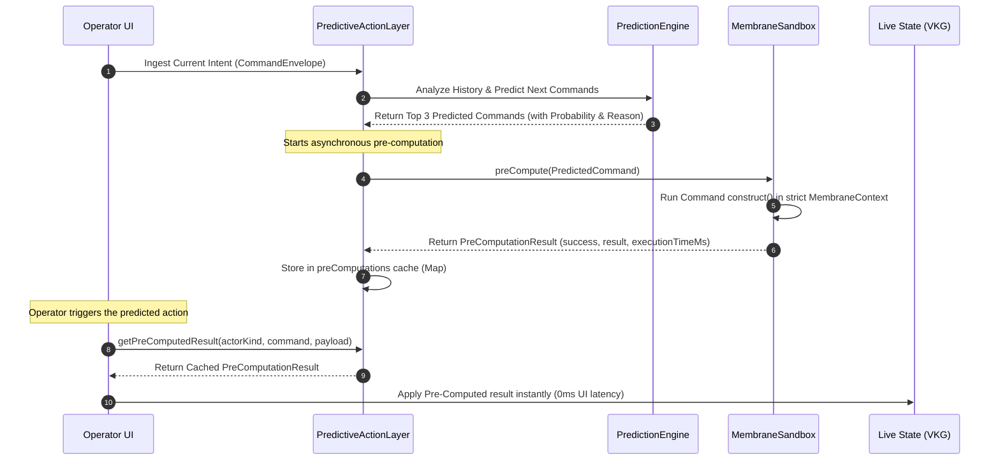

# Predictive Action Layer (PAL) & Membrane Sandbox

The **Predictive Action Layer (PAL)** is a core optimization engine introduced in the Zoe 2030 Innovation Peak. By continuously analyzing the stream of operator command intents, PAL anticipates future transitions and pre-executes candidate actions inside a strictly isolated sandbox. This proactive approach removes user-visible execution latency, delivering an **Instant UX** (0ms execution feedback).

---

## 1. Overview

In high-consequence environments, waiting for synchronous command validation, database writes, and state synchronization creates latency that hinders real-time operational efficiency. 

The Predictive Action Layer addresses this challenge by introducing three key components:
1. **Command Intent Prediction**: A rolling event analyzer that maps transition frequencies to anticipate the operator's next moves.
2. **Membrane Sandbox Context**: A secure, isolated environment where predicted actions are run to obtain their projected state changes without modifying the active state.
3. **Instant UX Dispatcher**: A cache-aligned commit layer that instantly applies pre-computed results if the predicted action is chosen, bypassing execution bottlenecks.



---

## 2. Architectural & Philosophical Mapping

### The Receipted Chatman Equation
PAL is designed as a direct realization of the **Receipted Chatman Equation**:

$$R \vdash A = \mu(O^*)$$

Where:
* **$O^*$ (Lawful Closure Ontology)**: Represents admissible operational state. In PAL, this is simulated in the sandbox using [MembraneSandbox.ts](file:///Users/sac/zoeapp/src/framework/2030/predictive/MembraneSandbox.ts).
* **$\mu$ (Transformation/Manufacturing Function)**: The command execution pathway defined in the registry (`spec.construct`).
* **$A$ (Emitted Consequence)**: The state changes or updates generated by the command.
* **$R$ (Receipt Lineage)**: The proof showing compliance, safety, and validity inside the membrane.

### The Manufacturing Inversion
Traditional web and mobile applications use a reactive runtime model:
$$\text{Intent} \longrightarrow \text{Execution} \longrightarrow \text{State Mutation} \longrightarrow \text{Render}$$

This reactive sequence makes probability do determinism's job at runtime, forcing the client to bear the latency of validating and executing mutations on the fly.

PAL flips this through the **Truex Manufacturing Inversion**:
$$\text{History} \longrightarrow \text{Pre-manufacture } A = \mu(O^*) \longrightarrow \text{Instant Commit (0ms)}$$

Because the state transition has already been manufactured inside the isolated membrane sandbox, the final action is reduced to a constant-time state swap. If the operator deviates from the predicted path, the precomputed result is discarded without contaminating the live state system (VKG).

> [!IMPORTANT]
> **Live Operational Closure > Static Architecture**
> Consequence is pre-manufactured at the lowest cost tier beforehand, ensuring that runtime execution is deterministic, secure, and immediate.

---

## 3. Source Code Structure

The predictive module is located at `src/framework/2030/predictive` and consists of the following components:

* [index.ts](file:///Users/sac/zoeapp/src/framework/2030/predictive/index.ts)
  * The public entry point. It exports all primary classes and types.
* [types.ts](file:///Users/sac/zoeapp/src/framework/2030/predictive/types.ts)
  * Defines core contracts such as `PredictedCommand`, `PreComputationResult`, and `PredictiveState`.
* [PredictionEngine.ts](file:///Users/sac/zoeapp/src/framework/2030/predictive/PredictionEngine.ts)
  * Analyzes historical command transitions using frequency analysis to calculate the next 3 likely commands.
* [MembraneSandbox.ts](file:///Users/sac/zoeapp/src/framework/2030/predictive/MembraneSandbox.ts)
  * Initializes the `MembraneContext` in strict isolation to construct future state deltas without side effects.
* [PredictiveActionLayer.ts](file:///Users/sac/zoeapp/src/framework/2030/predictive/PredictiveActionLayer.ts)
  * The singleton orchestrator that ties the prediction engine, sandbox, and active user command stream together.

---

## 4. Public Interfaces & API Contracts

### Data Structures (`types.ts`)

#### `PredictedCommand`
Represents a predicted command that may be executed in the future.
* `envelope: CommandEnvelope`: The fully hydrated command payload predicted by the engine.
* `probability: number`: A floating-point number between `0` and `0.9` representing prediction confidence.
* `reason: string`: Human-readable context explaining why the prediction was made.

#### `PreComputationResult`
The output of a sandboxed membrane execution.
* `predictedCommand: PredictedCommand`: The source prediction.
* `success: boolean`: Whether the command validation and construct steps completed without errors.
* `result: any`: The resulting state delta constructed inside the sandbox.
* `error?: string`: The error message if the execution failed.
* `executionTimeMs: number`: The duration of the execution in milliseconds.

#### `PredictiveState`
The internal state representation of PAL.
* `recentIntents: CommandEnvelope[]`: Bounded list of recently ingested real-time commands.
* `predictions: PredictedCommand[]`: Currently active predictions.
* `preComputations: Map<string, PreComputationResult>`: Bounded cache mapping prediction signatures to results.

---

### Core Classes

#### `PredictiveActionLayer`
The singleton manager coordinating predictive executions.
* **`static getInstance(): PredictiveActionLayer`**: Returns the singleton instance.
* **`ingestIntent(envelope: CommandEnvelope): Promise<PredictedCommand[]>`**: Records the current command in the rolling history, triggers prediction, starts parallel background sandbox executions, and notifies subscribers.
* **`getPreComputedResult(actorKind: string, command: string, payload: any): PreComputationResult | null`**: Looks up the cache to see if a command matches the requested actor, type, and payload parameters.
* **`getState(): PredictiveState`**: Returns the current state clone.
* **`subscribe(listener: (state: PredictiveState) => void): () => void`**: Registers a callback for state changes. Returns an unsubscribe function.
* **`reset(): void`**: Clears history and pre-computations (primarily for test isolation).

#### `PredictionEngine`
Implements frequency-based transition analysis.
* **`analyze(envelope: CommandEnvelope): PredictedCommand[]`**: Appends the latest command to the history log (capped at 50) and returns up to 3 likely transitions.

#### `MembraneSandbox`
Provides isolation context for dry-running commands.
* **`preCompute(predicted: PredictedCommand): Promise<PreComputationResult>`**: Resolves the actor command definition and executes its `construct` routine within a strictly isolated `MembraneContext`.

---

## 5. Usage Guide

Below is a complete TypeScript example showing how to initialize, subscribe, ingest user intents, and leverage pre-computed results in a custom dispatch flow.

```typescript
import { PredictiveActionLayer } from '@/src/framework/2030/predictive';
import { CommandEnvelope } from '@/src/lib/actor/types';

// 1. Retrieve the Singleton instance of PAL
const pal = PredictiveActionLayer.getInstance();

// 2. Subscribe to predictive state changes (e.g. for debugging or UI indicators)
const unsubscribe = pal.subscribe((state) => {
  console.log(`Current predictions: ${state.predictions.map(p => p.envelope.command).join(', ')}`);
  console.log(`Precomputations cached: ${state.preComputations.size}`);
});

// 3. Simulate ingesting an active user intent (command)
const lastCommand: CommandEnvelope = {
  id: 'env_real_101',
  actor: { id: 'v-99', kind: 'volunteer' },
  command: 'check_in',
  payload: { gateId: 'gate-3' },
  principal: { id: 'operator_sean', role: 'admin' },
  createdAt: new Date().toISOString(),
};

console.log('Ingesting current user action...');
const predictions = await pal.ingestIntent(lastCommand);

// 4. Simulate checking for a pre-computed follow-up action.
// If the prediction engine anticipated the next action, we can apply it instantly.
const predictedCommandPayload = { gateId: 'gate-3' };

// Wait briefly for parallel sandbox execution to complete
await new Promise((resolve) => setTimeout(resolve, 50));

const precomputed = pal.getPreComputedResult('volunteer', 'log_equipment', predictedCommandPayload);

if (precomputed && precomputed.success) {
  console.log('Instant UX hit! Applying precomputed result without execution latency.');
  console.log('Result details:', precomputed.result);
  console.log('Pre-computation took:', precomputed.executionTimeMs, 'ms');
  
  // Apply changes to the live VKG context here
} else {
  console.log('Pre-computation not found or failed. Executing command synchronously.');
  // Fall back to executing the command spec directly at runtime
}

// 5. Unsubscribe when cleanup is required
unsubscribe();
```

---

## 6. Test Suite

The PAL module is verified via automated Jest unit tests located at [PredictiveActionLayer.test.ts](file:///Users/sac/zoeapp/src/framework/2030/predictive/__tests__/PredictiveActionLayer.test.ts).

### Test Coverage Details
* **Intent Ingestion**: Verifies that new intents successfully register in the rolling history buffer.
* **Transition Frequency Analysis**: Trains the `PredictionEngine` with sequential intent patterns (e.g., `cmd-1` followed by `cmd-2`) and asserts that the engine correctly predicts subsequent actions based on history.
* **Membrane Execution Safety**: Confirms that commands are successfully executed via `spec.construct` within the sandbox and outputs appropriate state changes.
* **Resource Boundaries**: Validates that history logs remain capped at 50 items and that pre-computations map sizes remain capped at 20 entries to prevent memory overflows.
* **Subscription Management**: Ensures state change listeners are successfully invoked during ingestion and do not leak after being unsubscribed.

To run the predictive test suite, execute:
```bash
npm test -- src/framework/2030/predictive
```
