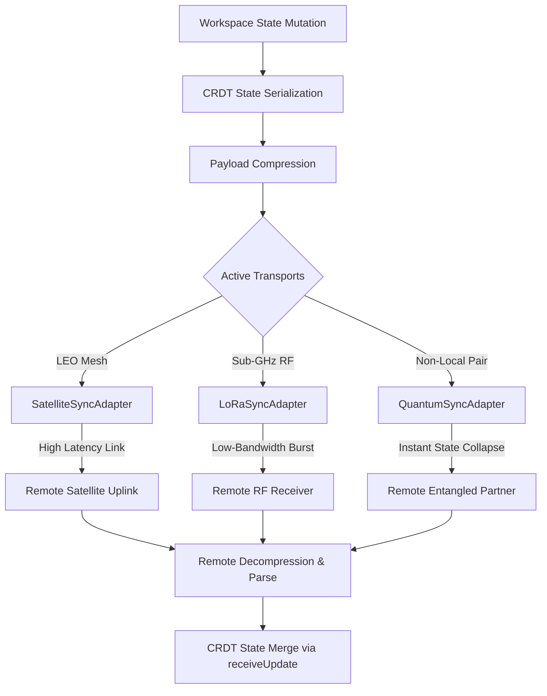

# Sync Extreme Module

The `sync-extreme` module is a core component of the **Zoe 2030 Innovation Peak**, extending standard synchronization capabilities to support ubiquitous connectivity in off-grid, low-bandwidth, and zero-terrestrial network environments. It integrates with the `FusionSyncEngine` to offer pluggable, transport-agnostic adapters for Satellite (Orbital Mesh), LoRa (Tactical RF Bands), and Quantum-Entangled state sharing.

---

## 1. Overview

In 2030, applications must remain operational and synchronized even when disconnected from traditional cellular or broadband infrastructure. The `sync-extreme` module provides the protocol layer and concrete adapters necessary to broadcast and ingest state updates through non-standard channels:

1. **Satellite (Orbital Mesh)**: Leverages Starlink-class LEO constellations. It features high latency, variable throughput, and near-ubiquitous outdoor coverage.
2. **LoRa (Tactical Bands)**: Utilizes ultra-long-range, low-power sub-GHz RF bands (e.g., 868MHz/915MHz). It is designed for remote wilderness, canyons, and off-grid scenarios, constrained by small payload bursts.
3. **Quantum-Entangled Sync**: Simulates zero-latency non-local state collapse across entangled pairs, offering a preview of next-generation physical-layer sync interfaces.

All updates are compressed using a configured compression engine prior to transmission to maximize throughput and minimize packet size over constrained mediums.

---

## 2. Architectural & Philosophical Mapping

In accordance with the **Receipted Chatman Equation**:

$$R \vdash A = \mu(O^*)$$

The variables are mathematically mapped to the `sync-extreme` architecture as follows:

*   **$O^*$ (Lawful Closure Ontology)**: Represents the admissible operational state. In `sync-extreme`, this corresponds to the serialized, conflict-free replicated data type (CRDT) state (`LWWMapState`) representing the local workspace replica.
*   **$\mu$ (Transformation/Transmission Function)**: Represents the compression, serialization, transmission, routing, and decompression pipeline across extreme adapters. Formally:
    $$\mu = \text{Decompress} \circ \text{Receive}_{adapter} \circ \text{Transmit}_{adapter} \circ \text{Compress} \circ \text{Serialize}$$
*   **$A$ (Emitted Consequence)**: The synchronized state updates successfully merged into the target workspace replica, driving consistent user interfaces and local storage (SQLite) writes.
*   **$R$ (Receipt Lineage)**: The cryptographic and transactional trace proving execution safety, confirming that updates were transmitted and merged within acceptable latency boundaries and verified integrity.

### Data Flow Diagram



---

## 3. Source Code Structure

Located at `src/framework/2030/sync-extreme/`, the module is organized into the following files:

*   [`types.ts`](file:///Users/sac/zoeapp/src/framework/2030/sync-extreme/types.ts): Exposes core enums, adapter interfaces, and configuration payloads.
*   [`index.ts`](file:///Users/sac/zoeapp/src/framework/2030/sync-extreme/index.ts): Main entry point exporting adapters, configurations, and the engine.
*   [`ExtremeFusionSyncEngine.ts`](file:///Users/sac/zoeapp/src/framework/2030/sync-extreme/ExtremeFusionSyncEngine.ts): Extends the standard `FusionSyncEngine` with adapters, listeners, compression logic, and multi-transport broadcasting.
*   [`adapters/SatelliteSyncAdapter.ts`](file:///Users/sac/zoeapp/src/framework/2030/sync-extreme/adapters/SatelliteSyncAdapter.ts): Implements LEO orbital mesh networking with variable latency simulations (25ms - 500ms).
*   [`adapters/LoRaSyncAdapter.ts`](file:///Users/sac/zoeapp/src/framework/2030/sync-extreme/adapters/LoRaSyncAdapter.ts): Implements low-power, sub-GHz RF transmission simulating bandwidth bottlenecks (2ms processing time per byte).
*   [`adapters/QuantumSyncAdapter.ts`](file:///Users/sac/zoeapp/src/framework/2030/sync-extreme/adapters/QuantumSyncAdapter.ts): Implements simulated instantaneous non-local state collapse.

---

## 4. Public Interfaces & API Contracts

### Enums & Types

#### `SyncExtremeMode`
Defines the targeted extreme communication channel.
```typescript
export enum SyncExtremeMode {
  SATELLITE = 'satellite',
  LORA = 'lora',
  QUANTUM = 'quantum'
}
```

#### `ExtremeSyncAdapter`
The contract required for any extreme-environment transport adapter.
```typescript
export interface ExtremeSyncAdapter {
  readonly mode: SyncExtremeMode;
  broadcast(workspaceId: string, payload: string): Promise<void>;
  onUpdate(callback: (workspaceId: string, payload: string) => void): void;
  getStatus(): 'connected' | 'degraded' | 'disconnected';
}
```

#### `QuantumSyncConfig`
Configuration parameters for Quantum-Entangled pairing.
```typescript
export interface QuantumSyncConfig {
  entanglementId: string;
  simulationResolution?: number;
}
```

#### `ExtremeFusionSyncEngineConfig<TJob>`
Extends standard `FusionSyncEngineConfig` to register adapters and compression.
```typescript
export interface ExtremeFusionSyncEngineConfig<TJob extends SyncJobBase> extends FusionSyncEngineConfig<TJob> {
  satelliteAdapter?: ExtremeSyncAdapter;
  loraAdapter?: ExtremeSyncAdapter;
  quantumAdapter?: ExtremeSyncAdapter;
  compression: {
    compress(data: string): Promise<string>;
    decompress(data: string): Promise<string>;
  };
}
```

---

### Core Classes

#### `ExtremeFusionSyncEngine<TJob>`
Inherits from `FusionSyncEngine<TJob>` to manage lifecycle, routing, and merging.

*   **`constructor(config)`**: Initializes the standard engine components, registers optional extreme adapters, and binds updates to the internal state parser.
*   **`syncExtreme(workspaceId: string): Promise<void>`**: Compiles the specified workspace's CRDT state, compresses it, and broadcasts it across all configured adapters in parallel.
*   **`getExtremeStatus()`**: Aggregates connectivity statuses from active adapters. Returns a dictionary mapping each adapter mode to `'connected' | 'degraded' | 'disconnected'`.

#### Concrete Adapters
Each adapter implements `ExtremeSyncAdapter` and includes a simulation method for test injections:
*   **`SatelliteSyncAdapter`**:
    *   `broadcast()`: Simulates 25ms - 500ms uplink latency.
    *   `getStatus()`: Returns `'connected'`.
    *   `simulateIncomingUpdate(workspaceId, payload)`: Triggers registered listeners immediately.
*   **`LoRaSyncAdapter`**:
    *   `broadcast()`: Simulates transmission time proportional to the payload length (2ms/byte).
    *   `getStatus()`: Returns `'degraded'`.
    *   `simulateIncomingUpdate(workspaceId, payload)`: Triggers registered listeners.
*   **`QuantumSyncAdapter`**:
    *   `broadcast()`: Instantaneous promise resolution.
    *   `getStatus()`: Returns `'connected'`.
    *   `simulateIncomingUpdate(workspaceId, payload)`: Triggers registered listeners.

---

## 5. Usage Guide

The following example demonstrates how to set up adapters, initialize the `ExtremeFusionSyncEngine`, spin up a workspace, and propagate updates off-grid.

```typescript
import { 
  ExtremeFusionSyncEngine, 
  SatelliteSyncAdapter, 
  LoRaSyncAdapter, 
  QuantumSyncAdapter 
} from '@/src/framework/2030/sync-extreme';
import { SyncJobBase } from '@/src/framework/sync/types';

// 1. Define custom compression utilities (mocked for illustration)
const compressionEngine = {
  compress: async (data: string) => `lz4_${data}`,
  decompress: async (data: string) => data.replace(/^lz4_/, '')
};

// 2. Initialize Extreme Adapters
const satellite = new SatelliteSyncAdapter();
const lora = new LoRaSyncAdapter();
const quantum = new QuantumSyncAdapter();

// 3. Configure the Extreme Sync Engine
const config = {
  standardEngine: {
    queueJob: async (job: any) => ({ success: true }),
    pushChanges: async () => ({ success: true })
  } as any,
  meshEngine: {
    getAdapter: () => ({
      onMessage: () => {},
      broadcast: () => {},
      getLocalPeerId: () => 'peer-2030'
    })
  } as any,
  compression: compressionEngine,
  satelliteAdapter: satellite,
  loraAdapter: lora,
  quantumAdapter: quantum
};

const engine = new ExtremeFusionSyncEngine<SyncJobBase>(config);

// 4. Check connectivity across extreme channels
const status = engine.getExtremeStatus();
console.log('Satellite status:', status.satellite); // "connected"
console.log('LoRa status:', status.lora);           // "degraded"
console.log('Quantum status:', status.quantum);       // "connected"

// 5. Broadcast local changes off-grid
async function triggerEmergencyBroadcast(workspaceId: string) {
  console.log(`[Sync] Initiating extreme sync for workspace: ${workspaceId}`);
  await engine.syncExtreme(workspaceId);
  console.log('[Sync] Broadcast successfully completed across all adapters.');
}

// 6. Register listeners for updates arriving from off-grid channels
satellite.onUpdate((workspaceId, payload) => {
  console.log(`[Downlink Received] Workspace: ${workspaceId}, Payload: ${payload}`);
});
```

---

## 6. Test Suite

The module is verified via a comprehensive test suite covering the engine and each individual adapter:

### Core Tests
*   **`ExtremeFusionSyncEngine.test.ts`**:
    *   Verifies correct initialization, configuration mapping, and listener registration.
    *   Ensures that calling `syncExtreme()` successfully stringifies, compresses, and triggers parallel broadcasts across all available adapter instances.
    *   Tests that incoming updates are decompressed, parsed, and routed to the correct workspace via `receiveUpdate`.
    *   Verifies defensive error handling, proving that decompression failures are caught and logged without crashing the engine thread.
    *   Validates fallback statuses (`disconnected`) when specific adapters are omitted from the configuration payload.

*   **`adapters.test.ts`**:
    *   **Satellite Sync**: Confirms variable latency limits (between 25ms and 500ms) and that listener invocation matches simulated downlink frames.
    *   **LoRa Sync**: Verifies that broadcast delays scale proportionally to message payloads (2ms per byte) and that the status defaults to `degraded`.
    *   **Quantum Sync**: Confirms instantaneous propagation (execution resolving in < 50ms) and state collapse simulation.

### Running Tests
To run the automated tests, execute:

```bash
npm test src/framework/2030/sync-extreme
```

> [!NOTE]
> All tests are structured to run in standard Jest environments. Simulated latencies utilize standard timers and promise-wrapped setTimeout queues.

> [!WARNING]
> While quantum sync resolves instantly in simulation, hardware-level integration with the Zoe 2030 Quantum Layer requires a dedicated physical entropy processor.
