# ZoeOS Zero-Loss Mermaid Diagram Pack

## Purpose

This pack gives coding agents the full diagram set required to preserve the ZoeOS / VKG Hook-Field Runtime architecture without information loss. It covers architecture, hooks, avatars/JTBDs, supervisor hooks, Supabase authority, Expo local-first behavior, evidence/replay, DOE/SPC/twin, hook packs, doctor gates, church examples, and the calculus overview.

---

# 1. Architecture Spine

## 1. System Context

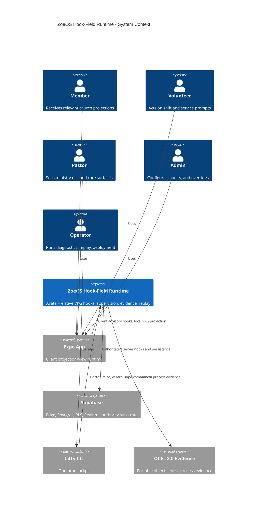

## 2. Container Diagram

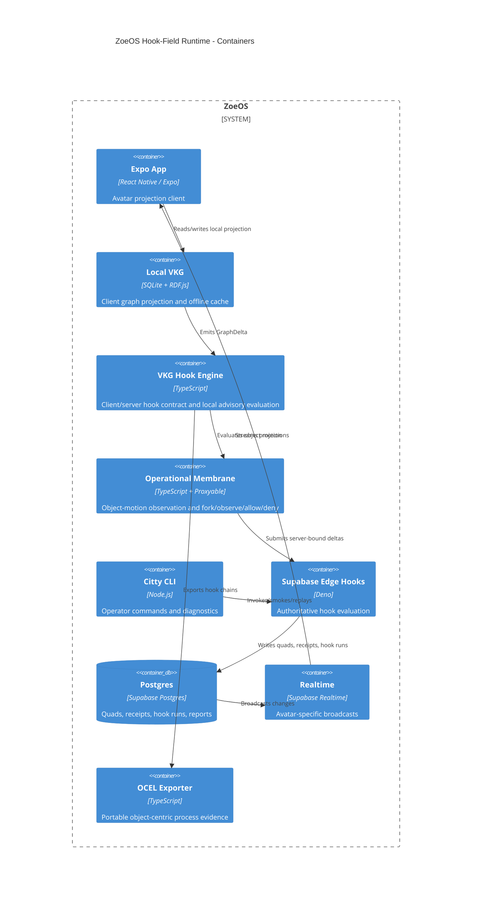

## 3. VKG Hook Engine Components

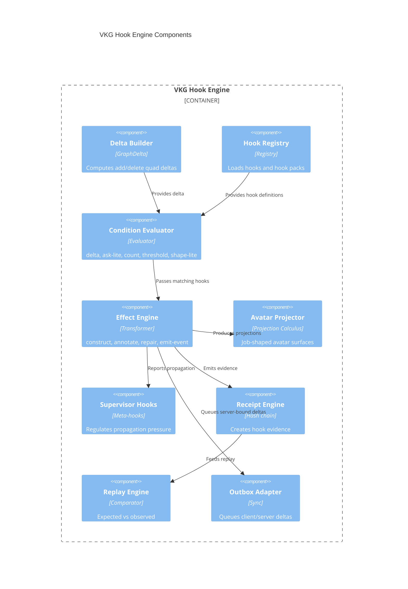

## 4. Runtime Boundary Diagram

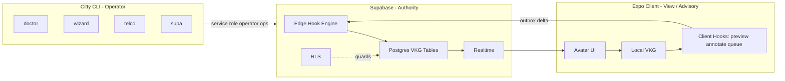

## 5. Data Flow Diagram

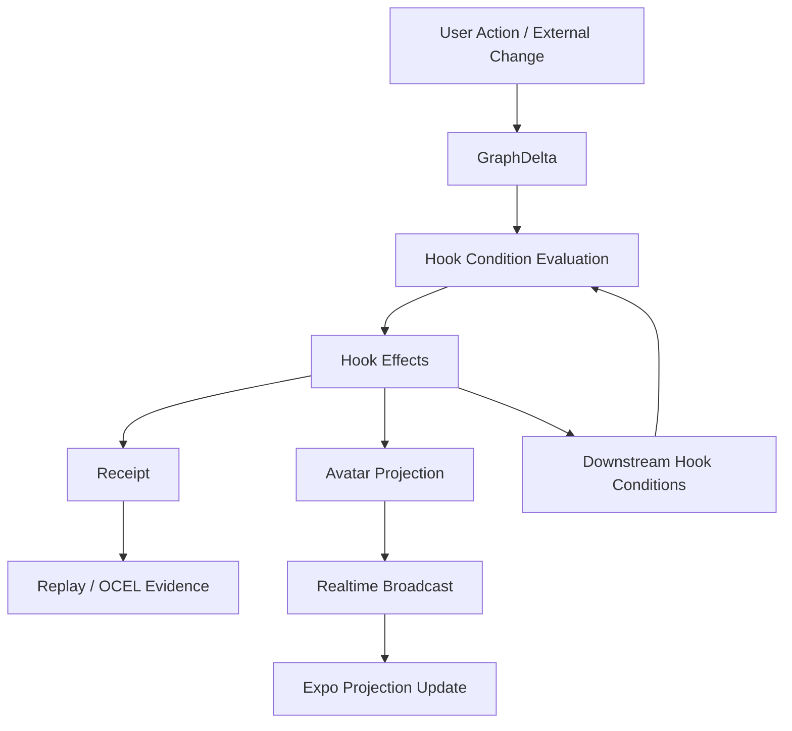

## 6. Deployment Diagram

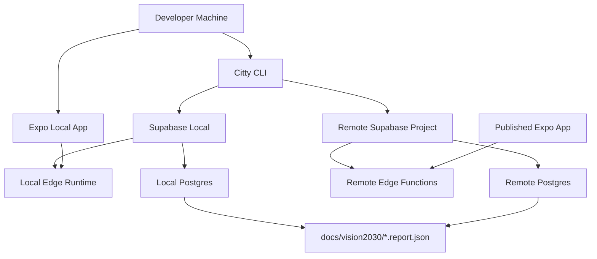

---

# 2. Hook Model

## 7. Hook Definition Anatomy

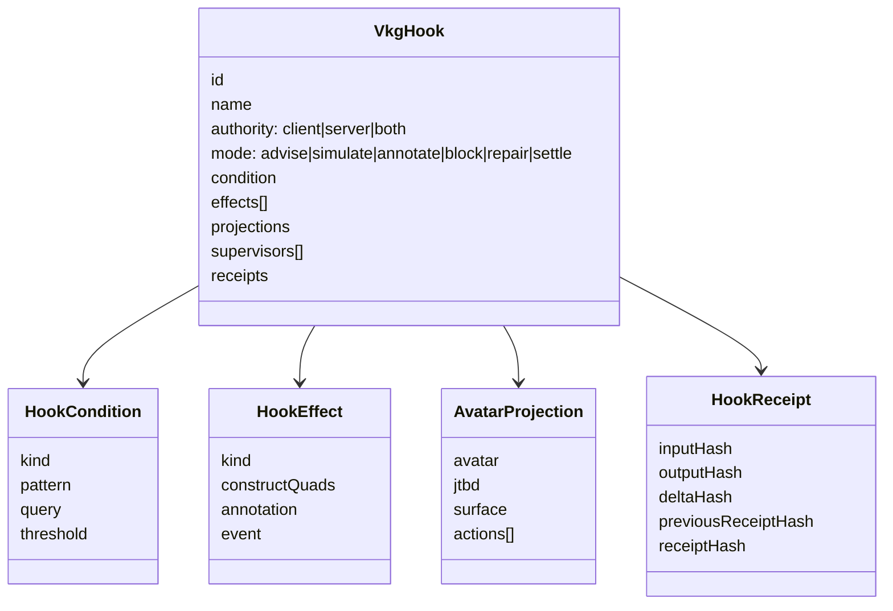

## 8. Client Hook vs Server Hook

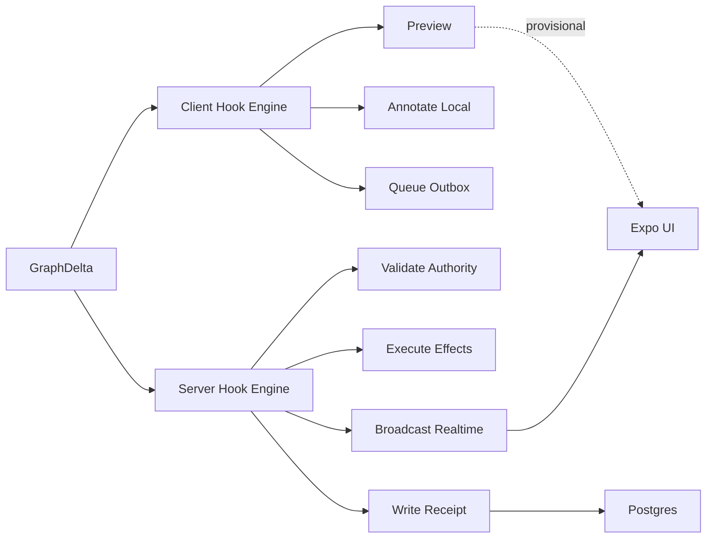

## 9. Hook Lifecycle State Machine

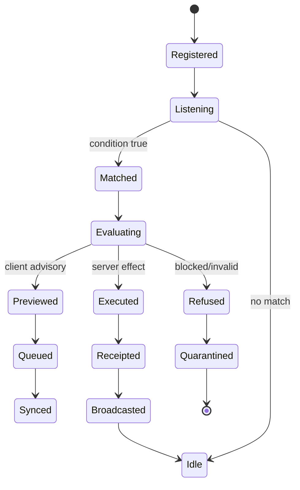

## 10. Hook Chain Propagation

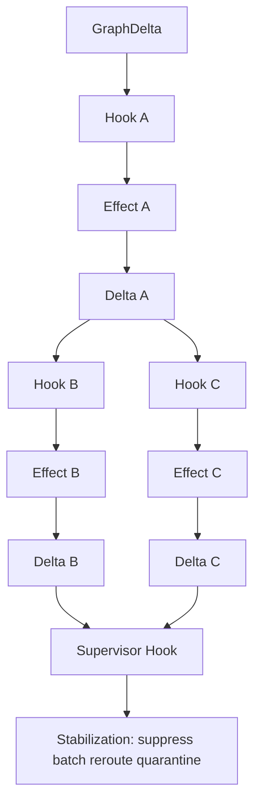

## 11. Hook Registry + Hook Pack Loading

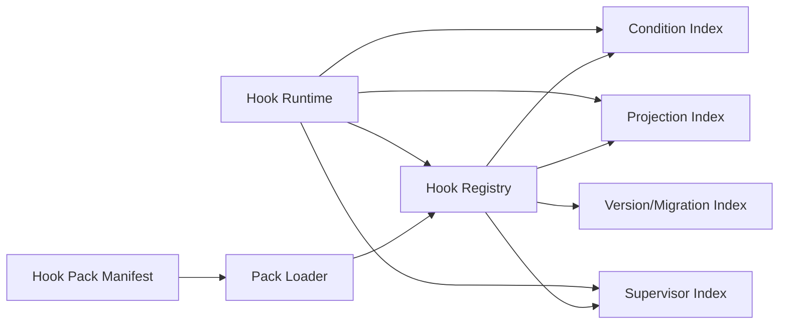

## 12. Hook Condition Evaluation

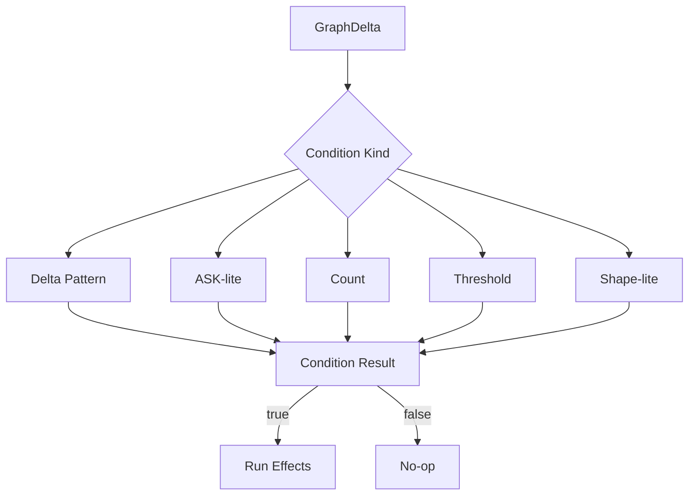

## 13. Hook Effect Execution

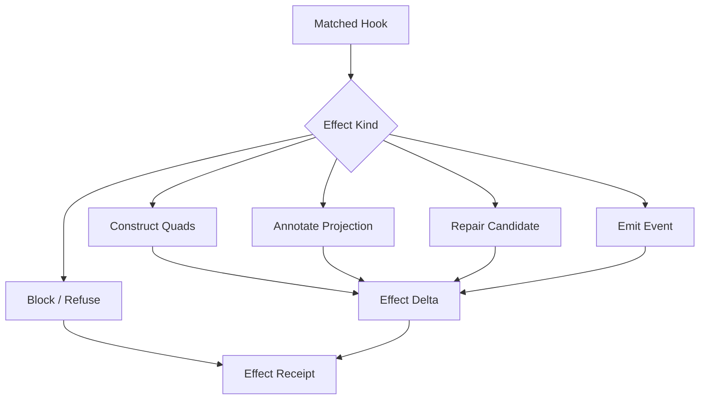

## 14. Hook Receipt Emission

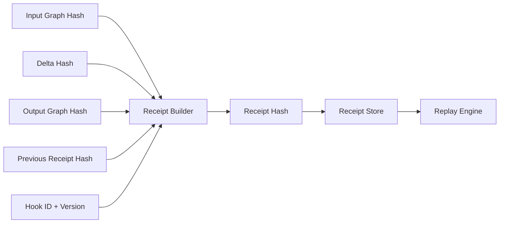

## 15. Hook Replay Flow

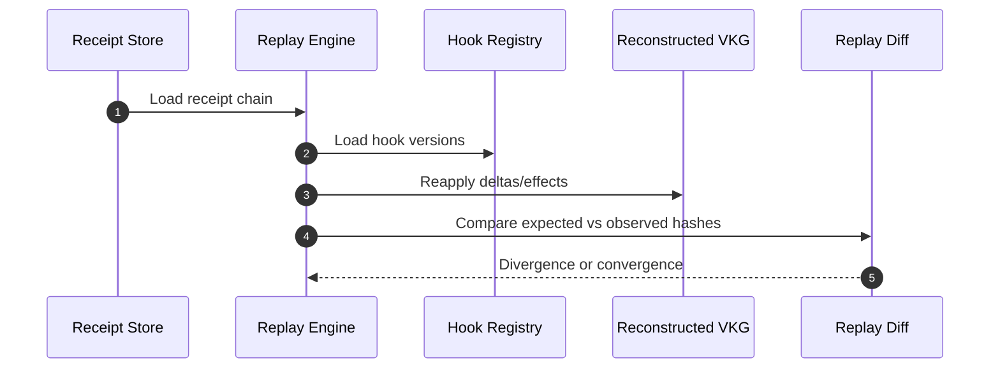

---

# 3. Avatar / JTBD Model

## 16. Avatar Projection Matrix

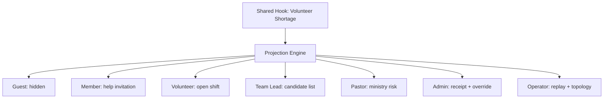

## 17. Avatar-JTBD Hook Mapping

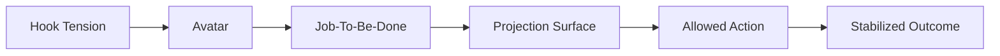

## 18. Same Hook / Different Avatar Views

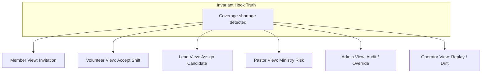

## 19. Projection Load Flow

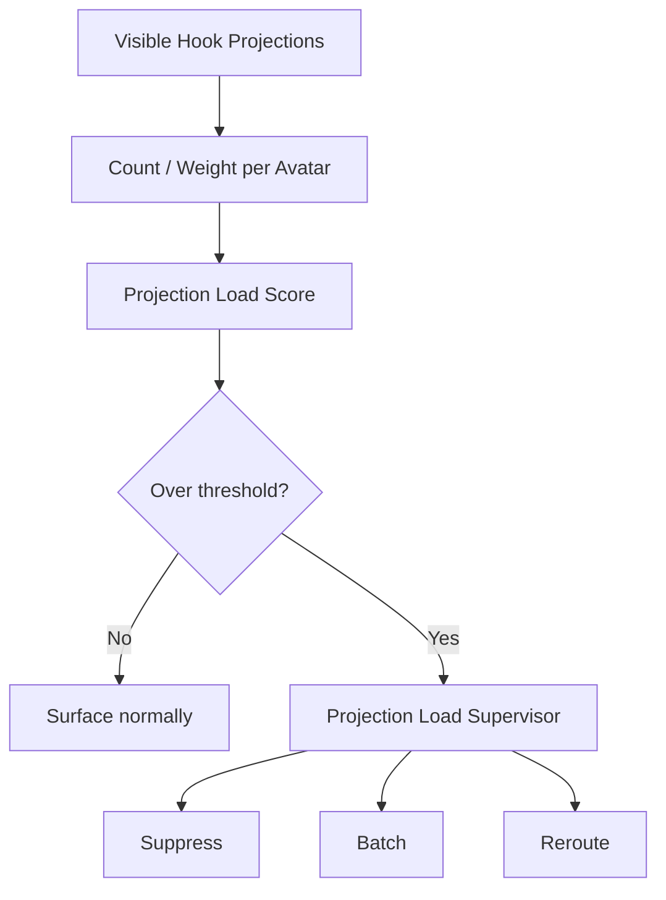

## 20. Suppression Decision Flow

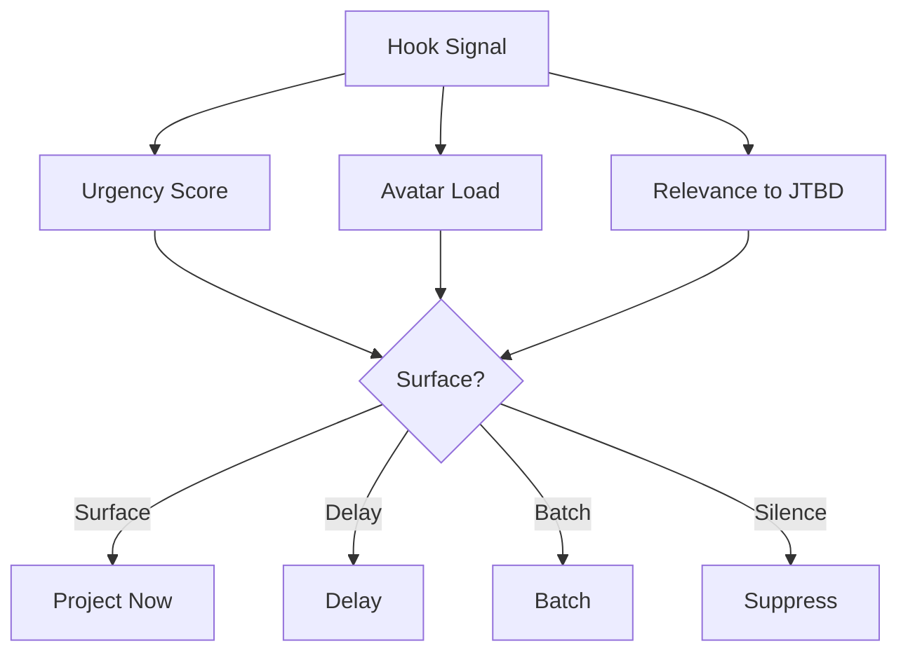

## 21. Escalation Decision Flow

```mermaid
flowchart TD
  Tension[Unresolved Tension] --> Risk[Risk Score]
  Tension --> Authority[Authority Required]
  Tension --> Age[Time Unresolved]
  Risk --> Decision{Escalate?}
  Authority --> Decision
  Age --> Decision
  Decision -->|No| Continue[Continue Hook Propagation]
  Decision -->|Yes| Human[Human Judgment Surface]
  Human --> Receipt[Escalation Receipt]
```

## 22. Human Judgment Surface Flow

```mermaid
sequenceDiagram
  autonumber
  participant Hook as Hook Chain
  participant Esc as Escalation Calculus
  participant Pastor as Pastor Surface
  participant Admin as Admin Surface
  participant Receipt as Receipt Store
  Hook->>Esc: unresolved high-risk tension
  Esc->>Pastor: project pastoral review
  Esc->>Admin: project evidence/override
  Pastor->>Esc: judgment action
  Esc->>Receipt: write judgment receipt
```

---

# 4. Supervisor Hooks

## 23. Supervisor Hook Topology

```mermaid
flowchart TD
  H1[Hook A] --> H2[Hook B]
  H2 --> H3[Hook C]
  H2 --> H4[Hook D]
  H3 --> Metrics[Propagation Metrics]
  H4 --> Metrics
  Metrics --> Sup[Supervisor Hook]
  Sup --> Throttle[Throttle]
  Sup --> Suppress[Suppress]
  Sup --> Quarantine[Quarantine]
  Sup --> Fork[Fork Simulation]
```

## 24. Propagation Pressure Monitoring

```mermaid
flowchart LR
  A[Activation Rate] --> P[Propagation Pressure]
  F[Fanout] --> P
  D[Cascade Depth] --> P
  O[Oscillation] --> P
  P --> Limit{Beyond Limit?}
  Limit -->|No| Normal[Normal Flow]
  Limit -->|Yes| Supervisor[Supervisor Intervention]
```

## 25. Notification Flood Intervention

```mermaid
sequenceDiagram
  autonumber
  participant Hooks as Notification Hooks
  participant Meter as Pressure Meter
  participant Sup as Flood Supervisor
  participant Supp as Suppression Engine
  participant RT as Realtime
  Hooks->>Meter: 200 prompts/min
  Meter->>Sup: flood threshold crossed
  Sup->>Supp: suppress low relevance
  Sup->>Supp: batch related prompts
  Supp->>RT: send summary projection
```

## 26. Oscillation Detection

```mermaid
flowchart TD
  H[Hook Chain] --> History[Activation History]
  History --> Pattern[Cycle Pattern Detector]
  Pattern --> Osc{Oscillation detected?}
  Osc -->|No| Continue[Continue]
  Osc -->|Yes| Damp[Dampen: delay / suppress / repair]
  Damp --> Report[Oscillation Report]
```

## 27. Avatar Overload Regulation

```mermaid
flowchart LR
  Proj[Avatar Projections] --> Load[Avatar Load Score]
  Load --> Rule{Load rule violated?}
  Rule -->|No| Deliver[Deliver]
  Rule -->|Yes| Sup[Overload Supervisor]
  Sup --> S1[Suppress nonurgent]
  Sup --> S2[Batch similar]
  Sup --> S3[Reroute to lead/admin]
```

## 28. Quarantine + Repair Flow

```mermaid
flowchart TD
  Fault[Fault Signal] --> Q[Quarantine Chain]
  Q --> Evidence[Preserve Evidence]
  Evidence --> Repair[Repair Candidate]
  Repair --> Recheck[Recheck]
  Recheck --> Decision{Valid?}
  Decision -->|Yes| Release[Release repaired chain]
  Decision -->|No| Suppress[Keep quarantined / escalate]
```

## 29. Supervisor Hook State Machine

```mermaid
stateDiagram-v2
  [*] --> Watching
  Watching --> Warning: pressure rising
  Warning --> Intervening: threshold crossed
  Intervening --> Stabilizing: control applied
  Stabilizing --> Watching: pressure normal
  Intervening --> Quarantining: unstable/faulty chain
  Quarantining --> Watching: contained
```

## 30. Hook Field Stability Loop

```mermaid
flowchart TD
  Field[Hook Field] --> Metrics[Pressure / Load / Drift Metrics]
  Metrics --> Supervisor[Supervisor Hooks]
  Supervisor --> Controls[Suppress / Batch / Fork / Quarantine]
  Controls --> Field
  Field --> Receipts[Receipts]
  Receipts --> Replay[Replay Diff]
  Replay --> Supervisor
```

---

# 5. Supabase Integration

## 31. Supabase Authority Runtime

```mermaid
C4Container
title Supabase Authority Runtime
System_Boundary(supabase, "Supabase") {
  Container(eval, "vkg-hooks-evaluate", "Edge Function", "Evaluate hook conditions")
  Container(apply, "vkg-hooks-apply", "Edge Function", "Apply effects and receipts")
  Container(replay, "vkg-hooks-replay", "Edge Function", "Replay chains")
  ContainerDb(pg, "Postgres", "DB", "Quads, hooks, runs, receipts")
  Container(rls, "RLS", "Policy", "Tenant/role boundaries")
  Container(rt, "Realtime", "Broadcast", "Avatar projections")
}
Rel(apply, eval, "Evaluates")
Rel(eval, pg, "Reads graph/hooks")
Rel(apply, pg, "Writes quads/receipts")
Rel(pg, rls, "Constrained by")
Rel(pg, rt, "Broadcasts")
Rel(replay, pg, "Reads receipts")
```

## 32. Supabase Tables ERD

```mermaid
erDiagram
  tenants ||--o{ vkg_quads : owns
  tenants ||--o{ vkg_hook_definitions : owns
  tenants ||--o{ vkg_hook_runs : owns
  tenants ||--o{ vkg_hook_receipts : owns
  tenants ||--o{ vkg_outbox : owns
  vkg_hook_definitions ||--o{ vkg_hook_runs : executes
  vkg_hook_runs ||--o{ vkg_hook_receipts : emits
  vkg_hook_runs ||--o{ vkg_hook_violations : records
  vkg_outbox ||--o{ vkg_hook_runs : flushes_to
  tenants {
    uuid id
    text name
  }
  vkg_quads {
    uuid id
    uuid tenant_id
    text subject
    text predicate
    text object
    text graph
    text object_kind
    timestamptz created_at
  }
  vkg_hook_definitions {
    uuid id
    uuid tenant_id
    text hook_id
    text version
    jsonb definition
    boolean enabled
  }
  vkg_hook_runs {
    uuid id
    uuid tenant_id
    uuid hook_definition_id
    text status
    jsonb input_delta
    jsonb output_delta
  }
  vkg_hook_receipts {
    uuid id
    uuid tenant_id
    uuid hook_run_id
    text input_hash
    text output_hash
    text previous_receipt_hash
    text receipt_hash
  }
  vkg_hook_violations {
    uuid id
    uuid tenant_id
    uuid hook_run_id
    text violation_kind
    jsonb details
  }
  vkg_outbox {
    uuid id
    uuid tenant_id
    text idempotency_key
    jsonb delta
    text status
  }
```

## 33. Edge Function Hook Evaluation Sequence

```mermaid
sequenceDiagram
  autonumber
  participant Client
  participant Edge as vkg-hooks-apply
  participant PG as Postgres
  participant Eval as Hook Evaluator
  participant Receipt as Receipt Builder
  Client->>Edge: submit delta
  Edge->>PG: load graph + hook definitions
  Edge->>Eval: evaluate conditions/effects
  Eval-->>Edge: effect delta + projections
  Edge->>PG: write quads/hook run
  Edge->>Receipt: build receipt
  Edge->>PG: write receipt
  Edge-->>Client: status + receipt hash
```

## 34. RLS Boundary Diagram

```mermaid
flowchart TD
  User[Authenticated User] --> RLS[RLS Policy]
  Edge[Edge Service Role] --> RLS
  CLI[CLI Service Role] --> RLS
  RLS --> ReadProj[Read permitted projections]
  RLS --> BlockWrite[Block direct authoritative receipt writes]
  Edge --> WriteAuth[Write authoritative hook rows]
  CLI --> OperatorWrite[Operator/admin writes]
  ReadProj --> Expo[Expo]
```

## 35. Realtime Broadcast Topology

```mermaid
flowchart LR
  PG[Postgres Hook Receipt/Projection Rows] --> RT[Supabase Realtime]
  RT --> T1[tenant:member]
  RT --> T2[tenant:volunteer]
  RT --> T3[tenant:team-lead]
  RT --> T4[tenant:pastor]
  RT --> T5[tenant:admin]
  RT --> T6[tenant:operator]
  T1 --> M[Member Surface]
  T2 --> V[Volunteer Surface]
  T3 --> L[Lead Surface]
  T4 --> P[Pastor Surface]
  T5 --> A[Admin Surface]
  T6 --> O[Operator Surface]
```

## 36. Outbox Sync Sequence

```mermaid
sequenceDiagram
  autonumber
  participant Expo
  participant Outbox
  participant Edge
  participant PG
  participant RT
  Expo->>Outbox: enqueue GraphDelta
  Outbox->>Edge: flush with idempotency key
  Edge->>PG: check duplicate
  Edge->>PG: write hook run + receipt
  PG->>RT: broadcast result
  RT->>Expo: reconcile pending delta
  Outbox->>Outbox: mark synced
```

## 37. Supabase Smoke Test Flow

```mermaid
flowchart TD
  Start[zoe supa smoke] --> Env[Read supabase status env]
  Env --> Health[Invoke runtime health function]
  Health --> Truex[Invoke truex / hook verify fixture]
  Truex --> DB[Insert/read synthetic receipt]
  DB --> Boundary[Run Expo boundary scan]
  Boundary --> Report[Write supabase-smoke.report.json]
  Report --> Gate[doctor supabase-live]
```

## 38. Service Role Secret Boundary

```mermaid
flowchart LR
  ServiceRole[Service Role Key] --> CLI[CLI only]
  ServiceRole --> Edge[Supabase Edge only]
  ServiceRole -. forbidden .-> Expo[Expo]
  ServiceRole -. forbidden .-> Components[src/components]
  ServiceRole -. forbidden .-> Hooks[src/hooks]
  Boundary[doctor expo-boundary] --> Expo
  Boundary --> Components
  Boundary --> Hooks
```

---

# 6. Expo / Local-First

## 39. Expo Local Projection Flow

```mermaid
flowchart TD
  UI[Expo Avatar UI] --> Intent[User Intent]
  Intent --> Delta[Local GraphDelta]
  Delta --> Hooks[Client Advisory Hooks]
  Hooks --> VKG[Local VKG Projection]
  VKG --> UI
  Hooks --> Outbox[Outbox if server authority required]
```

## 40. Client Advisory Hook Flow

```mermaid
flowchart LR
  Delta[GraphDelta] --> Advisory[Client Hook Engine]
  Advisory --> Preview[Preview Effects]
  Advisory --> Warning[Local Warnings]
  Advisory --> Queue[Outbox Queue]
  Preview --> UI[UI Projection]
  Warning --> UI
  Queue --> Server[Server Hooks]
```

## 41. Offline Outbox Reconciliation

```mermaid
sequenceDiagram
  autonumber
  participant User
  participant Expo
  participant VKG as Local VKG
  participant Outbox
  participant Edge
  participant RT
  User->>Expo: action while offline
  Expo->>VKG: provisional projection
  Expo->>Outbox: queue delta
  Outbox->>Outbox: wait for network
  Outbox->>Edge: sync after reconnect
  Edge-->>RT: broadcast settled result
  RT-->>Expo: reconcile
```

## 42. Pending Receipt UI Flow

```mermaid
flowchart TD
  Action[User Action] --> Pending[Pending Receipt Badge]
  Pending --> Sync[Outbox Sync]
  Sync --> Result{Server Result}
  Result -->|Settled| Confirmed[Confirmed Receipt Badge]
  Result -->|Refused| Refused[Refused / Repair UI]
  Result -->|Quarantined| Quarantine[Operator Review UI]
```

## 43. Realtime Reconciliation Flow

```mermaid
flowchart LR
  RT[Realtime Event] --> Match[Match pending idempotency key]
  Match --> Diff{Local projection differs?}
  Diff -->|No| Confirm[Mark confirmed]
  Diff -->|Yes| Patch[Apply server projection patch]
  Patch --> Confirm
```

## 44. Expo Boundary Guard Diagram

```mermaid
flowchart TD
  Scan[doctor expo-boundary] --> Paths[src/app src/components src/hooks src/route-law metro.config]
  Paths --> Terms[@wasm4pm .wasm WasmLoader service_role SERVICE_ROLE_KEY]
  Terms --> Decision{Violation?}
  Decision -->|No| Pass[Expo view-only verified]
  Decision -->|Yes| Fail[Fail doctor scan]
```

---

# 7. Evidence / Replay / Process Mining

## 45. Receipt Chain Diagram

```mermaid
flowchart LR
  R0[Genesis Receipt] --> R1[Receipt 1]
  R1 --> R2[Receipt 2]
  R2 --> R3[Receipt 3]
  R1 -. contains .-> I1[input/output/delta/hash]
  R2 -. contains .-> I2[input/output/delta/hash]
  R3 -. contains .-> I3[input/output/delta/hash]
```

## 46. OCEL Export Diagram

```mermaid
flowchart TD
  Hooks[Hook Chain] --> Events[OCEL Events]
  Hooks --> Objects[OCEL Objects]
  Hooks --> Changes[OCEL Object Changes]
  Hooks --> Relations[Event-Object / Object-Object Relations]
  Events --> JSON[OCEL 2.0 JSON]
  Objects --> JSON
  Changes --> JSON
  Relations --> JSON
```

## 47. OCEL Import / Roundtrip Diagram

```mermaid
flowchart LR
  Runtime[Runtime Receipts] --> Export[OCEL Export]
  Export --> Hash1[Canonical Hash]
  Export --> Import[OCEL Import]
  Import --> Reconstruct[Reconstructed Events/Objects]
  Reconstruct --> Replay[Replay]
  Replay --> Hash2[Replay Hash]
  Hash1 --> Compare[Compare]
  Hash2 --> Compare
```

## 48. Replay Differential Flow

```mermaid
flowchart TD
  Expected[Expected Replay] --> Compare[Replay Comparator]
  Observed[Observed State] --> Compare
  Compare --> Missing[Missing transition]
  Compare --> Mutation[Unexpected mutation]
  Compare --> Authority[Authority mismatch]
  Compare --> Receipt[Receipt inconsistency]
  Compare --> Causal[Causal divergence]
```

## 49. Deterministic Replay Hashing

```mermaid
flowchart LR
  Chain[Receipt Chain] --> Replay[Replay Engine]
  Replay --> Canon[Canonical Replay State]
  Canon --> Hash[Replay Hash]
  Hash --> RuntimeCompare[Compare across runtime/time/schedule]
```

## 50. Temporal Replay Stability

```mermaid
flowchart TD
  Input[Same receipts + inputs] --> T1[Replay today]
  Input --> T2[Replay after restart]
  Input --> T3[Replay after sync]
  T1 --> Compare[Compare hashes]
  T2 --> Compare
  T3 --> Compare
  Compare --> Stable{Stable?}
```

## 51. Concurrency Equivalence

```mermaid
flowchart TD
  Scenario[Concurrent Scenario] --> P1[Permutation 1]
  Scenario --> P2[Permutation 2]
  Scenario --> P3[Permutation N]
  P1 --> S1[Final State Hash]
  P2 --> S2[Final State Hash]
  P3 --> S3[Final State Hash]
  S1 --> Compare[All converge?]
  S2 --> Compare
  S3 --> Compare
```

## 52. Replica Convergence

```mermaid
flowchart LR
  A[Replica A] --> Sync[Exchange receipts/events]
  B[Replica B] --> Sync
  Sync --> A2[Replica A after sync]
  Sync --> B2[Replica B after sync]
  A2 --> Compare[Projection/replay hash compare]
  B2 --> Compare
```

## 53. Compression / Replay-Faithful Summary

```mermaid
flowchart TD
  History[Large Hook History] --> Compress[Compression Calculus]
  Compress --> Summary[Operational Summary]
  History --> FullReplay[Full Replay]
  Summary --> SummaryReplay[Compressed Replay]
  FullReplay --> Compare[Outcome family compare]
  SummaryReplay --> Compare
```

---

# 8. DOE / SPC / Digital Twin

## 54. Hook Field DOE Flow

```mermaid
flowchart TD
  Objective[Experiment Objective] --> Factors[Factors + Levels]
  Factors --> Design[Full/Fractional Factorial Design]
  Design --> Runs[Treatment Runs]
  Runs --> Sim[Forked Simulations]
  Sim --> Responses[Response Metrics]
  Responses --> Surface[Response Surface]
  Surface --> Recommend[Recommended Settings]
```

## 55. Experiment Design ERD

```mermaid
erDiagram
  experiment_design ||--o{ hook_factor : defines
  hook_factor ||--o{ factor_level : has
  experiment_design ||--o{ response_metric : measures
  experiment_design ||--o{ treatment_run : creates
  treatment_run ||--o{ treatment_setting : uses
  treatment_run ||--o{ response_observation : produces
  hook_factor {
    text id
    text name
  }
  factor_level {
    text id
    text value
  }
  response_metric {
    text id
    text name
    text unit
  }
  treatment_run {
    text id
    text status
  }
```

## 56. Treatment Run Sequence

```mermaid
sequenceDiagram
  autonumber
  participant DOE as Experiment Runner
  participant Twin as Twin Replica
  participant Hooks as Hook Runtime
  participant Metrics as Response Metrics
  DOE->>Twin: create isolated replica
  DOE->>Hooks: apply factor levels
  DOE->>Twin: inject scenario deltas
  Twin->>Hooks: run hook field
  Hooks->>Metrics: record responses
  Metrics-->>DOE: response vector
```

## 57. Response Surface Diagram

```mermaid
flowchart LR
  Runs[Treatment Results] --> Model[Response Surface Model]
  Model --> Opt[Optimization Objective]
  Opt --> Candidate[Candidate Settings]
  Candidate --> Confirm[Confirmation Run]
  Confirm --> Release[Release Config]
```

## 58. SPC Control Chart Flow

```mermaid
flowchart TD
  Metric[Runtime Metric Stream] --> Window[Sample Window]
  Window --> Chart[Control Chart]
  Chart --> Limits[UCL / CL / LCL]
  Limits --> Rules[Western Electric / Nelson Rules]
  Rules --> Signal{Out of control?}
  Signal -->|No| Continue[Continue monitoring]
  Signal -->|Yes| Supervisor[SPC Supervisor Hook]
```

## 59. Out-of-Control Supervisor Intervention

```mermaid
sequenceDiagram
  autonumber
  participant Chart as Control Chart
  participant Rule as Rule Evaluator
  participant Sup as SPC Supervisor Hook
  participant Runtime as Hook Runtime
  Chart->>Rule: metric sample violates rule
  Rule->>Sup: stability signal
  Sup->>Runtime: adjust suppression/supervision threshold
  Runtime-->>Chart: new metric stream
```

## 60. Digital Twin Scenario Runtime

```mermaid
flowchart TD
  Scenario[Twin Scenario] --> Clock[Simulation Clock]
  Scenario --> Replica[Twin Replica]
  Scenario --> Injections[Synthetic Deltas]
  Clock --> Runtime[Hook Runtime]
  Replica --> Runtime
  Injections --> Runtime
  Runtime --> Outcome[Twin Outcome]
  Outcome --> Compare[Scenario Comparison]
```

## 61. Counterfactual Branch Comparison

```mermaid
flowchart LR
  Base[Initial State] --> B1[Branch A: normal]
  Base --> B2[Branch B: aggressive suppression]
  Base --> B3[Branch C: early escalation]
  B1 --> O1[Outcome Metrics]
  B2 --> O2[Outcome Metrics]
  B3 --> O3[Outcome Metrics]
  O1 --> Compare[Compare]
  O2 --> Compare
  O3 --> Compare
  Compare --> Rec[Recommendation]
```

## 62. Sunday Service Twin Simulation

```mermaid
sequenceDiagram
  autonumber
  participant Planner
  participant Twin as Sunday Service Twin
  participant Hooks as Hook Runtime
  participant Metrics
  Planner->>Twin: horizon 4h
  Planner->>Twin: inject volunteer cancellation
  Planner->>Twin: inject attendance spike
  Planner->>Hooks: run simulated service
  Hooks->>Metrics: staffing/load/escalation results
  Metrics-->>Planner: recommended operating plan
```

---

# 9. Hook Pack / Productization

## 63. Hook Pack Structure

```mermaid
flowchart TD
  Pack[Hook Pack] --> Manifest[manifest.json]
  Pack --> Hooks[hooks/]
  Pack --> Supervisors[supervisors/]
  Pack --> Projections[projections/]
  Pack --> Migrations[migrations/]
  Pack --> Tests[tests/]
  Pack --> Reports[reports/]
  Pack --> Ocel[ocel-mappings/]
  Pack --> Docs[docs/]
```

## 64. Hook Pack Install Sequence

```mermaid
sequenceDiagram
  autonumber
  participant Op as Operator
  participant CLI
  participant Pack
  participant Tests
  participant Supa as Supabase
  participant Registry
  Op->>CLI: install HookPack
  CLI->>Pack: read manifest
  CLI->>Tests: run verification
  Tests-->>CLI: pass
  CLI->>Supa: apply migrations/deploy edge hooks
  CLI->>Registry: register hooks/projections
```

## 65. Hook Pack Upgrade / Migration

```mermaid
flowchart TD
  Old[Hook Pack v1] --> Plan[Migration Plan]
  New[Hook Pack v2] --> Plan
  Plan --> Compat[Replay Compatibility Check]
  Compat --> Migrate[Apply Migration]
  Migrate --> Verify[Doctor Pack Gates]
  Verify --> Activate[Activate v2]
  Verify -->|fail| Rollback[Rollback v1]
```

## 66. Hook Pack Rollback

```mermaid
sequenceDiagram
  autonumber
  participant CLI
  participant Registry
  participant PG as Postgres
  participant Edge
  participant Report
  CLI->>Registry: deactivate new pack
  CLI->>PG: revert migrations if reversible
  CLI->>Edge: restore previous edge bundle
  CLI->>Report: write rollback report
```

## 67. Hook Pack Registry

```mermaid
flowchart LR
  Registry[Hook Pack Registry] --> Installed[Installed Packs]
  Registry --> Active[Active Versions]
  Registry --> Migrations[Migration State]
  Registry --> Compatibility[Replay Compatibility]
  Registry --> Reports[Verification Reports]
  Active --> Runtime[Hook Runtime]
```

## 68. Hook Pack Release Gate Flow

```mermaid
flowchart TD
  Pack[Hook Pack Candidate] --> Typecheck[Typecheck]
  Typecheck --> Unit[Unit Tests]
  Unit --> Maestro[Maestro E2E]
  Maestro --> Replay[Replay Tests]
  Replay --> Supa[Supabase Smoke]
  Supa --> Doctor[Doctor Gates]
  Doctor --> Decision{Release?}
  Decision -->|Yes| Publish[Publish Pack]
  Decision -->|No| Block[Block Release]
```

## 69. Template Calculus / Hypergen Factory

```mermaid
flowchart TD
  Intent[Structural Intent] --> Template[Template Primitive]
  Template --> Files[File Topology]
  Template --> Patch[Registration Patch]
  Template --> Test[Test Shell]
  Template --> Docs[Docs Anchor]
  Files --> Compile[Typecheck]
  Patch --> Compile
  Test --> Verify[Verification]
  Docs --> Verify
```

## 70. Citty CLI Command Topology

```mermaid
flowchart TD
  Zoe[zoe root] --> Doctor[doctor]
  Zoe --> Wizard[wizard]
  Zoe --> Telco[telco]
  Zoe --> Supa[supa]
  Doctor --> Scan[scan/all]
  Doctor --> Check[check]
  Doctor --> Gates[gates]
  Wizard --> HookPack[hook-pack]
  Wizard --> Command[command]
  Telco --> Replay[replay]
  Telco --> Twin[twin]
  Supa --> Status[status]
  Supa --> Smoke[smoke]
  Supa --> Env[env]
```

---

# 10. Doctor / Gates / Verification

## 71. Doctor Scan Flow

```mermaid
flowchart TD
  Start[zoe doctor scan] --> Boundary[Runtime Boundary]
  Boundary --> Tests[Typecheck + Jest]
  Tests --> Supa[Supabase Live]
  Supa --> Max[Maximalism Gates]
  Max --> Replay[Replay/OCEL/Temporal/Concurrency]
  Replay --> Reports[Write Reports]
  Reports --> Result{All pass?}
  Result -->|Yes| Healthy[100% Healthy]
  Result -->|No| Fail[Exit non-zero]
```

## 72. Gate Dependency Graph

```mermaid
flowchart TD
  G1[Boundary] --> G2[Runtime]
  G2 --> G3[Receipts]
  G3 --> G4[Replay]
  G4 --> G5[Temporal]
  G4 --> G6[Concurrency]
  G5 --> G7[OCEL Roundtrip]
  G6 --> G7
  G7 --> G8[Replica/Chain/Determinism]
  G8 --> G9[Hooks]
  G9 --> G10[DOE/SPC/Twin]
```

## 73. Gate 01-28 Matrix

```mermaid
flowchart TD
  Gates[Gate Matrix] --> G01[01 Expo exclusion]
  Gates --> G02[02 CLI execution]
  Gates --> G03[03 Supabase execution]
  Gates --> G04[04 Ontology projection]
  Gates --> G05[05 Receipt shape]
  Gates --> G06[06 Negative refusal]
  Gates --> G07[07 Quarantine]
  Gates --> G08[08 Report persistence]
  Gates --> G09[09 Trajectories]
  Gates --> G10[10 Replay diff]
  Gates --> G11[11 Runtime parity]
  Gates --> G12[12 Temporal]
  Gates --> G13[13 Concurrency]
  Gates --> G14[14 OCEL]
  Gates --> G15[15 Replicas]
  Gates --> G16[16 Chain]
  Gates --> G17[17 Ontology drift]
  Gates --> G18[18 Isolation]
  Gates --> G19[19 Determinism]
  Gates --> G20[20 Compression]
  Gates --> G21[21 Hook evaluation]
  Gates --> G22[22 Hook receipts]
  Gates --> G23[23 Supabase hook authority]
  Gates --> G24[24 Realtime projection]
  Gates --> G25[25 DOE]
  Gates --> G26[26 SPC]
  Gates --> G27[27 Digital twin]
  Gates --> G28[28 Response surface]
```

## 74. Maximalism Coverage Matrix

```mermaid
flowchart LR
  Runtime[Runtime Axis] --> Case[Critical Case]
  Capability[Capability Axis] --> Case
  Input[Input Class Axis] --> Case
  Authority[Authority Axis] --> Case
  Outcome[Outcome Axis] --> Case
  Artifact[Artifact Axis] --> Case
  Case --> TestRefs[Jest / Maestro / Doctor refs]
  TestRefs --> Report[Maximalism Report]
```

## 75. Perturbation Test Flow

```mermaid
flowchart TD
  Baseline[Valid Case] --> Perturb[Generate Perturbation]
  Perturb --> Run[Run Hook/Runtime]
  Run --> Expected[Expected refusal/quarantine]
  Run --> Observed[Observed result]
  Expected --> Compare[Compare]
  Observed --> Compare
  Compare --> Report[Perturbation Report]
```

## 76. Maestro E2E Flow

```mermaid
flowchart TD
  Flow[Maestro Flow] --> Launch[Launch Expo]
  Launch --> Login[Login / Select Avatar]
  Login --> Action[Perform User Action]
  Action --> Projection[Assert Projection]
  Projection --> Receipt[Assert Pending/Confirmed Receipt UI]
  Receipt --> Report[Maestro Report]
```

## 77. Typecheck/Test/Doctor CI Pipeline

```mermaid
flowchart LR
  Commit[Commit] --> Typecheck[npm run typecheck]
  Typecheck --> Jest[npm run test]
  Jest --> Doctor[npm run zoe doctor scan]
  Doctor --> Maestro[Maestro optional E2E]
  Maestro --> Artifact[Reports/artifacts]
  Artifact --> Decision{Merge?}
```

## 78. Report Persistence Flow

```mermaid
flowchart TD
  Command[Doctor/Telco/Supa Command] --> Run[Run Check]
  Run --> Payload[Report Payload]
  Payload --> Hash[Optional report hash]
  Hash --> File[docs/vision2030/*.report.json]
  File --> Freshness[Freshness/commit validation]
  Freshness --> Gate[Doctor gate]
```

---

# 11. Church Domain Examples

## 79. Publish Sermon Hook Sequence

```mermaid
sequenceDiagram
  autonumber
  actor Admin
  participant Expo
  participant ClientHooks
  participant Outbox
  participant Edge
  participant PG
  participant RT
  actor Member
  Admin->>Expo: Publish sermon
  Expo->>ClientHooks: create CreativeWork delta
  ClientHooks->>Outbox: queue server delta
  Outbox->>Edge: sync
  Edge->>PG: write sermon + receipt
  PG->>RT: broadcast projections
  RT->>Member: sermon available
  RT->>Expo: admin receipt trace
```

## 80. Sermon → Notification → Discipleship Chain

```mermaid
flowchart TD
  Sermon[Sermon Published] --> Notify[Notification Candidate Hook]
  Sermon --> Quest[Discipleship Quest Hook]
  Notify --> Suppress[Suppression Check]
  Suppress --> MemberPrompt[Member Prompt]
  Quest --> MemberNext[Next Action]
  MemberPrompt --> Engagement[Engagement Hook]
  MemberNext --> Engagement
```

## 81. Volunteer Shortage Cascade

```mermaid
flowchart TD
  Cancel[Volunteer Cancels] --> Shortage[Coverage Shortage Hook]
  Shortage --> Candidates[Candidate Selection Hook]
  Shortage --> Notify[Volunteer Notification Hook]
  Notify --> Supervisor[Flood Supervisor]
  Candidates --> Lead[Team Lead Projection]
  Supervisor --> Batch[Batch/Suppress]
  Batch --> Volunteers[Volunteer Prompts]
```

## 82. Prayer Request Care Flow

```mermaid
flowchart TD
  Request[Prayer Request Submitted] --> Privacy[Privacy/Visibility Hook]
  Privacy --> Care[Care Assignment Hook]
  Care --> Pastor[Pastor Projection]
  Care --> Team[Care Team Projection]
  Care --> Receipt[Care Receipt]
  Receipt --> Followup[Follow-up Hook]
```

## 83. Member Reengagement Flow

```mermaid
flowchart TD
  Inactive[Member Inactive 14d] --> Risk[Disengagement Risk Hook]
  Risk --> Suppression[Suppression / Fatigue Check]
  Suppression --> Outreach[Outreach Projection]
  Outreach --> Volunteer[Volunteer Follow-up]
  Outreach --> Pastor[Pastor Risk Summary]
  Volunteer --> Outcome[Engagement Outcome Hook]
```

## 84. Giving / Stewardship Hook Flow

```mermaid
flowchart TD
  Gift[Gift Recorded] --> Receipt[Giving Receipt Hook]
  Gift --> Steward[Stewardship Projection]
  Steward --> Member[Member Thank-you]
  Steward --> Finance[Finance Summary]
  Steward --> Pastor[Pastoral Trend Surface]
  Finance --> Audit[Audit Evidence]
```

## 85. Livestream Incident Hook Flow

```mermaid
flowchart TD
  Incident[Livestream Degradation] --> Tech[Tech Incident Hook]
  Tech --> Operator[Operator Alert]
  Tech --> Member[Member Status Projection]
  Tech --> Supervisor[Incident Supervisor]
  Supervisor --> Suppress[Suppress duplicate alerts]
  Supervisor --> Escalate[Escalate if unresolved]
```

## 86. Facilities / Room Overflow Hook Flow

```mermaid
flowchart TD
  Attendance[Attendance Spike] --> Capacity[Room Capacity Hook]
  Capacity --> Facilities[Facilities Projection]
  Capacity --> Parking[Parking Hook]
  Capacity --> Kids[Kids Ministry Load Hook]
  Facilities --> OpenRoom[Open overflow room]
  Parking --> Reroute[Parking reroute]
  Kids --> Staffing[Staffing check]
```

---

# 12. Calculus Overview

## 87. Full Calculi Runtime Map

```mermaid
flowchart TD
  JTBD[JTBD Tension] --> Hook[Hook Chain]
  Hook --> Avatar[Avatar Projection]
  Avatar --> Load[Projection Load]
  Hook --> Supervisor[Supervisor Hook]
  Supervisor --> Suppression[Suppression]
  Supervisor --> Repair[Repair]
  Supervisor --> Escalation[Escalation]
  Supervisor --> Quarantine[Quarantine]
  Hook --> Receipt[Receipt]
  Receipt --> OCEL[OCEL Projection]
  OCEL --> Replay[Replay Differential]
  Replay --> Drift[Drift]
  Hook --> Fork[Fork]
  Fork --> Trajectory[Trajectory]
  Hook --> Outbox[Outbox]
  Outbox --> Realtime[Realtime]
  Realtime --> Avatar
  Template[Template] --> Pack[Hook Pack]
  Pack --> Hook
  Receipt --> Compression[Compression]
```

## 88. Avatar Projection Calculus

```mermaid
flowchart LR
  H[Hook] --> Pair[Hook x Avatar x JTBD]
  A[Avatar] --> Pair
  J[JTBD] --> Pair
  Pair --> P[Projection]
  P --> Act[Allowed Actions]
```

## 89. JTBD Tension Calculus

```mermaid
flowchart TD
  Situation[Situation] --> Tension[Operational Tension]
  Tension --> Hook[Hook Trigger]
  Hook --> Intervention[Intervention]
  Intervention --> Outcome[Stabilized Outcome]
```

## 90. Hook Chain Calculus

```mermaid
flowchart LR
  H1[Hook 1] --> E1[Effect 1]
  E1 --> C2[Condition 2]
  C2 --> H2[Hook 2]
  H2 --> E2[Effect 2]
```

## 91. Supervisor Hook Calculus

```mermaid
flowchart TD
  Field[Hook Field] --> Pressure[Propagation Pressure]
  Pressure --> Supervisor[Supervisor Hook]
  Supervisor --> Control[Regulation]
  Control --> Field
```

## 92. Receipt Calculus

```mermaid
flowchart LR
  Prev[Previous Receipt] --> Hash[Receipt Hash]
  Delta[Graph Delta] --> Hash
  Hook[Hook Result] --> Hash
  Hash --> Next[Next Receipt]
```

## 93. Fork Calculus

```mermaid
flowchart TD
  Current[Current State] --> Fork[Fork]
  Fork --> FutureA[Future A]
  Fork --> FutureB[Future B]
  FutureA --> Compare[Compare Outcomes]
  FutureB --> Compare
  Compare --> Select[Select / discard]
```

## 94. Suppression Calculus

```mermaid
flowchart TD
  Signal[Signal] --> Urgency[Urgency]
  Signal --> Load[Avatar Load]
  Signal --> Relevance[Relevance]
  Urgency --> Decision{Propagate?}
  Load --> Decision
  Relevance --> Decision
  Decision --> Surface[Surface]
  Decision --> Silence[Silence]
```

## 95. Repair Calculus

```mermaid
flowchart TD
  Violation[Violation] --> Candidate[Repair Candidate]
  Candidate --> Apply[Apply in fork]
  Apply --> Recheck[Recheck]
  Recheck --> Decision{Valid?}
  Decision -->|Yes| Settle[Settle repair]
  Decision -->|No| Escalate[Escalate]
```

## 96. Escalation Calculus

```mermaid
flowchart TD
  Tension[Unresolved Tension] --> Risk[Risk]
  Tension --> Authority[Authority Need]
  Risk --> Escalate{Escalate?}
  Authority --> Escalate
  Escalate --> Human[Human Judgment Surface]
  Escalate --> Continue[Continue propagation]
```

## 97. Drift Calculus

```mermaid
flowchart LR
  V1[Version/Projection T1] --> Compare[Compare over time]
  V2[Version/Projection T2] --> Compare
  Compare --> Drift[Drift Signal]
  Drift --> Supervisor[Supervisor / Migration]
```

## 98. Quarantine Calculus

```mermaid
flowchart TD
  Fault[Fault] --> Isolate[Isolate Chain]
  Isolate --> Preserve[Preserve Evidence]
  Preserve --> Decide{Repair, suppress, escalate?}
  Decide --> Repair[Repair]
  Decide --> Suppress[Suppress]
  Decide --> Escalate[Escalate]
```

## 99. Hook Pack Calculus

```mermaid
flowchart TD
  Domain[Domain Capability] --> Pack[Hook Pack]
  Pack --> Hooks[Hooks]
  Pack --> Supers[Supervisors]
  Pack --> Proj[Projections]
  Pack --> Tests[Tests]
  Pack --> Migrations[Migrations]
  Pack --> Release[Release Bundle]
```

## 100. Template Calculus

```mermaid
flowchart LR
  Intent[Architectural Intent] --> Primitive[Template Primitive]
  Primitive --> Files[Files]
  Primitive --> Registration[Registration Patch]
  Primitive --> Tests[Tests]
  Primitive --> Docs[Docs]
```
