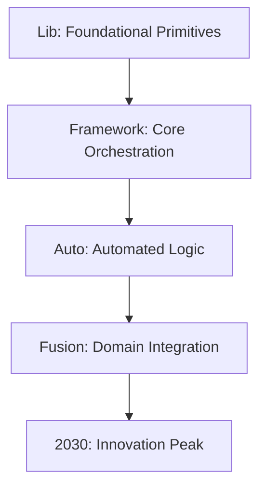
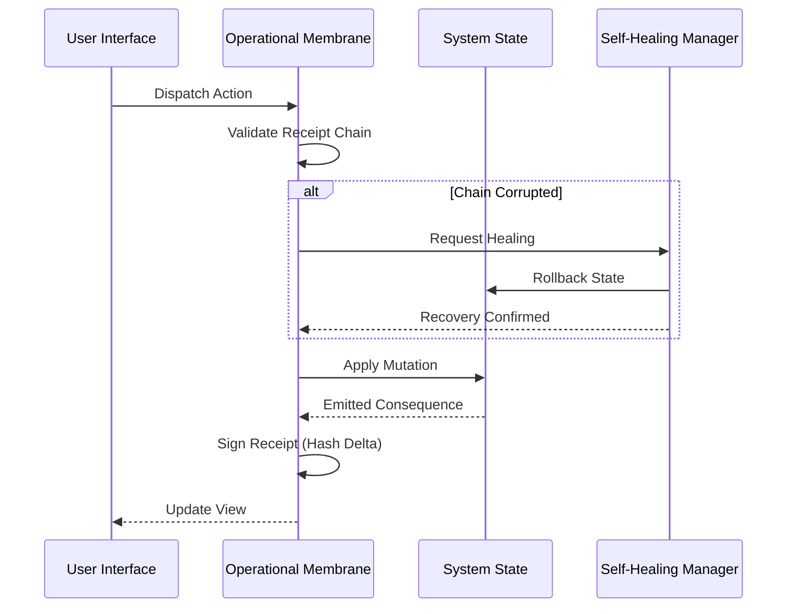

# Zoe Framework: Architectural Overview

The Zoe Framework is a "batteries-included," highly resilient SDK designed to power the next generation of autonomous and ambient applications. It follows a layered architectural approach that scales from foundational primitives to the "2030 Innovation Peak" of ambient computing.

## 1. High-Level Architecture

The framework is built around the **Operational Membrane**, a secure proxy layer that ensures every state mutation is validated, receipted, and auditable. This foundation enables the framework to provide "Zero-Config" setup and "Self-Healing" capabilities.

### Layered Design: The Path to 2030

Zoe is structured into five distinct layers, each building upon the previous one to add intelligence and automation.

#### Layer 1: Lib (Foundational Primitives)
The bedrock of the SDK. It provides raw, stateless utilities for:
- **Crypto**: Post-quantum primitives and cryptographic hashing.
- **DB**: Local-first storage engines (SQLite, Key-Value).
- **State**: Atomic state management and observable patterns.

#### Layer 2: Framework (Core Orchestration)
The standard application layer. It introduces the React context providers and hooks used in daily development:
- **`ZoeFrameworkProvider`**: The root container.
- **`useTranslation` / `useAuth`**: Standard hooks for cross-cutting concerns.
- **UI Components**: Base glassmorphic and accessible components.

#### Layer 3: Auto (Automated Logic)
The "Zero-Config" layer. It provides components and logic that "just work" by assuming sensible defaults:
- **Auto-UI**: Components that wire themselves to the state based on metadata.
- **Auto-Auth**: Intelligent session management and refresh logic.
- **Auto-i18n**: Automatic locale detection and cultural adaptation.

#### Layer 4: Fusion (Domain Integration)
The orchestration layer. It fuses multiple domains (e.g., Auth + Sync + State) into cohesive high-level behaviors:
- **SyncExtreme**: Fusing local state with satellite or peer-to-peer transport.
- **Smart Components**: UI that adapts its behavior based on the operator's current authentication and sync status.

#### Layer 5: 2030 (Innovation Peak)
The advanced capability layer for the 2030 vision:
- **GenEx (Generative UI)**: Dynamic layouts driven by on-device LLMs.
- **Agent-Native**: ZKP-secured gateways for autonomous AI agents.
- **Holographic UI**: Gyroscope-driven 3D parallax and glassmorphism.
- **Post-Quantum Identity**: Identity verification resilient to future compute threats.

---

## 2. Core Philosophies

### Zero-Config Philosophy
Zoe aims for "Zero Friction" for developers. The framework implements several strategies to achieve this:
1.  **Sensible Defaults**: Every provider and hook has a fallback behavior that allows the application to run without complex configuration files.
2.  **Automatic Discovery**: Sub-systems (like i18n or Sync) automatically discover their peers and resources within the execution context.
3.  **Heuristic Initialization**: The framework uses environment heuristics to decide between optimization profiles (e.g., switching to "Power Saver" on low battery without user intervention).

### Self-Healing Philosophy
The framework is designed to be "Self-Healing," meaning it can autonomously recover from state corruption or execution deadlocks.

1.  **Integrity Monitoring**: The Operational Membrane continuously validates the cryptographic chain of state receipts.
2.  **Autonomous Recovery**: If corruption is detected, the `SelfHealingManager` rolls back the application state to the last known good receipt.
3.  **Deadlock Detection**: Long-running operations are monitored; if a deadlock is detected, the membrane initiates a surgical reset of the affected sub-system.
4.  **$\mu$ Transformation**: The system uses a formal manufacturing function to ensure that every state transition $O^* \to A$ is mathematically admissible.

---

## 3. Data Flow & The Operational Membrane

Every action in a Zoe application passes through the **Membrane**. This ensures that the application logic is decoupled from the underlying state management and security concerns.

### High-Level Data Flow
1.  **Action Ingestion**: An intent (User click, Sync update) enters the Membrane.
2.  **Pre-Validation**: The Membrane checks if the current state is "sane" and the receipt chain is intact.
3.  **Execution ($\mu$)**: The state mutation is applied within the membrane sandbox.
4.  **Receipt Generation**: A new cryptographic receipt is appended to the lineage, proving the transition.
5.  **Projection**: The updated state is projected to the UI or persisted to the DB.

---

## 4. 2030 Best Practices

Developers building on Zoe should adhere to the following principles:
- **State as Law**: Treat the application state as a sequence of immutable receipts.
- **Defensive Layouts**: Use `GenEx` variants to ensure the UI remains usable under different trust and performance profiles.
- **ZKP by Default**: Always prefer Zero-Knowledge Proofs for identity and state inspection to maintain operator privacy.
- **Ambient Awareness**: Leverage device vitals and orientation to make the application feel "alive" and responsive to its physical environment.

---
*Zoe Framework Documentation - 2030 Edition*
