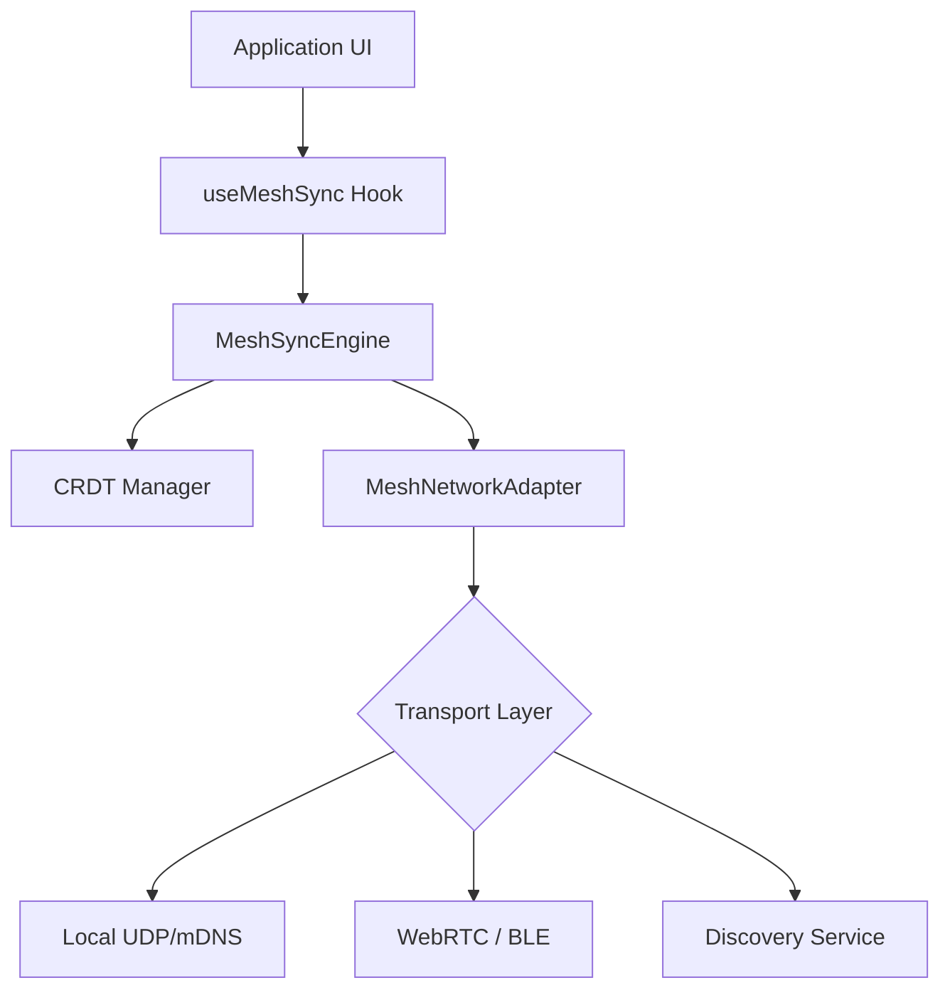

# P2P Mesh Synchronization

The Zoe Framework provides a robust, zero-latency P2P Mesh Sync layer designed for **zero-internet collaboration**. By leveraging Conflict-free Replicated Data Types (CRDTs) over local transport protocols, Zoe enables seamless real-time experiences in environments ranging from high-speed local networks to remote offline field operations.

## Architecture Overview

The P2P Mesh Sync architecture is built on three primary pillars:

1.  **MeshSyncEngine**: The central orchestrator that manages CRDT registration, state versioning, and synchronization scheduling.
2.  **MeshNetworkAdapter**: A transport-agnostic interface that abstracts the underlying communication protocol (mDNS, UDP, WebRTC, Bluetooth).
3.  **CRDT Integration Layer**: The bridge that connects mesh updates to the application's local-first data models.

### System Diagram



## Mesh Sync Concepts

### 1. Peer Discovery
Zoe does not rely on a central server for discovery. Instead, it employs decentralized discovery mechanisms:
- **Local Network**: mDNS (Bonjour/Avahi) and UDP broadcasting are used to discover peers on the same WiFi or Ethernet segment.
- **Proximity**: Bluetooth Low Energy (BLE) advertisements enable discovery for device-to-device "over-the-air" sync without a common router.
- **Remote P2P**: WebRTC signaling servers (optional) can facilitate NAT traversal for peers on different networks.

### 2. Delta Broadcasting
To minimize bandwidth and maximize performance, Zoe prefers **Delta Synchronization**:
- **Full State**: Sent when a new peer joins to establish a baseline.
- **Deltas**: Small, incremental changes (deltas) are broadcast as they occur. Since Zoe uses CRDTs, these deltas are commutative, associative, and idempotent, ensuring convergence regardless of arrival order.

### 3. Local Network Synchronization
In "Offline Mode," the Mesh Adapter switches to aggressive local broadcast. Heartbeats ensure the `MeshSyncEngine` maintains an accurate `Peer[]` list, allowing the UI to reflect the connectivity status of the local swarm.

### 4. Heartbeat & Liveness
To maintain mesh integrity, Zoe employs an adaptive heartbeat mechanism:
- **Active Swarm**: Peers broadcast heartbeats every 5-10 seconds.
- **Liveness Detection**: Peers not heard from within 3 heartbeat cycles are marked as "Lost" and removed from the active peer list.
- **Network Awareness**: The engine detects changes in local network interfaces (e.g., switching from WiFi to LTE) and re-initializes discovery protocols accordingly.

## Integration with CRDT Layer

The `MeshSyncEngine` interacts directly with the `CRDT` interface. When a message arrives via the `MeshNetworkAdapter`:
1.  The engine identifies the target CRDT by its `id`.
2.  The payload (state or delta) is passed to the `crdt.merge()` method.
3.  The CRDT resolves conflicts deterministically.
4.  The application UI reacts to the updated state via standard React hooks.

## Implementing a Custom Mesh Adapter

While Zoe provides standard adapters, you may need a custom implementation for specialized hardware or protocols.

```typescript
import { 
  MeshNetworkAdapter, 
  MeshMessage, 
  Peer 
} from '@zoe/framework/sync/p2p';

/**
 * Example: Custom UDP-based Local Network Adapter
 */
export class LocalUDPAdapter implements MeshNetworkAdapter {
  private peers: Map<string, Peer> = new Map();
  private listeners: Set<(msg: MeshMessage) => void> = new Set();

  async start(): Promise<void> {
    // 1. Initialize UDP socket
    // 2. Start mDNS discovery
    // 3. Begin heartbeat broadcast
  }

  async broadcast(message: MeshMessage): Promise<void> {
    const payload = JSON.stringify(message);
    // Send via UDP broadcast to 255.255.255.255:port
  }

  onMessage(callback: (message: MeshMessage) => void): () => void {
    this.listeners.add(callback);
    return () => this.listeners.delete(callback);
  }

  // ... Other implementation details for Peer discovery
  getLocalPeerId(): string {
    return 'device-unique-id';
  }
}
```

## Usage in Application Code

The `useMeshSync` hook is the primary entry point for developers.

```tsx
import { useMeshSync } from '@zoe/framework/sync/p2p';
import { useSharedDocument } from '@zoe/framework/data';

export const CollaborativeEditor = ({ docId }) => {
  const doc = useSharedDocument(docId);
  const { peers, isOnline, lastSyncTimestamp } = useMeshSync(docId, doc.crdt);

  return (
    <div>
      <StatusHeader online={isOnline} peerCount={peers.length} />
      <Editor value={doc.data} onChange={doc.update} />
      <SyncIndicator timestamp={lastSyncTimestamp} />
    </div>
  );
};
```

## 2030 Best Practices & Security

- **Perfect Forward Secrecy**: All mesh traffic should be encrypted using Noise Protocol Framework or similar, ensuring that even if a device is compromised, historical data remains secure.
- **Privacy by Design**: Peer IDs should be ephemeral or derived from Zero-Knowledge Proofs (ZKPs) to prevent tracking across different mesh swarms.
- **Resource Efficiency**: In mobile environments, adaptive heartbeat intervals should be used to preserve battery life while maintaining sync fidelity.
- **Conflict Resolution**: Always prioritize the CRDT layer for conflict resolution; avoid "Last Write Wins" (LWW) unless explicitly required by the business logic.

---

*This document is part of the Zoe Framework SDK Deep Dive series.*
